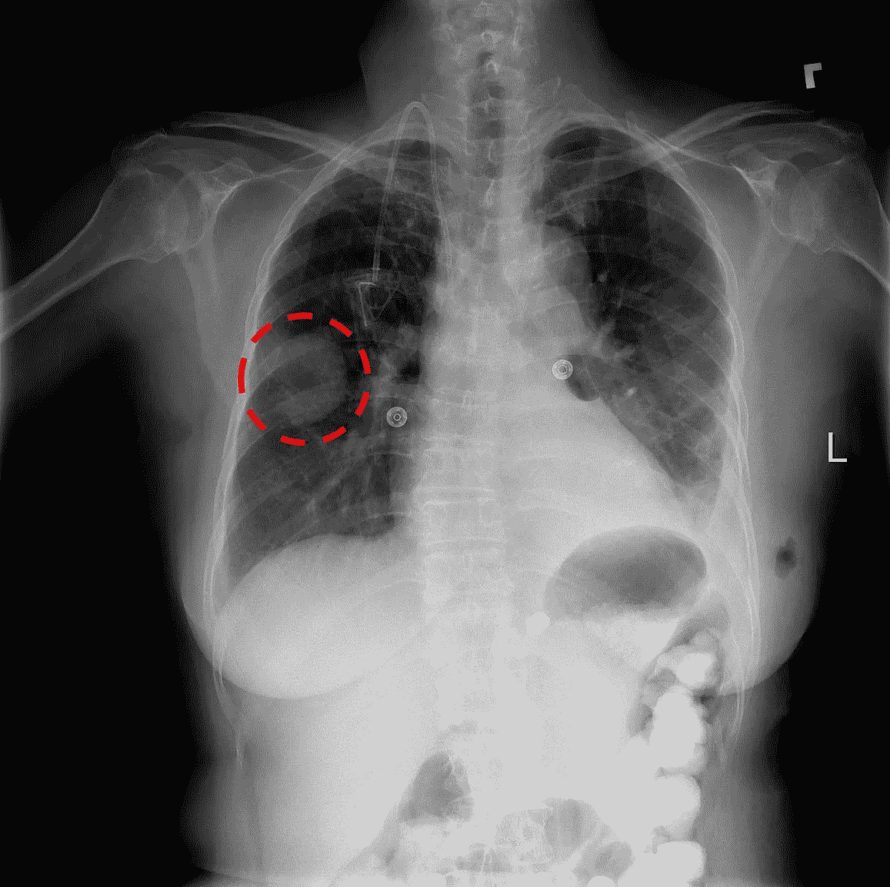
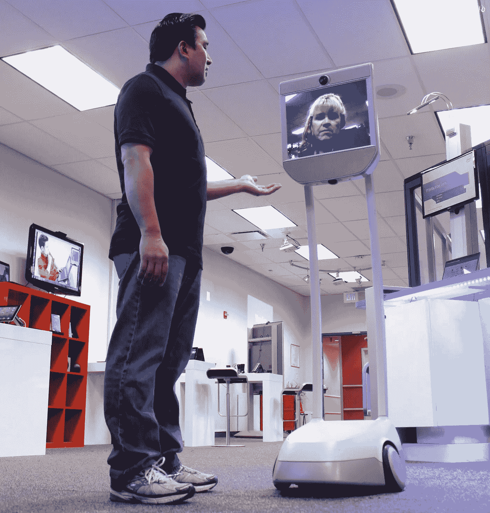
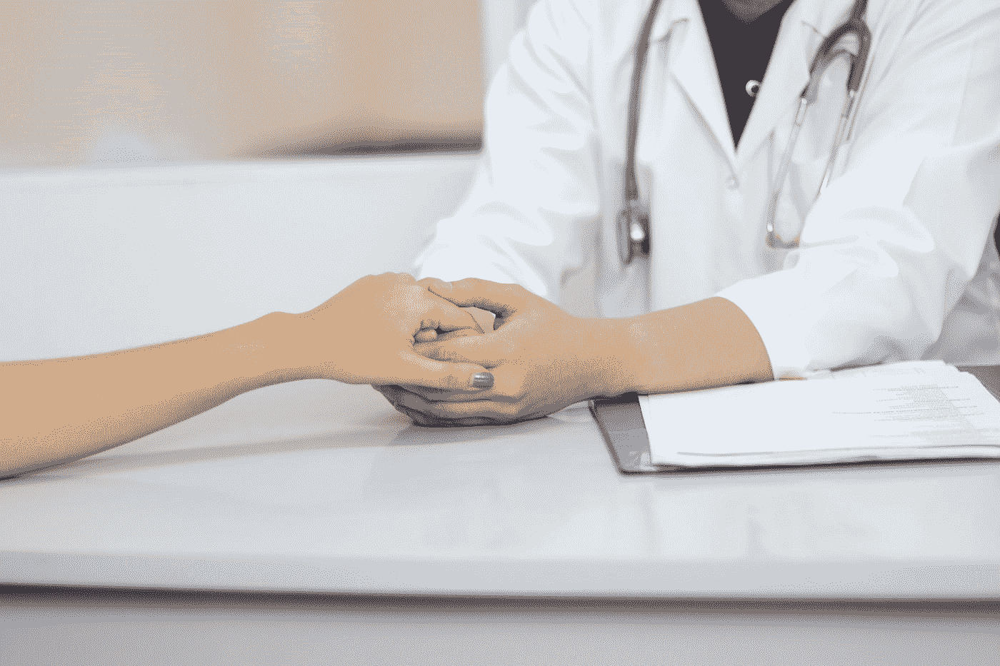

# 一个机器人说你得了癌症

> 原文：<https://towardsdatascience.com/a-robot-says-you-have-cancer-294937f3a69?source=collection_archive---------13----------------------->

Someday soon, your doctor could be a robot. Would you trust it? Photo by [Kendal James](https://unsplash.com/@hikendal?utm_source=medium&utm_medium=referral).

如果电脑给你健康建议，你会相信吗？如果一个计算机程序告诉你，你有一个侵略性的癌症肿瘤，并推荐一个有风险的程序来挽救你的生命，你会抓住这个机会吗？

就在几十年前，从计算机那里接受医疗建议的想法似乎来自于一部老的《杰森一家》卡通片或《星际迷航》中的一集。医学是复杂的，很难想象计算机程序能够成功地取代人类医生，能够将许多不同的报告(测试结果、X 射线和其他扫描以及患者信息)结合成一个单一的诊断。

然而，如今让计算机程序扮演医生的想法似乎更接近现实。但是，虽然计算机在诊断疾病方面可能越来越好，但人类准备好倾听了吗？

# 计算机程序可以匹配(或超过)人类诊断的准确性

人工智能程序处理复杂医疗问题并取得惊人成功的一个例子是放射学，即阅读 X 射线、CAT 扫描和其他身体内部可视化的实践。这些图像通常模糊不清，以至于放射学有时被描述为“更像一门艺术而不是科学”。即使是经验丰富的放射科医生有时也很难确定 X 射线上的黑点是癌性肿瘤，还是只是一个污点。

An example training X-ray, this time with the cancerous mass helpfully circled. Source: [NIH](https://www.nih.gov/news-events/news-releases/nih-clinical-center-provides-one-largest-publicly-available-chest-x-ray-datasets-scientific-community)

事实证明，计算机可以做得更好。如果给一个算法一大组 X 射线作为训练数据，它可以胜过真正的医生——在一个案例中，[一个算法成功诊断了 75%的结核病病例，相比之下，人类医生的正确诊断率为 62%](https://www.npr.org/sections/health-shots/2019/04/01/708085617/how-can-doctors-be-sure-a-self-taught-computer-is-making-the-right-diagnosis)。

不仅仅是 x 光。[人工智能算法成功地从痣和皮肤病变的照片中诊断出皮肤癌，其速度相当于委员会认证的医生。](https://www.nature.com/articles/nature21056?foxtrotcallback=true)另一种算法证明[通过读取心电图数据检测心律失常(不规则心跳)比人类医生更有效。](https://arxiv.org/pdf/1707.01836.pdf)一些算法甚至试图通过分析语音来诊断认知障碍和智力下降，[使用单词之间的停顿和词汇水平等措施来确定某人是否患有痴呆症。](https://www.marsdd.com/magazine/computers-are-already-better-than-doctors-at-diagnosing-some-diseases/)

所以电脑可以比人类医生更准确。有人会听他们的吗？

# 医生需要同理心吗？

最近，加州弗里蒙特的一家医院制造了一条新闻——而且不是好消息——一名 78 岁的病人被机器人告知他即将死亡。

An example of a telepresence robot. Source: [Wikimedia](https://commons.wikimedia.org/wiki/File:Suitable_Technologies_Beam_telepresence_robot.jpg)

这不是人工智能驱动的超级计算机。这是一个人类医生使用远程呈现机器人与病人进行远程交流。因此，尽管有 clickbait 这个标题，但人工智能并没有冷漠地通知病人他要死了——一名人类医生选择通过相当于 FaceTime 视频电话的方式来传达这一痛苦的消息，而不是亲自去。

然而，这篇文章呼应了任何时候讨论人工智能取代医生时都会出现的一个共同主题:算法没有同理心，不能像有血有肉的医生那样传递坏消息或艰难的诊断。

这篇文章还提出了一个问题，即医生目前在同理心方面是否比机器人做得更好。许多医生在向病人传达坏消息时都很有同情心和爱心，但有些医生已经采用了机械的、非个人化的语气。这些容易出错、低同理心的医生会成为第一批被更精确的机器人取代的人吗？

# 一个可能的未来:机器人诊断，人类分娩

展望未来，医学可能会变得更加需要共同努力，医生依靠计算机来完成诊断疾病的繁重工作，但同时在医患关系中保持一个人来提供解释和安慰。

“The algorithms say that the tumor is likely serious, but we have options and solutions. It will be okay.” Photo by [Arvin Chingcuangco](https://unsplash.com/@arvinteezy27?utm_source=medium&utm_medium=referral).

当然，这个概念不太可能在医学界顺利推行。转向依赖计算机和算法来诊断医学疾病可能会引发关于工资和补偿的问题——如果放射科医生的大部分工作由计算机程序处理，他们还应该得到平均每年 371，000 美元的报酬吗？

许多医生已经在与侵入医学的技术作斗争。[人们普遍抱怨电子健康记录(EHRs](https://ehrintelligence.com/news/40-of-physicians-see-more-ehr-challenges-than-benefits) 越来越普遍，许多医生表示，电子健康记录最终不完整、难以填写，并且无法取代与患者的面对面交流。医院管理人员和高管希望改善病人的结果并节省资金，他们可能会支持增加算法的使用，以取代由活体医生处理的部分工作量——但他们将与医生斗争，可以理解的是，医生不希望他们的工作被计算机取代。

AI 不会完全取代医生。算法可能在诊断问题方面表现得更好，但我们可能仍然需要人手来开处方，复核诊断结果，最重要的是，带着同情和善意向患者传达结果。

但是也许在不久的将来，当医生给你看 x 光片时，你可以礼貌地请求电脑给出第二种意见。