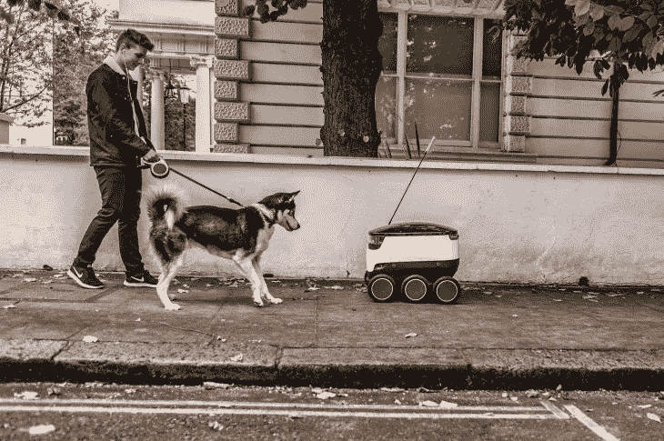

# 机器人的旅程

> 原文：<https://towardsdatascience.com/a-robots-journey-ce4fcd30aba1?source=collection_archive---------43----------------------->

## 送货机器人眼中的世界

Picture courtesy to Starship Technologies

想象，试着从另一个人的角度看这个世界是很有趣的。去思考做动物的感觉。

我们的乌龟跑了。他不开心吗？我们的鹦鹉一头撞在墙上。她抑郁了吗？我们的猫曾经在我的床上拉屎。她恨我吗？我们狗的蛋蛋被割掉了。他生气了吗？这些事情让我整个童年夜不能寐，因为没有答案。

如今，我过得更轻松了。我的周围不是由进化塑造的不可预测的大块肉，而是按照形式逻辑行事的机械人造生物。这些生物的每一个反抗行为都可以通过计算机代码追溯到其根源并被清除。

作为一名工程师，我的工作就是——把自己放在一个六轮自动送货机器人的位置上，驯服它。这些问题让我成年后夜不能寐，因为我一直在寻找答案:

## 如何避免撞到东西？

像这些人一样，机器人的眼睛是成对的。两只眼睛很容易测量到世界上物体的距离，以三维方式看事物。

当光线从物体上反射回来，进入我们的眼睛——或者对于机器人来说，进入相机——时，图像就在我们的视网膜上形成了。由于我们的眼睛在头上的位置不同，它们捕捉的图像也略有不同。如果我们将它们重叠在一起，我们会发现图像上相应物体的位置并不完全匹配。所有的东西都会水平移动，在右边的图片上看起来稍微偏左一点，反之亦然。

转折:一个物体从一个图像转移到另一个图像的次数越多，它就离我们越近。它移动得越少，越远。这是一个惊人的数学事实。为了了解一个物体在*真实世界*中离我们有多远，我们只需要测量它在*图像*之间移动的毫米数。

问题是:匹配对象。为了计算一个物体在两幅图像之间移动了多少，我们必须首先在两幅图像上识别它。人类在这方面特别擅长，我们下意识地这么做。机器人在这方面特别糟糕——感谢上帝，因为它让我有工作。

## 如何安全过马路？

机器人是行人——它在人行道上行驶。和行人一样，它被十字路口所困扰。它田园诗般的、无忧无虑的漫步很快被恐怖所取代，因为现在有一股邪恶的两吨重的野蛮人必须通过。快点，你可能会被冷血地击倒。摆摊，你可能会因为提供冷食而被拆穿。

巨大的任务需要巨大的智慧。机器人的汽车大脑是一个很深的层叠，每一层都是由数百万人工神经元组成的薄片。不同的层类似于传送带上的专业工人，随后的层建立在前面的结果之上。

一幅图像——机器人无法识别的原始像素的大杂烩——来自摄像机。最底层识别代表边缘的像素组。下一层神经元识别从边缘构建的形状——圆形、矩形和三角形。第三层将这些几何图形放在一起，以识别整个物体:车轮、门、窗和车牌。最上层组装各种汽车部件以识别完整的车辆。

正是这个单一用途的大脑，专门致力于防止机器人成为马路杀手，允许安全过马路。相比之下，动物只将一小部分思维能力用于识别汽车。这就是为什么你到处看到死的是松鼠，而不是机器人。

## 如何不迷路？

唯一比延迟交货更糟糕的事情是货物丢失。为了避免如此多的痛苦，机器人已经从伦敦出租车司机的剧本中吸取了一页。

为了获得驾照，这些崭露头角的出租车司机需要通过世界上最难的地理测试(T1)，这是一项对伦敦数万条街道、地标和旅游目的地的严格测试。为了准备考试，考生们在将近五年的时间里，数百次开车穿过这座城市，试图将伦敦错综复杂的动脉蚀刻进他们的大脑。

同样，机器人也需要练习。在他们被给予城市的自由之前，他们在一名人类监督者的陪同下被手动驾驶穿过城市。但是与黑人出租车司机的希望不同，机器人只需要握一次手。

如果说计算机擅长什么，那就是记忆。在他们独特的*地图绘制过程中*，机器人每秒钟沿着整个路线拍摄多次照片。接下来，它从图像中提取相关的物体——像公园长椅的单块木板或烟囱的砖块一样细小的物体。最后，耗时的算法计算出所有这些物体的真实世界坐标，然后存储在一个巨大的数据中心，这个数据中心构成了机器人非常详细的存储器。

此后，每当现在自主的机器人不确定自己的位置时，它就在数据库中搜索与其当前环境最接近的匹配。像伦敦出租车司机一样，他们的人工对应物用存储在他们记忆中的全球知识绘制了当地场景——他们看到的物体如何相互关联——这些物体如何与整个城市相关联。机器人只是在几天内建立这种理解，而不是几年。

很快，你就会看到这些送货机器人中的一个在你家附近辛勤工作。通常，你会看到他们最好的，高效的和有效的。

偶尔，你也会看到他们最糟糕的一面。也许在人行道上迷路了。或者害怕过马路。原谅他们的笨拙。正如西奥多·罗斯福所说:“唯一从不犯错误的人是从不做任何事情的人。”机器人做很多事情。他们送货上门。