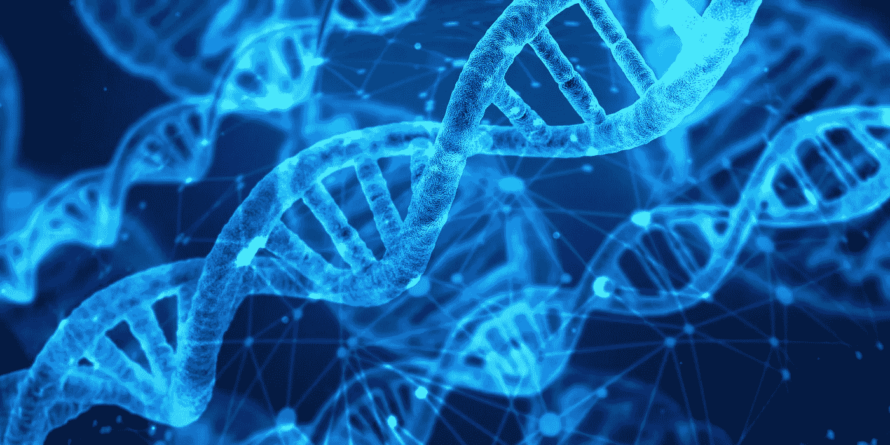

# 为算法鼓掌

> 原文：<https://towardsdatascience.com/a-round-of-applause-for-algorithms-3322f6aa1f8e?source=collection_archive---------22----------------------->

## 拯救生命和打开新的大门

外语。黑色和白色。无名演员。这是一场完美的描述风暴，让我对电影失去兴趣。但是，网飞给了我 90 多分。

虽然这个在线流媒体巨头知道我所有肮脏的观看秘密(**完全披露:超级英雄和太空战)**，但我也是。我不会自愿选择*罗马*。但是，网飞想当然地认为自己知道一些连我都不知道的事情。所以我给了*罗马*一个机会。我没有失望。

现在我并不自称理解算法背后的内在魔力。我认为知情者是科技奇才的精英俱乐部。但是有一件事我明白了。算法为机器学习和深度学习工具提供动力，使处理和分析一组无限的数据点成为可能。一些我的大脑，你的大脑，甚至爱因斯坦的大脑都无法理解的事情。网飞从我令人上瘾的暴饮暴食习惯中收集了大量数据，然后输入其算法，这些数据表明我会喜欢罗马。一些连我都没有意识到的事情。

对很多人来说，这很可怕。

48%的欧洲人不知道什么是算法。不到一半的人知道算法已经被用于他们生活的许多领域。

算法受到了不好的指责:它们单枪匹马地引发了民主的垮台。它们引发不良消费行为。他们将对失去成千上万的工作岗位负责。他们有偏见。他们歧视。他们的决定不可理解，也不可追踪。对于一本基本上被美化了的指导手册来说，有很多负面的报道。

让这些担忧雪上加霜的是一大群政治顾问、半生不熟的监管措施和普遍的数字文盲。这一切也是一场完美风暴。这是在延续一个错误的说法。一个把更多的注意力放在算法哪里出了问题，而完全忽略了它们哪里做得非常非常正确的问题。

**算法重新定义诊断**

当慕尼黑白血病实验室扩大其设施和人员时，对最先进的下一代测序(NGS)系统进行了大量投资。大数据的大机器。

科学是复杂的，但简单地说:这些 NGS 系统使分析整个基因组序列(WGS)成为可能，提供了更多的数据，更快地，对我们的遗传物质。为什么这很重要？WGS 提供的数据是检测致病突变、遗传疾病和疾病爆发的关键。而正是这些数据，由算法指令的机器学习应用可以比人眼更好更快地进行分析。

**算法能够以比显微镜更高的精度检测突变和畸变:治疗后检测到 0.3%对 5%的残留白血病细胞。**

在 NGS 诊断学的发展中发挥最大作用的算法之一是对齐算法。它可以排列由 NGS 系统确定的许多冗长的 DNA 和 RNA 序列。对于科学家和医生来说，考虑到大量的数据，这是很困难的，甚至是不可能的。一旦这些序列对齐，就有可能进行比较并检测出遗传密码中的异常。而且非常非常快。

对于像白血病这样的疾病，时间是至关重要的，速度和数据可能意味着生与死的区别。

**“精准医疗寻求利用基因组数据帮助在正确的时间为正确的患者提供正确的治疗。”**

比对算法提供的分析也在以其他方式推进癌症治疗。肿瘤的测序提供了维持肿瘤生长的特定遗传异常的详细信息。这意味着肿瘤学家可以为患者提供专门针对其基因突变的疗法。这一精确医学领域有可能消除治疗中的大量猜测，这意味着患者将不再被迫接受不必要的复杂程序。他们也将更快地获得最好的、最有针对性的治疗，这对于侵袭性衰弱疾病来说非常重要。

**机器穿衣**

虽然不是所有的算法都带着这样的利他意图运行，但它们在功能上是一致的。他们制定了一套解决问题和执行任务的规则。其中一项让他们声名狼藉的任务恰好是人类臭名昭著的糟糕任务:做决定。

这就是 Stitch 的生意所在。是 USP？数据科学。这对一家软件公司来说并不罕见。但是史迪奇绝不是。该公司是一家在线服装零售商。成千上万中的一个。但是有一个转折。Stitch 完全承担购物决策过程。

现在有很多人可能会对算法为我们着装的未来感到恐惧。任何读过算法写的诗，听过算法创作的音乐，看过算法生成的图像的人都见证了反乌托邦噩梦的内容。创造性许可不应该完全委托给机器。

“机器学习将改变技术的每一个方面，但没有机器能够模仿人类思维的创造能力。”山塔努·纳拉延，土坯

但请记住，算法可以以人类无法做到的方式导航数据。你给他们的数据越多，他们驾驶的学习工具就越聪明。这就是史迪奇所利用的。

该公司的造型算法在数据中翻腾:客户数据、产品数据、反馈数据。尺寸，喜欢的颜色，流行的款式。而且每件商品有 30 个以上的测量属性:从有纽扣衬衫的肘部到肩部的距离到裤子的内缝长度。

一旦算法“选择”了你的完美新线，它们会将最终决定交给人类造型师，也是由算法选择最适合你的风格。这些造型师对出现在你家门口的东西做最后的决定。

公司的目标之一？消除对尺寸标签的需求，只为每位顾客提供“你的尺寸”。任何买过牛仔裤的人都会看到其中的价值。就我个人而言，我会很高兴地跳过心理创伤和自我粉碎的战斗，挤进 X 号牛仔裤，却一无所有地回家。

即使在最强大的时候，人工智能也不会取代人类的智能，它只是帮助人们更好更快地做他们喜欢的事情。

但是还有一个好处。一个很多人不考虑的问题。让我们回到*罗马。一部充斥着超级英雄和科幻惊悚片的单色外国电影。打破我们的习惯和模式可能是巨大的努力。打开我们的思想，我们的视频图书馆，我们的壁橱去接受新事物。不是因为我们必然厌恶新事物，或者可以毫不含糊地说我们不会喜欢某样东西。而是因为我们是习惯性动物。*

尽管对一些人来说这可能令人毛骨悚然，但新的数字商业模式正在利用算法来比我们更好地预测我们的好恶，也许我们应该将其视为一个机会。拓展我们视野的机会，摒弃我们的偏好。就我个人而言，我很高兴网飞向我展示了一个超越*漫威宇宙的世界。*