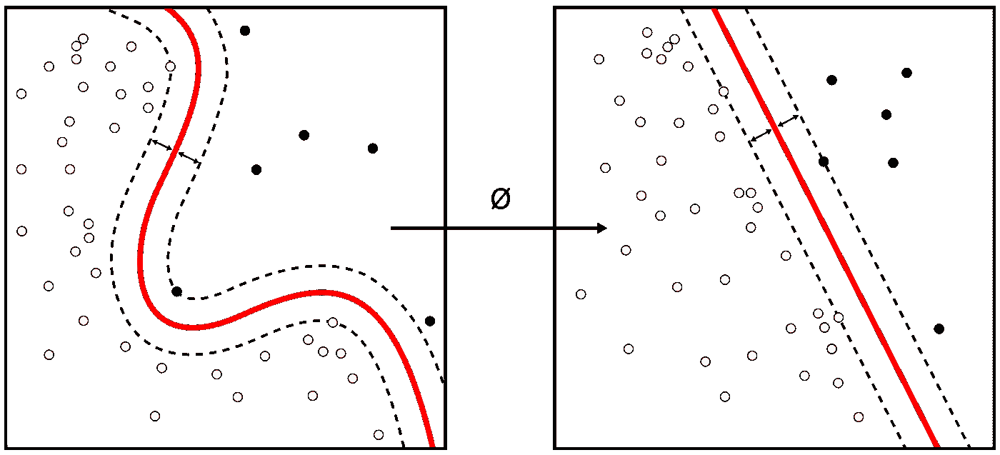
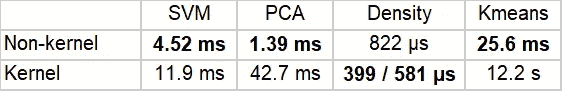
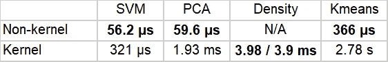

# 内核和非内核算法的运行速度基准

> 原文：<https://towardsdatascience.com/a-running-speed-benchmark-for-kernel-non-kernel-algorithms-b7db5bfabcef?source=collection_archive---------28----------------------->

## 非内核算法总是比基于内核的算法快吗？

The Kernel method, Wikipedia, [CC BY-SA 4.0](https://creativecommons.org/licenses/by-sa/4.0), [https://en.wikipedia.org/wiki/Kernel_method](https://en.wikipedia.org/wiki/Kernel_method)

多年来，我知道线性 SVM 比内核版本快，这是常识，而不是我测试过的东西。不久前，我想知道是否所有基于内核的算法都比它们的非内核版本慢。下面的比较用作几个众所周知的算法的运行时间基准。

> 内核方法因使用了[内核函数](https://en.wikipedia.org/wiki/Positive-definite_kernel)而得名，这使得它们能够在高维、*隐式* [特征空间](https://en.wikipedia.org/wiki/Feature_space)中操作，而无需计算该空间中数据的坐标，而是简单地计算特征空间中所有数据对的图像之间的[内积](https://en.wikipedia.org/wiki/Inner_product)。该操作通常比坐标的显式计算在计算上更便宜。这种方法被称为“**内核技巧**”——来自维基百科

想直接跑这个基准的可以在我的 [**Github**](https://github.com/orico/KernelAlgorithms/) 里找**笔记本。用于该基准的数据集是乳腺癌数据集，它很小，但众所周知。你可以用其他数据集做实验，看看实证结果是否保持不变，我怀疑会的。**

## 我们将比较以下算法:

1.  [线性 SVM](https://scikit-learn.org/stable/modules/generated/sklearn.svm.LinearSVC.html) vs [线性核 SVM](https://scikit-learn.org/stable/modules/generated/sklearn.svm.SVC.html)
2.  [PCA](https://scikit-learn.org/stable/modules/generated/sklearn.decomposition.PCA.html) vs 线性[核 PCA](https://scikit-learn.org/stable/modules/generated/sklearn.decomposition.KernelPCA.html)
3.  [K-means](https://scikit-learn.org/stable/modules/generated/sklearn.cluster.KMeans.html) vs [内核 K-means](https://tslearn.readthedocs.io/en/latest/gen_modules/clustering/GlobalAlignmentKernelKMeans/tslearn.clustering.GlobalAlignmentKernelKMeans.fit_predict.html)
4.  [PDF](https://docs.scipy.org/doc/scipy/reference/generated/scipy.stats.norm.html) vs [KDE](https://scikit-learn.org/stable/modules/generated/sklearn.neighbors.KernelDensity.html) (高斯)vs [高斯 KDE](https://docs.scipy.org/doc/scipy/reference/generated/scipy.stats.gaussian_kde.html)

这种比较是双重的，一次是“适合”，另一次是“预测”或“转换”。请注意，我找不到概率密度函数(PDF)的等效转换方法。支持向量机(SVM)、主成分分析(PCA)、核密度估计(KDE)和 K-means 是众所周知的，并且具有相关的功能，对于核-K-means，我必须查看一个名为 [Tslearn](https://tslearn.readthedocs.io/en/latest/index.html) 的外部包。

Table 1: Running time for ‘fit’

Table 2: Running time for ‘predict’ or ‘transform’

## 结果和讨论

这两种类型之间似乎有很大的差异，对于“fit”(表 1)，值得注意的是线性 SVM 比它的内核对应物快两倍，PCA 快大约 30 倍，K-means 快大约 40 倍。对于“预测”(表 2)或“转换”，我们看到的是相同的画面，但比例不同。速度差异可能有多种原因。如果你感兴趣的话，值得检查一下每个算法的实现和时间复杂度，这里没有涉及。

除非你真的需要某个算法的内核版本，否则应该首先考虑非内核版本。值得注意的是，最快的版本存在于 Sklearn 中，这意味着您不需要查看其他包。

Ori Cohen 博士拥有计算机科学博士学位，专注于机器学习。他领导着 Zencity.io 的研究团队，试图积极影响市民的生活。