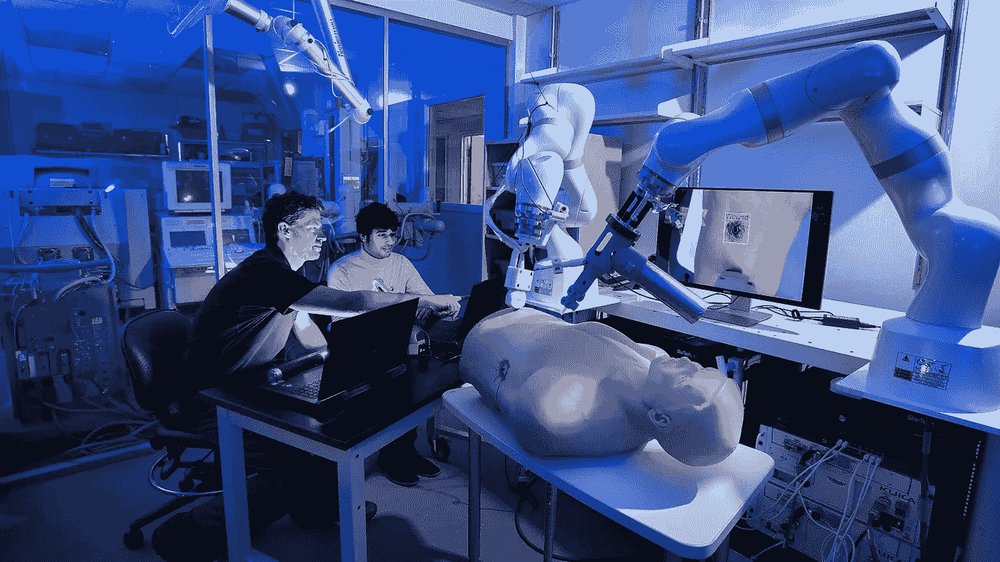
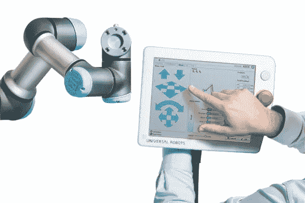
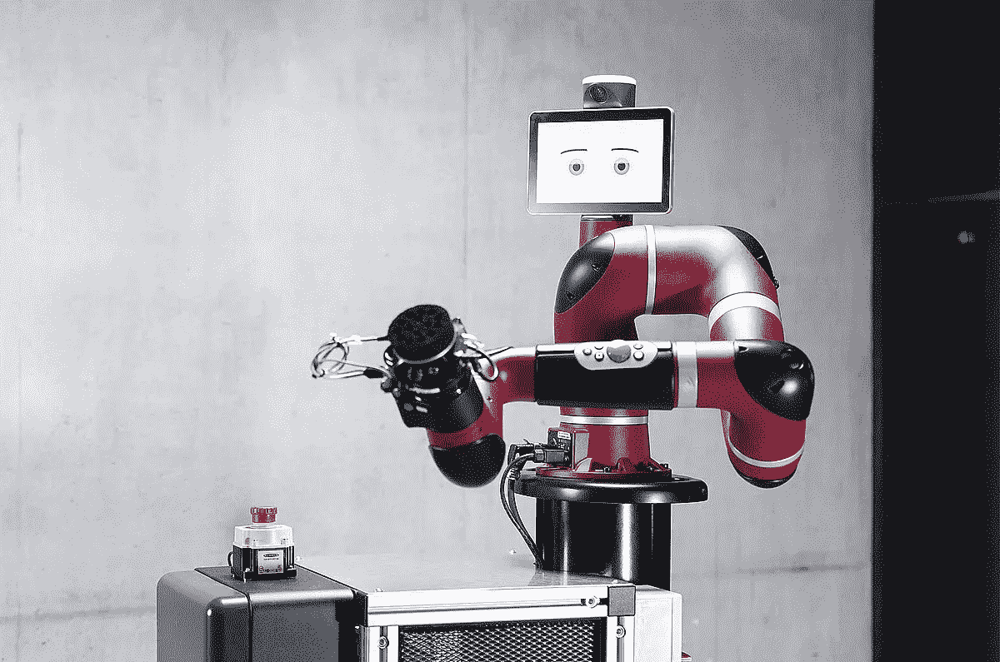
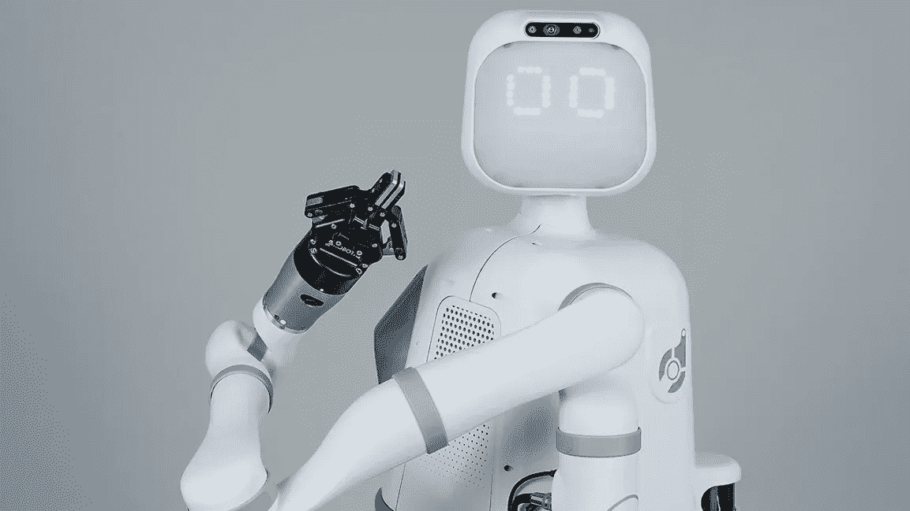
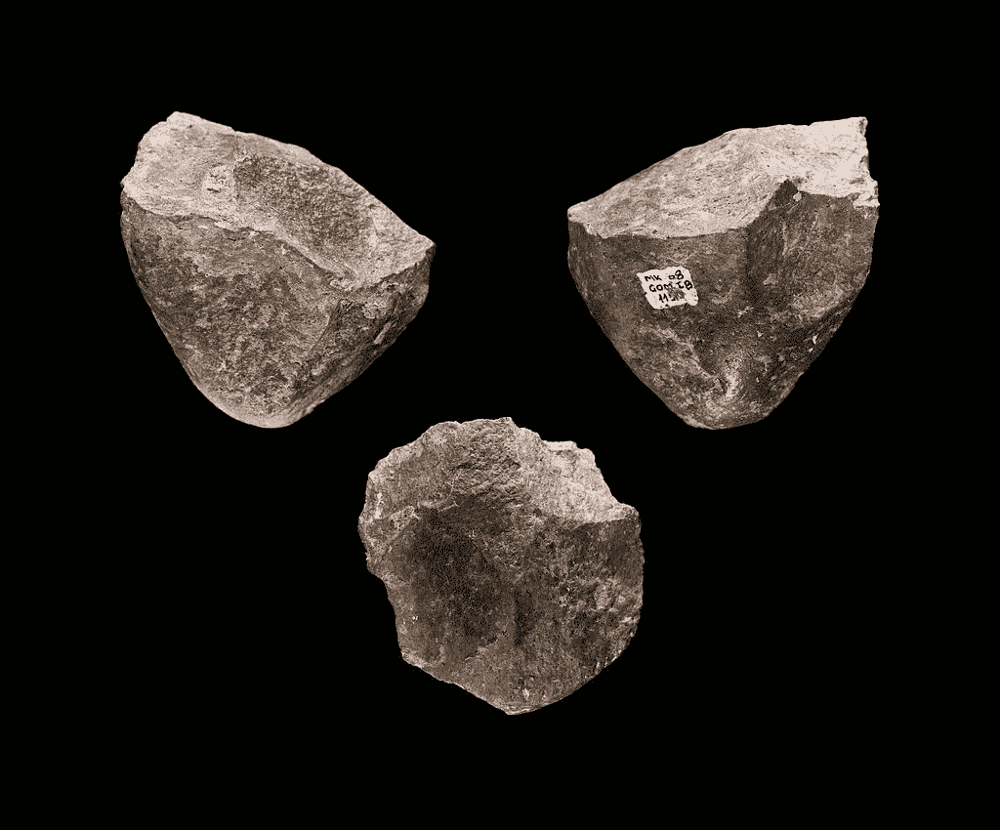
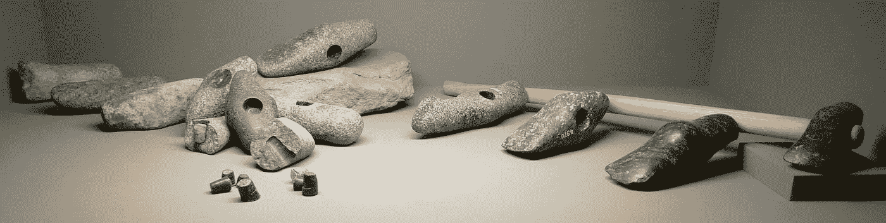
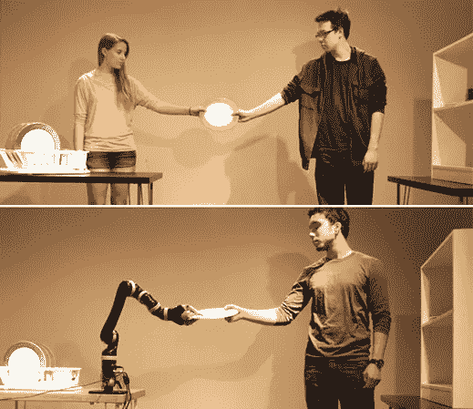
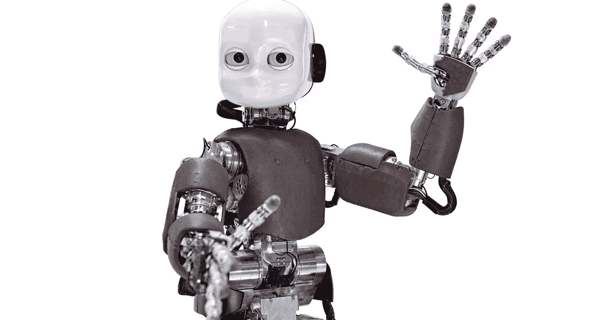
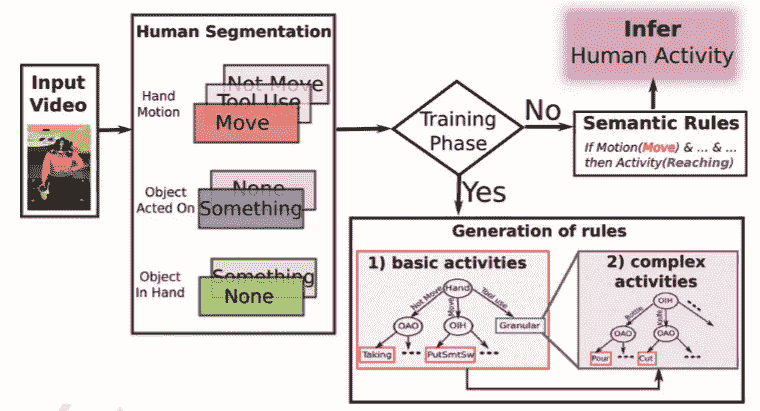

# 目的感使人和机器人能够更好地合作

> 原文：<https://towardsdatascience.com/a-sense-of-purpose-enables-better-human-robot-collaboration-fbe64d0ae913?source=collection_archive---------23----------------------->

## 机器人需要理解人类活动的意义，才能安全有效地与人类并肩工作。

那是 1954 年。两个美国人，发明家乔治·德沃尔和企业家约瑟夫·恩格尔伯格在一个鸡尾酒会上讨论他们最喜欢的科幻小说作家。迪沃最近在专利局提交了他的最新想法，第一个*通用自动化*或**Unimate***，*用机器人机器取代工厂工人的早期努力。他的创造性天才已经诞生了现代世界的两个最早的技术奇迹:一个是带有光电管和真空管的自动门*幻影门卫*，另一个是根据需求使用微波能量烹饪热狗的机器 *Speedy Weeny* 。

Engelberger 发现 Unimate 工业转移机如此引人注目，以至于七年后，专利一获得批准，他就成立了一家公司来发展 Devol 先生的想法。那家公司的名称是 ***Unimation 公司*** 。他们的"*编程物品传送*"，后来重新命名为"*机械手*"最后是"*机器人*"(人们只能怀疑 Devol 和 Engelberger 是否在那些鸡尾酒会上讨论过艾萨克·阿西莫夫第一次使用术语" [*机器人*](https://www.thevintagenews.com/2017/01/04/robot-means-serfdom-in-czech-and-asimov-was-the-first-to-use-the-word-robotics/) ")最终作为一个材料处理和焊接的单元进入了全面生产。

Unimate makes its public debut in London. “*Unimate. A machine that can reach up to seven feet and perform a multitude of tasks in the factory or laboratory, as skillfully as a man but without getting tired. It’s controlled by a built-in memory system which you lead just once through the required measurements and it can then repeat it 24 hours a day, week after week*”.

***尤尼马特*改造并加速了世界各地制造工厂的生产线**。**通用汽车、克莱斯勒、福特和菲亚特很快认识到了其中的好处，并下了大量订单**，帮助这台机器成为了过去 50 年的*50 大发明之一*。这只是**催生一个新产业的种子:商业机器人**。随着时间的推移，Unimation Inc .及其唯一的竞争对手俄亥俄州的辛辛那提米拉克龙公司(Cincinnati Milacron Inc .)将会看到几个日本和欧洲竞争对手的崛起，这些竞争对手采用了新的创新技术，如电子微处理器、伺服枪技术和电弧焊。

然而，世界可能还要再等一会儿才能看到第一个真正协作的机器人(或 ***cobot*** )，它于 2008 年安装在 [Linatex](https://www.universal-robots.com/case-stories/linatex/) 。与它的前辈不同，Universal Robot 的 [UR5](https://www.universal-robots.com/products/ur5-robot/) 重量轻，价格便宜，易于设置，可以由未经培训的操作员重新编程。

The cobot UR5\. Image courtesy of Universal Robots.

> “你不需要输入或计算任何东西来让机器人工作。你只需要向它展示动作”。万能机器人。

**Cobots 旨在与人类共享一个工作空间** —这就是为什么 UR5 不需要放在围栏后面，可以与员工一起安全工作的。这与传统工业机器人形成鲜明对比，传统工业机器人通常被锁在笼子里，因为它们的快速移动和笨重的体积会使它们对人类不安全。一旦安装好，工厂里常见的笨重机械臂就很少动了；大多数实际上是用螺栓固定在地板上的。相反，新一代产品更轻，即插即用，并辅以传感器和视觉技术，使工作空间更易于共享。

尽管 11 年前就推出了 cobots，但 2018 年售出的所有工业机器人中只有不到 5%是协作型的(根据[金融时报](https://www.ft.com/content/6d5d609e-02e2-11e6-af1d-c47326021344))。Cobots 可能不是新东西，但是它们仍然有潜力革新生产，特别是对小公司——占全球制造业的 70%。据估计，cobot 市场将从 2018 年的 1 亿多美元增长到 2020 年的 30 亿美元，因为这些灵活的机器人比传统的工业机器人便宜得多(根据巴克莱资本的数据，平均价格为每台 24，000 美元)。

Sawyer™, a high-performance collaborative robot from [Rethink Robotics](https://www.rethinkrobotics.com/sawyer)

预计在未来几年，cobots 在工业环境中的采用将显著增加。但是它们在其他领域的应用情况如何，比如医疗保健？

在根托夫特的哥本哈根大学医院，cobot **UR5** 已经被用于优化血液样本的**处理和分类，**帮助实验室实现在 1 小时内提供 90%以上结果的目标。Universal Robots 的机械臂还被整合到加拿大 Synaptive Medical 公司开发的**Modus V**、[中](https://www.synaptivemedical.com/synaptive-medical-unveils-next-generation-surgical-robotics-groundbreaking-optics-platform/)，通过提供前所未有的患者解剖视图来协助神经外科手术，并以更高的精度执行侵入性更小的手术。这还不是全部。 **Cobots 也开始用于其他医疗领域，例如远程呈现、康复、医疗运输和卫生**。

其中一些场景带来了一系列新的挑战，因为它们充满了**动态和不可预测的交互，与工业环境中的交互有很大不同**。

例如，一个机器人护士可能被要求帮助一个病人*从一个柜子*中取出特定的药物。机器人将需要理解病人以任何方式表达的要求，定位橱柜，在房间内导航避开障碍物，打开橱柜，抓住正确的药物并给病人。为了处理物体，机器人需要**为某种形状选择正确的抓手**，了解不同的材料如何对力做出反应，以及**在将它们交给人时协调反馈和联合步骤**。在这些类型的互动中，人类自然会监控他们伴侣的节奏和工作量，并相应地调整他们的交接。机器人在执行任务时也需要达到类似的适应性。

**操纵物体包括一系列与感知、控制和协调紧密相连的动作**。

[Moxi](https://diligentrobots.com/moxi) is a hospital robot assistant that helps clinical staff with non-patient-facing tasks like gathering supplies and bringing them to patient rooms, delivering lab samples, fetching items from central supply, and removing soiled linen bags.

传统上，机器人技术的重点一直是通过两个指标来成功够到和抓住东西:**速度和稳定性**。这些是物流中特别感兴趣的，并且在很大程度上受益于计算机视觉和机器学习的最新进展。然而，当涉及到在更加灵活、不可预测的环境中与人类互动时，如医院或家中，它们可能不足以决定机器人行动的成功。

为了让合作机器人有效地导航这些新领域，他们需要**了解人们如何与世界互动，这样他们就可以预测对他们的期望。**

# “目的”如何影响人类行为和工具使用

作为人类，我们头脑中有一个直观的物理模型。我们能够想象一个物体，以及如果我们通过推、拉、挤等方式与它互动，它会如何表现。这使得我们能够完成**难以置信的操控任务，这些任务远远超出了目前机器人**的能力范围。

[昂热大学的研究员弗朗索瓦·奥西乌拉克](https://emc.univ-lyon2.fr/fr/equipes/equipe-cognition-outils-systemes/francois-osiurak/francois-osiurak-610797.kjsp)认为“*没有任何* ***意图*** 我们就无法感知世界”。各种文化的人类**自发且几乎系统地使用工具来改造世界，**创新并远离以前的技术设备。

An Oldowan chopper, one of the earliest examples of the stone industry. Ethiopia, c. 1.7 million years before our era. Source: [Wikipedia](https://en.wikipedia.org/wiki/File:Pierre_taill%C3%A9e_Melka_Kunture_%C3%89thiopie_fond.jpg#/media/File:Pierre_taill%C3%A9e_Melka_Kunture_%C3%89thiopie.jpg) CC.

这种能力根植于我们获得一项技术并将其应用于各种目标的特殊天赋，并且与我们的进化密切相关。大约七百万年前，两足行走将第一批原始人与其余的四足猿分开。我们的手可以自由地操纵物体，因此我们必须创建关于工具及其相关动作的表示。我们的大脑变得非常擅长处理复杂的空间信息，这反过来又导致了抽象和先验的思维。

不像非人类动物，他们不能理解一个动作的潜在机制，我们可以推断我们学到的与其他情况的关系。**一个单一的对象可以在不同的时间提供多种可能性**、**、**取决于**、*我们追求的目的*、**。

A stone axe in various stages of manufacture, from left to right, from the Neolithic settlement of Vinelz on Lake Biel, Switzerland, c. 2700 BC. [Wikipedia](https://en.wikipedia.org/wiki/File:HMB_Steinaxtmanufaktur_Vinelz_Jungsteinzeit_2700_BC.jpg) CC.

一百年前，w .詹姆斯写道，当我们写字时，**我们看到一张纸作为题字的表面，**但是如果我们需要点火并且没有其他材料可用，那张纸将是可燃材料。这个物品可以是这两个中的任何一个，或者是一个薄的东西，或者是一个碳氢化合物的东西，或者是一个美国的东西，等等，无止境。

> “没有任何一种财产对任何一件事物都是绝对必要的。在一种情况下是一件事物的本质的同一属性，在另一种情况下就变成了一个非常不重要的特征。”詹姆斯，1890 年/2007 年 b，第 333 页。

我们将对象视为 ***启示、*** 处置，需要一个人在场才能实现它们。同样的技术，例如切割动作，可以用来实现几个不同的目标:觅食、狩猎、自卫。同时，使用不同的对象可以实现相同的目标。

启示使我们能够灵活地与世界互动。它们允许建立目标和实现目标的不同方式。

Human-human and Human-Robot handovers in a household scenario. From “Adaptive Coordination Strategies for Human-Robot Handovers”, [Chien-Ming Huang et. al.](http://www.roboticsproceedings.org/rss11/p31.pdf)

相比之下，大多数机器人系统都是为完成单一任务而设计的。他们通常知道需要与哪些对象进行交互，并以一种**预先计划好的方式**进行交互。但是在一个**开放、动态的世界**中，我们无法明确地说出机器人可能面临的所有可能任务的每一个细节。

将机器人系统集成到这些新环境中需要开发**更好的人机交互、感知和协调**。一种方法是展示机器人如何，更重要的是**为什么**，我们操纵物体。

# 教机器人如何更有效地操纵物体

将我们的一些操纵能力转移给机器人的一个好方法是，当我们在各种场景中使用工具时，让它们观察我们。

> “复杂的观察可以提取适用于新情况的规则，即使是在观察多个人以不同的风格执行相同的任务时。”戈登·程。

2017 年，来自**麻省理工**的计算机科学和人工智能实验室(CSAIL)的研究人员开发了 [C-LEARN](https://people.csail.mit.edu/cdarpino/CLEARN/ICRA17_DArpino_CLEARN.pdf) ，这是一个允许非编码者通过提供一些关于**通常如何操纵对象的信息**来教会机器人一系列任务的系统，然后向机器人**展示任务的单个演示**。

> “通过将从演示中学习的直观性与运动规划算法的精确性结合起来，这种方法可以帮助机器人完成他们以前无法学习的新型任务，如使用双臂进行多步装配。”麻省理工学院的克劳迪娅·佩雷斯·达皮诺。

麻省理工学院的系统将任务的演示与机器人已经知道的世界联系起来。首先，关于如何到达和抓住具有不同约束的各种物体的信息的**知识库被加载到机器人上。然后，操作员使用一系列被称为“关键帧”的相关时刻来执行任务。通过将这些关键帧与知识库中的不同情况进行匹配，**机器人可以自动建议运动计划，准确率达到 87.5%。****

通过试图**推断运动**背后的原理，这些类型的系统**比那些只是试图模仿正在演示的东西的系统**灵活得多，并且可以证明在时间敏感和危险的情况下是重要的。该系统实际上是用 [Optimus](https://interactive.mit.edu/about/robots) 测试的，这是一个为拆弹而设计的双臂机器人。该机器被教会执行诸如开门、运输物品和从集装箱中提取物品等任务，结果非常有效，以至于它学到的技能可以无缝转移到 CSAIL 的 6 英尺高、400 磅重的人形机器人 [**Atlas**](http://news.mit.edu/2015/robotics-competition-algorithms-0611) 。

虽然 C-LEARN 还不能处理某些高级任务，如避免碰撞或为给定任务规划不同的步骤序列，但从人类学习中获得的更多见解能够为机器人提供更广泛的能力只是时间问题。

麻省理工学院 CSAIL 的团队并不是唯一一个试图解决这个问题的团队。

来自慕尼黑工业大学的 Karinne Ramirez-Amaro 的团队一直在研究如何使用语义表征来获得和确定对示威者行为的更高层次的理解。这将允许机器人根据人类的期望**预测*下一个可能的运动*** 。

The iCub robot, an open-source child-size humanoid robot capable of crawling, grasping objects, and interacting with people.

Ramirez-Amaro 的框架由三个模块组成:1) **对*人体运动和物体属性*的观察**以准确提取一项任务最相关的方面；2) **通过分层解释*人的行为*并生成*语义规则来推断***目标；和 3) **模仿/再现**最佳动作以达到同样的目的。

该团队用一组真实世界的场景和 [**iCub**](http://www.icub.org/bazaar.php) 测试了他们的系统，这是在 [**IIT**](http://www.iit.it/) 开发的人形机器人，是欧盟项目 RobotCub 的一部分。

测试的场景是*做煎饼，做三明治，*和*摆桌子*。

**1。观察和提取任务的相关方面**

iCub 被训练做的第一件事是**分割一系列描述简单人类动作的视频**。这是在运行中完成的，包括正常速度和快速速度，使用了基于颜色的*跟踪*算法和 [OpenCV 库](https://opencv.org/)。手的位置，它的运动和速度，以及某些物体的属性都以令人印象深刻的 **95%** **精度**确定。

**2。推断演示者的目标**

下一个模块**使用识别出的手部动作和物体属性来寻找它们之间有意义的关系，并推断出活动**、**、**，例如*到达*、*拿取*、*切割*、*浇注*、*释放*等。这是通过使用一系列低级抽象(广义运动，如*移动、不移动、*或*工具使用*)和高级抽象(更复杂的人类行为，如*闲置、伸手、拿取、切割、倾倒、将某物放在某处、释放、*等)来完成的。)

Method for inferring human activities. First, the input video is segmented into hand motions and two object properties. Next, the rules are computed to infer human activities. Ramirez-Amaro.

**3。再现实现目标的最佳动作**

最后，**使用在线运动原语**选择一个执行计划，这样机器人可以重现步骤二中推断的活动。***iCub****被证明是一个优秀的测试平台，因为它有 53 个[自由度](https://en.wikipedia.org/wiki/Degrees_of_freedom_(mechanics))。*

***结果***

*实验证明**机器人可以实时实现对各种场景任务的高精度识别和模仿**，甚至包括不同条件和用户的未知场景。提取的语义表示允许**构建人类活动的机器/人类可理解的描述**，例如:*

> *如果手(移动)& OBjectInHand(非)& ObjectActedOn(某物)→活动(**到达**)*
> 
> *如果手(Not_Move) & ObjectInHand(某物)→活动(**取**)*
> 
> *如果手(移动)和物体手(某物)→活动(**把某物放在某处***

*结果表明，该系统可以处理新的(粒度)行为和重用模型的挑战。因为分割是通过基本的视觉过程完成的，所以这项研究可以通过包括更复杂的物体识别软件来扩大规模。研究人员认为，下一步将是通过整合基于知识的本体 **和推理引擎来计算对象和活动之间的新关系**并控制决策树的增长，来**按需学习行为*。****

# **机器人知识的表示:KnowRob**

**我们不能保证手动存储在系统中的知识在每一个可能的不同场景下都有效，这是灵活协作机器人的主要挑战之一。为了与人类进行更自然的互动，我们需要**以有意义的方式发展机器人的知识库**。一个让我们离这个目标更近一步的项目是 ***KnowRob*** 。**

**KnowRob 是一个开源系统，目前正在几个机器人上使用，执行复杂的物体操纵任务。KnowRob **不是处理原始的高分辨率连续数据，而是提供按需抽象或符号视图**。它的查询将所有抽象层次的推理与**一个浅层知识库结合起来，这个浅层知识库作为推理算法的集成层**。**

**Daniel Beßler talks about KnowRob 2.0, a 2nd Generation Knowledge Processing Framework for Cognition-Enabled Robotic Agents.**

**这种通用的本体，在表现层次上有点像“*胶水*”，可以用添加特定领域知识或特殊用途推理方法的微观理论来扩展。为了促进这一点，所有模块共享相同的语言，即 **Web 本体语言(OWL)。****

**KnowRob 可以表示对象和空间信息、事件和动作，对于我们关于目标和目的的分析特别有用，**动作对对象的影响**。例如，机器人可以搜索一个将一个*设备从 ***设备状态关*** 到*设备状态开* 的 ***动作，并将获得动作类***TurningOnPoweredDevice***。******

> ***类**:TurningOnPoweredDevice
> **子类** :
> 控制物理设备
> 状态对象将某些物理设备
> 从状态值 DeviceStateOff
> 更改为状态值 DeviceStateOn
> […]*

*为了补充这一点，还有程序性的投射规则，用于计算在执行一个动作之后，具体的世界状态将如何变化。*

*像 KnowRob **这样的知识系统可以帮助服务机器人处理通常肤浅和符号化的指令，填补空白**以生成执行所需的详细、基础和实值信息。由于 KnowRob 是开源的，由第三方开发的扩展包括关于工业装配任务、高山环境中的搜索和救援以及水下机器人等方面的知识。*

# *结论*

*随着机器人工厂工人、同事和家庭助理机器人向开放环境和更复杂的任务发展，他们的知识处理系统需要应对来自动态的、以人为中心的世界的挑战**。***

***灵活、*智能* cobots 的优点不限于精度、可重复性或遥操作**。此时此刻，在加利福尼亚州的帕萨迪纳，翻转汉堡的机器人每天从厨房里为 300 份订单服务，厨房热得让人无法忍受，大多数员工在几周内就辞职了。现在，他们可以自由地专注于接待客户。*

*Riken and Sumitomo Riko labs in Japan have created a robotic nurse (Bear) as the country prepares for a growing elderly population.*

*在**医院**里，机器人正在准备载玻片和装载离心机，运送物资和给人做手术。此外，他们开始照顾任务，如**移动病人**(见视频中的[熊](http://www.riken.jp/en/pr/press/2015/20150223_2/)机器人)，提供标准化的症状管理方法，甚至**对抗孤独和无所事事**(如[帕罗](https://www.youtube.com/watch?v=BQza_aqAP3M%20%20)、[佩珀](https://www.youtube.com/watch?v=fWfuViicGgY%20)和[丁索夫](https://www.youtube.com/watch?v=3csjRY8tGoI))。这些活动可以极大地受益于对上下文的理解以及对词语和情感的解读。*

*为了在无限可变数量的设置中与机器人合作，**我们需要不同的集成知识领域、来源和推理机制的组合**。*

*前面提到的第二代 KnowRob 将包括 ***叙事使能的情景记忆*** *，*通过在具有物理和几乎照片般逼真的渲染的虚拟环境中重用组件来获取经验知识的能力。系统将能够**得出关于什么动作参数化在现实世界中可能成功的结论**。*

*这带来了一个有趣的结尾问题:如果机器人将物体视为启示，帮助我们人类不断发明新的做事方式，那么不难想象他们可以**提出全新的更好的做事方式**。我们得等着看那些是什么。*

*本文原载于**we volver**:[https://www . we volver . com/article/a . sense . of . purpose . enables . better . human robot . collaboration](https://www.wevolver.com/article/a.sense.of.purpose.enables.better.humanrobot.collaboration)*