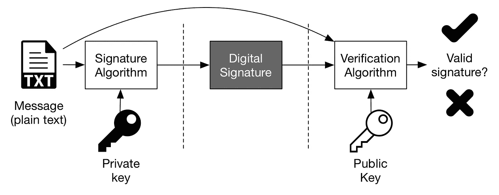

# 比特币区块链浅探第二部分——交易

> 原文：<https://towardsdatascience.com/a-shallow-dive-into-bitcoins-blockchain-part-2-transactions-d4ee83067bae?source=collection_archive---------14----------------------->

[source](https://www.mentalfloss.com/article/500940/fact-check-physicist-weighs-whether-scrooge-mcduck-could-actually-swim-pool-gold)

在[之前的文章](https://medium.com/@alymbouras/a-shallow-dive-into-bitcoins-blockchain-part-1-consensus-48f62355681b)中，我们讨论了比特币网络中的共识。

我们说过，有一种额外的安全措施可以防止坏人从别人的钱包里拿走资金。这将在本文中解释。

资金保存在数字钱包里。或者我应该说**通过数字钱包追踪**。有一种普遍的误解，认为你的硬币是放在钱包里的。硬币(或者应该说数字)实际上是以交易的形式存入区块链的；数字钱包创造的交易。

数字钱包不过是一段代码，通过扫描区块链街区内的交易来跟踪和计算所有者的余额。

Transactions are structures within the block structure. The whole chain of blocks is stored on a bitcoin participant’s hard disk.

钱包的主要功能之一是代表主人签署交易。

它们有点像真实世界的签名，但更强大。数字签名可以:

1.  证明账户所有人是唯一授权使用其资金的人
2.  授权证明是不可否认的
3.  证明交易签署后没有也不能被任何人修改

## 私钥/公钥和比特币地址

为此，网络中的每个帐户所有者都必须创建一个公钥/私钥对。它们被认为是“一对”，因为公钥是从私钥派生出来的。**你的私钥只不过是一个数字！**数字世界中 0-2 ⁵⁶(remember 之间的 256 位数字[一切都用位](https://medium.com/@alymbouras/this-is-how-internet-works-in-8-mins-f28e785e1f5b)表示。这是一个巨大的数字范围，这使得两个人得到相同的钥匙在统计学上是不可行的(有 10⁷⁷钥匙可用)。

这些密钥基于具有特殊性质的数学函数:计算它们很容易，但计算它们的倒数却很难。

公钥是其相关私钥的数学结果。而且即使知道创建它的[数学函数](https://en.wikipedia.org/wiki/Elliptic_Curve_Digital_Signature_Algorithm)，也无法推断出它的私钥。

Your public key is derived from your private key using elliptic curve multiplication. Your address is derived from your public key. Both of those actions are irreversible. [Source](https://github.com/bitcoinbook/bitcoinbook/blob/develop/images/mbc2_0401.png)

*这里值得一提的是，您的比特币地址是通过使用单向加密哈希从您的公钥中获得的。你的地址是和其他比特币持有者交易的方式。它只是代表比特币需要发送到的目的地。*

不过，创建私钥的方式非常重要。你绝不会选择数字 1 作为你的私钥。那太危险了！任何人，使用相同的数学函数，都可以从私钥推断出比特币的地址。如果那个比特币地址拥有硬币，它们很容易被盗。

事实上，如果您运行一个尝试每个数字(私钥)的脚本，从数字 1 数到 100，000，您会发现(在几秒钟内)几十个可用的比特币地址！为了发现一个地址是否可用(一个在比特币网络中拥有一些硬币的地址)，人们必须遍历整个区块链，如果找到该帐户的引用，嘣！一个人可以用这个弱生成的数字(私钥)从里面偷走所有的硬币。

实际上，私钥号 1 衍生出来的比特币地址是可用的:[1 ehna 6 q 4 JZ 2 uvnexl 497 me 43 ikxhwf 6 kzm](https://www.blockchain.com/btc/address/1EHNa6Q4Jz2uvNExL497mE43ikXhwF6kZm)。

如果你点击这个链接，你会看到进入这个地址的任何东西都会在几秒钟内被撤回！钱一进来，有人就可以快速创建一个交易(使用自己的地址作为目的地)，用私钥数字 1 签名，并传播到网络的其余部分！

太好了！为什么每个人都不这样做呢？

原因是检查所有可能的私钥号码是一项非常困难的任务。例如，50 台超级计算机需要大约 3×10⁵年的时间(每秒检查一万亿个键！)耗尽整个 2 ⁵⁶密钥空间。

## 糟糕的私钥生成算法

一些钱包曾经使用人类提供的密码来创建私钥(本质上是数字)。然而，黑客可以很容易地快速检查弱密码或常用密码(这个范围要小得多)。

私钥被盗(源自弱密码)的帐户示例:

> ASD—1g 4 mt 5 jltrdj 4 hm 6 mkyaqphmzzvoojlfx 3
> cat—162 trprzvdglvnksmoyjsybfytb 4 q 8 TM
> hello—1 hosfymoqteymr7s 3 jddqmqmggoxacbk 37
> 密码—16ga 2 uqnf 1 qpauqeeg 7 stcadtduwdyjav
> 测试—1 hkqktmpbtzz 8 H5 zqyewybaawelrdexee
> fuckyou—1

## 数字签名

签署交易的过程涉及一个数学函数，该函数既取决于消息(交易细节)，也取决于您的私钥。

> sign(消息，私钥)=签名

结果是一个签名，可以使用您的公钥和消息(交易详细信息)进行验证。

> 验证(消息、签名、公钥)=[真或假]

Verifying digital signatures. [Source](https://stakey.club/en/verifying-digital-signatures/)

私钥、公钥和签名这三者加在一起[在数学上是相关的](https://en.wikipedia.org/wiki/Elliptic_Curve_Digital_Signature_Algorithm)。

验证过程毫无疑问地确定交易可能仅来自具有对应于其公钥的私钥的人。因此，接收交易的网络的所有参与者都确信，该交易只能由私钥所有者批准！

所有者还可以确保没有人能够更改他的交易的签名部分。这是因为一个简单的改变会使他的交易无效，从而被所有网络参与者放弃。

## 签名中随机性的重要性

专注于用于交易的弱随机数生成器，黑客仍然可以获得对地址硬币的控制。

用于创建消息签名的数学基础使用一个随机数(见下面的公式)。如果*相同的随机数*被用于签署两个不同的消息(事务)，那么某人使用这两个结果签名可以提取私有密钥数。

生成签名的数学公式是这样计算的:

> s = k-1(Hash(m)+dA * R)mod p
> 其中:
> **k** 是随机数
> **R** 是从随机数 k
> **dA** 是签名私钥
> **m** 是交易数据
> **p** 是椭圆曲线的素数阶

人们实际上因为这个随机数的不经意的*重复使用*而导致资金被盗。

为了避免这种漏洞，钱包必须遵循行业标准算法，按照 [RFC 6979](https://tools.ietf.org/html/rfc6979) 中的定义，对该随机数进行确定性初始化。

现在你已经记住了所有必要的细节，让我们来看看交易的过程:

1.  你的钱包是一个作为用户界面的应用程序。它显示您的余额，并在汇款时请求您的允许。为了做到这一点，它跟踪你的收入和支出交易，总结你的可消费金额，并代表你创建和签署交易。
2.  首先，指定比特币所有者的金额和目的地地址。基于这些信息，你的钱包构建一个交易(按照比特币协议)并用你的私钥签名。
3.  你的钱包开始通过它的直接对等点向比特币网络广播你的新交易(包含交易细节、签名和公钥)，这些对等点将交易传递给它们的对等点，等等。在几秒钟内，整个网络已经验证了你的交易，并将其传递给比特币网络上的每个其他节点。

Transaction propagation

4.网络上收到您交易的每个参与者都会检查其有效性。他们检查签名是否正确，是否有任何错误，你是否试图执行双重消费，等等。如果您的交易不符合任何标准，参与者会完全忽略它。否则，参与者会将您的事务保存在一个名为 mempool 的临时内存中。

5.费用低于 *minrelaytxfee* 变量(0.00001 比特币)的交易被视为免费，只有在 mempool 中有空间时才会被中继；否则，它们将被丢弃。如果附加费用小于*平均竞争交易费用*(通常由你的钱包计算，但你也可以指定费用)，矿工/矿池将在创建区块时给予你的交易较低的优先级。

6.最终，您的交易到达挖掘池和交易接收者的钱包。后者会在他们的钱包里看到新的交易，并无限期地存储它的副本，但它会以零确认的形式出现。挖掘池通过聚合来自内存池的事务来构建候选块。根据你的费用，他们最终会把你的费用包括在未来的费用中。

7.池将搜索满足块难度级别的随机数的工作分配给它的池矿工。矿工对你的交易一无所知。他们的工作是处理数字，而不是检查块的有效性，因为那是池的任务。

8.最终，您的事务被包含在一个得到解决的块中。它通过比特币网络传播，每个人都将其存储到自己的本地区块链(如果有交易冲突，他们将分叉现有的区块链，并保留两个区块链)。现在，您的事务有了一个确认(网络接受的一个有效块)。

9.块创建过程继续进行，随着越来越多的块建立在包含您的交易的块之上，它会获得更多的确认。当它达到 6 个或更多确认时，它被认为是完全确认的。确认时间越长，通过攻击使交易无效的难度就越大。

事务是更复杂的结构。他们在幕后看起来非常不同。它们有输入和输出，伴随着锁定和解锁比特币价值的脚本。

但那是另一篇文章；对事务的更深入探究。:)

在社交媒体上关注我:

 [## Andreas Lymbouras -应用程序开发人员-法国巴黎银行| LinkedIn

### 加入 LinkedIn 经验丰富的应用程序开发人员，并展示其在银行业的工作经历。熟练的…

www.linkedin.com](https://www.linkedin.com/in/andreas-lymbouras-51211246/)  [## 安德烈亚斯·林布拉斯(@alymbouras) |推特

### Andreas Lymbouras 的最新推文(@alymbouras)。软件开发商区块链工程师

twitter.com](https://twitter.com/alymbouras)