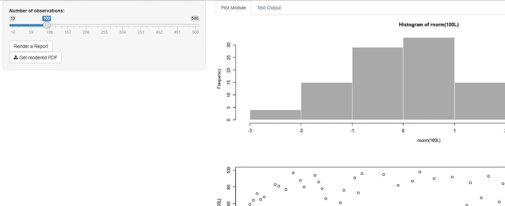
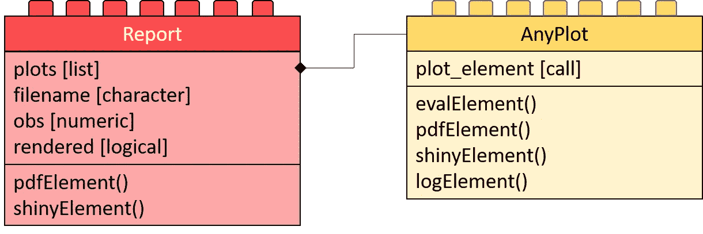

# 来自乐高的闪亮网络应用——卡车+拖车

> 原文：<https://towardsdatascience.com/a-shiny-web-app-from-lego-truck-trailer-c977015bc6a9?source=collection_archive---------20----------------------->

## 如何建造闪亮的“卡车”第 2 部分——让乐高“卡车”应用程序拉拖车。一个模块化闪亮应用的例子。


在 2018 年 9 月的[中，我用了一个汽车隐喻来解释一个大规模的闪亮应用。RViews 发表了这篇文章。我将用一句话来概括这篇文章。在 R shiny 中构建大型应用程序(卡车)时，有许多事情需要记住。为了在一个应用程序中涵盖所有这些内容，我提供了这个教程。](https://rviews.rstudio.com/2018/09/04/how-to-build-shiny-trucks-not-shiny-cars/)

您可以在 https://github.com/zappingseb/biowarptruck[下找到该应用的所有文件—文件夹:example_packaged](https://github.com/zappingseb/biowarptruck)

## 摘要(如果您阅读 RViews 中的文章，请跳过)

我在 RViews 上写的文章告诉读者，任何闪亮的应用程序都有可能在某一天变得巨大。从头开始，它必须是精心策划的。此外，应该可以删除或添加应用程序的任何部分。因此它必须是模块化的。每个模块必须像乐高积木一样工作。乐高积木有不同的功能。这些砖块遵循一定的规则，这使得它们彼此粘在一起。这些规则我们称之为标准。像乐高积木一样设计的模块增加了你的灵活性。因此，你的模块的可重用性增加了。当你设置你的应用程序时，你可以添加无限数量的乐高积木。它可以生长。想象像汽车这样的小规模应用。大规模应用是卡车。这篇文章解释了如何建造一辆乐高卡车。

> 如果你用乐高组装你的车，更多不同的零件可以让它成为一辆卡车。
> 
> 如果你用标准化的模块构建你的应用程序，你可以灵活地插入更多的功能。

# 模块化的闪亮应用——从哪里开始？

下图解释了模块化闪亮应用的想法。


你从一个闪亮的核心应用程序开始。把它看成你汽车的底盘。它是由乐高制成的。乐高制成的任何其他部分都可以粘在你的底盘上。这样的部件可以改变其功能。不同的模块将帮助你制造不同的汽车。此外，您希望有一个砖块说明(计划)。这个计划告诉我们该拿走哪些部分，以增加灵活性。砖块说明的背面可以包含相同砖块的不同型号。如果您可以从您的模块构建一个应用程序，您也可以构建一个包含相同模块的不同应用程序。如果你清楚这一点，我们可以开始在 [R-shiny](https://shiny.rstudio.com/) 开发我们的应用程序:

实施规则:

*   每个模块是一个 R 包
*   核心 R 包定义了砖块的标准化
*   核心应用是一个基本的闪亮应用
*   砖块指令(计划)文件不在 R 中

为什么这些规则存在，读了这篇文章就会明白了。

# 我们想要建立的应用程序



我们想要构建的应用程序将从一组用户输入中创建不同类型的输出。这些不同的输出将显示在应用程序中。此外，所有输出将进入一个 **PDF** 文件。该示例将包括绘图模块中的两个绘图和表格模块中的一个表格。由于每个模块都是一个 R 包，您可以想象逐步添加更多的 R 包。在 shiny 中，很多输出都是可能的。这个应用程序的主要特点是可以添加越来越多的模块。更多的模块不会搞砸 PDF 报告功能或查看功能。在这个应用程序中，模块根本不交互。

# 核心 R 包

核心包包含模块必须遵循的结构，以适应核心应用程序。有两种结构我们将定义为 R-S4 类。一个表示模块，另一个表示这些模块中的输出元素。



**Class diagram of the core application**: The left side shows the reports. The app can generate each of those. Each contains a list of elements to go into the report (plots). The right-hand side contains the class definition of such elements. Each element is of kind AnyPlot. This class contains a call (plot_element) that produces the element upon calling evalElement.

对于任务一，我们称这个对象(类)为报表。报告是我们在核心应用程序中定义的主要模块。它包含:

```
**plots** — A list of all elements shown in the report 
**filename** - The name of the output file (where to report to) 
**obs** - The handling of the input value input$obs 
**rendered** - Whether it shows up in the app right now
```

此外，Report 类还带有一些生成漂亮输出的功能。此外，它允许创建 PDF 报告。这些功能包含在方法 shinyElement()和 pdfElement()中。在 [R-S4](http://adv-r.had.co.nz/S4.html) 中，这看起来像这样:

现在我们还要定义，如何构造这样的每个元素。因此，我们定义了一个类 AnyPlot，它携带一个表达式，因为它是唯一的槽。`evalElement`方法将计算这个表达式。`pdfElement`方法创建一个可以输出到 PDF 的输出。`shinyElement`通过调用`shiny::renderPlot()`创建一个 PlotOutput。`logElement`方法将表达式写入日志文件。 [R-S4](http://adv-r.had.co.nz/S4.html) 代码显示如下:

# 核心应用程序

为了使这个例子简单，核心应用程序将包括所有的输入。这个应用程序的输出将是模块化的。核心应用程序必须完成以下任务:

1.  有一个显示模块的容器
2.  阅读计划—添加容器
3.  包括将模块打印成 PDF 的按钮
4.  *想象一下还有一个按钮打印模块来”。png“，”。jpg“，”。xlsx"*
5.  包括输入

## 显示模块

对于任务一，我们使用给定对象的`shinyElement`方法，并将其插入到任何输出中。我为每个模块决定了一个选项卡输出。因此每个模块都在不同的选项卡中呈现。

## 阅读计划

现在，应用程序的最难部分来了。正如我所说，我想增加两个模块。一个有图，一个有表。计划(config.xml)文件必须包含这些信息。所以我把它作为一个计划文件:

```
<?xml version="1.0" encoding="UTF-8"?>
<modules>
  <module>
    <id>module1</id>
    <name>Plot Module</name>
    <package>module1</package>
    <class>PlotReport</class>
  </module>
  <module>
    <id>module2</id>
    <name>Text Output</name>
    <package>module2</package>
    <class>TableReport</class>
  </module>
</modules>
```


Construction plan of the web App

你可以看到我有两个模块。每个模块都有一个包。在这个包中，一个类定义了(参见[模块包](http://www.hemingwayapp.com/#07bb)一节)输出。这个班是我们**报**班的子班。

该模块在我们的应用程序中显示为一个选项卡。我们将一步一步地完成这个过程。首先，我们需要一个函数来加载每个模块的包:

```
library(XML)
load_module <- function(xmlItem){
  devtools::load_all(paste0("./",xmlValue(xmlItem[["package"]]))) 
}
```

其次，我们需要一个函数来从模块的信息中生成一个选项卡:

```
library(shiny)
module_tab <- function(xmlItem){
  tabPanel(XML::xmlValue(xmlItem[["name"]]),
           uiOutput(xmlValue(xmlItem[["id"]]))
  )
}
```

现在我们有了这两个函数，我们可以迭代 XML 文件并构建我们的应用程序。首先，我们需要一个像`tabPanel(id='modules')`这样的 UI 中的`TabPanel`。之后，我们可以将应用程序的配置读入`TabPane`。因此我们使用`appendTab`功能。函数`XML::xmlApply`让我们遍历 XML (config.xml)的每个节点并执行这些任务。

```
configuration <- xmlApply(xmlRoot(xmlParse("config.xml")),function(xmlItem){ load_module(xmlItem)

    appendTab("modules",module_tab(xmlItem),select = TRUE)

    list(
      name = xmlValue(xmlItem[["name"]]),
      class = xmlValue(xmlItem[["class"]]),
      id = xmlValue(xmlItem[["id"]])
    )
  })
```

现在，每个模块都以静态方式加载到应用程序中。下一部分将讨论如何使其具有反应性。

## 将内容呈现到面板中

对于面板的动态渲染，有必要知道一些输入。首先是用户选择的选项卡。`input$modules`变量定义了选择的选项卡。此外，我们闪亮的应用程序的输出必须通过另一个输入更新，`input$obs`。因此，在更改选项卡或更改`input$obs`时，我们需要调用一个事件。这个事件将调用我们的 S4 对象的构造函数。在此之后，`shinyElement`方法呈现输出。


The module class gets reconstructed up on changes in the input$modules or input$obs

reactive `report_obj`是一个可以调用我们 **Report** 对象的构造函数的函数。对`input$obs`和`input$modules`使用`observeEvent`功能，我们称之为反应式。这允许对用户输入做出反应。

## 从报告中导出 PDF 文件


Adding a PDF render button to enable the download of PDF files.

`pdfElement`函数将 S4 对象渲染为 PDF 文件。如果这样做很好，PDF 元素加起来就是下载按钮。

一个额外的标签检查 PDF 渲染是否成功。

我们完成了核心应用程序。可以在这里找到 app:[app。R](https://github.com/zappingseb/biowarptruck/blob/master/example_packaged/app.R) 还有这里的核心包:[核心](https://github.com/zappingseb/biowarptruck/tree/master/example_packaged/core)。

最后一步是把整辆卡车组装起来。

# 模块包

这两个模块包现在将包含两个类。两者都必须是类 **Report 的子类。这些类中的每个元素必须是类的子类。**下图中的红砖代表**报告**，黄砖代表**任何地块。**


Final app: The truck consists of a core app with a PlotReport and a TableReport. These consist of three AnyPlot elements that the trailer of the truck carries.

## 绘图包

第一个模块包将生成散点图和直方图。两者都是类定义中`contains='AnyPlot'`的 **AnyPlot** 的子元素。`PlotReport`是该包中**报表**的类。它在`plots`槽中包含了这两个图。有关这些类的构造函数，请参见下面的代码。

## 桌子包装

表格包遵循与地块包相同的规则。主要区别在于`plots`槽内只有一个元素。这个元素不是情节。这就是为什么它包含一个`data.frame`调用作为它的表达式。

为了使内部的`data.frame`调用闪亮，我们必须重写`shinyElement`方法。我们将返回一个`renderDataTable`输出，而不是返回一个`renderPlot`输出。此外，`pdfElement`方法必须返回一个`gridExtra::grid.table`输出。

## 包装优势

打包每个模块的一个主要优点是依赖关系的定义。描述文件指定了模块包的所有依赖关系。例如，表格模块需要`gridExtra`包。核心 app 包需要`shiny, methods, XML, devtools`。app 不需要额外的`library`调用。任何同事都可以安装所有依赖项

# 最后的话

现在，您必须有工具来开始构建自己的大型闪亮应用程序。使用包将应用模块化。使用 S4 或任何其他面向对象的 R 风格将其标准化。使用 XML 或 JSON 文档设置应用程序。你可以走了。在一个目录中设置核心包和模块包。你可以用 *devtools* 加载它们，并开始构建你的*闪亮的*文件`app.R`。现在，您可以构建自己的应用程序来交换模块包。


像每个孩子一样，你现在可以尽情地玩你的卡车了，你可以走了。我不能告诉你是建造更有趣还是滚动更有趣。


亲爱的读者:写下我在构建模块化闪亮应用程序方面的工作总是令人愉快的。感谢你一直读到这篇文章的结尾。如果你喜欢这篇文章，你可以在 [*中*](https://medium.com/p/c977015bc6a9) *或者在*[*github*](https://github.com/zappingseb/biowarptruck)*上为它鼓掌。如有任何意见，请在此留言或在我的 LinkedIn 个人资料上留言*[*http://linkedin.com/in/zappingseb.*](http://linkedin.com/in/zappingseb.)

# 进一步阅读

*   [如何在闪亮的应用中构建自定义输入](https://medium.com/@zappingseb/7-steps-that-make-custom-inputs-in-shiny-easy-504b303a2973)
*   如何让人们在一小时内做好准备
*   [教程:可视化活检数据的应用](https://medium.com/datadriveninvestor/tutorial-an-app-in-r-shiny-visualizing-biopsy-data-in-a-pharmaceutical-company-f15f06395f3e)