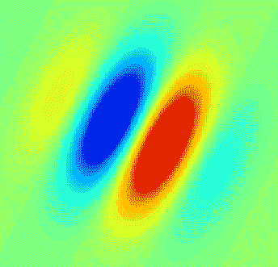
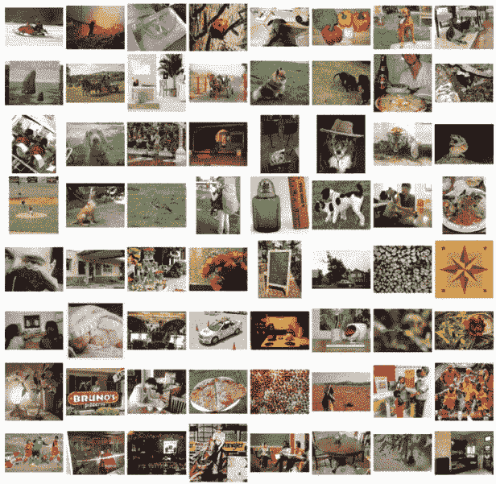
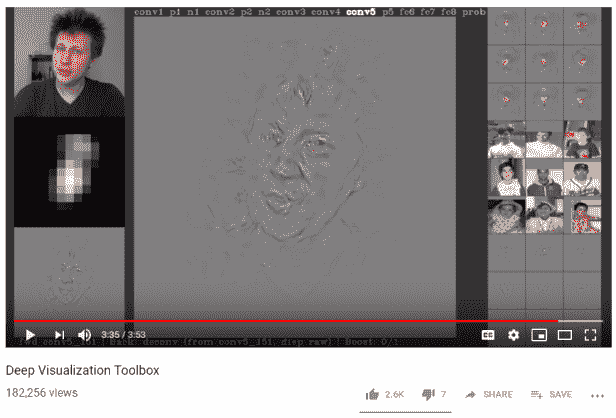
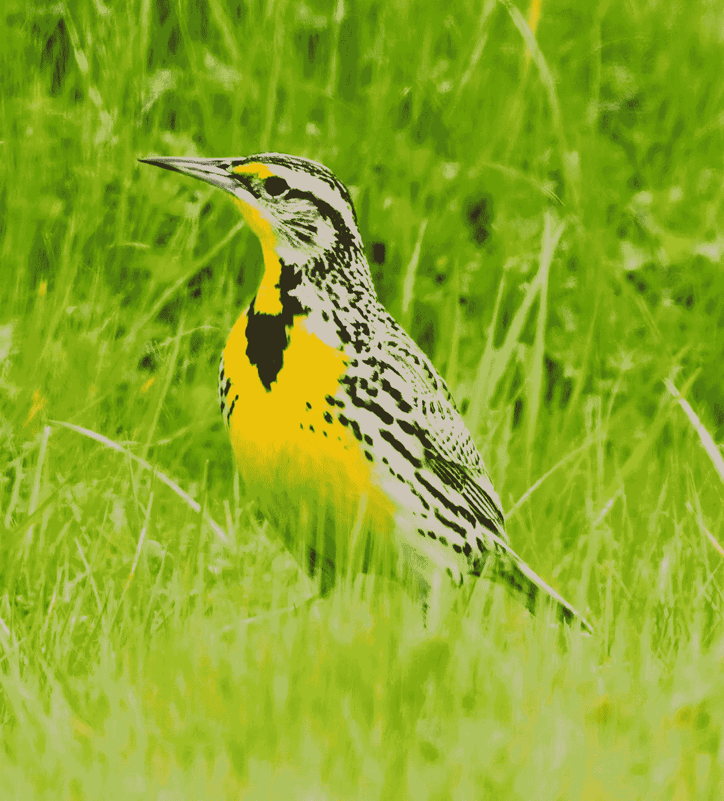

# 卷积神经网络的历史

> 原文：<https://towardsdatascience.com/a-short-history-of-convolutional-neural-networks-7032e241c483?source=collection_archive---------5----------------------->

卷积神经网络，简称 CNN，构成了许多现代计算机视觉系统的主干。这篇文章将描述 CNN 的起源，从 20 世纪 50 年代的生物实验开始。

**简单和复杂细胞**

1959 年，[大卫·胡贝尔](https://en.wikipedia.org/wiki/David_H._Hubel)和[托尔斯滕·威塞尔](https://en.wikipedia.org/wiki/Torsten_Wiesel)描述了人类视觉皮层中的“简单细胞”和“复杂细胞”。他们提出两种细胞都用于模式识别。一个“[简单单元格](https://en.wikipedia.org/wiki/Simple_cell)响应特定方向的边缘和条，例如[这个图像](https://en.wikipedia.org/wiki/Simple_cell):

一个“[复杂单元](https://en.wikipedia.org/wiki/Complex_cell)也对特定方向的边缘和条做出响应，但它与简单单元的不同之处在于，这些边缘和条可以在场景中四处移动，并且该单元仍然会做出响应。例如，简单的单元格可能只响应图像底部的水平条，而复杂的单元格可能响应图像底部、中间或顶部的水平条。复杂细胞的这种特性被称为“空间不变性”

本文中的图 1 显示了简单细胞和复杂细胞之间的区别。

Hubel 和 Wiesel 在 1962 年提出，复杂细胞通过“求和”几个简单细胞的输出来实现空间不变性，这些简单细胞都倾向于相同的方向(例如水平条)但不同的感受野(例如图像的底部、中部或顶部)。通过从一群简单的细胞奴才那里收集信息，复杂细胞可以对任何地方出现的横条做出反应。

这个概念——简单的检测器可以被“相加”以创建更复杂的检测器——在人类视觉系统中随处可见，也是卷积神经网络模型的基本基础。

(旁注:当这一概念走上极端时，你会得到“[祖母细胞](https://en.wikipedia.org/wiki/Grandmother_cell)”:即在你大脑的某个地方有一个单一神经元，专门对你祖母的视线做出反应。)

**大脑皮层**

20 世纪 80 年代，Kunihiko Fukushima 博士受到 Hubel 和 Wiesel 关于简单和复杂细胞的工作的启发，提出了“ [neocognitron](https://en.wikipedia.org/wiki/Neocognitron) ”模型(原文：<https://www.rctn.org/bruno/public/papers/Fukushima1980.pdf>)。neocognitron 模型包括称为“S 细胞”和“C 细胞”的组件这些不是生物细胞，而是数学运算。“S 细胞”位于模型的第一层，并与位于模型第二层的“C 细胞”相连。总体想法是捕捉“简单到复杂”的概念，并将其转化为视觉模式识别的计算模型。

**用于手写识别的卷积神经网络**

现代卷积神经网络(CNN)的第一项工作发生在 20 世纪 90 年代，受到 neocognitron 的启发。Yann LeCun 等人在他们的论文[“Gradient-Based Learning Applied to Document Recognition”](http://yann.lecun.com/exdb/publis/pdf/lecun-01a.pdf)(现在被引用了 17，588 次)中证明了一种将简单特征聚合成逐渐更复杂特征的 CNN 模型可以成功地用于手写字符识别。

具体来说，LeCun 等人使用 MNIST 手写数字数据库训练了一个 CNN。MNIST 是一个现在著名的数据集，它包括手写数字的图像，这些图像与它们的真实标签 0、1、2、3、4、5、6、7、8 或 9 配对。CNN 模型通过给它一个示例图像来训练 MNIST，要求它预测图像中显示的是什么数字，然后根据它是否正确预测了数字身份来更新模型的设置。最先进的 CNN 模型今天可以在 MNIST 数字分类上达到近乎完美的准确度。

[来自 MNIST 数据集](https://en.wikipedia.org/wiki/MNIST_database)的手写数字示例。

这项工作的一个直接结果是[你的邮件现在由机器分类](https://mailingsystemstechnology.com/article-2813-Optical-Character-Recognition-A-Backbone-for-Postal-and-Mail-Sorting-Applications.html)，使用自动手写识别技术读取地址。

**卷积神经网络看到一切**

在整个 20 世纪 90 年代和 21 世纪初，研究人员对 CNN 模型进行了进一步的研究。大约在 2012 年，在一家名为 AlexNet 的 CNN 在 ImageNet 挑战赛中实现了最先进的图片标签性能后，CNN 的受欢迎程度大幅上升(这种情况一直持续到今天)。Alex Krizhevsky 等人发表的论文“ [ImageNet 分类与深度卷积神经网络](https://papers.nips.cc/paper/4824-imagenet-classification-with-deep-convolutional-neural-networks.pdf)”描述了获胜的 AlexNet 模型；这篇论文被引用了 38007 次。

与 MNIST 类似， [ImageNet](http://www.image-net.org/) 是一个公开的、免费提供的图像及其相应真实标签的数据集。ImageNet 关注的不是标有 0-9 的手写数字，而是“自然图像”，或世界的图片，上面标有各种描述符，包括“两栖动物”、“家具”和“人”。这些标签是通过大量的人工努力获得的(即人工标记——要求某人为每张图片写下“这是什么图片”)。ImageNet 目前包含 14，197，122 张图像。

[来自 ImageNet 数据集](https://www.researchgate.net/figure/Examples-in-the-ImageNet-dataset_fig7_314646236)的示例图像。

在过去的几年中，CNN 在描述自然图像(包括 ImageNet、 [CIFAR-10、CIFAR-100](https://www.cs.toronto.edu/~kriz/cifar.html) 和 [VisualGenome](https://visualgenome.org/) )、执行面部识别(包括 [CelebA](https://www.kaggle.com/jessicali9530/celeba-dataset/kernels) )和分析医学图像(包括[胸部 x 光](https://stanfordmlgroup.github.io/competitions/chexpert/)、[皮肤病变照片](https://www.nature.com/articles/nature21056)和[组织病理学切片](https://www.ncbi.nlm.nih.gov/pmc/articles/PMC5446756/))方面取得了出色的表现。这个名为“网络上的 CV 数据集”的网站有一个超过五十个带标签的图像数据集的广泛列表，研究人员可以用它来训练和评估 CNN 和其他类型的计算机视觉模型。公司正在开发许多令人兴奋的应用程序，包括 [Seeing AI](https://www.theverge.com/2017/7/12/15958174/microsoft-ai-seeing-app-blind-ios) ，这是一款智能手机应用程序，可以向盲人口头描述周围环境。

**CNN 与人类视觉？**

大众媒体经常谈论神经网络模型如何“直接受到人脑的启发”。在某种意义上，这是真的，因为 CNN 和人类视觉系统都遵循“简单到复杂”的层次结构。但是，实际实现完全不同；大脑是用细胞构建的，神经网络是用数学运算构建的。

这个视频，Jason Yosinski 的“深度可视化工具箱”绝对值得一看，可以更好地理解 CNN 如何获取简单的特征，并使用它们来检测复杂的特征，如人脸或书籍。

**结论**

在过去的几十年里，计算机视觉取得了长足的进步。想象未来会有哪些新的发展改变该领域，并推动自动化放射学图像解释和无人驾驶汽车等技术，这是令人兴奋的。

**关于特色图片**

特色图片展示了一只[西部草地鹨](https://en.wikipedia.org/wiki/List_of_birds_of_North_Dakota)。有各种各样的鸟类数据集可用于训练 CNN 自动识别鸟类物种，包括[加州理工学院-加州大学圣迭戈分校鸟类 200 数据集](http://www.vision.caltech.edu/visipedia/CUB-200.html)，其中包括 6033 张显示 200 种鸟类的图像。同样，[自然学家](https://www.inaturalist.org/pages/computer_vision_demo)正在建立一个众包自动物种识别系统，包括鸟类和许多其他物种。这种系统也许有一天会在保护生物学中大有用处。

*原载于 2019 年 4 月 13 日*[*http://glassboxmedicine.com*](https://glassboxmedicine.com/2019/04/13/a-short-history-of-convolutional-neural-networks/)*。*