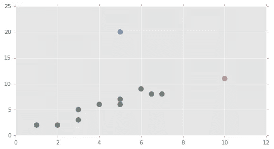
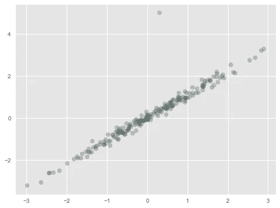
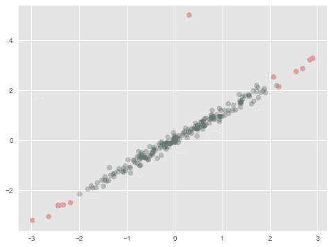
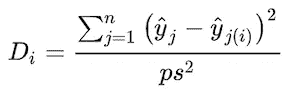

# 离群点检测的短暂旅程

> 原文：<https://towardsdatascience.com/a-short-journey-of-outlier-detection-bdf143464a92?source=collection_archive---------8----------------------->

## 查找异常值的几种方法的快速概述

[Source](http://Source): Pexels by Pedro Figueras

## **目录:**

*   目标
*   单变量异常值检测
*   线性回归模型的异常值检测

# **目标**

根据我们工作的内容和当前使用的模型，有很多方法可以捕捉异常数据。当我们需要精确的统计数据和模型时，注意异常数据是至关重要的，因为这些数据，如异常值，会极大地影响均值、标准差和方差。在本文中，我们将体验三种类型的技术:

*   对于带有 *Z-socre* 和 *IQR* 的单变量
*   对于带有简单*杠杆统计*、*库克距离*和 *DFFITS* 的线性回归模型，以及
*   对于具有*稳健协方差*、*局部异常因子*和*隔离森林*的双变量和高维

我们的主要目标是获得更深一层的理解，而不仅仅是通过阅读文章获得想法，并从实验中获得洞察力。我们还寻求实现它们的能力，这样我们就可以在需要时优化我们的算法，这样我们就可以在使用开源软件时处理意想不到的问题。

# 单变量

在处理单变量时，我们的方法很简单。因为我们有高中的数学知识，我们已经知道如何处理异常值。

## IQR

第一种方法是 IOR(四分位间距)。设 ***X*** 为一元变量，一组值，s.t. ***X*** ={0，1，2，3，4，5， ***6*** ，7，8，9，10，11，20}。用 ***X*** ，我们简单算一下 Q1、Q2、Q3。在这种情况下，Q1=3，Q2(中位数)=6，Q3=9，IQR 是 Q3-Q1=6。异常值定义为

***Q1-1.5*IQR*** 或 ***Q3+1.5*IQR*** ，

因此，在这种情况下，如果 a 值小于-6 或大于 18，则为异常值。在数据集 ***X*** 中，20 是离群值。

## **Z 分数**

使用 Z 分数来检测这种异常值也很简单。与 IQR 的不同之处在于首先将原始数据转换成 Z 值。z 分数定义为

***z=(x-μ)/* σ，**

其中 ***x*** 是原始数据， ***μ*** 只是***x*****σ**是 ***x*** 的标准差。异常值也被定义为

***Z 值小于 1.0 或大于 3.0 的 x***

在代码以下的数据样本中，30 是一个异常值。

这是异常检测和单变量检测。Z 分数的概念值得注意，因为它用于计算 Mahalanobis 距离。此外，在比较稳健协方差作为异常检测的性能时，马氏距离是一个基本概念。

# 线性回归模型

接下来我们将看看线性回归模型的异常检测技术，具体来说，*杠杆统计*、*库克距离*和 *DFFITS* 。他们的目的是相同的，然而他们的方法是不同的。

## **杠杆统计**

杠杆统计是对数据与他人的距离/影响力的诊断。这里我们要观察**杠杆** **点**，它是对回归模型没有影响，但对数据集的均值、方差有影响的数据点，以及**影响点**，它是对两者都有影响的数据点。我们将测量每个点的观测影响，并检测对从观测中提取的信息量有很大影响的异常数据。

Influence point (blue point) v.s. Leverage point (red point)

设 ***X*** 为设计矩阵， ***x*** 为 ***X*** ， ***x ⊆ X*** 的变量。在杠杆统计中，我们计算杠杆分数，并将其与临界值进行比较。超过临界值的分数是杠杆或影响点。截止值定义为

***2*(全球平均观测影响(OI)/n)，OI =痕迹(H)，***

其中 ***n*** 为观察数， ***H*** 为 ***X*** 的投影矩阵。投影矩阵 ***H = X(XᵀX)⁻ Xᵀ*** ，各次观测的杠杆分数*是*的对角线入口。**

**为了实现这一点，我们首先制作简单的样本数据，并用红色添加一个影响点。如果一个杠杆分数超过截止值，那么我们也把它涂成红色。**

******

Fig. left: Plot data points with influence point (red). Fig. right: Applying leverage statistics and detecting leverage and influence points(red)** 

**从右图中我们可以看到，高度偏离的数据点被检测为杠杆点和影响点。**

## ****d fits****

**当我们拟合了一些估计量的值时，如 OLS，我们可以用 DFFITS 来寻找异常点。当我们在杠杆统计中计算分数时，我们在 DFT ifts 中做同样的事情。DFFITS 用两个不同估计量的拟合值之差来度量分数。其得分公式定义为**

*****DFFITSᵢ = (ŷᵢ-ŷᵢᵢ) / s*√hᵢᵢ，*****

**其中，*是由估计器基于包括第 I 个观测值的数据集预测的第 I 个拟合值，而***【ŷᵢᵢ】***是由基于估计器的不包括第 I 个观测值的数据集预测的拟合值。 ***s*** 是由基于估计量的数据集预测的独立值和拟合值的误差的标准偏差，不包括第 I 次观察。***

**上面的公式等于，**

*****dffitsᵢ=tᵢ* √[hᵢᵢ/(1-hᵢᵢ)】*****

**其中 ***tᵢ*** 是一个 [R-student](https://en.wikipedia.org/wiki/Studentized_residual) 。**

**在下面的代码中，我们用第 I 个观察值来计算 DFFITS。因此 ***tᵢ*** 被称为内化残。**

## **库克的距离**

**就 DFFITS 而言，当我们已经知道拟合值时，Cook 距离也是一种有用的方法。该方法通过计算由估计器基于包括第 I 个观察值数据集预测的第 I 个拟合值和由估计器基于排除所有第 I 个数据的第 I 个观察值的数据集预测的拟合值之间的平方误差来测量得分。因此，该公式定义为**

****

**其中 ***p*** 为变量个数， ***s*** 为回归模型的均方误差，拟合值定义与 DFFITS 中相同。对于小样本量，[临界值](https://www.researchgate.net/publication/258174106_Best-Practice_Recommendations_for_Defining_Identifying_and_Handling_Outliers)推荐为 *2*(p+1)/n* ，对于大样本量， *3*(p+1)/n* 。**

**上述公式等于**

*****dᵢ=(tᵢ/p*s)* √[hᵢᵢ/(1-hᵢᵢ)】*****

**这方面的术语同上。**

**在 [Statsmodels](https://www.statsmodels.org/dev/generated/statsmodels.stats.outliers_influence.OLSInfluence.summary_frame.html) 中提供了库克距离和 DFFITS。为了进行 n 次实验，看看库克距离和 DFT ifts 之间的结果有多大差异，现在我们来看下面的代码。我们使用来自 Kaggle( [来源](https://www.kaggle.com/pitasr/falldata))的跌倒检测数据集。为了方便起见，我们取时间(监测时间)和 HR(心率)，检查 ***cooks_d*** 和 ***dffits*** 值。在这两个图中，蓝线是 OLS 的回归线。Cook 的距离检测 HR 值方面的远杠杆数据和高变量数据点，而 ***DFFITS*** 倾向于检测回归线以上的数据点，而不检测位于远右上方的数据点。**