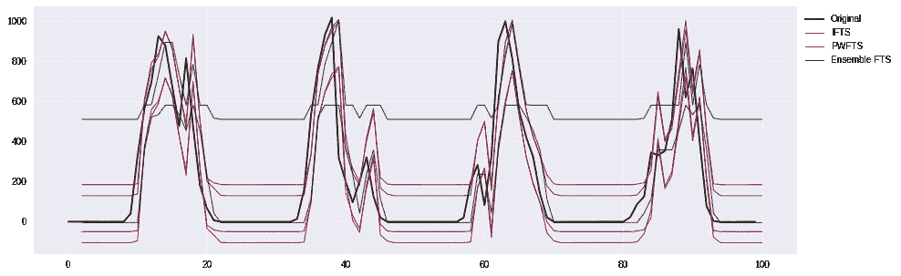
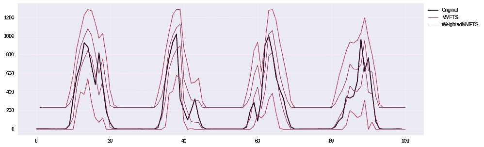
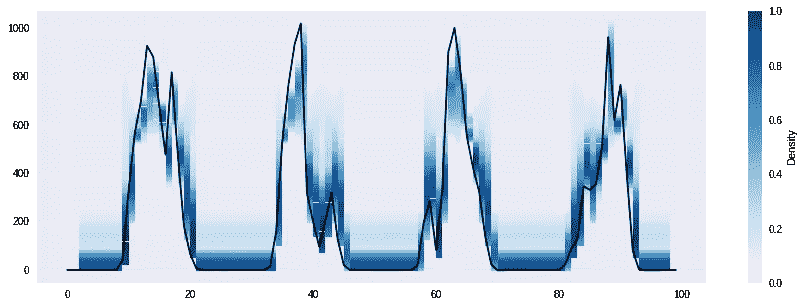
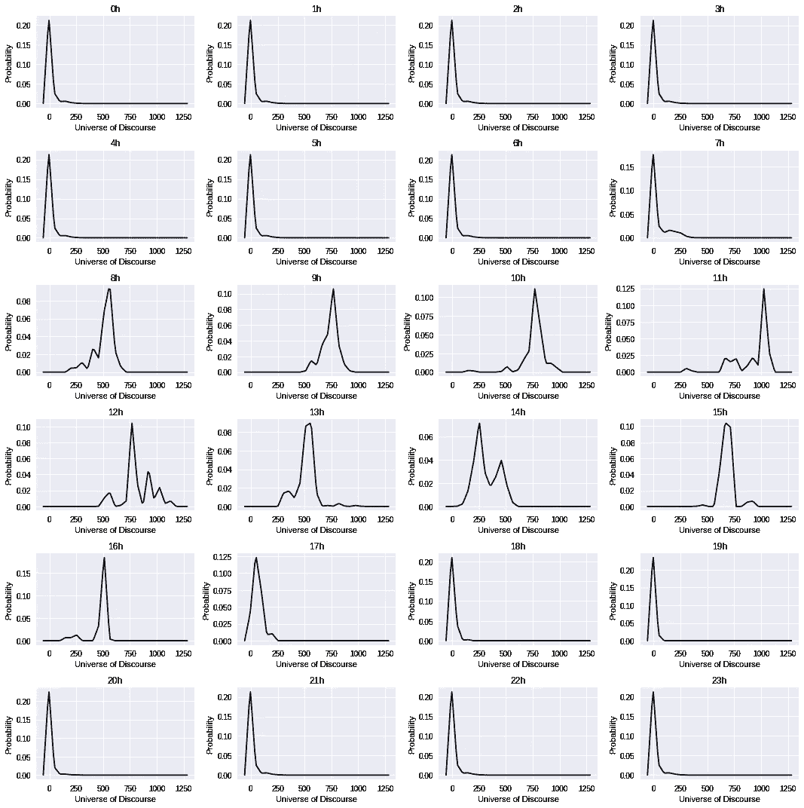
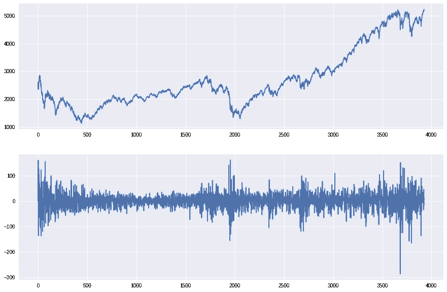
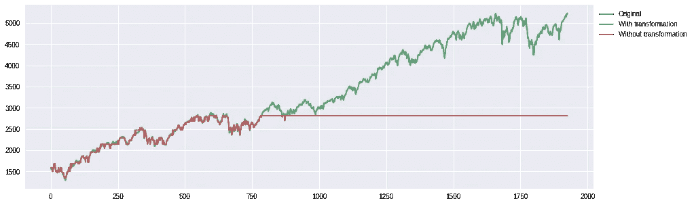
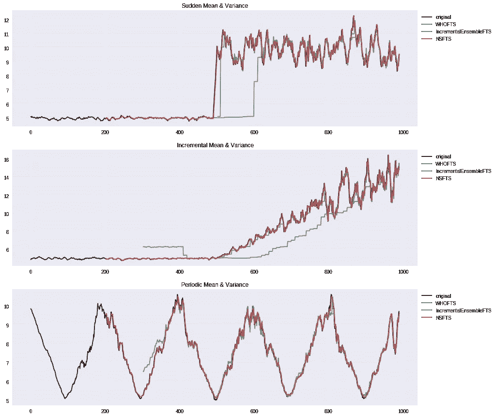

# 模糊时间序列的简短教程—第三部分

> 原文：<https://towardsdatascience.com/a-short-tutorial-on-fuzzy-time-series-part-iii-69445dff83fb?source=collection_archive---------11----------------------->

## 区间和概率预测和非平稳方法


嗨伙计们！距离我发表这篇教程的[第一篇](/a-short-tutorial-on-fuzzy-time-series-dcc6d4eb1b15)和[第二篇](/a-short-tutorial-on-fuzzy-time-series-part-ii-with-an-case-study-on-solar-energy-bda362ecca6d)已经很久了。与此同时，我有机会与许多在几个不同领域应用 FTS 方法的人交谈，他们帮助我通过修复一些错误和扩展其功能和可用性来改进 pyFTS 库。

从本教程开始，我们就一直在处理不确定性。我们找到了使用模糊集来建模和描述时间序列的时间行为的方法，但我们没有考虑我们预测的[不确定性](https://en.wikipedia.org/wiki/Uncertainty)。预测的不确定性就像一场雾:如果你看得更近，你会看到模糊不清，这可能不会对你产生太大影响，但如果你想看得更远…

所以，现在是时候深入探讨更多的预测类型和新方法了，这一次我将重点关注非平稳时间序列、概念漂移等。

本教程的所有例子都可以在谷歌实验室、http://bit.ly/short_tutorial_colab3 网站上找到。请随时联系，提供反馈并提出问题。现在，我们走吧！

# 点位预测背后有什么？

大多数预测方法产生点预测，即单一标量预测。给定一个数值时间序列 *Y* 及其单个值 *y(t) ∈ Y* ，一个点的预测通常是一个[条件期望](https://en.wikipedia.org/wiki/Conditional_expectation) *ŷ(t+1) = 𝔼[Y |y(t)，…】。*这个数字代表了在时间 *t+1* 时 *Y* 的最佳猜测值，根据我们对 Y 的了解，以及它过去的值 *t，t-1，* …不管我们的估计量有多好，它仍然是一个猜测值，而不是一个精确的确定值。换句话说，这个数字的背后隐藏着不确定性。

点预测的问题就在于此:它没有告知周围的不确定性。一个很好的起点是[条件方差](https://en.wikipedia.org/wiki/Conditional_variance)*Var[y(t+1)| y(t)】*，但通常不被告知，甚至不知道。

有一些方法可以解决点预测的这种局限性，它们是区间预测和概率预测。

## 区间预测

一个预测区间𝕀是一个元组𝕀=*【u，l】*，其中 *u* 是不确定性上界， *l* 是不确定性下界，断言估计很可能会落在这个区间内，ŷ(t+1)∈*【u，l】。*

置信区间是与置信水平α ∈ [0，1]相关联的值σ，其中 *ŷ(t+1) ∈ [ ŷ(t+1)-σ，ŷ(t+1)+σ]* 具有概率α。置信区间通常是参数化的，即它们假设预测值ŷ(t+1 周围的不确定性由高斯 pdf 描述。

有几种方法可以衡量区间预测的准确性，最简单的方法是[覆盖率](http://doi.org/10.2307/2527341)(表示落入区间内的真实值的百分比)[校准、锐度](https://www.stat.washington.edu/raftery/Research/PDF/Gneiting2007jrssb.pdf)等。已知 [Winkler 分数](http://doi.org/10.1080/01621459.1972.10481224)在一个度量中体现了区间的几个方面

*s(α,x,𝕀)=(u l)+2α(l−x)𝟙(x<l)+2α(x−u)𝟙(x>u)*

其中𝕀 = *[u，l]，* x 为真值，α为置信水平，𝟙(condition) = {条件为真为 1，否则为 0 }。

## 概率预测

一个概率预测是一个[概率分布](https://en.wikipedia.org/wiki/Probability_distribution)*p:u→【0，1】*，其中 *U* 是 *Y* 的论域，约束为 *∑P(x) = 1，∀x ∈ U* 。这意味着我们将为 *U* 的每一个可能值 *x* 估计一个概率π，即 *ŷ(t+1) = x* ，或者换句话说:P( *ŷ(t+1) = x) =* π，0 ≤ π ≤1 这是表示预测不确定性的最完整的方式，并为我们提供了 *ŷ(t+1)* 以其概率程度可以假设的可能值的图景。

有了概率分布 p，我们还可以计算α置信区间(使用[累积分布](https://en.wikipedia.org/wiki/Cumulative_distribution_function) F 的 *α* 和*1-α*分位数，并使用[期望值](https://en.wikipedia.org/wiki/Expected_value) *𝔼[P] = ∑xP(x)，∀x ∈ U.* 生成点预测

概率预测的主要准确性测量是[连续等级概率得分(CRPS)](https://www.lokad.com/continuous-ranked-probability-score) 。简而言之，CRPS 测量真实值 x 前后的预测概率曲线的面积。该测量值表明概率分布与真实值的接近程度。CRPS 是 MAE 在概率预报情况下的推广，CRPS 值越低越好。

*CRPS(F，x) = ∫ (F(y) -𝟙(y > x)) dy，y = -∞..+∞*

其中 *F(x) = P(X ≤ x)* 为累积分布函数，X 为真值。

# 我应该使用哪些 FTS 方法？

F 首先，在 pyFTS 库上，每个模型都有布尔标志，指示它能够做出哪种类型的预测。所有模型都支持点预测，但并非所有模型都支持区间预测和概率预测。如果您试图在没有这种技能的模型上使用其中一种预测，将会引发一个异常。

```
if model.has_interval_forecasting:
   forecasts = model.predict(data, type=’interval’)
```

要在 pyFTS 中生成区间预测，您可以使用与标量预测相同的方法——方法*预测 FTS 类中的*——并通知参数 *type='interval'* 。“预测”方法上的“区间预测”类型生成一个元组列表，每个元组有两个值，对应于一个预测区间𝕀 = *[u，l]。*一些模型(如 EnsembleFTS 和 PWFTS)允许指定区间的方法。

*   ifts。IntervalFTS (IFTS):生成预测区间的最基本方法，它是高阶函数的扩展。生成的预测区间不具有某种概率意义，它们只是度量预测过程中所涉及的模糊集的上下界，即模糊不确定性。[这里描述的是方法](https://doi-org.ez27.periodicos.capes.gov.br/10.1109/SSCI.2016.7850010)。
*   **合奏。AllMethodEnsembleFTS**:EnsembleFTS 是由几个基础模型组成的元模型。AllMethodEnsembleFTS 为 pyFTS 中实现的每个单变量 FTS 方法创建一个实例，并将它们设置为基础模型。预测是根据基本模型的预测计算出来的。[在这里可以找到该方法的简要说明。](http://abricom.org.br/wp-content/uploads/2018/09/cbic-paper-54.pdf)基本上有两种方法来计算集合中的预测区间:*极值*和*分位数*(默认)。在*极值*方法中，选择基础模型预测之间的最大值和最小值。在*分位数*方法中，必须告知阿尔法参数，然后对基础模型的预测进行排序，并提取分位数区间。

```
from pyFTS.models.ensemble import ensemblepart = Grid.GridPartitioner(data=train, npart=11)model = ensemble.AllMethodEnsembleFTS(partitioner=part)forecasts = model.predict(test, type='interval', mode='extremum')forecasts2 = model.predict(test, type='interval', mode='quantile', alpha=.1)
```

*   **pwft。probabilistweightedfts(PWFTS)**:顾名思义，这是最复杂的方法，仍在审核中(即将发布)。基本上有两种方法可以在 PWFTS 上产生预测区间:*启发式*(默认)和*分位数*。在*启发式*方法中，区间界限被计算为模糊集界限的期望值及其经验概率，而*分位数*方法生成一个完整的概率分布，然后提取分位数(使用*α*参数)。

```
forecasts1 = model.predict(test, type='interval', method='heuristic')forecasts2 = model.predict(test, type='interval', method='quantile', alpha=.05)
```

*   多变量方法:这种多变量方法使用与 IFTS 相同的方法来产生预测区间。
*   这种加权多元方法使用与 IFTS 相同的方法来产生预测区间。

在模块 *pyFTS.common.Util* 中，我们可以找到函数 *plot_interval* ，它允许我们很容易地绘制间隔:



Intervals generated by the monovariate methods ([source](http://bit.ly/short_tutorial_colab3))



Intervals generated by the multivariate methods ([source](http://bit.ly/short_tutorial_colab3))

生成的间隔试图展示模型考虑的可能变化范围。您可以看到，有些模型生成的区间比其他模型更宽，有时(尤其是在区间更窄的加权模型上)原始值会超出区间。最好的区间有平衡的宽度，既不会太宽而显示出高度的不确定性，也不会太窄而不能覆盖真实值。

要在 pyFTS 中生成概率预测，您还可以使用 FTS 类中的方法*预测*，并通知参数*type =‘分布’*。predict 方法将返回一个概率分布对象列表。此外，像间隔一样，概率预测也有自己的布尔标志来指示哪些模型能够执行它:

```
if model.has_probabilistic_forecasting:
   distributions = model.predict(test, type='distribution')
```

在中，与区间预测相比，概率预测有自己的类来表示概率分布——类[pyfts . probability . probability distribution](https://pyfts.github.io/pyFTS/build/html/pyFTS.probabilistic.html#module-pyFTS.probabilistic.ProbabilityDistribution)。有几种方法来表示这种概率分布，根据定义，这是一种离散的概率分布。我们现在对该类的一些方法特别感兴趣: [*【密度】*](https://pyfts.github.io/pyFTS/build/html/pyFTS.probabilistic.html?highlight=probabilitydistribution#pyFTS.probabilistic.ProbabilityDistribution.ProbabilityDistribution.density) (返回输入值的概率)、 [*【累积】*](https://pyfts.github.io/pyFTS/build/html/pyFTS.probabilistic.html?highlight=probabilitydistribution#pyFTS.probabilistic.ProbabilityDistribution.ProbabilityDistribution.cumulative) (返回输入值的累积概率)、 [*分位数*](https://pyfts.github.io/pyFTS/build/html/pyFTS.probabilistic.html?highlight=probabilitydistribution#pyFTS.probabilistic.ProbabilityDistribution.ProbabilityDistribution.quantile) (返回输入值的分位数)和[](https://pyfts.github.io/pyFTS/build/html/pyFTS.probabilistic.html?highlight=probabilitydistribution#pyFTS.probabilistic.ProbabilityDistribution.ProbabilityDistribution.plot)*(绘制输入 matplotlib 轴上的概率分布)。*

*现在让我们看看 pyFTS 上的一些概率预测方法:*

*   *pwfts。T21:这种方法完全是为概率预测而设计的，也是概率预测的最佳方法。其规则包含与模糊集相关联的经验概率，并且还呈现特定的去模糊化规则，该规则将概率分布上的输入(清晰)值转换为未来值；*
*   ***合奏。EnsembleFTS** :之前提到的 ensemble 使用[核密度估计器(KDE)](https://en.wikipedia.org/wiki/Kernel_density_estimation) 在基础模型的点预测上创建概率预测。KDE 还需要指定核函数和宽度参数。*

*让我们看看概率预测是什么样子的:*

**

*The probabilistic forecasting of 4 days using the Util.plot_density function ([source](http://bit.ly/short_tutorial_colab3))*

**

*The probabilistic forecasting of 24 hours using ProbabilityDistribution.plot function ([source](http://bit.ly/short_tutorial_colab3))*

*在上面的图片中，概率预测从两个不同的角度展示。第一张图片是通过*模块中的 *plot_density* 方法生成的。Util* ，其中每个概率分布绘制为蓝色阴影，其强度对应于概率。这种方法允许绘制原始时间序列和预测概率分布。第二张图使用*概率分布*的方法 *plot* 显示了与话语领域相关的每个概率分布。*

*当然不是一切！我们必须考虑未来许多步骤的区间和概率预测，我们希望这能告诉我们不确定性如何随着预测范围的增加而演变。是啊！这很吸引人，但我还有很多东西要展示，所以我会把它作为你的一个练习，好吗？*

*让我们现在走在一条最难走的路上…*

# *不稳定的土地*

*你可能还记得那句广为人知的老话:*

> *“唯一确定的是，没有什么是确定的”。*

*是的。预测可能是不公平的，因为事情总是在变化，我们必须应对。[平稳性](https://en.wikipedia.org/wiki/Stationary_process)通俗地说就是随机过程的统计性质(如它们的期望值和方差)不随时间变化，其最终均值是稳定的。这对预测模型来说太棒了:测试数据集的行为将和训练数据集完全一样！*

*另一方面，非平稳性意味着统计特性的变化。但并不是所有的非固定性都是平等的。其中一些趋势和季节性是可以预测的。处理季节性并不棘手，你可以使用高阶、季节性或多元方法(你可能还记得我们上一个教程)。要处理趋势也不太复杂，您可以使用[差异转换](https://www.quora.com/What-is-the-purpose-of-differencing-in-time-series-models)来消除数据的趋势。*

**

*The original time series — NASDAQ — and the differentiated time series ([source](http://bit.ly/short_tutorial_colab3))*

*假设我们将上述时间序列一分为二，称这些子集为训练和测试数据。您可以看到测试子集(在实例号 2000 之后)具有以前在训练子集中没有出现的值。这是大多数 FTS 方法的一个缺点:当输入数据超出已知的话语范围时会发生什么？这个模型以前从未见过那个区域，也不知道如何前进，于是它悲惨地失败了。你也可以在上面的图像中看到，微分时间序列表现得更好，事实上，它是平稳的。*

*如何在 pyFTS 上使用差分变换？只需从 pyFTS.common 导入转换模块并实例化它。不要忘记将转换通知给分区方法，并将其添加到模型中(使用 append_transformation 方法)。*

```
*from pyFTS.data import NASDAQ
from pyFTS.models import chen
from pyFTS.partitioners import Grid
from pyFTS.common import Transformationsdiff = Transformations.Differential(1)train = data[:2000]
test = data[2000:]part = Grid.GridPartitioner(data=train, npart=15, transformation=diff)model = chen.ConventionalFTS(partitioner=part)
model.append_transformation(diff)
model.fit(train)forecasts = model.predict(test)*
```

*看看经典的陈模型在 NASDAQ 数据集上进行差分变换和不进行差分变换时的行为:*

**

*The degradation effect of the FTS when the test data falls out of the known Universe of Discourse ([source](http://bit.ly/short_tutorial_colab3))*

*虽然时间序列仍在已知的话语空间中波动，但两种模型都表现良好。但是，当时间序列跳出训练数据的论域时，没有微分变换的模型开始恶化，因为它不知道如何处理未知数据。*

*然后，这些转变不仅帮助我们了解趋势模式，还帮助我们了解话语世界的未知范围。*

*但是有些非平稳性是不可预测的，有时候处理起来很痛苦。*

## *概念漂移的噩梦*

*C 有时，这些漂移循环发生(周期不规则)，在其他情况下，漂移是暂时的。当概念漂移发生时，有一些问题需要回答:它是暂时的吗？变化是结束了(确立了)还是会一直变化？*

*我们还必须区分概念漂移和离群值。异常值不是变化，它们属于已知信号但属于罕见事件。*

*概念漂移是噩梦——不仅 fts 方法，其他计算智能和统计技术也害怕它们——但我们需要学习如何与它们共存。尽管这个问题很复杂，但还是有一些简单的(不幸的是有些昂贵的)技术来解决它们。*

***时变方法***

*A 我们之前看到的 ll FTS 方法都是时间不变的方法，这意味着它们假设时间序列的未来波动会按照之前已经发生的模式表现。换句话说:由模型的模糊时态规则描述的时间序列的行为在未来不会改变。*

*这对于许多时间序列(例如我们之前研究过的环境季节性时间序列)来说很好，但对于其他时间序列(例如股票交易资产价格)来说却非常失败。*

*在这种情况下，我们需要应用时变模型，*

*   *[**增量。时变模型**](https://pyfts.github.io/pyFTS/build/html/pyFTS.models.incremental.html?highlight=retrainer#pyFTS.models.incremental.TimeVariant.Retrainer) :时变模型是解决概念漂移和非平稳性的最简单(但有效)的方法。这个类实现了一个元模型，这意味着你可以选择任何 FTS 方法作为它的基础方法，然后在每个 *batch_size* 输入时，元模型用最后的 *window_length* 输入重新训练它的内部模型。这些是模型的主要参数:*窗口长度*和*批量大小*。作为元模型，您还可以指定使用哪个 FTS 方法( *fts_method* 参数)以及您希望在其中使用哪个分区器( *partitioner_method* 和 *partitioner_params* 参数)。*

```
*from pyFTS.models.incremental import TimeVariantmodel = TimeVariant.Retrainer(
        partitioner_method=Grid.GridPartitioner,
        partitioner_params={'npart': 35},
        fts_method=hofts.WeightedHighOrderFTS,
        fts_params={}, 
        order=2 ,
        batch_size=50, 
        window_length=200)*
```

*   *[**增量。IncrementalEnsemble**](https://pyfts.github.io/pyFTS/build/html/pyFTS.models.incremental.html?highlight=retrainer#module-pyFTS.models.incremental.IncrementalEnsemble)**FTS**:工作方式类似于 TimeVariant，但采用的是一种整体式方法。在 TimeVariant 中，只有一个内部模型在 n 次输入后重新创建(这意味着 batch_size 是它拥有的唯一内存)。在 IncrementalEnsemble 上，我们还有 *window_length* 和 *batch_size* 参数，还有 *num_models* ，它表示要保存多少个内部模型。一旦新的模型被创建(利用输入的数据)，旧的模型就会被从集合中删除。*

```
*from pyFTS.models.incremental import IncrementalEnsemblemodel = IncrementalEnsemble.IncrementalEnsembleFTS(
        partitioner_method=Grid.GridPartitioner,
        partitioner_params={'npart': 35},
        fts_method=hofts.WeightedHighOrderFTS, 
        fts_params={}, 
        order=2 ,
        batch_size=50, 
        window_length=200, 
        num_models=3)*
```

*   *[**非平稳模糊集**](https://pyfts.github.io/pyFTS/build/html/pyFTS.models.nonstationary.html?highlight=nsfts#module-pyFTS.models.nonstationary.nsfts)**[非平稳模糊集](https://ieeexplore.ieee.org/iel5/91/4601099/04601106.pdf)是可以随时间修改的模糊集，允许它们通过平移和/或缩放其参数来适应数据的变化。NSFTS 方法非常类似于时间不变的 FTS 方法，除了它们的模糊集不是静态的:对于 NSFTS 模型执行的每个预测，误差被计算和存储，并且模糊集被改变以修正该误差。对于这种方法，误差是测试数据与训练数据有多少不同的度量。这个方法正在被出版的路上。***

```
***from pyFTS.models.nonstationary import partitioners as nspart
from pyFTS.models.nonstationary import nsftspart = nspart.simplenonstationary_gridpartitioner_builder(
       data=train, 
       npart=35, transformation=None)model3 = nsfts.NonStationaryFTS(partitioner=part)***
```

***[pyFTS.data](https://pyfts.github.io/pyFTS/build/html/pyFTS.data.html) 模块包含大量非平稳、概念漂移的时间序列，如纳斯达克、TAIEX、S & P 500、比特币、以太坊等。您还可以使用类[data . artificial . signal emulator](https://pyfts.github.io/pyFTS/build/html/pyFTS.data.html#module-pyFTS.data.artificial)来创建合成和复杂的模式。SignalEmulater 被设计为作为一个[方法链](https://en.wikipedia.org/wiki/Method_chaining) / [fluent 接口](https://en.wikipedia.org/wiki/Fluent_interface)工作，因此您可以通过链接方法来模拟复杂的信号，这些方法产生添加到上一个方法或替换它的特定信号。方法[*stationary _ signal*](https://pyfts.github.io/pyFTS/build/html/pyFTS.data.html#pyFTS.data.artificial.SignalEmulator.stationary_gaussian)创建具有恒定均值和方差的简单平稳信号，方法[*incremental _ Gaussian*](https://pyfts.github.io/pyFTS/build/html/pyFTS.data.html#pyFTS.data.artificial.SignalEmulator.incremental_gaussian)创建均值和/或方差每次递增的信号，方法[*periodic _ Gaussian*](https://pyfts.github.io/pyFTS/build/html/pyFTS.data.html#pyFTS.data.artificial.SignalEmulator.periodic_gaussian)在恒定周期内波动均值和/或方差，方法 [*blip*](https://pyfts.github.io/pyFTS/build/html/pyFTS.data.html#pyFTS.data.artificial.SignalEmulator.blip) 在随机位置添加异常值。每次调用其中一个方法时，其效果都会添加到之前的信号中，除非您通知 *start* 参数——指示该方法何时(哪一次迭代)开始工作——或将布尔参数 *additive* 设置为 False，从而停止之前的信号并开始这个新信号。要渲染整个信号，你只需要调用函数 [*运行*](https://pyfts.github.io/pyFTS/build/html/pyFTS.data.html#pyFTS.data.artificial.SignalEmulator.run) 。***

```
***from pyFTS.data import artificialsignal = artificial.SignalEmulator()\
.stationary_gaussian(mu=2.5,sigma=.1,length=100,it=10)\
.incremental_gaussian(mu=0.02,sigma=0.01,length=500,start=500)\
.run()***
```

***[现在让我们将所有这些放在一起，创建 3 个非平稳时间序列，带有概念漂移，并使用上述方法来预测它们](http://bit.ly/short_tutorial_colab3):***

******

***Performance of the time variant methods for artificial time series with concept drifts ([source](http://bit.ly/short_tutorial_colab3))***

***当处理非平稳性和概念漂移时，ime Variant 方法必须平衡某种开发和探索。利用模型已经知道的东西——它的记忆、从数据中最后学习的模式——或者探索新的数据和学习新的模式。每种方法都有自己的机制:再训练器由 window_length 和 batch_size 控制，增量集成由 window _ length 和 num_models 控制，NSFTS 使用自己的误差大小来调整模糊集。毕竟，适应概念漂移所花费的时间是时变方法最重要的方面之一。我们在以前的教程中看到的原则同样适用于本教程:每个 FTS 方法都有自己的特性和参数，最佳方法将取决于上下文。***

***伙计们。今天到此为止，好吗？***

***在这些教程中，我们已经涵盖了时间序列预测领域的一个很好的部分，甚至是表面上的，以及它们的问题和使用 FTS 方法的解决方案。我们还没完成呢！我们将永远有问题要解决，新的改进方法和优化。***

***在接下来的教程中，我将介绍一些新的方法，比如超参数优化和如何用分布式计算处理大时间序列。伙计们，再见！***