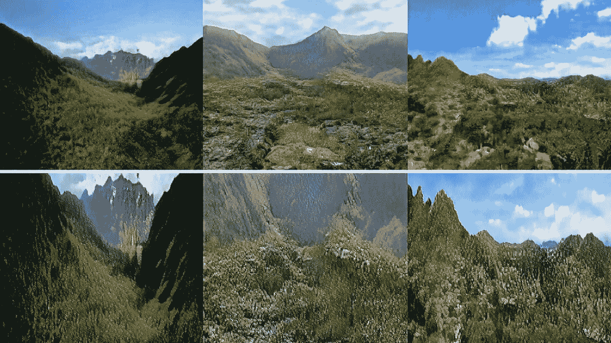
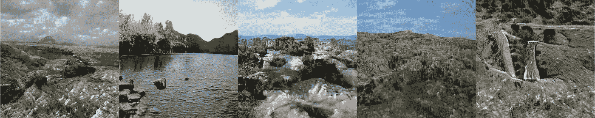
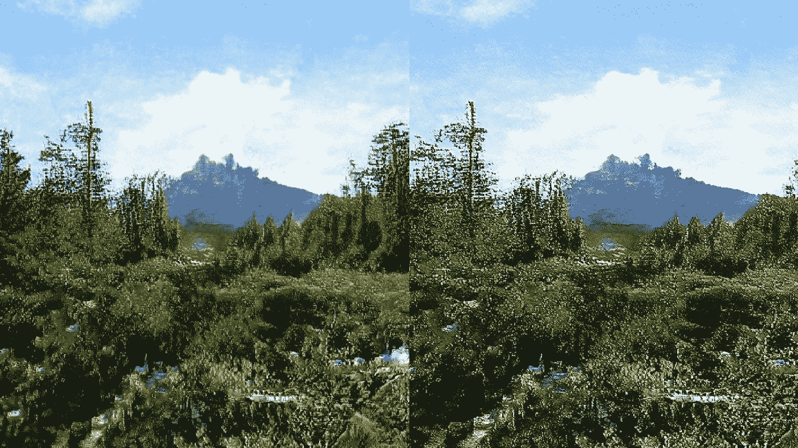
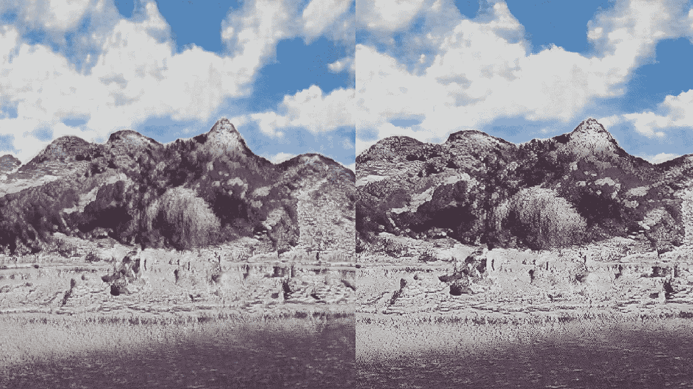
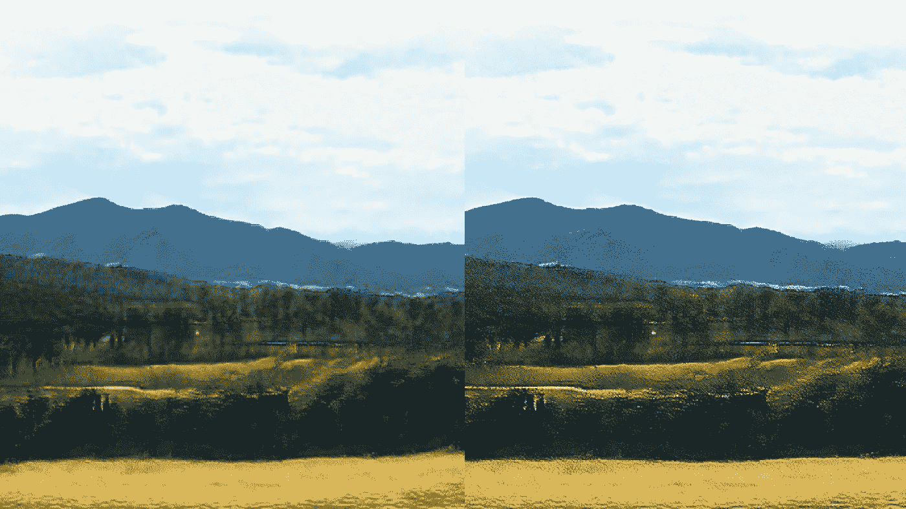

# 获得高质量氮化镓结果的捷径

> 原文：<https://towardsdatascience.com/a-shortcut-to-achieving-high-quality-gan-results-bca64a5b9394?source=collection_archive---------11----------------------->

Above: Generated Samples. Below: After Super-Resolution

在过去的几周里，我一直在摆弄 StyleGAN，结果真的很奇怪，很酷。在过去的几年里，甘取得了如此大的进步，真是令人吃惊。

去年花 43.2 万美元买下那幅可怕的斑点肖像的人可能已经操之过急了，因为 GANs 现在可以生成一些令人惊叹的真实而美丽的照片。

 [## 此人不存在

### 此人不存在

这个人不是 Existthispersondoesnotexist.com](https://thispersondoesnotexist.com/) 

StyleGAN 真正令人惊讶的是，它第一次给了我们一些接近迁移学习的东西。我们实际上可以使用预先训练好的模型，这些模型是组织花费数十万美元训练出来的，并且通过我们自己的数据集得到了不错的结果。

 [## 用斯泰尔根-Gwern.net 制作动漫脸

### 一个教程解释了如何训练和生成高质量的动画脸与 StyleGAN 神经网络，并…

www.gwern.net](https://www.gwern.net/Faces) 

我说不错，因为不幸的是，它仍然需要相当多的时间和美元的培训，以产生任何接近 NVidia 团队已经得到的现实结果。

随着更多的突破，我确信训练/计算需求会下降，但现在像我这样的平民仍然停留在生成低分辨率的艺术或风景图像上。这本身就是一个巨大的进步，因为我现在至少可以生成低质量的照片，而不是几年前用 DCGAN 得到的斑点。

Generated Landscapes: Not too shabby (in low resolution)

我在寻找提高 GAN 结果质量的方法，并有了一个想法。

# 这个想法

多亏了杰瑞米·霍华德教授的惊人的 [fastai](https://www.fast.ai/2019/01/24/course-v3/) 课程，我在一年前偶然发现了一个很酷的技术:【https://arxiv.org/abs/1603.08155

主要思想是使用感知损失将图像特征转换到另一个图像上，而不使用 GANs。用这个，我可以给黑白照片上色。

 [## 用深度学习着色巴基斯坦

### 深度学习可以很有趣。你给它一些猫和狗的照片，它可以分辨出哪些照片是猫和…

hackernoon.com](https://hackernoon.com/colorizing-pakistan-5697f7754b2a) 

快进到今天，当我从 StyleGAN 生成这些模糊的照片时，我想知道我是否真的可以使用这种技术来提高最终结果的质量。所以——训练一个模型，将低质量的照片转换成高质量的照片，并在我的 GAN 生成的结果上使用。

## 这个实验是这样设置的。

*   使用预训练的 StyleGAN 模型在某组图像上训练您自己的模型。你可以从 NVidia StyleGAN 代码和他们的一个预训练模型开始:【https://github.com/NVlabs/stylegan

补充说明:Gwern(上面的链接)对如何设置 StyleGAN 代码并将其用于迁移学习有很好的指导。

*   完成训练后，从最终模型中生成并保存一些随机样本。
*   基于相同的数据集创建超分辨率模型。为了做到这一点，我们需要一个原始数据的源数据集，和一个包含转换图像的目标数据集。对于这个练习来说，可以简单地将原始图像重新保存为较小的尺寸和较低的质量。然后，您可以创建一个模型，尝试将这些图像恢复到原始形式，即提高图像质量。你可以在这里找到这样做的脚本:[https://github . com/fastai/course-v3/blob/master/nbs/dl1/lesson 7-super RES . ipynb](https://github.com/fastai/course-v3/blob/master/nbs/dl1/lesson7-superres.ipynb)
*   最后，一旦你训练了一个可以从低质量图像中充分恢复原始图像的模型，你就可以看到你的 GAN 样本是如何通过这种技术得到的。

这是我从 LandscapeGAN 得到的一些结果。

Right: GAN generated. Left: After Super-resolution

Can see way more details on the right image

如果我用更多的数据训练我的 StyleGAN 和超分辨率模型更长时间，我相信我可以获得更好的质量最终结果。

我认为这是一个从你 GAN 结果中获得额外质量的巧妙技巧。GANs 倾向于收敛到一定的图像质量，让它们达到更高的分辨率会导致你必须投入的计算量的回报递减。例如，我只花了几个小时就可以得到这些风景图片，但是从这里到高质量的照片级的图片就要花更长的时间。

通过使用超分辨率，我们可以让我们的 GAN 模型产生我们想要的图像/视频质量的 80–90%的图像，并对它们应用超分辨率，最终获得高质量的结果。如果我们一直训练我们的 GANs 变得越来越好，这将花费我们更长的时间(和更多的成本)。

创建一个超分辨率模型不需要太多时间，所以绝对值得一试。您甚至可以将其设置为一个无缝的多步骤过程，生成 GAN 样品，然后通过一个经过训练的超分辨率模型进行处理。