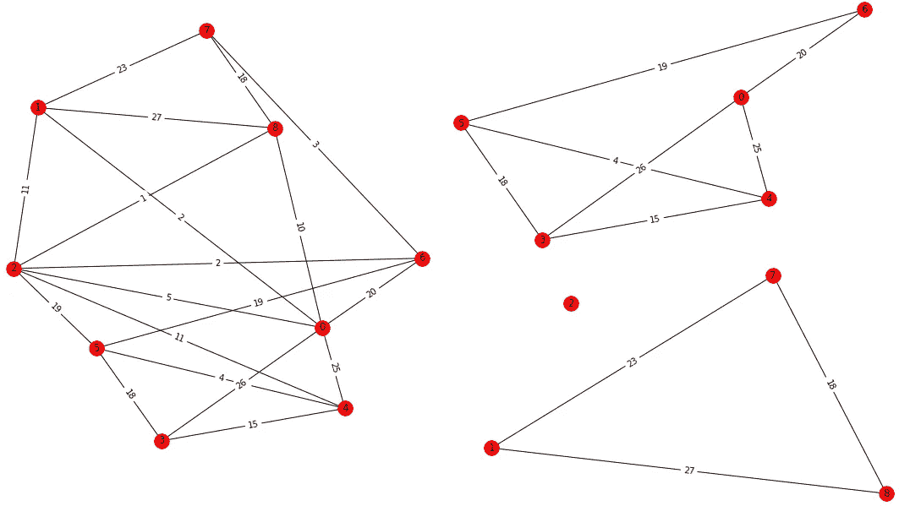
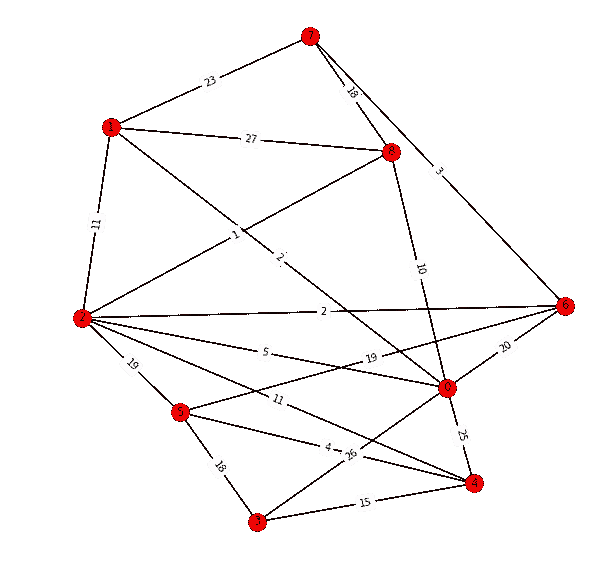
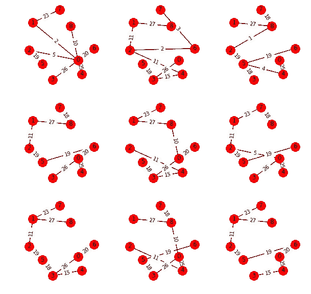
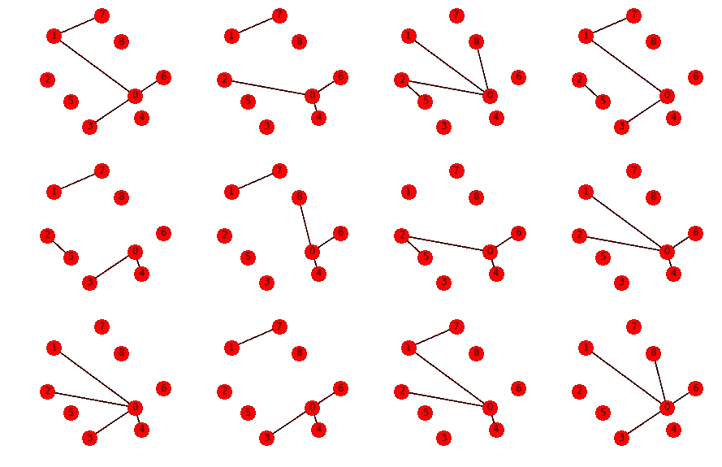
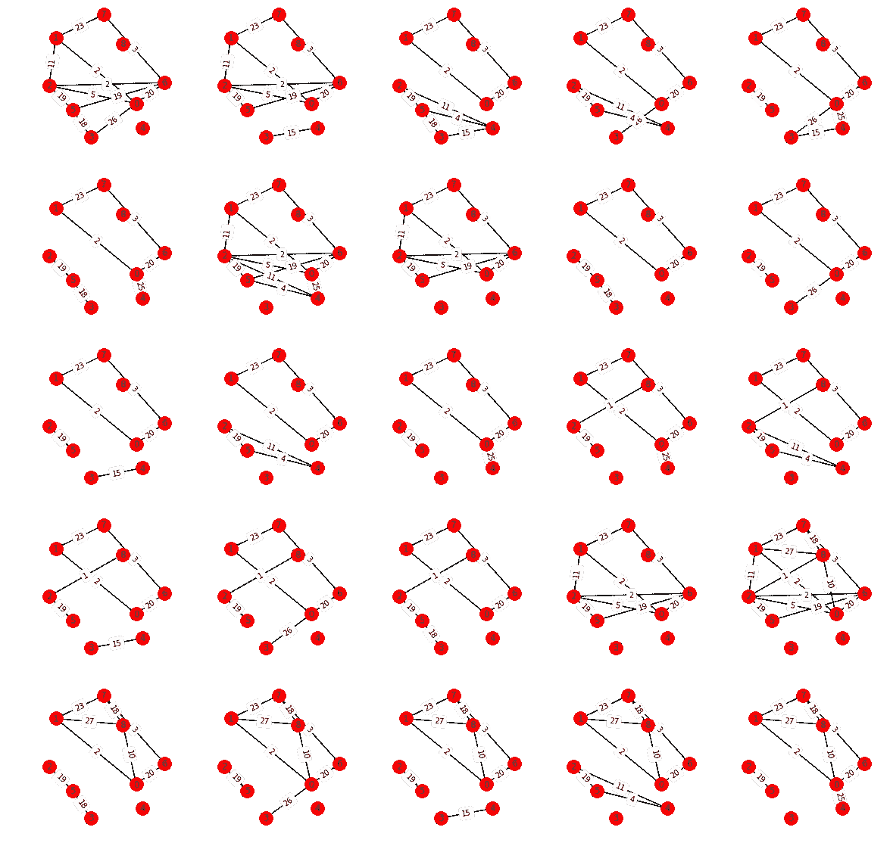

# 最小 k 路切割问题的简单快速确定性算法

> 原文：<https://towardsdatascience.com/a-simple-and-fast-deterministic-algorithm-for-the-minimum-k-way-cut-74d7ee2a521a?source=collection_archive---------4----------------------->

用一个例子逐步解释 m .托鲁普的“通过确定性贪婪树包装的最小 k 路切割”中的算法。

# 最小 *k 向切割*

设 *G=* ( *V，E，c: E →R+* ) 是一个有容量限制的图，其中 *|V|=n* 个节点， *|E|=m* 个边。一个 *k* 路切割是将节点划分成 *k* 组。切割边是连接不同组中的节点的边。最小 *k* 路切割问题的目标是找到最小化切割边总容量的 *k* 路切割。

In the left, a capacitated graph. In the right, a minimum 3*-way cut. The weight of the cut is the sum of the capacities of the edges that are not in the right subgraphs, which is 52.*

最小路割问题在网络出现的不同领域都有应用，例如，在社交网络中划分兴趣组。它还用于查找电信网络甚至流量网络中最弱的连接。

# 解决问题

如果 *k* 是输入的一部分，那么为有容量限制的图寻找最小 *k* 路割的问题是 NP 难的，参见[1]。在 *k* 固定的情况下，问题是多项式可解的。

M. Thorup 在[2]中提出的算法解决了*soft*-*o*(*n*^(2*k*)*，*参见 [soft-O wikipedia](https://en.wikipedia.org/w/index.php?title=Big_O_notation&section=22#Extensions_to_the_Bachmann.E2.80.93Landau_notations) 。

## 算法:通过确定性贪婪树包装的最小 K 路切割，由 m .托鲁普提出

该算法建立在 m .托鲁普在[2]中提出的以下定理的基础上:

对于 0 < *a <* 9/10，设 *T* 是一个至少有 3 个*m*(*k*/*a*)ln(*nmk*/*a*)树的贪婪树包装。然后，平均起来， *T* 的树交叉每条最小*k*-路割不到 2( *k-* 1+2 *a* )次。特别地，对于 *a* =1/4，每个最小 *k* 道切口被 *T* 中的某棵树最多穿越 2 *k* -2 次。

考虑到 *a* =1/4 的特殊情况，寻找最小 *k* 路径切口的过程如下:

*   构建贪婪树包装。
*   对于至少一棵树的包装，收集每个 *k* 道切口不超过 2*k*2 次。
*   从集合中选择最小的 *k* 向切削，也就是最小的 *k* 向切削。

## 逐步解释

在这个解释中，目标是找到以下容量限制图的最小 3 路截

Capacitated graph.

**第一步:生成贪婪树包装**

*贪婪树打包*是图的生成树的集合，其通过将关于利用率的最小生成树添加到集合中来构建。

一条边的*利用率*是该边在包装的当前树中的次数与其容量的商。因此，每次将一棵树添加到包装中，这些边的利用率都会随着其容量的倒数而增加。

贪婪树打包获得的第一个生成树如下:

First nine spanning trees (left-right by row) of the greedy tree packing. Edge labels are the capacities.

**步骤 2:建造每一个 *k* 道切口，该切口被树**穿过少于 2*k*2 次

如果对于每棵树，我们得到所有没有被该树交叉超过 2 次的 k 个方向切口，则最小的 k 个方向切口必须在最终集合中。那么，如何列出给定树木的采伐量呢？现在对包装的第一棵树进行解释，并且必须对它们中的每一个进行解释。有两个步骤:

*   考虑从树上切割 2 条 *k 条* -2 条边所产生的所有可能的图形。这些切割中的每一个都有 2 个 *k* -1 块。

Sample of cuts generated by cutting 2*k-2 edges from the first tree of the packing. Pieces of the first cut would be 1:*[0, 1, 6, 7], 2:[2, 5], 3:[3], 4:[4], 5:[8]

*   对于每个切割，以各种可能的方式将 2 个 *k* -1 件分成 *k* 组。在这样的分组中，被分成 *k* 块的节点诱导出一个 *k* 路割(在不同组的节点之间没有边的原始图)，该图满足被考虑的生成树交叉不超过 2 *k* -2 次的条件。

All 3-way cuts extracted from the first cut (previous figure’s first) of the first tree.

这样做的关键是，对于给定的树，删除 2 条 *k* -2 条边相当于确保我们只允许这些边穿过 *k* 路切割，因为剩余的边将节点保留在一个片段中，这些节点必须属于将片段分成 *k* 组的每个可能分组中的同一组。

这 25 个作为最小 *k* 路切割的候选是从贪婪树包装的第一棵树的第一次切割中提取的。必须对包装中每棵树的 2 个 *k* -2 个边缘的所有可能切割进行收集。

**第三步:选择最小*k*-路切**

最小 *k* 路切削是生成的 *k* 路切削集合的最小值。

## 时间复杂度

算法的时间复杂度是找到定理所有可能的 *k* 路割的时间。有关更多详细信息，请查看算法参考。因此，

1.  贪心树包装:3 棵*m*(*k*/*a*)ln(*nmk*/*a*)=*soft-O*(*MK*)树，每棵在 *O(n)* 。对于每棵树:
2.  树的 2 *k* -2 条边的所有可能切割: *Binom* ( *n-* 1，2*k*-2)=*soft-o*((*en*/(2*k-2*))^)2*k*-2)可能性。对于每次切割:
3.  将 2 个 *k* -1 块分割成 *k* 套:最多*k*^(2*k*-1)/*k*！= *软-o*((*ek*)^(*k*-1))不同的方式。

每个分区可以在固定的时间内生成分区，因此，时间复杂度变为*soft-o*(*n*^(2*k*)。

# 结论

在这篇文章中，解释了一个寻找有容量限制的图的最小 *k* 路割的算法。接下来是一个例子，看看它是如何工作的，最后起草了一个简单的复杂性分析。

图形操作和数字是用 Python 的 NetworkX 包创建的，见[3]。

# 参考

1.  O.戈德施密特和 D. S .霍赫鲍姆。固定 *k* 的 *k* 割问题的多项式算法。*数学。操作。第 61 号决议，1994 年。*
2.  米（meter 的缩写））托鲁普。经由确定性贪婪树包装的最小 *k* 路切割。第四十届 ACM 计算理论年会会议录， 2008。
3.  NetworkX，[https://NetworkX . github . io](https://networkx.github.io/)。

# 附录

## 算法的 Python 代码

在本附录中，有在 python 中运行算法的代码。该代码不是为最佳体验而优化的，它旨在阐明所描述的算法的定义和结构。