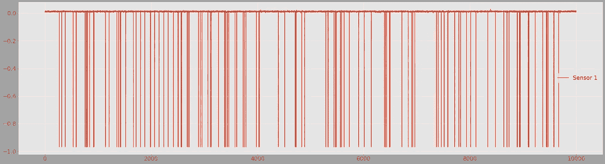
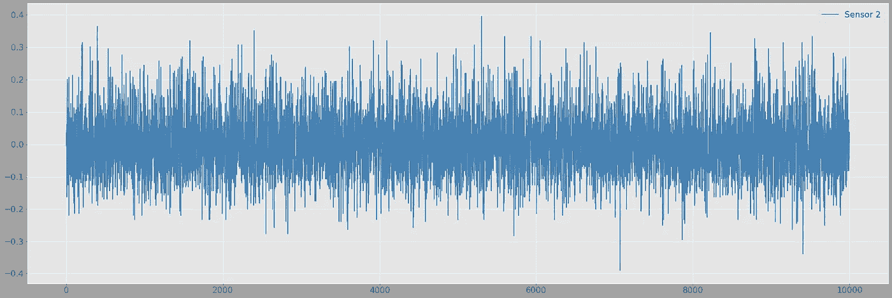
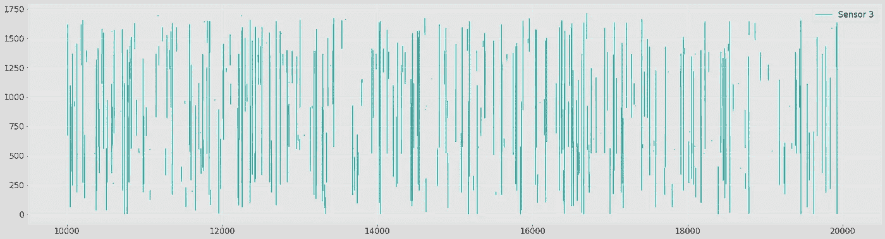
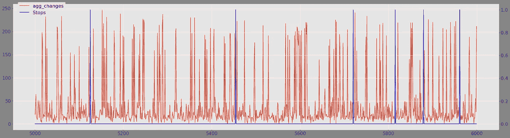
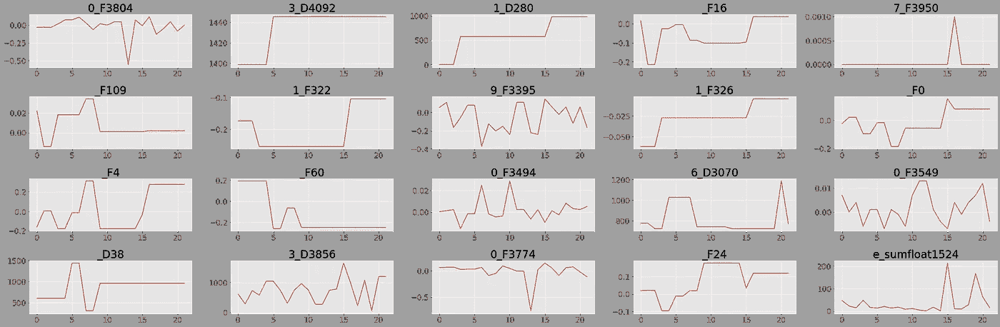
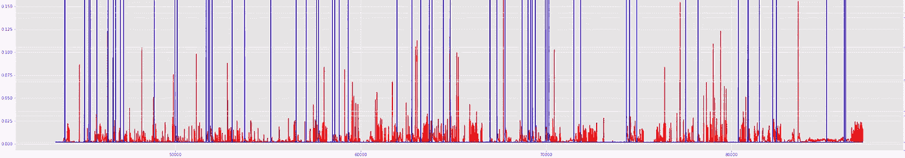
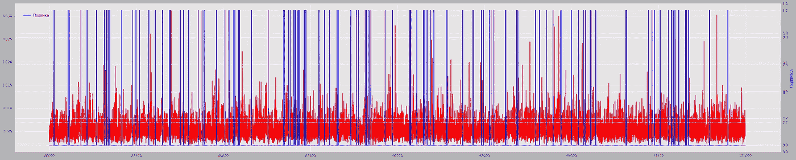

# 预测性维护的简单且可解释的基线

> 原文：<https://towardsdatascience.com/a-simple-and-interpretable-baseline-for-predictive-maintenance-3f94736ed99a?source=collection_archive---------14----------------------->

不久前，我在数据科学工作中遇到了一个预测性维护问题。高度不平衡的类(因为破损的数量通常小于 1%)，大量不可解释的传感器——好吧，但下一步是什么？由于我缺乏这方面的经验，我开始搜索和阅读所有我能找到的关于“项目管理的数据科学”的资料。

令我失望的是，我发现的大多数文章都没有给我提供有价值的见解——它们要么是一些复杂的 Arxiv 论文，在不可用的数据上测试新的理论方法，要么是一些高水平的博客帖子，缺乏可重用的想法。

经过几个月用机器学习解决预测性维护(进一步设置为 PM)问题的实践经验，我厌倦了辛劳，决定分享我迄今为止开发的基线方法。对于像我几个月前一样，不知道该做什么，希望附近有某种灯塔的人来说，这可能是富有成效的。

在帖子中，我将解释问题的业务方面，并列出客户端对算法的典型要求，这可能会极大地限制可用的数据科学工具集。接下来，我将详细解释我的方法，并强调其利弊。最后，我将分享一些实用的技巧和代码片段，对实现它有所帮助。

# **业务问题**

*如果你只对技术感兴趣，你可以跳过这一部分。*

安装在业务流程中的每个 ML 算法都应该以某种方式增加利润。在项目管理中，我们通常有一台大型机器，消耗昂贵的资源，通过复杂的多阶段过程产生某种最终输出。随着时间的推移，这些机器会意外损坏，导致闲置时间增加和宝贵资源的损失，因为发生故障的机器通常会浪费这些资源。

这就是 ML 算法可以进入场景的地方——它可以使用安装在机器上的传感器的数据，提前预测故障(我在全文中交替使用停止、损坏、停止)。然而，即使我们能够提前预测这些停止，在不知道原因的情况下，我们预测的财务价值将是适度的。

首先，如果我们向工程师报告的唯一信息是在接下来的 20 分钟内破损的可能性很高，他们就不能做太多。也许，他们可以停止机器，做一些深度维护，但这是昂贵的。此外，对于大型机器，他们不一定会在如此短的时间内发现故障原因，因此，我们预测的价值是无效的。第二，我们的算法会有一定的误报。由于假阳性的存在，客户端很少会批准停止机器来检查不明显的故障。

因此，我们的算法，除了预测停止的概率，应该在某种程度上暗示可能的原因。它将为技术人员在预防性维护过程中查找故障提供一定的指导。在这种情况下，我们的 ML 算法真正解决了客户的痛苦。

# **数据准备**

现在让我们仔细看看一个典型的预测性维护数据。下面是完成数据准备后，结果变量的样子。 **Y = 1** 如果即将停止，而 **Y = 0** 如果在接下来的 **K** 分钟内没有停止。

你可以看到，类是不平衡的，机器学习模型应该给稀有类更高的权重，以便用更强的注意力来区分导致停止的异常。

Outcome variable

但是要获得这个时间序列，你必须做一些繁重的工作。通常，它们会为您提供两个数据集-一个包含有关停靠点的信息(它们的性质、原因和时间戳)，另一个包含来自传感器的所有数据。

我们需要合并这两个文件来创建数据集。我建议当机器坏了时，停止观察(下面是数据处理的代码样本),因为这些信息可能有噪音。例如，可以丢弃到下一站的时间少于 5 分钟的所有观测。

接下来，让我们将到达下一站的时间超过 20 分钟的所有观察值标记为零，而将到达下一站的时间小于 20 分钟的所有观察值标记为一(您可以根据您的数据改变这个临界值)。这个操作稍微改善了你的职业平衡。

通常在机器的不同部分有不同类型的停止。我建议筛选数据，选择最常见的一个，然后将解决方案推广到其他止损点。不同类型的停车有不同的原因，因此，关于每次停车的信息将包含在不同的传感器组中。因此，一个通用模型不太可能表现良好。

一些可能有助于您完成上述操作的代码:

[https://gist.github.com/ikleni/fa9421f23852459e166f14a5f4edb584](https://gist.github.com/ikleni/fa9421f23852459e166f14a5f4edb584)

第二，要处理好解释变量( **Xs** )。在我们将它们与一个结果变量合并后，我们应该尝试降低维度，以便得出有意义的结论。在没有任何行业细节的先验知识的情况下，我们无法根据我们的直觉选择哪些对应于重要的预测因素。就看一些 Xs 的剧情:

Examples of sensors

然而，我们有很多技术可以降低维度:

*   超低方差跌落传感器
*   根据传感器在机器中的位置/角色对传感器进行分组和聚合(通过 PCA 或其他类似技术)(此信息可从其标签中获得)
*   变量的总体变化(有多少传感器刚刚改变了它们的状态)

*根据与结果变量的原始相关性选择变量不是一个好主意*

在我的任务中，变量变化的汇总很有帮助，因为它既包含了机器不稳定的信息，又减少了变量的数量。

这里有一个这样的聚合变量:

Aggregated variable and Y

我们可以进一步限制我们的传感器空间。

让我们反复挑选每个传感器，并尝试根据其分位数预测止损点。如果传感器的当前时间序列分位数在某种程度上指示停止，则传感器包含关于机器异常行为的信息。我建议选择大约 5-15 个(这个范围适用于我的特殊问题)传感器，它们的分位数模型具有最强的预测能力。

这一步预测能力的丧失取决于止损的数据和性质，因为有时某一顺序的复杂相互作用可能对预测至关重要。然而，我们的主要目标是简单的基线可解释性和对客户的可解释性。

另一个有用的事情是在停止之前和稳定工作期间检查所选传感器的行为。如果你注意到你的时间序列图在停止之前有异常，你就有很好的机会解决这个问题。

Sensors just prior to the stop (look for simultaneous jumps in certain variables)

生成此类图的代码:

[https://gist.github.com/ikleni/95d93442f1042d1c7e3bf392d4322a30](https://gist.github.com/ikleni/95d93442f1042d1c7e3bf392d4322a30)

# **建模**

*思绪*

给定行为良好的( **X，Y** )(我假设你已经做了其他标准的数据预处理，比如处理缺失值)数据我们就可以开始建模阶段了。

在测试一些模型之前，我们可以假设信号包含在哪里。机器是为了正常运转而设计的。此外，它们还规定了一个稳定的工作状态，指示每个传感器的值的区间。如果由于某种原因(工程师没有顺利改变某个参数),机器偏离了规定的运行状态，它可能会发生故障。随着时间的推移，机器变得越来越不稳定，操作制度应考虑到这种转变。这种情况很少发生——这可能是我们完成这项任务的面包和黄油。

我希望通过每个传感器与一些新值范围的偏差，可以很好地预测止损。此外，我预计几个传感器之间的相互作用将预测停机。例如，如果一个传感器偏离其正常间隔，而另一个传感器的值为 ***w*** ，则不会发生停机。但是，如果同一个传感器出现偏差，而另一个传感器的值为 ***z*** ，则停止是不可避免的。

我不期望(这个假设对我的任务有好处)大量传感器之间的交互对这个任务有帮助。特别是，如果我们量化当前超出其标准值范围的传感器总数。这种整体机器稳定性应该是该模型的关键特征之一。

*接近*

考虑到这一点，我选择用基于 2-3 个传感器和集合特征的小模型的多数投票集合来预测停靠点。这种方法允许识别哪些传感器发出停止信号。这些信息可以在以后提供给工程师，工程师可以根据他们的知识找出原因并解决问题。

首先，我使用具有特定调整参数的基本 LGBM 模型，从我们的受限集合中选择一组传感器对(三元组)。根据 k 倍时间序列交叉验证的 AUC 分数，通过对成对的迭代搜索进行选择。除了传感器数据，这些小型模型还包括聚合功能和一些基于传感器的直观功能，例如:

*   平均
*   趋势
*   z 分数
*   标准

变量生成代码:

在确定了小模型的集合之后，它们的预测通过基本集合被组合。发现 0.5 分位数，如果它高于预定义的边界，我预测 Y = 1，止损应该很快出现。**报警！**

上述方法略有简化，还可以做更多的工作来提高其精度，例如:

*   其他组装技术(RNN 和其他…)
*   其他初级学习者
*   搜索剩余的传感器，并将它们添加到一些小模型中
*   为每个生产体系建立一个单一模型(夏季/冬季在传感器值的分布上有很大不同，这可以通过 Kolmogorov-Smirnov 测试进行检查)

# 结果

在我看来，图像比文字或指标更能说明问题，如果你看到算法很少预测停止，但当机器确实发生了一些事情时——我们很好:

Good performance of the baseline

Bad performance

在我的数据中，所描述的框架能够以大约 40%的精度和大约 40%的召回率预测停止，这对于预测性维护中的基线来说是一个好结果。此外，它为工程师提供了特定传感器的参考，因为他们知道哪些传感器发出停车的可能性较高。因此，他们可以进行有针对性的预防性维护。

最后，我将简要总结一下这种方法的利弊:

*优点*

*   简单性和可解释性(由于每个型号的传感器数量如此之少，您可以强调机器的哪个部分驱动了停止的威胁)
*   对 GPU 使用和内存的低限制

*缺点*

*   在准确性方面次优(具有所有特征的训练有素的神经网络可能优于该基线)
*   计算时间限制(所有这些迭代搜索都需要时间)
*   人的时间限制(这种方法需要人的指导)

稍后我会添加链接到省略的代码。此外，我要感谢 Kaggle Bosch 竞赛，我用它创作了所有这些图像…