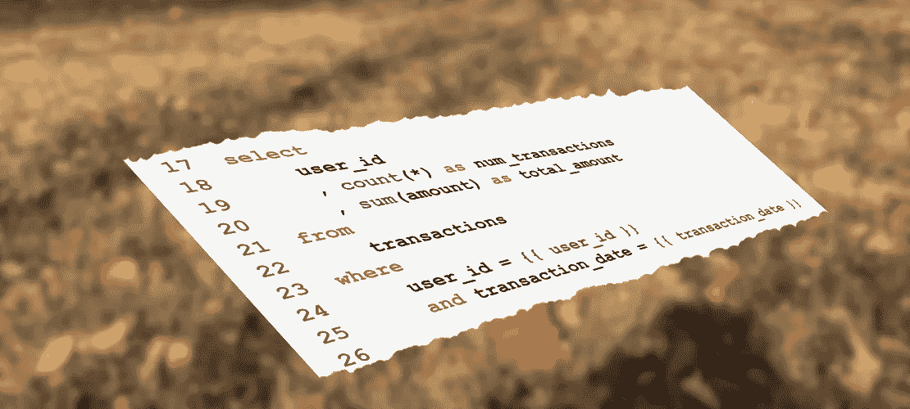

# Python 中模板化 SQL 查询的一种简单方法

> 原文：<https://towardsdatascience.com/a-simple-approach-to-templated-sql-queries-in-python-adc4f0dc511?source=collection_archive---------1----------------------->

## 加速和自动化您的分析



在许多情况下，人们都希望在 SQL 查询中插入参数，并且有许多方法可以在 python 中实现模板化的 SQL 查询。在不比较不同方法的情况下，这篇文章解释了一种使用 [JinjaSql](https://github.com/hashedin/jinjasql) 参数化 SQL 的简单而有效的方法。除了 [Jinja2](http://jinja.pocoo.org/) 的许多强大功能，如条件语句和循环，JinjaSql 还提供了一种简单明了的方法，不仅可以参数化代入`where`和`in`子句的值，还可以参数化 Sql 语句本身，包括参数化表和列名，以及通过组合整个代码块来组合查询。

# 基本参数替代

假设我们有一个保存金融交易记录的表`transactions`。该表中的列可以是`transaction_id`、`user_id`、`transaction_date`和`amount`。要计算给定用户在给定日期的交易数量和总金额，直接对数据库的查询可能如下所示

```
**select**
    user_id
    , count(*) as num_transactions
    , sum(amount) as total_amount
**from**
    transactions
**where**
    user_id = 1234
    and transaction_date = '2019-03-02'
**group by**
    user_id
```

这里，我们假设数据库会自动将日期的字符串表示形式的`YYYY-MM-DD`格式转换成适当的日期类型。

如果我们想要为任意用户和日期运行上面的查询，我们需要参数化`user_id`和`transaction_date`值。在 JinjaSql 中，相应的模板将简单地变成

```
**select**
    user_id
    , count(*) as num_transactions
    , sum(amount) as total_amount
**from**
    transactions
**where**
    user_id = {{ uid }}
    and transaction_date = {{ tdate }}
**group by**
    user_id
```

这里，值被占位符替换，python 变量名用双花括号`{{ }}`括起来。注意，选择变量名`uid`和`tdate`只是为了证明它们是变量名，与列名本身没有任何关系。存储在 python 变量中的同一模板的一个可读性更好的版本是

```
**user_transaction_template** = '''
**select**
    user_id
    , count(*) as num_transactions
    , sum(amount) as total_amount
**from**
    transactions
**where**
    user_id = {{ user_id }}
    and transaction_date = {{ transaction_date }}
**group by**
    user_id
'''
```

接下来，我们需要为查询设置参数。

```
params = {
    'user_id': 1234,
    'transaction_date': '2019-03-02',
}
```

现在，从这个模板生成 SQL 查询非常简单。

```
**from** jinjasql **import** JinjaSql
j = JinjaSql(param_style='pyformat')
query, bind_params = j.prepare_query(user_transaction_template, params)
```

如果我们打印`query`和`bind_params`，我们会发现前者是一个参数化的字符串，而后者是一个参数化的`OrderedDict`:

```
>>> print(query)
**select**
    user_id
    , count(*) as num_transactions
    , sum(amount) as total_amount
**from**
    transactions
**where**
    user_id = %(user_id)s
    and transaction_date = %(transaction_date)s
**group by**
    user_id>>> print(bind_params)
**OrderedDict**([('user_id', 1234), ('transaction_date', '2018-03-01')])
```

# 运行参数化查询

许多数据库连接都可以选择将`bind_params`作为参数传递给在连接上执行 SQL 查询的方法。对于数据科学家来说，在 Pandas 数据框中获得查询结果可能是很自然的事情。一旦我们有了连接`conn`，就像运行`read_sql`一样简单:

```
**import** pandas **as** pd
frm = pd.read_sql(query, conn, params=bind_params)
```

其他示例参见 [JinjaSql 文档](https://github.com/hashedin/jinjasql)。

# 从模板到最终的 SQL 查询

通常希望在运行查询之前用所有参数完全展开查询。例如，记录完整的查询对于调试批处理过程非常重要，因为可以将查询从日志中直接复制粘贴到 interactive SQL 界面中。使用 python 内置的字符串替换将`bind_params`替换到`query`中是很诱人的。然而，我们很快发现字符串参数需要加引号才能产生正确的 SQL。例如，在上面的模板中，日期值必须用单引号括起来。

```
>>> print(query % bind_params)
​
**select**
    user_id
    , count(*) as num_transactions
    , sum(amount) as total_amount
**from**
    transactions
**where**
    user_id = 1234
    and transaction_date = 2018-03-01
**group by**
    user_id
```

为了处理这个问题，我们需要一个助手函数来正确地引用字符串参数。我们通过调用来检测参数是否是字符串

```
**from** six **import** string_types
isinstance(value, string_types)
```

这对 python 3 和 2.7 都适用。字符串参数被转换为`str`类型，名称中的单引号被另一个单引号转义，最后，整个值被括在单引号中。

```
**from** six **import** string_types**def** quote_sql_string(value):
    '''
    If `value` is a string type, escapes single quotes in the string
    and returns the string enclosed in single quotes.
    '''
    **if** isinstance(value, string_types):
        new_value = str(value)
        new_value = new_value.replace("'", "''")
        return "'{}'".format(new_value)
    **return** value
```

最后，为了将模板转换成正确的 SQL，我们循环遍历`bind_params`，引用字符串，然后执行字符串替换。

```
**from** copy **import** deepcopy**def** get_sql_from_template(query, bind_params):
    **if** **not** bind_params:
        **return** query
    params = deepcopy(bind_params)
    **for** key, val **in** params.items():
        params[key] = quote_sql_string(val)
    **return** query % params
```

现在我们可以很容易地得到最终的查询，我们可以记录或交互运行:

```
>>> print(get_sql_from_template(query, bind_params))**select**
    user_id
    , count(*) as num_transactions
    , sum(amount) as total_amount
**from**
    transactions
**where**
    user_id = 1234
    and transaction_date = '2018-03-01'
**group by**
    user_id
```

将所有这些放在一起，另一个 helper 函数包装 JinjaSql 调用，简单地获取模板和一个`dict`参数，并返回完整的 Sql。

```
**from** jinjasql **import** JinjaSql
​
**def** apply_sql_template(template, parameters):
    '''
    Apply a JinjaSql template (string) substituting parameters (dict) and return
    the final SQL.
    '''
    j = JinjaSql(param_style='pyformat')
    query, bind_params = j.prepare_query(template, parameters)
    return get_sql_from_template(query, bind_params)
```

# 计算列的统计信息

无论是在第一次浏览数据时还是在生产中进行数据验证时，对存储在特定数据库列中的值计算统计数据都很方便。因为我们只想演示模板的一些特性，为了简单起见，让我们只使用`integer`列，比如上面表`transactions`中的`user_id`列。对于整数列，我们感兴趣的是唯一值的数量、最小值和最大值以及空值的数量。有些列可能有一个默认值，比如说，`-1`，它的缺点超出了本文的范围，但是，我们确实想通过报告默认值的数量来捕获它。

考虑下面的模板和函数。该函数将表名、列名和默认值作为参数，并返回用于计算统计数据的 SQL。

```
**COLUMN_STATS_TEMPLATE** = '''
**select**
    {{ column_name | sqlsafe }} as column_name
    , count(*) as num_rows
    , count(distinct {{ column_name | sqlsafe }}) as num_unique
    , sum(case when {{ column_name | sqlsafe }} is null then 1 else 0 end) as num_nulls
    
    , sum(case when {{ column_name | sqlsafe }} = {{ default_value }} then 1 else 0 end) as num_default
    
    , 0 as num_default
    
    , min({{ column_name | sqlsafe }}) as min_value
    , max({{ column_name | sqlsafe }}) as max_value
**from**
    {{ table_name | sqlsafe }}
'''
​
​
**def** get_column_stats_sql(table_name, column_name, default_value):
    '''
    Returns the SQL for computing column statistics.
    Passing None for the default_value results in zero output for the number
    of default values.
    '''
    params = {
        'table_name': table_name,
        'column_name': column_name,
        'default_value': default_value,
    }
    **return** apply_sql_template(COLUMN_STATS_TEMPLATE, params)
```

这个函数很简单而且非常强大，因为它适用于任何表中的任何列。注意模板中的``语法。如果传递给函数的默认值是`None`，SQL 将在`num_default`字段中返回零。

如果`default_value`设置为 None，上面的函数和模板也可以处理字符串、日期和其他数据类型。然而，为了更智能地处理不同的数据类型，有必要扩展该函数，以将数据类型作为参数，并构建特定于不同数据类型的逻辑。例如，可能想知道字符串长度的最小值和最大值，而不是值本身的最小值和最大值。

让我们看看`transactions.user_id`列的输出。

```
>>> print(get_column_stats_sql('transactions', 'user_id', None))**select**
    user_id as column_name
    , count(*) as num_rows
    , count(distinct user_id) as num_unique
    , sum(case when user_id is null then 1 else 0 end) as num_nulls
    , 0 as num_default
    , min(user_id) as min_value
    , max(user_id) as max_value
**from**
    transactions
```

请注意，空行出现在``子句的位置，可以被删除。

# 摘要

有了上面的帮助函数，用 python 创建和运行模板化的 SQL 查询就非常容易了。因为参数替换的细节是隐藏的，所以可以专注于构建模板和参数集，然后调用单个函数来获得最终的 SQL。

一个重要的警告是代码注入的风险。对于批处理来说，这应该不是问题，但是在 web 应用程序中使用`sqlsafe`构造可能会有危险。`sqlsafe`关键字表明用户(您)确信不可能进行代码注入，并负责将参数中传递的任何字符串直接放入查询中。

另一方面，在查询中放入任意字符串的能力允许将整个代码块传递到模板中。例如，可以不通过上面的`table_name='transactions'`，而是通过`'(select * from transactions where transaction_date = 2018-03-01) t'`，查询仍然可以工作。

要探索 SQL 模板更强大的特性，也可以参考关于使用 JinjaSql 的 Python 中的[高级 SQL 模板教程](/advanced-sql-templates-in-python-with-jinjasql-b996eadd761d)。

本帖中的[代码获得了](https://github.com/sizrailev/life-around-data-code/blob/master/pylad/sql_templates_base.py)[麻省理工学院许可](https://opensource.org/licenses/MIT)的许可。这篇文章最初出现在[生活数据](http://www.lifearounddata.com/templated-sql-queries-in-python/)博客上。

Sergei Izrailev 的照片和图片