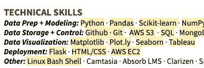

# 一个简单而有效的面试准备技巧

> 原文：<https://towardsdatascience.com/a-simple-but-effective-interview-prep-trick-3efb0f017c62?source=collection_archive---------25----------------------->

## 尝试这种实用的方法来准备数据科学面试

正好逢年过节，各位求职者，我送给你的礼物是一个非常实用的面试准备方法。如果你也这么做，保证你有 100 万的工作机会！不过说真的，这样做了之后，在面试的时候谈自己和自己的工作就会轻松很多。回忆关于你技能的信息越容易，面试就越容易。

## 方法？在你的简历中标注#$%。

制作一份简历的副本，并保存为一个单独的文件。然后，花一到三个小时对这份文件进行评论，每项技能、项目或角色都与你面试的角色相关(简称“TRYIF”)。面试官可能会把你的简历作为他们会问你的问题的指南，无论是文化问题还是技术问题，所以你可以在评论中同时关注这两个问题。

如果你有一份过去几周一直在申请工作的“通用”简历，这尤其有帮助。这是一个通过 TRYIF 的镜头唤起你对每个主题的记忆并思考它的练习。最近你对这些事情想得越多，谈论它们就越容易。

Google docs is a good way to organize your resume thoughts

你的评论应该至少涵盖其中的一个方面，你涵盖的越多，你的准备就越充分。每一个后面都有一个我今天早些时候准备的简历注释的例子:

a) **定义**或**用你自己的话或从其他来源对项目的解释**，还是那句话对你最有利。*Seaborn:“Python 数据可视化库，它提供了一个高级接口，用于绘制有吸引力且信息丰富的统计图形。”(来自其网站)或 Seaborn:让 matplotlib 更漂亮。*

b)项目的目标**优点**和**缺点**。 *Pandas:因为有表格，所以很容易使用，但不能处理大量数据(超过 10gb 时会非常慢)*

c) **该物品在您过去项目中的重要用途***烧瓶:部署* [*汇聚*](http://www.playconvergence.com) *以及使用它的 Doppel app*

d) **您对项目*用药过量* *项目的意见***:很难找到这个项目的数据集，了解了很多关于人口普查及其 API 和阈值的信息。

其中一些可能看起来“多余”，但有一些很好的理由来注释你的简历。通常面试官感兴趣的是听你如何向那些不知道你在说什么的人解释事情。也有可能面试官不熟悉你简历上的某件事，然后你可以很快回忆起你刚刚为他们创造的简单解释。最后，这些很容易写，因为除了你没有人会看到它们。你不必担心语法或让它们变得完美——这完全是你的大脑的事！

面试并不容易，但是把这种方法和一般的面试建议结合起来，做很多项目，你就在获得工作机会的路上了，我的朋友。你自己试试吧，并告诉我你的想法。

新年快乐！希望新工作也愉快！

Photo by [Suhyeon Choi](https://unsplash.com/@by_syeoni?utm_source=unsplash&utm_medium=referral&utm_content=creditCopyText) on [Unsplash](https://unsplash.com/s/photos/mirror?utm_source=unsplash&utm_medium=referral&utm_content=creditCopyText)