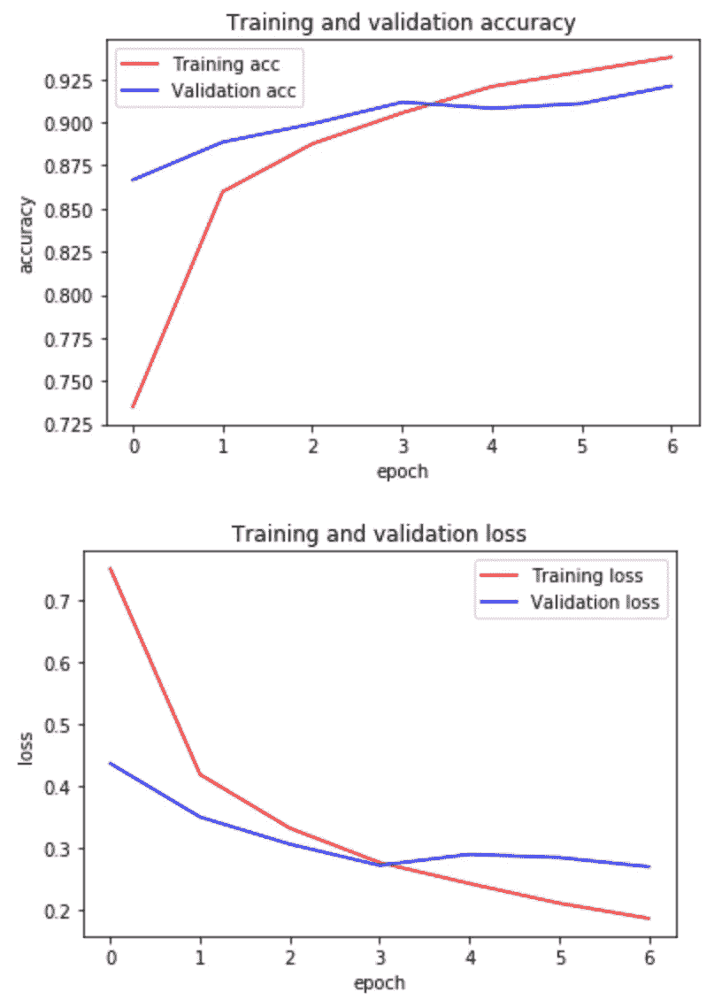
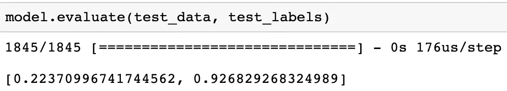
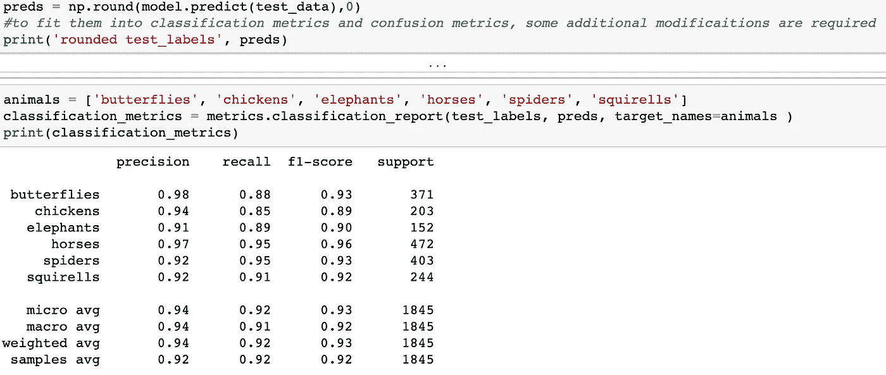
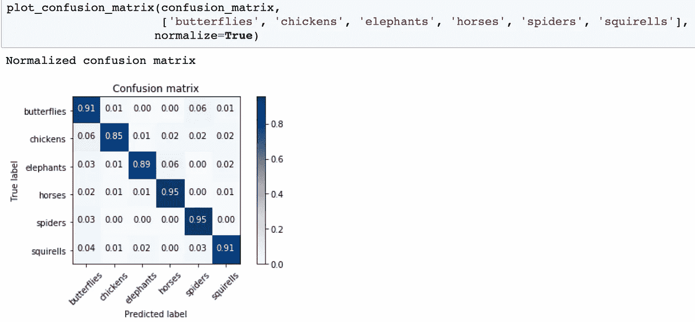

# 一个简单的 CNN:多图像分类器

> 原文：<https://towardsdatascience.com/a-simple-cnn-multi-image-classifier-31c463324fa?source=collection_archive---------0----------------------->

## 利用张量流和迁移学习，用卷积神经网络轻松制作一个有标签的图像分类器


[Source](https://www.weareworldquant.com/media/1654/computer-vision-in-flux-v1-web.jpg?anchor=center&mode=crop&width=1170&height=680&rnd=131740574240000000)

计算机视觉和神经网络是机器学习技术的新热点。随着神经网络的进步和将图像读取为像素密度数字的能力，许多公司都依赖这种技术来获取更多数据。例如，speed camera 使用计算机视觉来拍摄超速行驶的汽车的牌照，并将牌照号码与已知的数据库进行匹配，以发送罚单。虽然这与目标字符识别比图像分类更相关，但两者都使用计算机视觉和神经网络作为工作基础。

图像分类的一个更现实的例子是脸书标记算法。当你上传一个有人物的相册，并在脸书给他们加标签时，标签算法会分解人物照片的像素位置，并将其存储在数据库中。因为每张图片都有自己独特的像素位置，所以算法可以根据数据库中以前的图片相对容易地识别出谁是谁。当然，该算法可能会不时出错，但你纠正得越多，它就越能识别你的朋友，并在你上传时自动为你标记他们。然而，脸书标签算法是建立在人工智能的基础上的。这意味着标记算法能够基于我们的输入进行学习，并在未来进行更好的分类。

我们不会关注人工智能方面，而是关注制作图像分类算法的最简单方法。我们的模式和脸书的模式之间的唯一区别是，我们不能从它的错误中吸取教训，除非我们修正它。但是，对于一个简单的神经网络项目来说，这就足够了。

由于使用人的照片是不道德的，我们将使用动物来创建我们的模型。我的朋友文森特和我已经就此做了一个项目，所以我会以此为例继续下去。GitHub 链接在最后。

第一步是收集数据。在我看来，这将是该项目的最困难和最烦人的方面。请记住，数据必须有标签。谢天谢地，Kaggle 已经标记了我们可以轻松下载的图片。我们使用的数据集可以在这里找到: [animal-10 dataset](https://www.kaggle.com/alessiocorrado99/animals10) 。如果数据集未被标注，这可能会非常耗时，因为您必须为每类影像手动创建新的标注。另一种方法是创建新的标签，只将 100 张图片移动到它们适当的标签中，并创建一个类似我们将使用的分类器，并让该机器对图像进行分类。这将导致分类错误，因此您可能希望在每次运行后手动检查，这是耗时的地方。

现在，我们已经将数据集安全地存储在我们的计算机或云中，让我们确保我们有一个训练数据集、一个验证数据集和一个测试数据集。训练数据集将包含全部标记数据的 85–90%。这些数据将被用来训练我们的机器了解我们拥有的不同类型的图像。验证数据集将包含总标记数据的 5-10%。这将测试我们的机器对已知标签数据的表现。测试数据集将包含未标记格式的其余数据。这些测试数据将被用来测试我们的机器对从未见过的数据进行分类的能力。测试数据也可以只包含你从谷歌下载的图片，只要它对你分类的主题有意义。

***我们先导入所有需要的库:***

```
import pandas as pd
import numpy as np 
import itertools
import keras
from sklearn import metrics
from sklearn.metrics import confusion_matrix
from keras.preprocessing.image import ImageDataGenerator, img_to_array, load_img 
from keras.models import Sequential 
from keras import optimizers
from keras.preprocessing import image
from keras.layers import Dropout, Flatten, Dense 
from keras import applications 
from keras.utils.np_utils import to_categorical 
import matplotlib.pyplot as plt 
import matplotlib.image as mpimg
%matplotlib inline
import math 
import datetime
import time
```

***定义尺寸和定位图像:***

```
#Default dimensions we found online
img_width, img_height = 224, 224 

#Create a bottleneck file
top_model_weights_path = ‘bottleneck_fc_model.h5’# loading up our datasets
train_data_dir = ‘data/train’ 
validation_data_dir = ‘data/validation’ 
test_data_dir = ‘data/test’

# number of epochs to train top model 
epochs = 7 #this has been changed after multiple model run 
# batch size used by flow_from_directory and predict_generator 
batch_size = 50 
```

在这一步中，我们定义图像的尺寸。根据你的图像大小，你可以改变它，但我们发现 224，224 效果最好。然后我们创建了一个瓶颈文件系统。这将用于转换所有的图像像素到他们的数字(numpy 数组)对应，并存储在我们的存储系统中。一旦我们运行这个，它将需要半个小时到几个小时，这取决于分类的数量和每个分类有多少图像。然后我们简单地告诉我们的程序每个图像在我们的存储器中的位置，这样机器就知道哪里是什么了。最后，我们为我们的机器定义时期和批量大小。对于神经网络来说，这是关键的一步。我们发现，这组配对对于我们的机器学习模型来说是最佳的，但同样，这取决于需要调整的图像数量。

***导入迁移学习模型 VGG16:***

```
#Loading vgc16 model
**vgg16 = applications.VGG16(include_top=False, weights=’imagenet’)****datagen = ImageDataGenerator(rescale=1\. / 255)** 
#needed to create the bottleneck .npy files
```

这引入了卷积神经网络的迁移学习方面。迁移学习很方便，因为它带有预制的神经网络和其他必要的组件，否则我们将不得不创建这些组件。迁移学习模式有很多。我特别喜欢 VGG16，因为它只使用了 11 个卷积层，非常容易使用。但是，如果您正在处理较大的图像文件，最好使用更多的层，所以我推荐 resnet50，它包含 50 个卷积层。

对于我们的图像分类器，我们只处理了 6 个分类，因此对这些图像使用迁移学习并没有花费太长时间，但是请记住，图像和分类越多，下一步将花费越长的时间。但是值得庆幸的是，由于您只需要将图像像素转换为数字一次，因此您只需对每个训练、验证和测试执行一次下一步操作——除非您删除或损坏了瓶颈文件。

***使用 VGG16 创建权重和特征:***

```
#__this can take an hour and half to run so only run it once. 
#once the npy files have been created, no need to run again. Convert this cell to a code cell to run.__start = datetime.datetime.now()

generator = datagen.flow_from_directory( 
    train_data_dir, 
    target_size=(img_width, img_height), 
    batch_size=batch_size, 
    class_mode=None, 
    shuffle=False) 

nb_train_samples = len(generator.filenames) 
num_classes = len(generator.class_indices) 

predict_size_train = int(math.ceil(nb_train_samples / batch_size)) 

bottleneck_features_train = vgg16.predict_generator(generator, predict_size_train) 

np.save(‘bottleneck_features_train.npy’, bottleneck_features_train)
end= datetime.datetime.now()
elapsed= end-start
print (‘Time: ‘, elapsed)
```

因为我们正在制作一个简单的图像分类器，所以没有必要改变默认设置。对于我们在上面创建的培训、验证和测试目录，只需按照上面的步骤操作即可。但是，您可以添加不同的功能，如图像旋转、变换、反射和扭曲。

一旦文件被转换并保存到瓶颈文件，我们加载它们并为我们的卷积神经网络做准备。这也是确保所有数据都已经加载到瓶颈文件中的好方法。记住对验证和测试集也重复这个步骤。

***为训练数据创建瓶颈文件。(验证和测试步骤相同):***

```
#training data
generator_top = datagen.flow_from_directory( 
   train_data_dir, 
   target_size=(img_width, img_height), 
   batch_size=batch_size, 
   class_mode=’categorical’, 
   shuffle=False) 

nb_train_samples = len(generator_top.filenames) 
num_classes = len(generator_top.class_indices) 

# load the bottleneck features saved earlier 
train_data = np.load(‘bottleneck_features_train.npy’) 

# get the class labels for the training data, in the original order 
train_labels = generator_top.classes 

# convert the training labels to categorical vectors 
train_labels = to_categorical(train_labels, num_classes=num_classes)
```

***创建我们的卷积神经网络代码:***

```
#This is the best model we found. For additional models, check out I_notebook.ipynbstart = datetime.datetime.now()
**model = Sequential()** 
model.add(Flatten(input_shape=train_data.shape[1:])) 
model.add(Dense(100, activation=keras.layers.LeakyReLU(alpha=0.3))) 
model.add(Dropout(0.5)) 
model.add(Dense(50, activation=keras.layers.LeakyReLU(alpha=0.3))) 
model.add(Dropout(0.3)) 
model.add(Dense(num_classes, **activation=’softmax**’))model.compile(**loss=’categorical_crossentropy’**,
   optimizer=optimizers.RMSprop(lr=1e-4),
   metrics=[‘acc’])history = **model.fit**(train_data, train_labels, 
   epochs=7,
   batch_size=batch_size, 
   validation_data=(validation_data, validation_labels))model.save_weights(top_model_weights_path)(eval_loss, eval_accuracy) = model.evaluate( 
    validation_data, validation_labels, batch_size=batch_size,     verbose=1)print(“[INFO] accuracy: {:.2f}%”.format(eval_accuracy * 100)) 
print(“[INFO] Loss: {}”.format(eval_loss)) 
end= datetime.datetime.now()
elapsed= end-start
print (‘Time: ‘, elapsed)
```

现在我们创建我们的模型。第一步是用 Sequential()初始化模型。之后，我们平坦的数据，并添加我们额外的 3(或更多)隐藏层。这一步是完全可定制的你想要的。我们用不同的退出，隐藏层和激活制作了几个不同的模型。但是由于这是一个带标签的范畴分类，最终的激活必须总是 softmax。对于 loss 来说，最好是分类交叉相关的，但是 model.compile 中的其他内容都可以更改。然后，在我们创建并编译了我们的模型之后，我们用我们前面提到的规范使我们的训练和验证数据适合它。最后，我们创建一个评估步骤，来检查我们的模型训练集相对于验证集的准确性。


这是我们的模型，现在训练数据，然后验证它。一个时期是模型在我们整个数据集上训练的次数。批量可以解释为少量服用，训练后再服用一些。在进入下一个时段之前，每个时段必须完成所有批次。用太少的历元训练会导致数据拟合不足，而用太多的历元训练会导致数据拟合过度。你也希望损失尽可能低。下面的图片将显示我们的数据集的准确性和损失

***代码为可视化的精度和损失:***

```
#Graphing our training and validation
acc = history.history[‘acc’]
val_acc = history.history[‘val_acc’]
loss = history.history[‘loss’]
val_loss = history.history[‘val_loss’]
epochs = range(len(acc))
plt.plot(epochs, acc, ‘r’, label=’Training acc’)
plt.plot(epochs, val_acc, ‘b’, label=’Validation acc’)
plt.title(‘Training and validation accuracy’)
plt.ylabel(‘accuracy’) 
plt.xlabel(‘epoch’)
plt.legend()
plt.figure()
plt.plot(epochs, loss, ‘r’, label=’Training loss’)
plt.plot(epochs, val_loss, ‘b’, label=’Validation loss’)
plt.title(‘Training and validation loss’)
plt.ylabel(‘loss’) 
plt.xlabel(‘epoch’)
plt.legend()
plt.show()
```



Even though according to this graph, it showed that epoch 3 was the best as that was the point of intersection between accuracy and loss, when we ran the model on 3 epoch, it underperformed. So this graph is not an absolute indicator of how many epoch to run on your model.

下图显示了我们刚刚制造的机器对未知数据的预测能力。注意，它说它在 test_data 上进行测试。准确性是第二个数字。然而，这不是检查我们的机器性能的唯一方法



有两种很好的方法可以检验你的机器的预测和分类能力。其中一个是分类度量，另一个是混淆矩阵。



为了使用分类度量，我们必须将测试数据转换成不同的 numpy 格式，numpy 数组，以便阅读。这就是第一行代码所做的一切。第二个单元块接收转换后的代码，并通过内置的分类指标运行它，从而给出一个简洁的结果。请注意，除非您在这里手动标记您的类别，否则您将得到 0–5 作为类别，而不是动物。这里重要的因素是精确度和 f1 分数。分数越高，你的模型越好。这里有一个在 medium 上的很棒的[博客，解释了这些都是什么。](/accuracy-precision-recall-or-f1-331fb37c5cb9)

现在来做一个混淆矩阵。网上有很多关于如何制作大混乱矩阵的教程。我们的是我们在网上找到的一些的变体

```
#Since our data is in dummy format we put the numpy array into a dataframe and call idxmax axis=1 to return the column
# label of the maximum value thus creating a categorical variable
#Basically, flipping a dummy variable back to it’s categorical variable**categorical_test_labels = pd.DataFrame(test_labels).idxmax(axis=1)
categorical_preds = pd.DataFrame(preds).idxmax(axis=1)**confusion_matrix= confusion_matrix(categorical_test_labels, categorical_preds) #To get better visual of the confusion matrix:def plot_confusion_matrix(cm, classes,
   normalize=False,
   title=’Confusion matrix’,
   cmap=plt.cm.Blues):

#Add Normalization Option
 ‘’’prints pretty confusion metric with normalization option ‘’’
   **if normalize:
     cm = cm.astype(‘float’) / cm.sum(axis=1)[:, np.newaxis]
     print(“Normalized confusion matrix”)
   else:
     print(‘Confusion matrix, without normalization’)**

# print(cm)

   plt.imshow(cm, interpolation=’nearest’, cmap=cmap)
   plt.title(title)
   plt.colorbar()
   tick_marks = np.arange(len(classes))
   plt.xticks(tick_marks, classes, rotation=45)
   plt.yticks(tick_marks, classes)

   fmt = ‘.2f’ if normalize else ‘d’
   thresh = cm.max() / 2.
   for i, j in itertools.product(range(cm.shape[0]), range(cm.shape[1])):
      plt.text(j, i, format(cm[i, j], fmt), horizontalalignment=”center”, color=”white” if cm[i, j] > thresh else “black”)

   plt.tight_layout()
   plt.ylabel(‘True label’)
   plt.xlabel(‘Predicted label’) 
```

我们之前创建的 numpy 数组放在 dataframe 中。混淆矩阵最适合数据帧。具有多个迭代代码的第三单元块纯粹用于彩色视觉效果。唯一重要的代码功能是“if normalize”行，因为它标准化了数据。



正如我们在标准化数据中看到的，我们的机器非常擅长对动物进行分类。鸡被误归类为蝴蝶，很可能是因为蝴蝶身上有许多不同类型的图案。此外，蝴蝶也可能因为同样的原因被误归类为蜘蛛。大象和马都是相当大的动物，所以它们的像素分布可能相似。

最后一个阶段是对图像进行测试。下面的单元块将实现这一点:

```
def read_image(file_path):
   print(“[INFO] loading and preprocessing image…”) 
   image = load_img(file_path, target_size=(224, 224)) 
   image = img_to_array(image) 
   image = np.expand_dims(image, axis=0)
   image /= 255\. 
   return imagedef test_single_image(path):
  animals = [‘butterflies’, ‘chickens’, ‘elephants’, ‘horses’, ‘spiders’, ‘squirells’]
  images = read_image(path)
  time.sleep(.5)
  bt_prediction = vgg16.predict(images) 
  preds = model.predict_proba(bt_prediction)
  for idx, animal, x in zip(range(0,6), animals , preds[0]):
   print(“ID: {}, Label: {} {}%”.format(idx, animal, round(x*100,2) ))
  print(‘Final Decision:’)
  time.sleep(.5)
  for x in range(3):
   print(‘.’*(x+1))
   time.sleep(.2)
  class_predicted = model.predict_classes(bt_prediction)
  class_dictionary = generator_top.class_indices 
  inv_map = {v: k for k, v in class_dictionary.items()} 
  print(“ID: {}, Label: {}”.format(class_predicted[0],  inv_map[class_predicted[0]])) 
  return load_img(path)path = ‘data/test/yourpicturename’test_single_image(path)
```

*第一个 def 函数*是让我们的机器知道它必须加载图像，改变大小并将其转换为数组。*第二定义函数*使用迁移学习的预测模型和迭代函数来帮助正确预测图像。*路径*是我们定义图像位置的地方，最后 *test_single_image* 单元块将打印出最终结果，这取决于第二个单元块的预测。对于这一部分，我不会张贴一张图片，以便您可以找到自己的结果。然而，GitHub 链接就在下面，所以请随意下载我们的代码，看看它与您的代码相比如何。

[](https://github.com/imamun93/animal-image-classifications) [## 动物图像分类

### 基于 CNN 的不同类型动物图像分类。-动物图像分类

github.com](https://github.com/imamun93/animal-image-classifications) [](https://www.kaggle.com/alessiocorrado99/animals10) [## 动物-10

### 取自谷歌图片的 10 个不同类别的动物图片

www.kaggle.com](https://www.kaggle.com/alessiocorrado99/animals10) [](/accuracy-precision-recall-or-f1-331fb37c5cb9) [## 准确度、精密度、召回率还是 F1？

### 当我与希望将数据科学应用到其流程中的组织交谈时，他们经常会问…

towardsdatascience.com](/accuracy-precision-recall-or-f1-331fb37c5cb9)