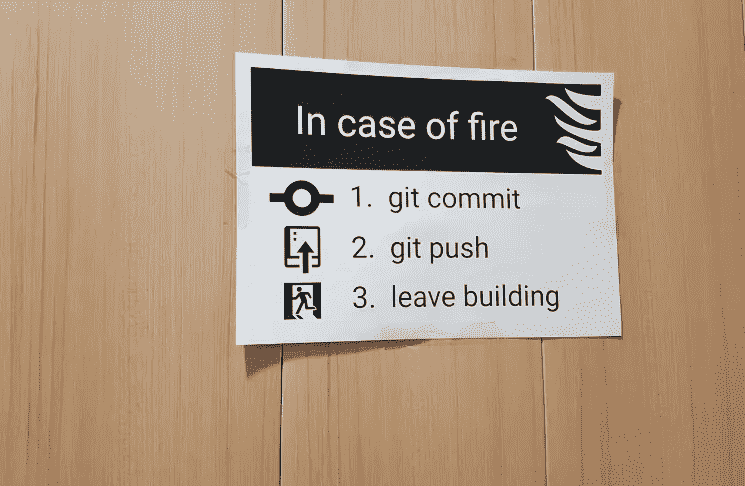
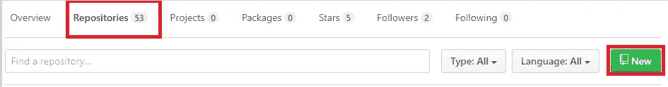
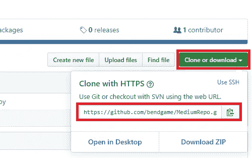
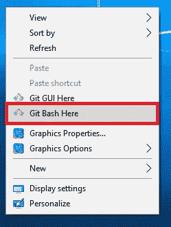
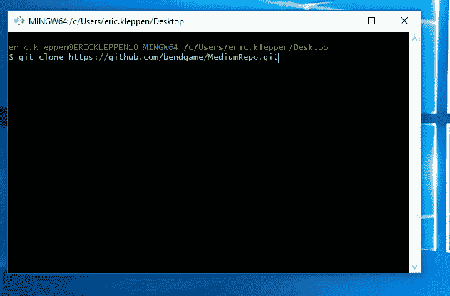
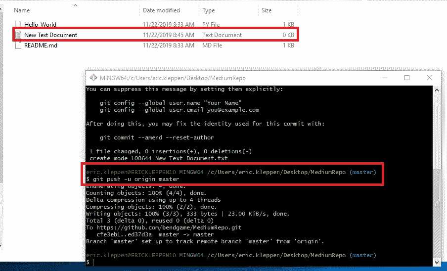
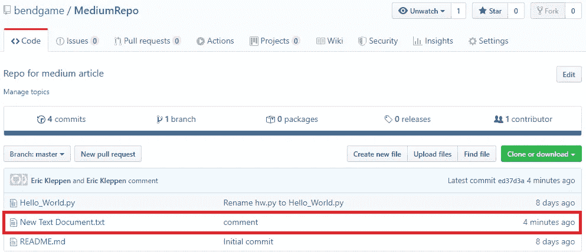

# 适用于 Github 初学者和其他人的简单 Git 工作流程

> 原文：<https://towardsdatascience.com/a-simple-git-workflow-for-github-beginners-and-everyone-else-87e39b50ee08?source=collection_archive---------10----------------------->



# 成为 Git 大师

当我在我参加的数据分析编码营开始我的第一个小组项目时，我们必须挑选一个“Git 大师”为五个使用 git 和 Github 的没有经验的人协调工作流的想法有点令人畏惧。决定的时候到了，因为我在新兵训练营开始前有一点点使用它的经验，我被任命为团队的“g it 大师”这是我创建的备忘单，用于帮助我的队友将他们的代码分支并合并到 Github 存储库中。如果你已经熟悉 Git ，可以在页面底部找到命令行指令的原始文本备忘单。

如果你正在考虑进入数据科学领域，请查看我在该领域工作 90 天后的感想:

[](/why-did-i-ever-get-into-data-science-aa69d3c74d19) [## 我为什么会涉足数据科学？

### 我不是一个“数字迷”这是我在数据科学领域头 90 天的反思

towardsdatascience.com](/why-did-i-ever-get-into-data-science-aa69d3c74d19) 

# 对 Git 和 Github 完全陌生？

[**GitHub**](http://www.github.com) 是一个 Git 存储库托管服务的用户界面。 [**Git**](https://git-scm.com/) 是一个可通过命令行访问的分布式版本控制系统。Git 是根据第二版 GNU 通用公共许可证的条款发布的免费开源软件。

Git 非常棒，因为它有助于跟踪代码的变化，并允许在各种规模的项目上进行协作。使用 Github，我可以与全世界分享我所有的编码项目。Github 有许多独特的特性，可以增强 git 体验，简化协作编码。任何人都可以打开我的用户页面，派生并克隆一个回购协议，然后玩代码。我不是 Git 或 Github 专家，但这是一个简短的指南，可以帮助你在 Github 上开始使用 Git:

创建一个 Github 帐户，如果你愿意的话，下载并安装 Git。这个例子是使用 Windows 10 机器完成的:

## 在 Github 上创建新的回购:

点击*仓库*选项卡上的绿色**新建**按钮。



将显示编辑器。

1.  输入存储库名称。
2.  选中复选框以使用自述文件初始化此存储库。
3.  单击创建存储库。您的新回购显示。
4.  单击绿色的克隆或下载按钮。
5.  将地址复制到剪贴板。



1.  复制完存储库地址后，切换到您的桌面。
2.  右键单击并选择 Git Bash Here，在桌面上打开一个终端。终端将显示。
3.  类型 git 克隆<paste the="" copied="" repo="" address="">。</paste>
4.  一个文件夹将出现在您的桌面上，它是克隆的存储库的副本。



通过克隆回购，您创建了它的本地副本。因为我们在桌面上使用了 Git Bash，所以副本出现在桌面上。现在我们有了本地 repo，我们可以在本地 repo 上添加文件和更新代码，然后使用备忘单中的命令将它推送到 Github！

# 将文件添加到您的存储库中

将文件添加到 repo 并推送到 Github 很容易。

1.  打开将存储库克隆到桌面时创建的文件夹。
2.  创建新的文本文件。
3.  切换到终端。确保您在正确的目录中！
4.  使用以下命令将文件推送到 Github，这样就可以将它们添加到存储库的主分支中:

```
Add the files to the branch:
 $ git add .

Commit the files:
 $ git commit -m "comment"

Add branch and files to the Remote Repo:
 $ git push -u origin main
```



## 注意新文件出现在 Github 上！



# 更多教程！

这个演练很简短，但是对于任何需要学习更多关于在平台上管理和共享代码的人来说，有很多好的 Git 和 Github 指南和教程。

如果您正在寻找编码项目，请查看我的一些教程:

[](https://medium.com/swlh/simple-sentiment-analysis-for-nlp-beginners-and-everyone-else-using-vader-and-textblob-728da3dbe33d) [## 简单的情感分析为 NLP 初学者和其他人使用 VADER 和 TextBlob

### 无需训练模型，只需几行代码就能从 Panda 数据帧的文本中提取情感指标！

medium.com](https://medium.com/swlh/simple-sentiment-analysis-for-nlp-beginners-and-everyone-else-using-vader-and-textblob-728da3dbe33d) [](https://medium.com/swlh/dashboards-in-python-for-beginners-and-everyone-else-using-dash-f0a045a86644) [## Python 中的仪表盘，适用于初学者和使用 Dash 的其他人

### 使用 Python 中的 Dash 初学者教程构建一个基本的和高级的仪表板

medium.com](https://medium.com/swlh/dashboards-in-python-for-beginners-and-everyone-else-using-dash-f0a045a86644) 

# 工作流程备忘单

```
Common console commands: 
 cd - change directory
 mkdir - make directory
 ls - view the files/folders in directory

NOTE: Exit VIM if needed ctrl + c then type :qa! and push enter
NOTE: If file is not in local repo, manually move the file into 
       the correct folder (outside of console)

--------------------------------------------
 Managing your Local Repo
--------------------------------------------
NOTE: If you need to hard reset your local repo to match 
       the remote master use the following commands:
 $ git fetch origin
 $ git reset --hard origin/master

Undo the act of committing, leaving everything else intact:
 $ git reset --soft HEAD^:

Undo the act of committing and everything you'd staged, 
but leave the work tree (your files intact):
 $ git reset HEAD^

Completely undo it, throwing away all uncommitted changes,
 resetting everything to the previous commit:
 $ git reset --hard HEAD^

--------------------------------------------  
 BEGIN WORKFLOW
-------------------------------------------- 
Clone the Repo to local machine:
 $ git clone https://github.com/user_name/repo_name.git

Make sure the local master is up-to-date:
 $ git pull origin main

Create new branch:
 $ git banch branch_name

Move to branch:
 $ git checkout branch_name

Navigate file structure as needed:
 $ ls 
 $ cd folder_name

Add the files to the branch:
 $ git add .

Verify file: 
 $ git status

Commit the files:
 $ git commit -m "comment"

Add branch and files to the Remote Repo:
 $ git push -u origin branch_name

Go to the github website to manage pull request and merge. 

Switch back to local master so you can delete the local branch:
 $ git checkout main

Delete local branch: 
 $ git branch -d branch_name
 OR 
 $ git branch -D branch_name

 If you don't want to go to the website, you can merge your branch 
 to the master locally and push the new master to the remote repo:

Switch back to master branch:
 $ git checkout main

Merge the branch with the local master:
 $ git merge branch_name -m "comment"

Push the local master to the remote master:
 $ git push origin main

Delete local branch: 
 $ git branch -d branch_name
 OR 
 $ git branch -D branch_name
```

# 我的 Github

如果你是 Github 的新手，需要一些 repos 来玩，请点击这里查看我的 Github:

[](https://github.com/bendgame/) [## 弯曲游戏-概述

### 对游戏、金融、数据分析、技术写作和牛肉干感兴趣。阻止或报告 9 月 10 月 11 月 12 月 1 月…

github.com](https://github.com/bendgame/) 

# 谢谢大家！

*   *如果你喜欢这个，* [*跟我上 Medium*](https://medium.com/@erickleppen) *了解更多*
*   [*通过订阅*](https://erickleppen.medium.com/membership) 获得完全访问权限并帮助支持我的内容
*   *我们连线上*[*LinkedIn*](https://www.linkedin.com/in/erickleppen01/)
*   *用 Python 分析数据？查看我的* [*网站*](https://pythondashboards.com/)

[**—埃里克·克莱本**](http://pythondashboards.com/)