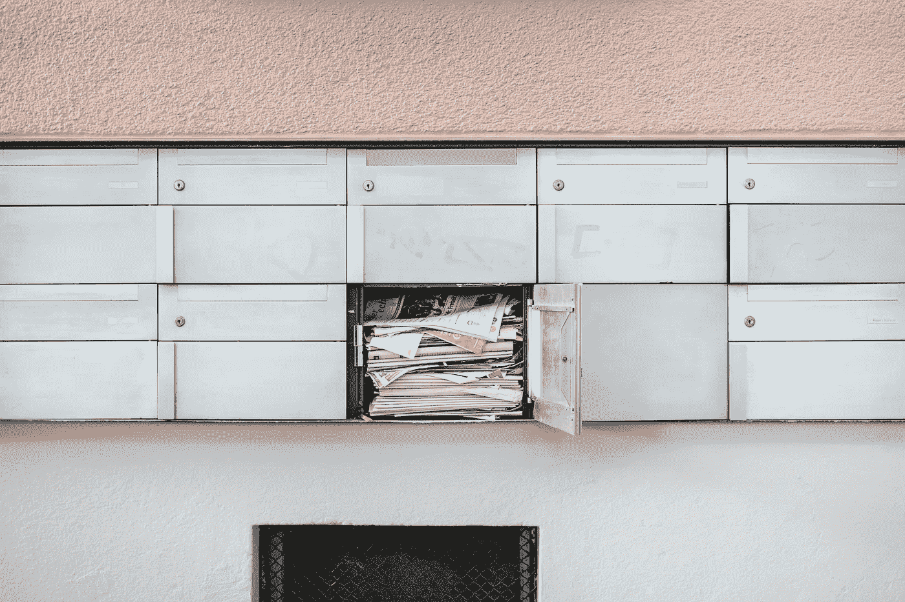
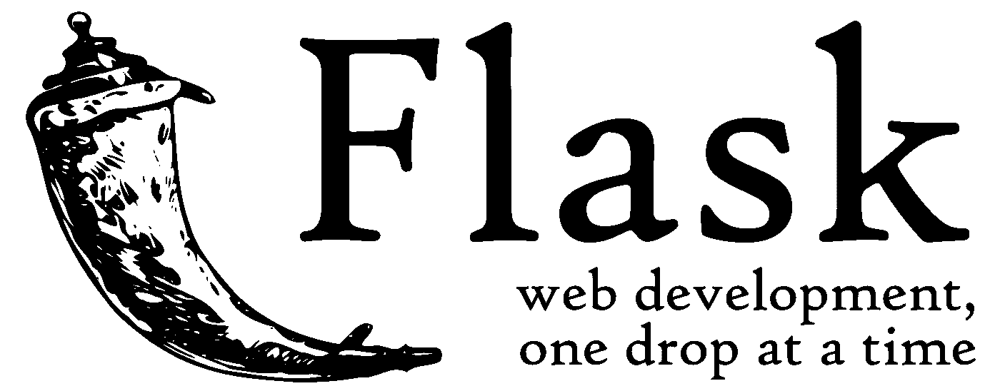
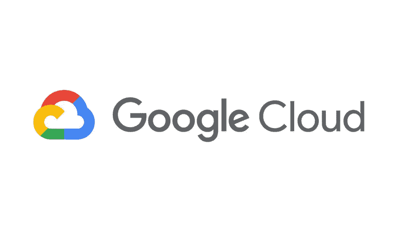
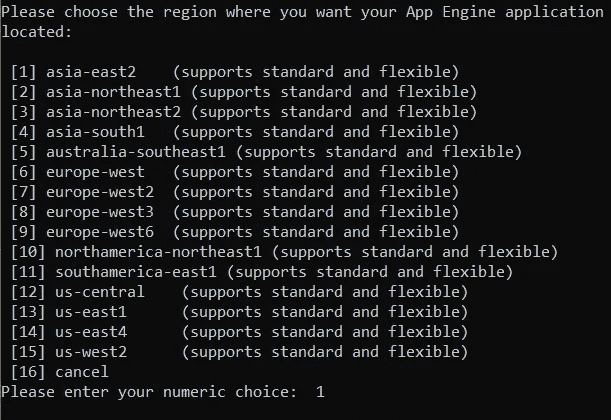
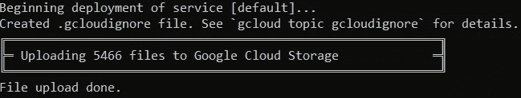

# 在 Google Cloud 上部署垃圾邮件检测器的简单指南

> 原文：<https://towardsdatascience.com/a-simple-guide-for-deploying-a-spam-detector-onto-google-cloud-ab1cd7163a21?source=collection_archive---------10----------------------->

## 谷歌云平台，Flask，分类合一



Photo by [Samuel Zeller](https://unsplash.com/photos/G_xJrvHN9nk?utm_source=unsplash&utm_medium=referral&utm_content=creditCopyText) on [Unsplash](https://unsplash.com/search/photos/spam?utm_source=unsplash&utm_medium=referral&utm_content=creditCopyText)

你好👋！嗯，有很多关于建立各种用途的机器学习模型的指南，我最近看到了一个关于建立垃圾邮件检测器然后使用 Flask 部署它的指南。通过这一点，我决定通过部署到谷歌云平台上更进一步！当然，你也可以使用 Heroku，AWS 等，但这是另一天的另一个主题，我现在只关注 GCP。

## 项目的简要背景

这是一种机器学习模型，通过对现有的标有“垃圾”或“火腿”的短信集合进行训练，对[垃圾短信](https://github.com/georgeblu1/Spam-Detector-Web-App)进行分类。垃圾邮件检测器采用 scikit-learn 的[多项式朴素贝叶斯](https://scikit-learn.org/stable/modules/naive_bayes.html)分类器，该分类器基于朴素贝叶斯算法，用于多项式分布数据:

> 朴素贝叶斯方法是一组基于应用贝叶斯定理的监督学习算法，其“朴素”假设是在给定类变量的值的情况下，每对要素之间的条件独立性。
> 
> 与更复杂的方法相比，朴素贝叶斯学习器和分类器可以非常快。类别条件特征分布的分离意味着每个分布可以被独立地估计为一维分布。这反过来又有助于缓解维数灾难带来的问题。



Flask Logo

同时，Flask 作为 web 框架，通过前端接收用户的输入(HTTP 请求)并实现其预测功能。诞生于 2010 年的 Flask 以大多数标准来看都是一个小框架，小到可以被称为“微框架”。Flask 提高了其源代码的可读性和易理解性。Flask 是一个用 Python 编写的轻量级 Web 框架，它已经成为初创企业最广泛使用的 Python web 框架之一，也是大多数企业快速简单解决方案的完美工具。

> Flask 的目标是保持框架的核心小但高度可扩展，从而非常容易和灵活地编写应用程序或扩展，同时使开发人员能够为他们的应用程序选择自己的配置



## 在 Google 云平台上部署

我们将在标准环境中使用[谷歌应用引擎](https://cloud.google.com/appengine/)。它允许我们“在完全托管的无服务器平台上构建高度可扩展的应用程序”。在继续之前，我将提出一些必要条件或假设:

1.  我假设您已经安装了 Flask 和虚拟环境中涉及的库(如果没有，将在后面显示)。
2.  您有一个可以访问[谷歌云平台控制台](https://console.cloud.google.com)的谷歌账户，并在上面创建了一个新项目。

> 确保为您的项目启用**计费**。为了将应用程序部署到 App Engine，需要将计费帐户链接到您的项目

3.已安装 [Google Cloud SDK](https://cloud.google.com/sdk/) ，按照其说明进行安装。

4.您已经成功地在本地测试了您的应用程序。


Project Folder Structure

大致来说，您的主文件夹将具有这种结构，请注意“nlp”是我的虚拟环境，我们将在下面创建 app.yaml、appengine_config.py 和 requirements.txt:

app.yaml

示例 app.yaml 指定了应用程序应该运行的运行时，对于这个项目，它将在 Python 3.7 上运行。对于 Python 2.7，可以参考下面的代码:

Python 2.7 app.yaml

app_engine_config.py

requirements.txt

如果您没有将必要的库安装到虚拟环境中，您可以使用下面的代码。应该首先激活环境，并使用终端、命令提示符等来访问它，以便根据需求安装新的依赖项。

```
pip install -t lib -r requirements.txt
```

**-t lib:** 此标志将库复制到 lib 文件夹中，该文件夹在部署期间上传到 App Engine。

**-r requirements.txt:** pip 安装 requirements.txt 中的所有内容。

# 部署

在我们开始之前，最好(可选)更新已安装的云 SDK:

```
gcloud components update
```

然后，在**根文件夹**，我们将使用您的 cmd/终端部署它，代码如下:

```
gcloud app deploy --project [ID of Project]
```

或者你也可以在没有项目 ID 的情况下完成！



根据您的项目，选择最合适的区域并等待几分钟，它将为您提供一个链接，任何人都可以访问该链接来查看/使用您的 web 应用程序！



或者只使用下面的代码:

```
gcloud app browse --project=
#the link usually is "projectid".appspot.com
```

# 结论

瞧啊。GCP 使部署 web 应用程序的过程变得更快、更容易。我希望我可以尝试在不久的将来或其他项目的其他选择。如果有任何问题，请随时联系我！我的网站可以在这里找到:[spamdetector.appspot.com](http://spamdetector.appspot.com)

参考

1.  存储库:[https://github.com/georgeblu1/Spam-Detector-Web-App](https://github.com/georgeblu1/Spam-Detector-Web-App)
2.  用 Python 开发 NLP 模型&用 Flask 逐步部署:[https://towardsdatascience . com/develop-a-NLP-Model-in-Python-Deploy-It-with-Flask-Step-Step-744 F3 BDD 7776](/develop-a-nlp-model-in-python-deploy-it-with-flask-step-by-step-744f3bdd7776)
3.  [烧瓶框架食谱](https://www.packtpub.com/web-development/flask-framework-cookbook)
4.  [砂箱网开发](https://www.oreilly.com/library/view/flask-web-development/9781491991725/)
5.  [Python 机器学习](https://www.amazon.com/Python-Machine-Learning-Sebastian-Raschka-ebook/dp/B00YSILNL0)