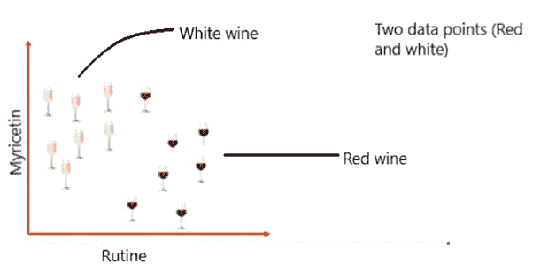
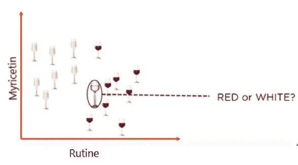
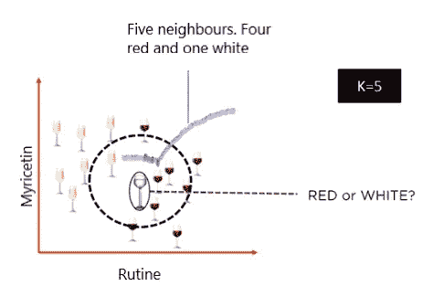
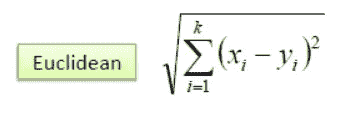
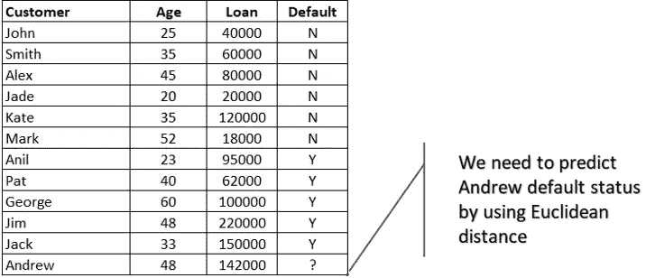
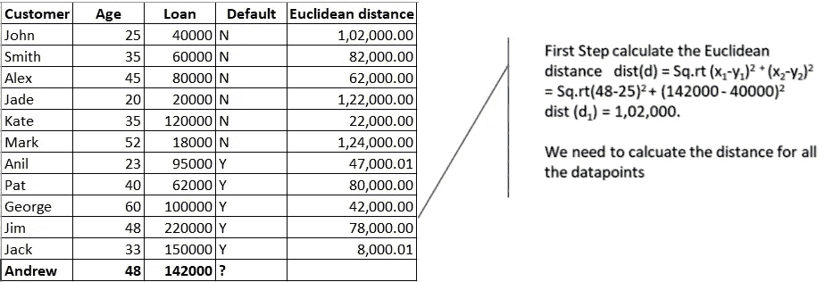
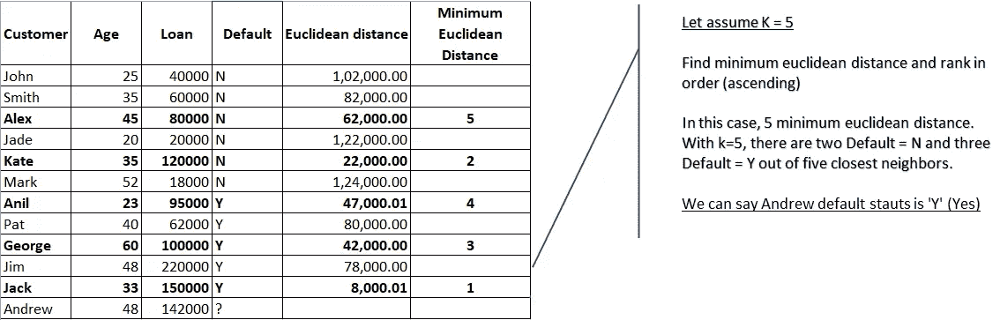

# K-最近邻算法简介

> 原文：<https://towardsdatascience.com/a-simple-introduction-to-k-nearest-neighbors-algorithm-b3519ed98e?source=collection_archive---------0----------------------->

Photo by [h heyerlein](https://unsplash.com/@heyerlein?utm_source=unsplash&utm_medium=referral&utm_content=creditCopyText) on [Unsplash](https://unsplash.com/s/photos/machine-learning?utm_source=unsplash&utm_medium=referral&utm_content=creditCopyText)

# 什么是 KNN？

k 最近邻是一种简单的算法，它存储所有可用的案例，并基于相似性度量对新数据或案例进行分类。它主要用于根据相邻数据点的分类方式对其进行分类。

让我们以下面的葡萄酒为例。两种化学成分叫做芦丁和杨梅素。考虑用红葡萄酒和白葡萄酒这两个数据点来测量芦丁和杨梅素的含量。他们已经测试了葡萄酒中芸香素和杨梅黄酮的含量，并确定了它们在图表中的位置。

KNN 中的“k”是一个参数，指的是在多数投票过程中包括的最近邻的数量。

假设，如果我们在数据集中添加一杯新的葡萄酒。我们想知道这种新酒是红的还是白的？

所以，我们需要找出这种情况下的邻居是谁。假设 k = 5，并且新的数据点被来自其五个邻居的多数投票分类，并且新点将被分类为红色，因为五个邻居中有四个是红色的。

# KNN 算法中 k 的值应该如何选择？

KNN 算法中的 K’是基于特征相似性的。选择正确的 K 值是一个被称为参数调整的过程，并且对于更好的准确性是重要的。求 k 的值并不容易。

# 关于“K”取值的几点想法

1.  没有一个结构化的方法可以找到“K”的最佳值。我们需要通过反复试验来找出不同的值，并假设训练数据是未知的。
2.  选择较小的 K 值可能会产生噪声，并对结果产生较大影响。

3)K 值越大，决策边界越平滑，意味着方差越低，但偏差越大。此外，计算成本很高。

4)选择 K 的另一种方法是通过交叉验证。从训练数据集中选择交叉验证数据集的一种方法。从训练数据集中取出一小部分，称之为验证数据集，然后使用它来评估 K 的不同可能值。这样，我们将使用 K 等于 1，K 等于 2，K 等于 3 来预测验证集中每个实例的标签..然后我们看看什么样的 K 值能让我们在验证集上获得最佳性能，然后我们可以取这个值，并将其用作我们算法的最终设置，这样我们就能最小化验证误差。

5)一般来说，实践中，选择 **k** 的值是 **k = sqrt(N)** 其中 **N** 代表你的训练数据集中的**个样本数。**

6)尽量保持 k 值为奇数，以避免两类数据之间的混淆

# KNN 算法是如何工作的？

在分类设置中，K-最近邻算法本质上归结为在与给定的“看不见的”观察最相似的 K 个实例之间形成多数投票。相似性根据两个数据点之间的距离度量来定义。一种流行的方法是欧几里德距离法

> 其他方法有*曼哈顿、闵可夫斯基和海明距离*方法。*对于分类变量，必须使用汉明距离。*

我们举个小例子。年龄 vs 贷款。

我们需要预测安德鲁的违约状态(是或否)。

计算所有数据点的欧几里德距离。

K=5 时，五个最近邻居中有两个 Default=N，三个 Default=Y。基于 5 分中的 3 分的主要相似性，我们可以说 Andrew 的默认状态是“Y”。

> K-NN 也是一个懒惰的学习者，因为它不从训练数据中学习判别函数，而是“记忆”训练数据集。

# KNN 的优点

1.  易于实施
2.  灵活选择功能/距离
3.  自然处理多类案件
4.  在实践中可以做得很好，有足够的代表性数据

# KNN 的缺点

1.  需要确定参数 K 的值(最近邻的数量)
2.  计算成本相当高，因为我们需要计算每个查询实例到所有训练样本的距离。
3.  数据存储
4.  必须知道我们有一个有意义的距离函数。

参考:

[https://stack overflow . com/questions/11568897/value-of-k-in-k-nearest-neighbor-algorithm](https://stackoverflow.com/questions/11568897/value-of-k-in-k-nearest-neighbor-algorithm)