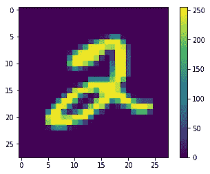

# 张量流的简单介绍

> 原文：<https://towardsdatascience.com/a-simple-introduction-to-tensorflow-d992eb2e3dbb?source=collection_archive---------20----------------------->


Don’t lie, this was you at some point

根据我的经验，学习任何对计算机科学有用的东西都落在了理论和实践的奇怪交叉点上。我们很容易忽略一些我们编码的东西的深度。机器学习将这一点发挥到了极致，如今每个人都想成为机器学习工程师。(包括我自己)

《统计学习要素》是一本很棒的书。如果你能熬过这一关，你会知道很多，但如果你不能将其中任何一点付诸实践，那就没什么意义了。TensorFlow 是一个用于构建、训练和部署机器学习模型的框架。Keras 是一个构建在 TensorFlow 之上的包装器，使它更容易访问，更容易使用，也更干净。

下面的代码块相当于 TensorFlow 中的“Hello World”。尽管这是使用 TensorFlow 的第一步，但这里还有很多东西要解开。所以让我们开始吧。

Full Code for this article

Python 令人惊奇的一点是，少量代码中可以包含如此多的内容。跟随教程并让代码做事情是非常容易的。对某些人来说，这就够了。其他人可能想知道每一行或每一个函数的作用。我属于后一类。

# 数据

```
import tensorflow as tf
mnist = tf.keras.datasets.mnist
(x_train, y_train),(x_test, y_test) = mnist.load_data()
```

MNIST 数据集由手写数字组成；60000 幅训练图像和 10000 幅测试图像。一个**训练集**是一个集合，在其中我们被给予我们正在观察的特征的结果。**特征**是可以测量的物体的特征。一个更熟悉的特性术语可能是变量或属性。


Digits in the MNIST Dataset

通过使用训练集中对象的特征，我们的模型将*学习*，然后对新的相似对象进行预测。

**测试集**是我们将(你猜对了)用来测试通过使用训练集创建的模型。

在上面的几行中，我们告诉 TensorFlow 我们想要 MNIST 数据集中的文件，然后我们将数据加载到训练和测试变量中。

```
print(x_train.shape)(60000, 28, 28)
```

我们已经知道我们的训练集有 60，000 张图片。28，28 指的是每个图像的尺寸，28 像素乘 28 像素。因此，让我们进一步探索这些数据。

```
import matplotlib.pyplot as plt
%matplotlib inlineplt.figure()
plt.imshow(x_train[5])
plt.colorbar()
plt.grid(False)
plt.show()
```



Result of plt.imshow(x_train[5])

对于图像的任何给定像素，分配给该像素的值可以在 0 到 255 之间。这就引出了下一行代码:

```
x_train, x_test **=** x_train **/** 255.0, x_test **/** 255.0
```

它标准化了我们训练和测试集中的所有值。

好了，酷的时候到了:

# 模型

```
model = tf.keras.models.Sequential([
 tf.keras.layers.Flatten(input_shape=(28, 28)),
 tf.keras.layers.Dense(512, activation=tf.nn.relu),
 tf.keras.layers.Dropout(0.2),
 tf.keras.layers.Dense(10, activation=tf.nn.softmax)
])model.compile(optimizer=’adam’,
 loss=’sparse_categorical_crossentropy’,
 metrics=[‘accuracy’])
```

我们的第一行指定了我们正在使用的模型:

```
tf.keras.models.Sequential
```

顺序模型可以被认为是一堆煎饼。每一层都是煎饼。因为我们正在努力成为高级厨师，制作机器学习模型，所以我们的煎饼有馅料。馅料即使不比它们的成分更好，也尽量做得一样好。我们的原料是我们的训练装备。
第一层之后的层可以自动识别出模型的输入形状是连续的，这就是为什么只做一次的原因。

```
tf.keras.layers.Flatten(input_shape**=**(28, 28)),
```

我们现在把输入的图像“展平”成一个 2D 数组。输入形状是输入到图层中的图像的尺寸。可以把这看作是为模型重新格式化图像。

```
tf.keras.layers.Dense(512, activation**=**tf.nn.relu)
```

这就产生了一个紧密连接的神经层。层中的每个输入节点都连接到一个输出节点。它接收来自前一层的输入，这就是为什么它是*密集*。512 表示输出空间的维数，乍一看，这对大多数人来说意义不大。这意味着什么的答案是比这篇文章更深入的神经网络。
一个激活函数接受网络中一个节点的输入，并生成将被传递到下一层的输出。如果没有非线性激活函数，这将只是一个线性回归模型。这里使用的激活函数类型是 RELU 或整流线性单元，这是最常用的激活函数之一。

```
tf.keras.layers.Dropout(0.2),
```

丢弃层是一种正则化技术，其中随机选择的神经元在训练中被忽略。这里我们有一个 20%的比率集，它将在下一个训练周期中丢弃每五个输入中的一个。

```
tf.keras.layers.Dense(10, activation**=**tf.nn.softmax)
```

与上面的 RELU 层类似，这一层使用了一个 Softmax 激活函数。Softmax 激活函数的输出类似于分类概率分布，因此它表示类为真的概率。

```
model.compile(optimizer**=**'adam',
              loss**=**'sparse_categorical_crossentropy',
              metrics**=**['accuracy'])
```

现在我们编译这个模型。
首先，亚当到底是谁？不是一个人。显然它是从“自适应矩估计”中推导出来的。应该是一个叫亚当的人想出来的，应该能写出更好的段落。
无论如何，优化器确实做了它听起来做的事情。Adam 优化算法用于根据训练数据更新网络权重。
损失函数用于衡量预测值和实际值之间的差异。目标是最小化损失函数。

# 结果

```
model.fit(x_train, y_train, epochs**=**5)
model.evaluate(x_test, y_test)
```

最后，我们拟合和评估我们的模型。需要注意的是，一个*纪元*与一次迭代不是一回事。历元是训练数据的完整传递。让一个模型运行太少的时期，在性能方面会有很多不足之处。让一个模型运行太多的时期会有开始“记住”它可能想要的输出的风险，因此会损害它的准确性。

这个模型的训练无论如何都不是很好，但这只是来自 TensorFlow 教程。

```
model.fit(x_train, y_train, epochs=5)
model.evaluate(x_test, y_test)Epoch 1/5
60000/60000 [==============================]60000/60000 [==============================] - 8s 126us/step - loss: 9.9728 - acc: 0.3813

Epoch 2/5
60000/60000 [==============================]60000/60000 [==============================] - 8s 127us/step - loss: 10.1151 - acc: 0.3724

Epoch 3/5
60000/60000 [==============================]60000/60000 [==============================] - 8s 127us/step - loss: 10.0101 - acc: 0.3789

Epoch 4/5
60000/60000 [==============================]60000/60000 [==============================] - 8s 126us/step - loss: 10.0149 - acc: 0.3786

Epoch 5/5
60000/60000 [==============================]60000/60000 [==============================] - 8s 127us/step - loss: 10.0893 - acc: 0.3740

10000/10000 [==============================]10000/10000 [==============================] - 0s 32us/step[10.388112817382812, 0.3555]
```

现在你知道了！首次尝试 TensorFlow。虽然它只有几行代码，但还有很多要解开，但这将变成一本书。如果你读了所有这些，我希望你学到了一些东西！