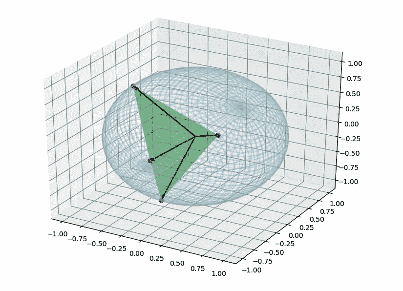
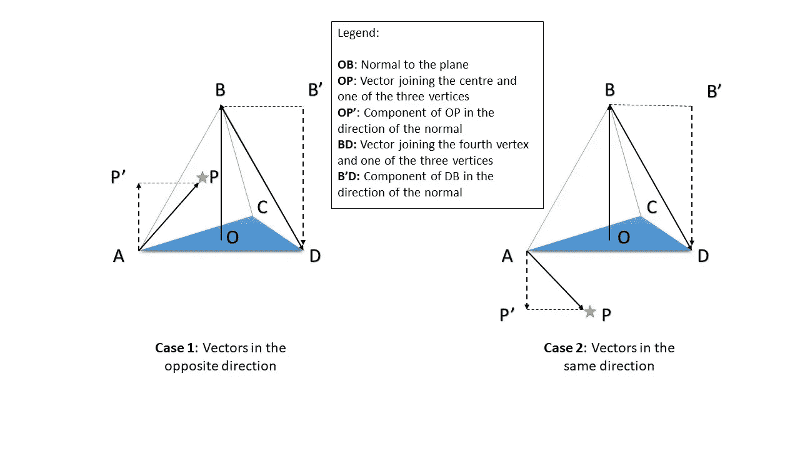
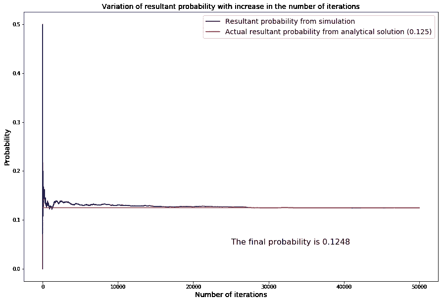

# 解决普特南竞赛数学问题的简单蒙特卡罗模拟

> 原文：<https://towardsdatascience.com/a-simple-monte-carlo-simulation-to-solve-a-putnam-competition-math-problem-28545df6562d?source=collection_archive---------19----------------------->

## Python 中蒙特卡罗方法综述


Photo by [Jonathan Petersson](https://unsplash.com/@grizzlybear?utm_source=medium&utm_medium=referral) on [Unsplash](https://unsplash.com?utm_source=medium&utm_medium=referral)

# 介绍

高赌注赌博和高速赛车有两个共同点——高度的不确定性和蒙特卡洛城。这两者之间的联系导致了术语“蒙特卡罗模拟”的使用，该术语用于使用统计抽样来预测包含不确定性的过程的各种结果的概率的计算方法。迷茫？放心吧！我们将看看使用 Python 设计和执行一个简单的蒙特卡罗模拟。

当我的一个朋友挑战我解决久负盛名的[普特南竞赛](https://www.maa.org/math-competitions/putnam-competition)中的一个问题时，我通常无聊的火车通勤变得令人兴奋——这是一个甚至困扰最聪明的数学本科生的测试。

问题如下(转述):

> 如果你在一个球体上随机选择 4 个点并把它们连接起来，那么得到的四面体包含球体中心的概率是多少？



现在，通过应用一些几何和概率的概念来确定精确的解是完全可能的。我希望你们中的数学天才在你读完这句话之前就已经准备好答案了。对于那些不能理解的人(像我一样)，YouTube 上 3Blue1Brown 的一个[视频](https://www.youtube.com/watch?v=OkmNXy7er84)提供了一个关于分析解决方案的非常优雅的解释。

然而，问题中的“随机”一词在我的脑海中引发了另一种思路，最终导致了我将要提出的解决方案。我考虑了通过**随机抽样**获得答案的可能性。这个想法很简单——抽取大量四面体的随机样本，并计算考虑所有这些样本的概率。

# 该算法

模拟的大致算法如下:

1.  将已知半径的球面定义为样本空间。
2.  将合成概率定义为 num/den，其中 num=0，den=1。
3.  从样本空间中绘制球体内部四面体的一个样本。
4.  确定中心是否位于四面体内部。
5.  分别基于当前试验的成功或失败，通过在 num 上加 1 或 0，并在任何情况下在 den 上加 1，计算得到的概率。
6.  重复步骤 3 至 5，选择指定数量的随机样本。
7.  显示结果概率。

# 代码

我们将一步一步地浏览代码，并详细检查每一步。

## 步骤 1:导入所需的模块

首先，我们在 Python 中导入所需的模块——即 *Scipy* 和 *Matplotlib* 。 *Scipy* 有一个允许生成随机数的子模块。

```
import scipy as sci
import matplotlib.pyplot as plt
```

## 步骤 2:定义样本空间

下一步是创建一个由一定数量的点组成的样本空间。对于这个例子，让样本空间在半径为 **1 单位的球体表面上有 **10，000 个点**。**

我们如何确保样本空间上的点位于球面上？三个简单的步骤:

1.  使用`sci.random.rand(1,3)` *选择任意随机 3D 矢量。*这将产生一个以 0.5 为中心的三维矢量，每个坐标的值在 0 到 1 之间。
2.  从每个坐标中减去 0.5，使其以 0 为中心。
3.  计算向量的范数(或大小)并将向量除以其范数，确保其成为单位向量**。任何单位矢量都必然位于半径为 1 的球面上。**

**为了安全起见，可以添加一个 if 条件，以确保范数等于 0 或大于 1 的向量不会经历这种变换。**

**This animation was created using matplotlib; the code for this is not given in the article. It is merely used for the purpose of representation of under-the-hood computations.**

```
points=10000 #Number of points 
x=sci.zeros((points,3)) #To store x-coordinates of sample points
y=sci.zeros((points,3)) #To store y-coordinates of sample pointsfor i in range(points):
    vector=sci.random.rand(1,3)-0.5
    if(sci.linalg.norm(vector)!=0 and sci.linalg.norm(vector)<=1.0):
        x[i,:]=vector
        y[i,:]=x[i,:]/sci.linalg.norm(x[i,:])
```

**为了绝对确保样本空间中的所有点都位于球体表面，我们可以添加另一个**检查点。****

**我们计算样本空间中向量的实际范数和期望范数(等于球体的半径；这里 1)并将其与一个公差(任意定义的；这里是 1×10⁻ ⁰).与所需规范不匹配的规范存储在`danger_array`中。如果`danger_array`的大小是 0(也就是说，不存在不需要的规范)，那么我们显示“全部清除”消息并继续前进。**

```
y_norms=sci.zeros(points) #Array to store norms of sample vectorsfor i in range(points):
    y_norms[i]=sci.linalg.norm(y[i,:])
    tol=1e-10 #Tolerance
    norm_diff=abs(y_norms-1) #Diff. between actual and desired norm
    danger_array=y_norms[norm_diff>tol]if(len(danger_array)==0): 
    print("All Clear")
else:
    print("Danger")
```

## **步骤 3:创建函数来确定中心是否位于四面体内部**

**一旦所有检查都通过了，我们就进入问题的核心——确定球体的中心是否位于随机四面体中。这可以通过使用两个函数来简化。**

**第一个检查球体的中心和四面体的第四个顶点是否位于由四面体的其余三个顶点形成的平面的同一侧。**

**第二个为四面体的所有四个面调用第一个函数，并推断中心是否位于四面体内部。**

**为了公式化`CheckSide`函数，我们依赖于以下线性代数原理:**

*   **两个向量的**叉积**给出一个垂直于两个向量形成的平面的**向量。****
*   **两个矢量的**点积**给出了一个矢量在另一个方向上的分量的**大小。如果分量的方向与第二个向量相反，那么点积就是负的。****

**我们使用第一个原理来寻找由任意三个顶点形成的平面的法线。**

**接下来，我们找到法线和一个向量的点积，该向量将第四个顶点与三个顶点中的任何一个连接起来——这个点积的符号被存储。**

**最后，我们找到法线和连接球体中心和三个顶点中的任何一个的向量的点积——将该点积的符号与前一个进行比较，如果它们**与**匹配，则可以得出结论，第四个顶点和中心位于由剩余三个顶点形成的平面的**同侧**。**

****

**This schematic will make it easier for you to visualize the application of the two principles**

```
def CheckSide(vertices,point):
    t1,t2,t3,t4=vertices
    p=point
    side_1=t2-t1
    side_2=t3-t1
    normal=sci.cross(side_1,side_2) ref_vector=t4-t1
    ref_sign=sci.dot(normal,ref_vector) point_vector=p-t1
    point_sign=sci.dot(normal,point_vector) if(sci.sign(ref_sign)==sci.sign(point_sign)):
        return 1
    else:
        return 0
```

**如果我们将`CheckSide`函数应用于一个四面体的所有四个面，我们将能够准确地推断出中心是否位于其中。因此，我们定义了一个新函数`CheckTetrahedron` ，它调用了`CheckSide` 函数四次。**

**在每一次函数调用之间，我们**将**的顶点数组滚动一个，这样`CheckSide` 函数在下一次调用时会在一个新的面上工作。**

**最后，将所有四个`CheckSide` 调用返回的值相加，如果它们等于 **4** ，则断定中心位于四面体内部；如果没有，它就在外面。**

```
def CheckTetrahedron(vertices,point):
    vert=sci.copy(vertices)
    check_1=CheckSide(vert,point) vert=sci.roll(vert,1,axis=0)
    check_2=CheckSide(vert,point) vert=sci.roll(vert,1,axis=0)
    check_3=CheckSide(vert,point) vert=sci.roll(vert,1,axis=0)
    check_4=CheckSide(vert,point) sum_check=check_1+check_2+check_3+check_4 if(sum_check==4.):
        return 1
    else:
        return 0
```

## **步骤 4:初始化**

**现在我们已经定义了所有必需的函数，是时候开始实际运行了。在开始运行之前，我们需要初始化一些参数，以便运行和绘图。**

**数组`check_point`将存储**的**和**的**来表示每次迭代的**成功**或**失败**。我们将创建一个数组来存储每次迭代的值，而不是只存储结果概率的一个值，这样我们就可以绘制一条曲线来显示概率随迭代次数的变化。**

```
centre=[0,0,0]
number_of_samples=10000
sample_span=sci.arange(0,number_of_samples,1)
check_point=sci.zeros(number_of_samples) 
prob=sci.zeros(number_of_samples)
```

## **跑步**

**是时候运行模拟了！在每次迭代中，我们做以下三件事:**

1.  **从样本空间中随机挑选 4 个不同的点。**
2.  **将`CheckTetrahedron` 函数应用于这 4 个点和中心，以确定中心是否位于这 4 个点形成的四面体中。**
3.  **根据试验的成功或失败，在`check_point` 中分别存储 1 或 0，并更新`prob` 数组中的合成概率值。**

**This animation was created using matplotlib; the code for this is not given in the article. It is merely used for the purpose of representation of under-the-hood computations.**

```
for i in range(number_of_samples):
    indices=sci.random.randint(0,points,4)
    vertex_list=y[indices]
    check_point[i]=CheckTetrahedron(vertex_list,centroid)
    prob[i]=len(check_point[check_point==1.])/(i+1)
```

## **第六步:绘图**

**最后，在给定迭代次数下运行模拟后，绘制结果并找出结果概率的时间到了。我们给情节添加了一些花里胡哨的东西，让它看起来更有吸引力，同时也确保它清晰地传达了所有需要的信息。**

```
#Plot blank figure
plt.figure(figsize=(15,10))#Plot resultant probability from simulation
plt.plot(sample_span,prob,color="navy",linestyle="-",label="Resultant probability from simulation")#Plot resultant probability from analytical solution
plt.plot(sample_span,[0.125]*len(sample_span),color="red",linestyle="-",label="Actual resultant probability from analytical solution (0.125)")#Plot value of final resultant probability in text
plt.text(sample_span[int(number_of_samples/2)],0.05,f"The final probability is {prob[-1]:.4f}",fontsize=16)#Display axis labels
plt.xlabel("Number of iterations",fontsize=14)
plt.ylabel("Probability",fontsize=14)#Display legend
plt.legend(loc="upper right",fontsize=14)#Display title of the plot
plt.title("Variation of resultant probability with increase in the number of iterations",fontsize=14)
```

**最终的剧情如下。从图的性质来看，很明显**随着迭代次数的上升，概率收敛到真值(即解析解)。****

****

**Plot generated by matplotlib detailing the variation of probability with the number of iterations**

## **总结想法**

**由于方法中相关的随机性，你的模拟可能无法在与我的模拟相同的迭代次数内收敛到真实值。在这种情况下，您可以不断增加迭代次数，直到您的解收敛到真实值。**

**解析解是 **1/8** 或 **0.1250** ，蒙特卡罗模拟收敛到一个值 **0.1248，**，这个值足够接近。我们通过模拟从随机性中创造了一种明显的秩序——重复随机采样可以导致单一收敛解的事实令人震惊。这种方法可能看起来不优雅——几乎就像对计算能力的野蛮使用——但它非常有效，确实给出了准确的答案。**

**代码已经被记录在一个 [Jupyter 笔记本](https://nbviewer.jupyter.org/gist/gauravsdeshmukh/f735e3dbd34ec6b6e3dcd1f154f264ef)中，可以在线查看。**

**我希望我已经清楚地解释了方法和代码。欢迎您在评论中做出回应，提出问题或提供您可能有的任何建议。**

**你也可以在 Twitter 上关注我。**