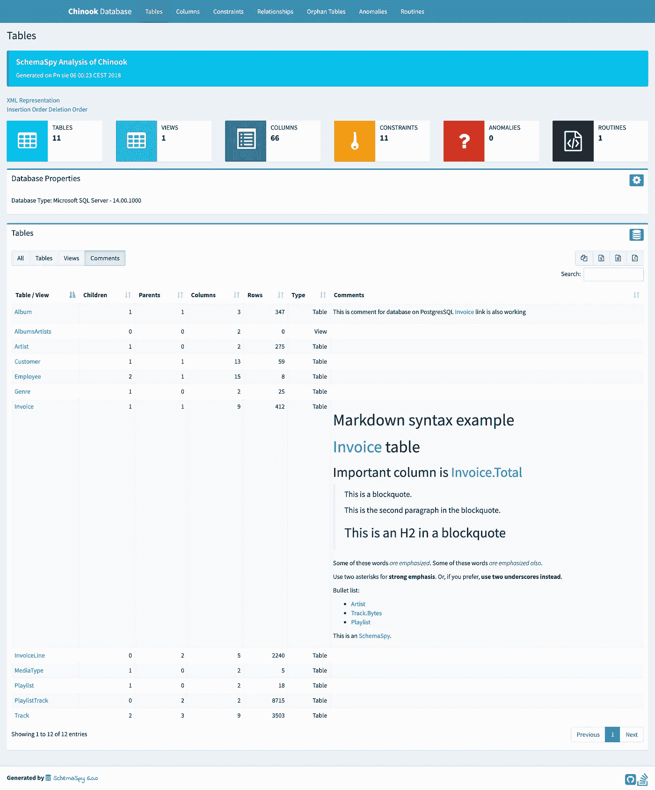
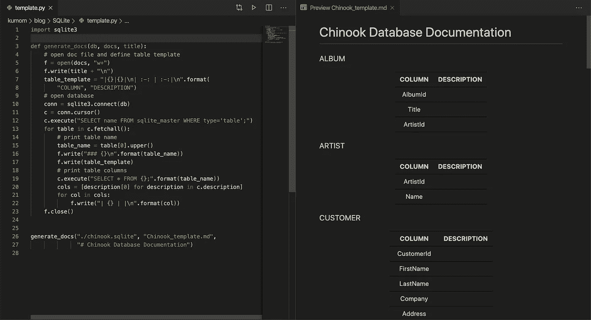

# 一个简单的 Python 脚本来记录 SQLite 数据库

> 原文：<https://towardsdatascience.com/a-simple-python-script-to-document-the-sqlite-databases-7932aa462cd8?source=collection_archive---------18----------------------->

## 自动生成降价文件以记录 SQLite 数据库

当我使用关系数据库时，这个问题一直困扰着我:**文档**。实体关系图是标准的，但是当列名不是自解释的或者模式变得太大而无法处理时，它就没有用了。 [SchemaSpy](http://schemaspy.org/) 是一个开源工具，可以自动生成 ER 图，但它为用户提供了接近零的灵活性来增强文档。

SchemaSpy demo

对于小型数据集，SchemaSpy 可能是多余的。为了使数据集可用于协作，很好地记录每一列就足够了。我选择 markdown 作为这项工作的工具。事不宜迟，让我们看看解决方案是什么样子的。

After executing the script on the left, we obtain a documentation template on the right.

该脚本检索所有表和相应的列名。我们需要做的就是打开 markdown 文件，并填写每个字段的描述。

你可以在这里下载奇努克数据库[并在你的电脑上运行演示。现在终于轮到我的食谱了。尽情享受，随心所欲地调节它:-)](https://github.com/lerocha/chinook-database/blob/master/ChinookDatabase/DataSources/Chinook_Sqlite.sqlite)

sqlite_doc_template.py

你知道任何其他好的方法来记录数据库(SQL，NoSQL，图形数据库等)。)?请在下面评论或给我留言！