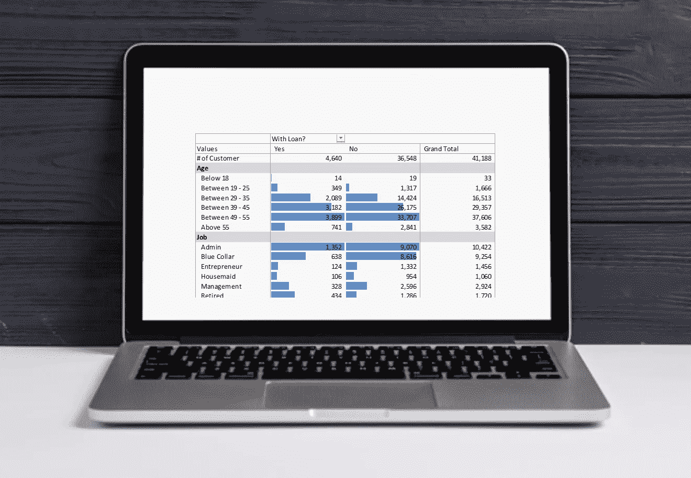
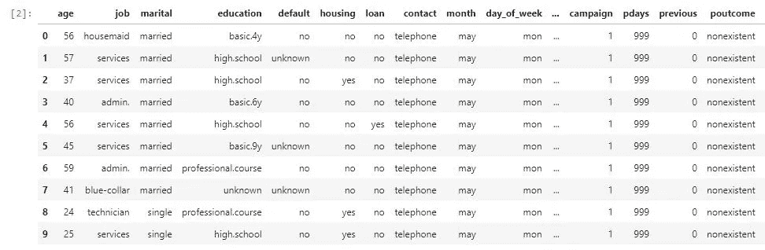
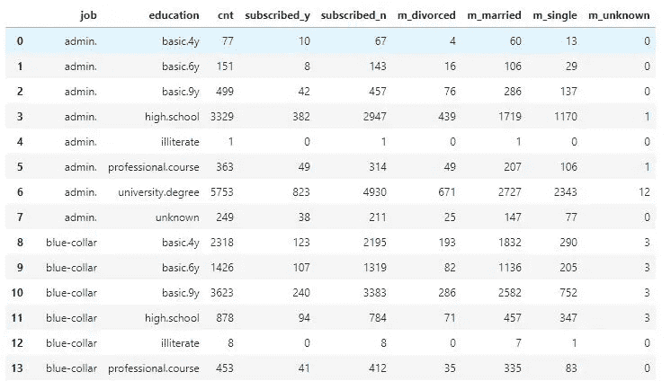
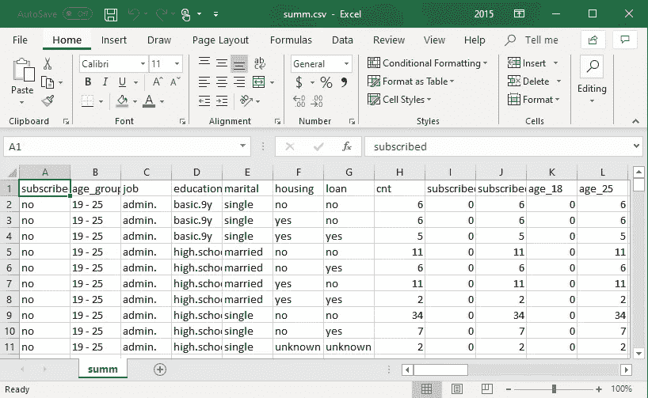
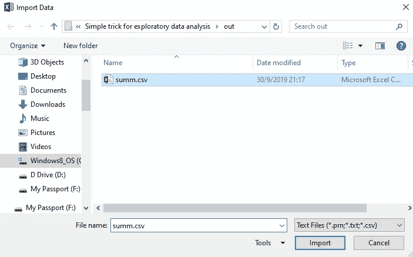
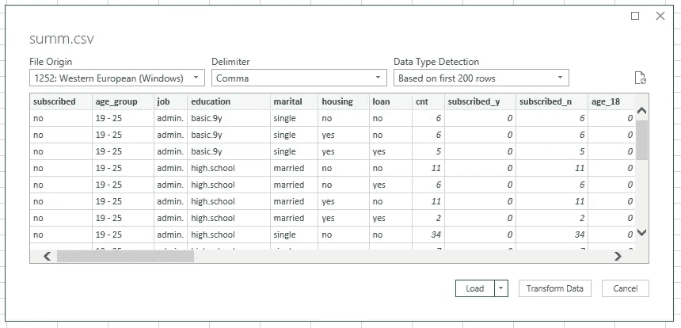
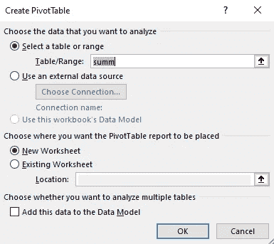
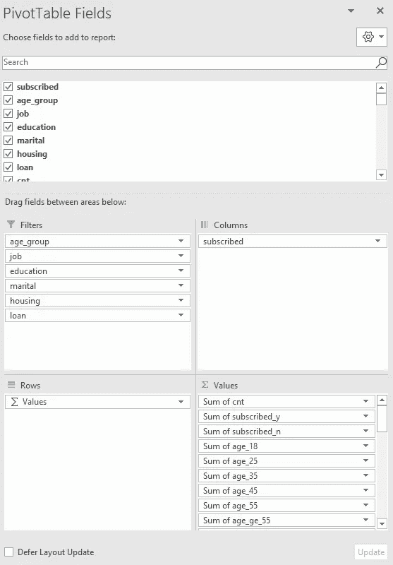
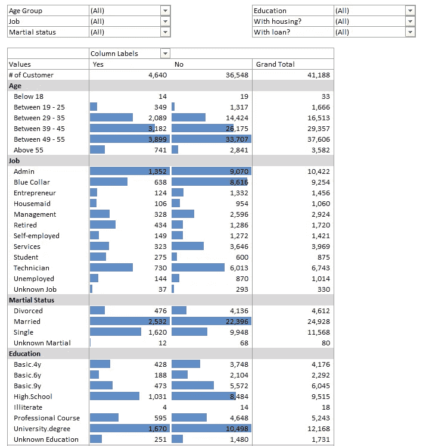

# 探索性数据分析的一个简单技巧

> 原文：<https://towardsdatascience.com/a-simple-trick-for-exploratory-data-analysis-35f2fa05764b?source=collection_archive---------27----------------------->

如果您很难理解您的数据，您可以尝试使用这些超级基础的数据分析工具，例如 python、SQL 和 excel 数据透视表。最终的结果是类似仪表板的表格，使您能够通过切片和切块来挖掘可操作的洞察力。



## 那么首先要做什么呢？当然，**获取数据。**

本文中使用的数据源是来自 **UCI 机器学习库的一个银行机构的直接营销活动(大约#41K 记录)。** 然后，用 pandas 把 CSV 文件读入 DataFrame。
~[https://archive.ics.uci.edu/ml/datasets/Bank+Marketing](https://archive.ics.uci.edu/ml/datasets/Bank+Marketing)

```
import pandas as pd
bank_cust_df = pd.read_csv('../dat/bank-additional-full.csv', sep = ',')
bank_cust_df.head(10)
```



First 10 rows of **bank_cust_df**

根据数据集描述，我们知道银行客户数据与基于电话的电话营销活动有关，并且与定期存款的*预订* *的结果有关。(出于演示目的，我将仅使用人口统计相关数据，并跳过下面展示中的数据清理步骤。)*

```
+---------------+--------------------------------------------+
| Features Name | Features Description                       |
+---------------+--------------------------------------------+
| age           | numeric                                    |
| job           | type of job (blue-collar, entrepreneur...) |
| marital       | marital status (married, singe...)         |
| education     | education (high school,university...)      |
| default       | has credit in default? (Y/N)               |
| housing       | has housing loan? (Y/N)                    |
| loan          | has personal loan? (Y/N)                   |
**| y             | has subscribed a term deposit?  (Y/N)      |**
+---------------+--------------------------------------------+
```

接下来，我们需要隔离必要的列，并了解数据的样子。

## **使用 SQL 将数据汇总成汇总格式**

```
# pandasql needed to run SQL with the pandas DataFrame
# [https://pypi.org/project/pandasql/](https://pypi.org/project/pandasql/)from pandasql import sqldf
pysqldf = lambda q: sqldf(q, globals())
```

聚合字段的基本思想是创建您想要浏览的字段的汇总表。例如，下面的代码将婚姻状况和教育与婚姻状况计数相加。

```
sql = """
select 
--==================
-- Category Features
--==================
job
,education
,count(*) as cnt
--=============================
-- Summarized Category Features
--=============================
,sum(case when marital = "divorced" then 1 else 0 end) as m_divorced
,sum(case when marital = "married" then 1 else 0 end) as m_married
,sum(case when marital = "single" then 1 else 0 end) as m_single
,sum(case when marital = "unknown" then 1 else 0 end) as m_unknown
from bank_cust_df
--===============================================
-- in this case, there are 2 columns to summarize
--===============================================
group by 1,2
;
"""
agg_df = pysqldf(sql)
agg_df.head(20)
```

然后，您将得到一个汇总表 **agg_df** ，如下所示，包含工作和教育的所有可能组合。通过每种组合，您还可以拥有不同婚姻状况的客户数量。



Example on aggregated table

下面的**全代码**生成整个汇总表:

```
sql = """
select 
y as subscribed
,case when age <= 18 then "Below 18"
      when age <= 25 then "19 - 25"
      when age <= 35 then "26 - 35"
      when age <= 45 then "36 - 45"
      when age <= 55 then "46 - 55"
      when age >  55 then "55 +" end as age_group
,job
,education
,marital
,housing
,loan,count(*) as cnt,sum(case when y = "yes" then 1 else 0 end) as subscribed_y
,sum(case when y = "no" then 1 else 0 end) as subscribed_n,sum(case when age <= 18 then 1 else 0 end) as age_18
,sum(case when age <= 25 then 1 else 0 end) as age_25
,sum(case when age <= 35 then 1 else 0 end) as age_35
,sum(case when age <= 45 then 1 else 0 end) as age_45
,sum(case when age <= 55 then 1 else 0 end) as age_55
,sum(case when age > 55 then 1 else 0 end) as age_ge_55,sum(case when job = "admin." then 1 else 0 end) as job_ad
,sum(case when job = "blue-collar" then 1 else 0 end) as job_blue
,sum(case when job = "entrepreneur" then 1 else 0 end) as job_entre
,sum(case when job = "housemaid" then 1 else 0 end) as job_house
,sum(case when job = "management" then 1 else 0 end) as job_mgt
,sum(case when job = "retired" then 1 else 0 end) as job_reti
,sum(case when job = "self-employed" then 1 else 0 end) as job_self
,sum(case when job = "services" then 1 else 0 end) as job_serv
,sum(case when job = "student" then 1 else 0 end) as job_std
,sum(case when job = "technician" then 1 else 0 end) as job_tech
,sum(case when job = "unemployed" then 1 else 0 end) as job_unem
,sum(case when job = "unknown" then 1 else 0 end) as job_un,sum(case when marital = "divorced" then 1 else 0 end) as m_divorced
,sum(case when marital = "married" then 1 else 0 end) as m_married
,sum(case when marital = "single" then 1 else 0 end) as m_single
,sum(case when marital = "unknown" then 1 else 0 end) as m_un,sum(case when education = "basic.4y" then 1 else 0 end) as edu_4y
,sum(case when education = "basic.6y" then 1 else 0 end) as edu_6y
,sum(case when education = "basic.9y" then 1 else 0 end) as edu_9y
,sum(case when education = "high.school" then 1 else 0 end) as edu_high
,sum(case when education = "illiterate" then 1 else 0 end) as edu_illi
,sum(case when education = "professional.course" then 1 else 0 end) as edu_pro
,sum(case when education = "university.degree" then 1 else 0 end) as edu_ud
,sum(case when education = "unknown" then 1 else 0 end) as edu_un,sum(case when housing = "yes" then 1 else 0 end) as housing_y
,sum(case when housing = "no" then 1 else 0 end) as housing_n
,sum(case when housing = "unknown" then 1 else 0 end) as housing_un,sum(case when loan = "yes" then 1 else 0 end) as loan_y
,sum(case when loan = "no" then 1 else 0 end) as loan_n
,sum(case when loan = "unknown" then 1 else 0 end) as loan_un
from bank_cust_df
group by 1,2,3,4,5,6,7
;
"""agg_df = pysqldf(sql)
agg_df.head(20)
```

结果聚集表具有#3，980 条记录，共 45 列(45 列中的 7 列是特征列；其他为汇总栏)。创建这样的聚合表的一个优点是防止敏感的客户数据泄露，因为所有数据都已经汇总。

## 通过创建简单的 excel 数据透视仪表板实现数据可视化

接下来，将聚合表导出到 CSV。不直接导出到 excel 文件的原因是为了防止记录超出 Excel 限制(根据版本不同，是#65，536 还是# 1，048，576)。

```
# Export the csv file to out folder
agg_df.to_csv('..\out\summ.csv',index=False)
```



Exported summ.csv open in excel

再创建一个名为 summary.xlsx 的 excel 文件，使用 excel 内置函数(Data > From Text/CSV)添加与 summ.csv 的数据连接。数据导入后，使用导入的数据作为数据源创建数据透视表。



import summ.csv



Load the data with comma as the delimiter



Using summ table as a data source

根据特性类型放置字段，
-特性列>过滤区
-汇总列>值区
-订阅的>列
-σ值>行



Pivot Table fields setting

最后，将该字段重命名为有意义的标题，并对其应用条件格式，这样就完成了一个带有特色过滤器的清晰的仪表板，并且可以更容易地显示客户数据的分布。



Dashboard-like table

## 浏览数据的最简单方法

现在，您可以创建一个简单的仪表板表，以便更好地了解您的数据，而无需任何花哨的分析工具。

最后，如果您拥有的数据少于 100 万行，我建议您在您的任务中充分利用上面的探索方法。接下来你要做的只是简单地切片和切块，并搜索任何特殊的模式和见解。