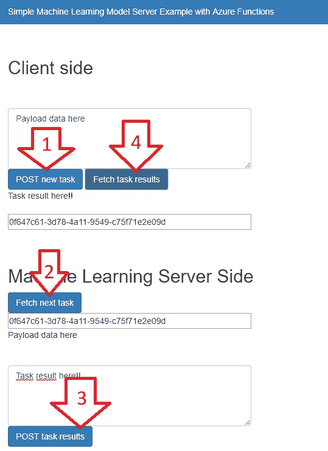

# 部署任何机器学习模型的简单方法

> 原文：<https://towardsdatascience.com/a-simple-way-to-deploy-any-machine-learning-model-106d463e9a4b?source=collection_archive---------4----------------------->

## 如何使用 Azure 函数来公开一个 REST API 端点，以服务可以在另一个服务器中计算的 ML 模型

Is there an easy way to deploy a powerful image segmentation model to a mobile app? The answer is yes.

当数据科学家开发机器学习模型时，无论是使用 Scikit-Learn、深度学习框架(TensorFlow、Keras、PyTorch)还是自定义代码(convex programming、OpenCL、CUDA)，最终目标都是使其在生产中可用。

然而，很多时候我们只是想要一个简单的方法来调用 REST API 并使用当前的分类器获得预测。例如，我们可能只想展示模型如何与用户界面集成，而不用担心设置环境、扩展到生产、平衡负载或任何其他问题。

这篇文章将展示我发现的最简单的方法:

*   建立机器学习模型；
*   公开一个端点(REST API)，以便网站/应用程序可以向*http://myendpoint.com/predict*发布消息并获得结果；
*   所有源代码和安装说明可在 https://github.com/douglas125/AzureMLDeploy[获得](https://github.com/douglas125/AzureMLDeploy)

我们不用担心导出模型、创建 Docker 图像、直接在浏览器中运行、安装软件包或任何类似的事情——有大量的资源可以处理这些问题(参见参考资料)。在本文中，机器学习服务器(MLServer)可以是本地计算机或云中的虚拟机。它将检索需要处理的数据，并将结果发送回来。

此外，无服务器架构是最便宜和最容易实现的架构之一:本质上，每个存储和执行时间都是收费的——如果我们不需要永远存储输入和输出，成本应该会非常低。

# 它是如何工作的？

Azure Function 应用程序充当中间人，接收并存储来自客户端的请求和来自 MLServer 的回答。当客户端返回来检索结果时，函数应用程序会将结果交付给客户端。

这看起来非常简单——确实如此。正是我们在这篇文章中寻找的。

## 示例 1:简单的 Ajax 页面

按照[存储库](https://github.com/douglas125/AzureMLDeploy)中的安装说明，可以构建一个简单的 Ajax 页面来总结客户端和 MLServer 端的工作流。注意，虽然 HTML 页面非常简单，但它仍然演示了如何从客户端(发送作业和检索结果)和 MLServer(获取作业和发送结果)向端点发送数据。

Simple Ajax page to test Azure Function App. Sequence: 1 — client posts task, receives task_id; 2 — MLServer fetches task and processes it; 3 — MLServer sends results to Function App; 4 — Client retrieves results.

## 示例 2:将 DeepLabV3+作为服务运行

C#是为 Windows 构建用户界面的好工具。这个例子展示了如何使用 python(作为 MLServer)进行推理。同样，所有代码在这个库中都是可用的[。](https://github.com/douglas125/AzureMLDeploy)

下面的图像序列演示了客户端和 MLServer 端发生的情况。请注意，MLServer 可以是运行 Jupyter 笔记本中 Keras 模型的任何计算机或虚拟机。

Client C# application loads image, resizes it to 512x512 (DeepLabv3+ input size) and sends it to Azure Function App Server.

A local computer or a virtual machine could be used to make predictions. In this case, we used Google Colab as the MLServer

Client C# application receives predictions (a .png file with the masks) and displays results to the user in a friendly interface.

# 保持简单

像 Azure Functions 或 AWS Lambda 这样的无服务器架构是实现云计算的绝佳方式:它们处理扩展服务的问题，它们通常易于使用，并且在许多情况下，它们也是最便宜的选择，因为它们不需要专用服务器，用户按使用付费(消费计划)。选择 Azure 函数完全是因为我对 C#的熟悉。

我们将构建一个简单的无服务器架构，接收用户请求，允许远程机器读取并预测存储在云中的数据，并让用户接收最终结果。请注意，功能应用程序可以配置为要求身份验证，保存发出请求的用户(稍后向他们收费)和许多其他功能-这只是一个入门代码，应该用作简单的基础。

工作流程如下:

*   用户通过向端点/预测发布消息来发出预测请求，该消息带有其有效载荷——文本、图像、音频或任何需要分析的数据；
*   服务器接收用户请求，保存有效载荷并生成唯一的 task_id，返回给用户；
*   MLServer(机器学习服务器)查询服务器检索下一个作业；
*   服务器向 MLServer 发送下一个作业的 task_id 和有效载荷；
*   MLServer 处理有效负载并将 task_id 的结果发送到服务器；
*   服务器接收并存储 task_id 结果；
*   用户使用 task_id 查询服务器并检索结果。

Client — Server — MLServer architecture

# 设置服务

我们已经讨论了客户端和 MLServer 是做什么的。现在是时候深入 Azure Function 应用服务器了。

服务器需要处理来自客户机和 MLServer 的请求。我们需要四个端点:

*   预测—接收有效负载并创建 task _ id
*   getresult—接收 task_id 并返回该任务的结果(如果可用)；
*   getnexttask —向 MLServer 发送 task_id 和有效负载；
*   puttaskresult —接收 task_id 并存储结果。

我们将使用 Azure Blob 存储来保存有效负载和结果。我们需要两个文件夹:收件箱(存储未完成任务的地方)和发件箱(存储结果)。如果我们想要使用多个服务器并行处理数据，我们可能会想要跟踪正在处理的任务(以便相同的任务不会被执行两次)。然而，这超出了本文的范围，并且会给我们的目标增加额外的、不必要的复杂性。

在函数 puttaskresult 中，我们将从 inbox 文件夹中删除有效载荷，并将结果保存在 outbox 文件夹中。如果我们愿意，我们可以在删除它之前将有效负载复制到一个“已处理”的文件夹中，但是这里我们将保持简单。

对于所有的实现细节，感兴趣的读者应该参考[这个库](https://github.com/douglas125/AzureMLDeploy)。它有功能应用程序的所有源代码以及安装说明。

# 结论

本文演示了一种非常简单的方法，使用 Azure 函数存储和服务请求和预测结果，将机器学习模型部署到客户端应用程序。虽然这种方法不如 Tensorflow Serving 强大或不如 tensorflow.js 通用，但它具有重要的优势；

*   部署起来非常简单；
*   它允许程序员服务于任何机器学习模型——不仅仅是神经网络，以及任何预处理和后处理步骤；
*   不需要转换或 dockerize 任何东西；
*   不需要分配专用的 VM——推理可以在本地运行；
*   由于推理可以在本地运行，功能应用程序按请求/存储收费，因此这是一个演示概念的廉价选项。

当然也有缺点:

*   对于需要接近实时运行的模型(例如，有执行时间限制的模型)，这不是最好的选择；
*   不会像 tf.js 一样在客户端运行；
*   MLServers 的负载平衡必须手动完成。

请注意，在原型/开发的早期阶段，这些缺点通常不是开发人员所担心的——他们可以简单地让一台 PC 开着(或者甚至是 Google Colab ),让用户界面团队可以使用 REST API。

这是我发现的将当前状态的机器学习算法快速部署到客户端应用程序的最简单方法。

# 参考

**Tensorflow.js** 【https://js.tensorflow.org/ 

使用 Azure 机器学习服务部署模型。[https://docs . Microsoft . com/en-us/azure/machine-learning/service/how-to-deploy-and-where](https://docs.microsoft.com/en-us/azure/machine-learning/service/how-to-deploy-and-where)

**在生产中部署机器/深度学习模型的指南**。[https://medium . com/@ maheshkkumar/a-guide-to-deploying-machine-deep-learning-model-s-in-production-e 497 FD 4b 734 a](https://medium.com/@maheshkkumar/a-guide-to-deploying-machine-deep-learning-model-s-in-production-e497fd4b734a)

**如何使用 Tensorflow Serving** 轻松将机器学习模型投入生产。[https://medium . com/coin monks/how-to-easy-put-machine-learning-models-to-production-using-tensor flow-serving-91998 fa 4 B4 e 1](https://medium.com/coinmonks/how-to-easily-put-machine-learning-models-into-production-using-tensorflow-serving-91998fa4b4e1)

**通过使用 AWS Lambda** 服务机器学习模型，我们学到了什么。[https://medium . freecodecamp . org/what-we-learn-by-serving-machine-learning-models-using-AWS-lambda-c70b 303404 a 1](https://medium.freecodecamp.org/what-we-learned-by-serving-machine-learning-models-using-aws-lambda-c70b303404a1)

**图像分类——评分样本**。[https://github . com/dot net/machine learning-samples/tree/master/samples/cs harp/getting-started/deep learning _ image classification _ tensor flow](https://github.com/dotnet/machinelearning-samples/tree/master/samples/csharp/getting-started/DeepLearning_ImageClassification_TensorFlow)

**ML.NET——一个开源、跨平台的机器学习框架**。[https://dot net . Microsoft . com/apps/machine learning-ai/ml-dot net](https://dotnet.microsoft.com/apps/machinelearning-ai/ml-dotnet)

**使用 Python 训练和部署机器学习模型的初学者指南**。[https://medium . freecodecamp . org/a-初学者指南-训练-部署-机器学习-模型-使用-python-48a313502e5a](https://medium.freecodecamp.org/a-beginners-guide-to-training-and-deploying-machine-learning-models-using-python-48a313502e5a)

**部署机器学习模型作为 REST API** 。[https://towards data science . com/deploying-a-machine-learning-model-as-a-rest-API-4a 03 b 865 c 166](/deploying-a-machine-learning-model-as-a-rest-api-4a03b865c166)

**部署机器学习模型很难，但不一定非得是**。[https://www . anaconda . com/blog/developer-blog/deploying-machine-learning-models-is-hard-but-it-dont-have-to-be/](https://www.anaconda.com/blog/developer-blog/deploying-machine-learning-models-is-hard-but-it-doesnt-have-to-be/)

**我们如何使用 FLASK 和 DOCKER 部署 SCIKIT-LEARN 模型**。[https://blog . solutotlv . com/deployed-sci kit-learn-model-flask-docker/？UTM _ medium = How-do-I-deploy-Machine-Learning-Models-as-an-API&UTM _ source = quora](https://blog.solutotlv.com/deployed-scikit-learn-model-flask-docker/?utm_medium=How-do-I-deploy-Machine-Learning-Models-as-an-API&utm_source=quora)

**档案:波利贾·科纳·Poznań.jpg**。[https://commons . wikimedia . org/wiki/File:Policja _ konna _ Pozna % C5 % 84 . jpg](https://commons.wikimedia.org/wiki/File:Policja_konna_Pozna%C5%84.jpg)

**作者 LukaszKatlewa——自己的作品，CC BY-SA 4.0** ，[https://commons.wikimedia.org/w/index.php?curid=49248622](https://commons.wikimedia.org/w/index.php?curid=49248622)

**Keras 实现 Deeplabv3+** 。[https://github.com/bonlime/keras-deeplab-v3-plus](https://github.com/bonlime/keras-deeplab-v3-plus)