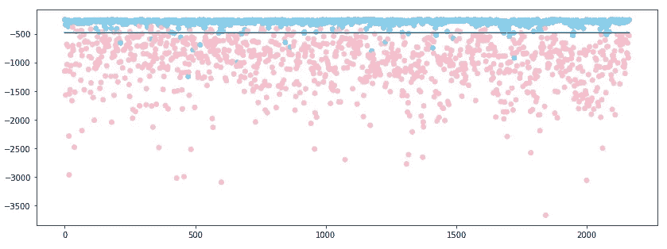

# 检测异常的简单方法

> 原文：<https://towardsdatascience.com/a-simple-way-to-detect-anomaly-3d5a48c0dae0?source=collection_archive---------17----------------------->

Photo by [Markus Spiske](https://unsplash.com/@markusspiske?utm_source=unsplash&utm_medium=referral&utm_content=creditCopyText) on [Unsplash](https://unsplash.com/search/photos/defect?utm_source=unsplash&utm_medium=referral&utm_content=creditCopyText)

当一个类中的观察值比另一个类中的观察值多得多时，很难训练一个普通的 CNN 分类器。CNN 分类器可以认为所有的观察值都来自主类，以实现高精度。

解决这个问题的一种方法是使用过采样或下采样来平衡数据。此外，调整类权重以强制分类器处理稀有类中的数据也是一个好主意。

然而，当数据极度不平衡时，使用上述方法有时可能导致模型过度拟合。因此，我们将研究另一种方法，称为异常检测，来处理这种情况。

我们将假设主类中的观察值为正常数据，并仅使用这些数据来训练我们的模型。然后，我们能够预测一个新的观察是否正常。您可能会问，当模型没有根据这些数据进行训练时，如何检测异常数据。下面是一个简单的例子来说明异常检测是如何工作的。

—实施—

我们可以使用 Keras 和 Scikit Learn 在几行代码内实现异常检测。

首先，导入库来构建模型。这四个库正是我们所需要的。

其次，我们可以使用预先训练的模型作为特征表示，将图像转换到更好的特征空间。

我们使用 Keras 得到一个在 ImageNet 上预训练的 VGG16 模型，并得到所选层的输出。然后，我们将输出通过一个全局平均池层来降低维度。

为了实现一类分类器，我们使用来自 Scikit Learn 的聚类模型，高斯混合模型(GMM)。所以，建造一个只有一个组件的 GMM。

figure 2\. clustering examples from Scikit Learn documentation.

如图 2 所示。越靠近高斯分布中心的数据越可能是正态的。通过选择分布的范围，我们能够确定观察值是否正常。

是时候导入数据集来看看模型是如何工作的了。我们使用来自 Keras 的 MNIST 数据集。我们假设“1”为正常数据，“7”为异常数据。因此，我们只使用“1”作为训练数据，同时使用“1”和“7”作为测试数据。

reshape_x: according to Keras’s VGG pre-trained model, the minimum size of images is 30 * 30, so we have to resize our images and transform them into 3-channel images.

只有两行来训练我们的模型。首先，使用 VGG 模型从训练数据中提取特征。然后，使用结果作为 GMM 的输入数据。

—结果—

使用 GMM 的 score_samples 函数，我们可以很容易地计算数据的可能性。假设阈值是训练数据的平均可能性加上 3 倍的标准偏差，我们可以预测我们的测试数据。

我们使用 VGG 模型从测试数据中提取特征。然后，我们使用经过训练的 GMM 来计算结果的可能性。最后，如果观测值的可能性小于阈值，我们就可以检测到异常。

the output of svdd_part6.py

让我们来看看我们的结果吧！我们画散点图，x 轴是数据的指数，y 轴是分数。我们将“1”标为蓝点，将“7”标为粉红点，并将阈值标为黑线。我们可以看到，大部分的点都可以用阈值来分隔。我们就是这样检测异常数据的。

visualization of output, the score is negative since the output of score_samples is log likelihood.

我们还可以检查失败案例。下图显示，当“1”更复杂且“7”过细时，模型更容易出错。

These are predictions of ‘1’. the first row is incorrect predictions. The second row is correct predictions.

These are predictions of ‘7’. the first row is incorrect predictions. The second row is correct predictions.

为了获得更好的准确性，我们可以用自动编码器代替预先训练的模型，以获得更好的特征表示。虽然在 ImageNet 上预先训练的模型可以从图像中提取很好的特征，但 MNIST 的图像与 ImageNet 中的图像非常不同。如果我们使用与 ImageNet 大不相同的数据集，可能会得到更差的结果。此外，有很多方法可以实现异常检测，请随意尝试另一种方法。

*—参考—*

[1] ICML 2018 论文[深一类分类](http://proceedings.mlr.press/v80/ruff18a/ruff18a.pdf)

[3] [Scikit 学习文档](https://scikit-learn.org/stable/modules/generated/sklearn.mixture.GaussianMixture.html)