# 使用 Keras 简化影像分类的单一功能

> 原文：<https://towardsdatascience.com/a-single-function-to-streamline-image-classification-with-keras-bd04f5cfe6df?source=collection_archive---------5----------------------->

## 我们一步一步地展示了如何构建一个单一的、通用的效用函数，从目录中自动提取图像，并训练一个卷积神经网络模型。

# 介绍

已经有很多关于深度学习框架的文章，如 [Keras](/introduction-to-deep-learning-with-keras-17c09e4f0eb2) 和 [PyTorch](https://www.analyticsvidhya.com/blog/2018/02/pytorch-tutorial/) ，以及[如何强大而简单地使用](/keras-vs-pytorch-for-deep-learning-a013cb63870d)来构建和玩精彩的深度学习模型。

已经有很多关于模型架构和优化器的教程/文章——卷积的概念[、最大池、优化器](http://papers.nips.cc/paper/4824-imagenet-classification-with-deep-convolutional-neural-networks.pdf),如 [ADAM](https://machinelearningmastery.com/adam-optimization-algorithm-for-deep-learning/) 或 [RMSprop](/a-look-at-gradient-descent-and-rmsprop-optimizers-f77d483ef08b) 。

> 如果您想要的只是一个函数，从磁盘上的指定目录中自动提取图像，并返回给您一个完全训练好的神经网络模型，准备用于预测，会怎么样？

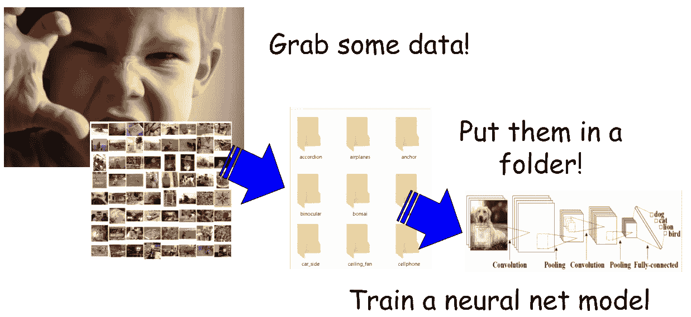

因此，在本文中，**我们将重点讨论如何使用 Keras (TensorFlow) API 中的一些实用方法，通过适当的数据预处理来简化此类模型的训练**(专门用于分类任务)。

基本上，我们想，

*   获取一些数据
*   将它们放在按类别排列的目录/文件夹中
*   用最少代码/fuss 训练神经网络模型

> 最后，我们的目标是编写一个单独的实用函数，它可以获取存储训练图像的文件夹的名称，并返回一个完全训练好的 CNN 模型。

# 数据集

在这个演示中，我们使用了一个由 4000 多幅花的图像组成的数据集。数据集可以从 Kaggle 网站下载。

数据收集基于 Flickr、谷歌图片、Yandex 图片等数据。这些图片被分为五类，

*   黛西，
*   郁金香，
*   罗斯，
*   向日葵，
*   蒲公英。

每个班级大约有 800 张照片。照片分辨率不高，320 x 240 像素左右。照片不是缩小到单一尺寸，它们有不同的比例。

然而，它们被**整齐地组织在五个目录中，并以相应的类标签**命名。我们可以利用这种组织并应用 Keras 方法来简化卷积网络的训练。

# 代码回购

完整的 Jupyter 笔记本在我的 Github repo 这里是 [**。随意分叉延伸，喜欢就给它一颗星。**](https://github.com/tirthajyoti/Deep-learning-with-Python/blob/master/Notebooks/Keras_flow_from_directory.ipynb)

我们将在本文中使用一些代码来展示重要的部分。

# 该不该用 GPU？

建议在 GPU 上运行该脚本(使用`TensorFlow-GPU`)，因为我们将构建一个具有五个卷积层的 CNN，因此，如果您不使用某种 GPU，使用数千幅图像的训练过程可能会计算量大且速度慢。

对于 Flowers 数据集，在我配有英伟达 GTX 1060 Ti GPU (6 GB 视频内存)、Core i-7 8770 CPU 和 16 GB DDR4 内存的普通笔记本电脑上，单个纪元需要大约 1 分钟。

或者，你可以利用 [Google Colab](https://colab.research.google.com/notebooks/basic_features_overview.ipynb) ，但是[加载和预处理数据集](https://stackoverflow.com/questions/46986398/import-data-into-google-colaboratory)可能有点麻烦。

# 数据预处理

## 内务处理和显示图像

请注意，笔记本代码的数据预处理部分的第一部分对于神经网络的训练并不重要。这组代码只是为了举例说明，并显示一些训练图像作为示例。

在我的笔记本电脑上，数据存储在比我的笔记本文件夹高一级的文件夹中。这是这个组织，

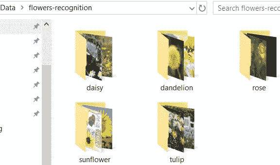

使用一些基本的 Python 代码，我们可以遍历子目录，对图像进行计数，并展示它们的示例。

一些雏菊的照片，

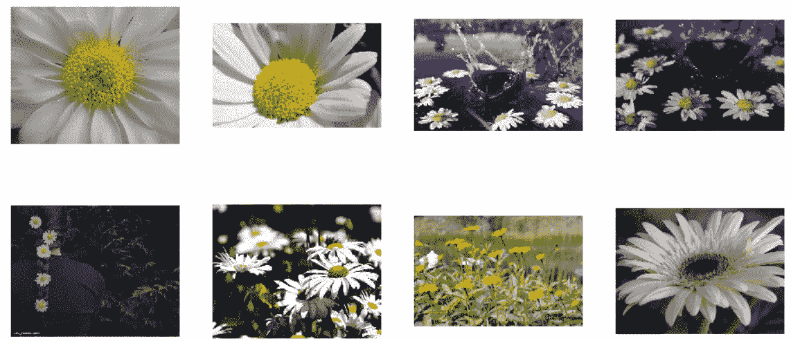

还有一些美丽的玫瑰，


请注意，图片的大小和长宽比各不相同。

## 构建`ImageDataGenerator`对象

这是真正的奇迹发生的地方。

`ImageDataGenerator`类的[官方描述](https://keras.io/preprocessing/image/)称“*通过实时数据增强生成批量张量图像数据。数据将(分批)循环。*

基本上，它可以用于**通过大量内置预处理(如缩放、移位、旋转、噪声、白化等)来增强图像数据**。现在，我们只是使用`rescale`属性在 0 和 1 之间缩放图像张量值。

这里有一篇关于这方面的有用文章。

[](https://medium.com/@arindambaidya168/https-medium-com-arindambaidya168-using-keras-imagedatagenerator-b94a87cdefad) [## 使用 Keras 图像数据生成器的图像增强

### 结合 Keras 的 ImageDataGenerator 实现我们的自定义生成器的博客，以执行各种…

medium.com](https://medium.com/@arindambaidya168/https-medium-com-arindambaidya168-using-keras-imagedatagenerator-b94a87cdefad) 

但是这个类在当前演示中的真正用途是超级有用的方法`flow_from_directory`，它可以从指定的目录中一个接一个地**提取图像文件。**

注意，**这个目录必须是顶层目录，在这里各个类的所有子目录都可以单独存储**。`flow_from_directory`方法自动扫描所有子目录，并获取图像及其相应的标签。

我们可以指定类名(就像我们在这里用`classes`参数做的那样)，但这是可选的。然而，我们稍后会看到，这对于从大量数据中进行**选择性训练是如何有用的。**

另一个有用的参数是`target_size`，它让我们将源图像的大小调整到统一的 200 x 200，不管图像的原始大小是多少。这是一些很酷的图像处理，带有一个简单的函数参数。

我们还指定了批量大小。如果不指定`batch_size`，默认情况下，它将被设置为 32。

我们选择`class_mode`作为`categorical`，因为我们在这里做多类分类。

运行这段代码时，Keras 函数扫描顶层目录，找到所有图像文件，并自动用适当的类(基于它们所在的子目录)标记它们。

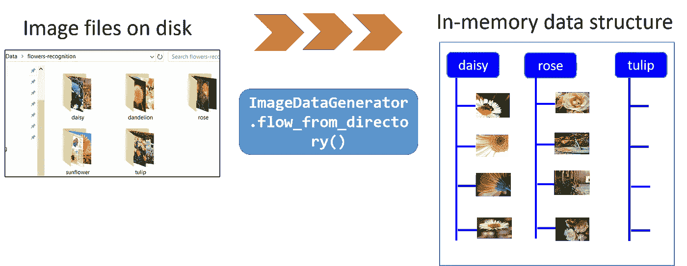

是不是很酷？

但是等等，还有更多。这是一个 [**Python 生成器对象**](https://realpython.com/introduction-to-python-generators/) ，这意味着它将用于在训练过程中一个接一个地 生成数据。这大大减少了处理非常大的数据集的问题，因为数据集的内容不能一次放入内存。看看这篇文章可以更好地理解它，

[](/pythons-list-generators-what-when-how-and-why-2a560abd3879) [## Python 的生成器表达式:将大型数据集放入内存

### 生成器表达式是 Python 中一个有趣的特性，它允许我们创建延迟生成的可迭代对象…

towardsdatascience.com](/pythons-list-generators-what-when-how-and-why-2a560abd3879) 

# 建立 conv 网络模型

正如所承诺的，我们不会花时间或精力去分析 CNN 模型背后的代码。简而言之，它由 5 个卷积层/最大池层和 128 个神经元组成，最后是 5 个神经元输出层，具有用于多类分类的 softmax 激活。

我们使用 RMSprop，初始学习率为 0.001。

[这里又是代码](https://github.com/tirthajyoti/Deep-learning-with-Python/blob/master/Notebooks/Keras_flow_from_directory.ipynb)。请随意试验网络架构和优化器。

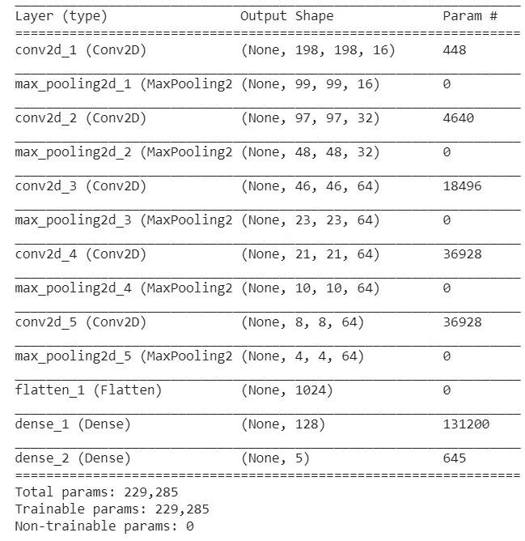

# 使用' *fit_generator'* 方法进行训练

我们之前讨论过`train_generator`对象用`flow_from_directory`方法和它的参数做了什么很酷的事情。

现在，我们在上面定义的 CNN 模型的`fit_generator`方法中使用这个对象。

注意`fit_generator`的`steps_per_epoch`参数。由于`train_generator`是一个通用的 [Python 生成器](https://realpython.com/introduction-to-python-generators/)，它从不停止，因此`fit_generator`不知道一个特定的时期在哪里结束，下一个时期在哪里开始。我们必须让它知道一个时期内的步骤。在大多数情况下，这是总训练样本的长度除以批量大小。

在上一节中，我们发现总样本量为`total_sample`。因此，在这种特殊情况下，`steps_per_epoch`被设置为`int(total_sample/batch_size)`，即`34`。因此，您将在下面的训练日志中看到每个时期 34 步。

部分培训日志…

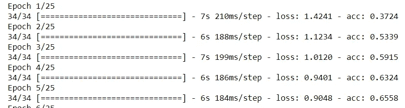

我们可以用通常的绘图代码来检查准确性/损失。

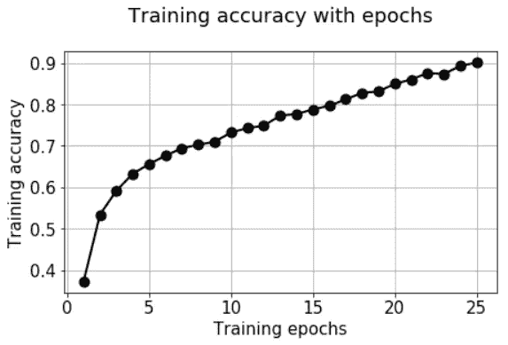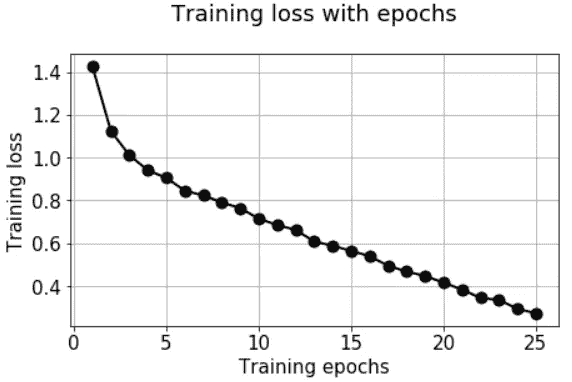

> 好的。到目前为止，我们完成了什么？

我们已经能够利用 Keras `ImageDataGenerator`和`fit_generator`方法从单个目录中自动提取图像，给它们加标签，调整它们的大小和比例，并一个接一个地(成批地)流动它们来训练神经网络。

> 我们能把所有这些都封装在一个函数中吗？

# 将所有这些封装在一个函数中？

制作有用的软件/计算系统的中心目标之一是 [**抽象**](https://en.wikipedia.org/wiki/Abstraction_(computer_science)) **，即隐藏内部计算和数据操作的血淋淋的细节，并向用户呈现简单直观的工作界面/API**。

作为实现这一目标的一种实践，我们可以尝试将上述过程封装在一个函数中。想法是这样的，

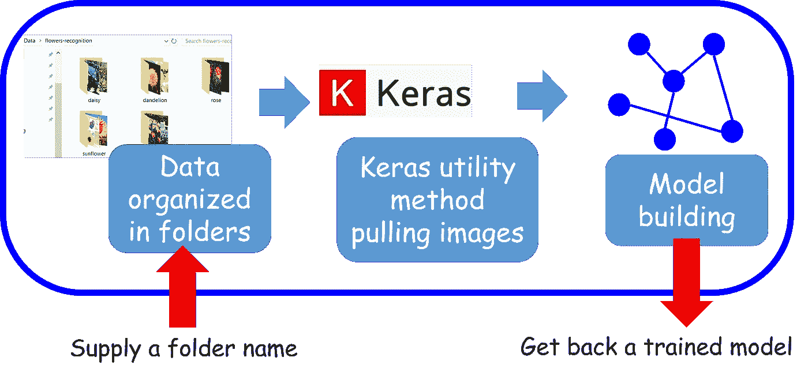

## 目标是用有用的参数实现灵活的 API

当你在设计一个高级 API 时，**为什么不去做比这个特定的 flowers 数据集演示所需要的更一般化的东西呢**？考虑到这一点，我们可以考虑为这个函数提供额外的参数，使它适用于其他图像分类情况(我们很快就会看到一个例子)。

具体来说，我们在函数中提供了以下参数，

*   `train_directory`:训练图像存储在单独文件夹中的目录。这些文件夹应该按照类来命名。
*   `target_size`:训练图像的目标尺寸。一个元组例如(200，200)
*   `classes`:一个 Python 列表，包含我们希望进行训练的类。这迫使生成器从`train_directory`中选择特定的文件，而不是查看所有的数据。
*   `batch_size`:培训批量
*   `num_epochs`:训练的次数
*   `num_classes`:要考虑的输出类的数量
*   `verbose`:训练的详细程度，传递给`fit_generator`方法

当然，我们可以提供与整个模型架构或优化器设置相对应的附加参数。本文并不关注这些问题，因此，我们保持它的简洁。

同样，完整的代码在 Github repo 中。下面，我们只展示了 docstring 部分，以强调使它成为一个灵活的 API，

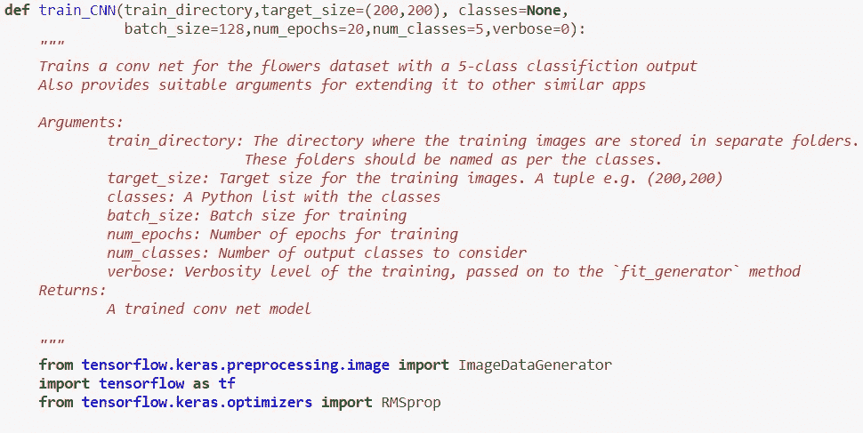

## 测试我们的效用函数

现在，我们通过简单地提供一个文件夹/目录名来测试我们的`train_CNN`函数，并获得一个可用于预测的训练好的模型！

让我们还假设我们现在只想为“雏菊”、“玫瑰”和“郁金香”训练，而忽略其他两朵花的数据。我们简单地将一个列表传递给`classes`参数。在这种情况下，不要忘记将`num_classes`参数设置为 3。您会注意到，当训练样本的数量少于上述情况时，每个时期的步数会自动减少到 20。

另外，请注意，在上面的函数中，`verbose`默认设置为 0，因此，如果您想要按时段监控训练进度，您需要明确指定`verbose=1`！

基本上，我们现在能够用 2 行代码得到一个完全训练好的 CNN 模型！

# 该函数对另一个数据集有用吗？

这是对这种功能效用的严峻考验。

> 我们能不能不做太多修改就把它应用到另一个数据集？

## 加州理工学院-101

Caltech-101 是一个丰富且易于管理的影像分类数据集。我说的*可管理的*是指，没有 ImageNet 数据库那么大，它需要大规模的硬件基础设施来训练，因此超出了在笔记本电脑上快速测试酷想法的范围，但足够多样，可以练习和学习卷积神经网络的技巧和交易。

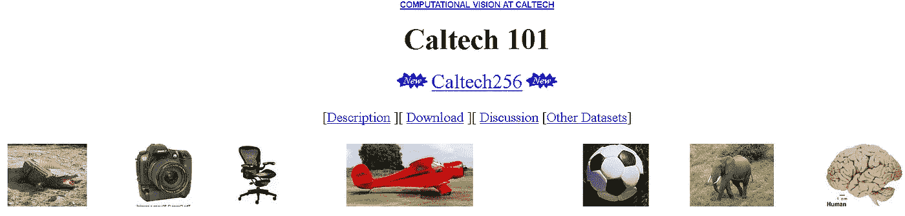

加州理工学院-101 是属于 101 个类别的不同类型的对象的图像数据集。每个类别大约有 40 到 800 张图片。大多数类别大约有 50 张图片。每个图像的大小大约为 300 x 200 像素。

这个数据集是 2003 年加州理工学院的费·李非教授和她的同事(马尔科·安德烈托和马克·奥雷利奥·兰扎托)建立的，当时她还是那里的一名研究生。因此，我们可以推测，加州理工学院-101 是她研究 ImageNet 的直接先驱。

## 用两行代码训练 Caltech-101

我们下载了数据集，并将内容解压缩到与之前相同的数据文件夹中。该目录如下所示，

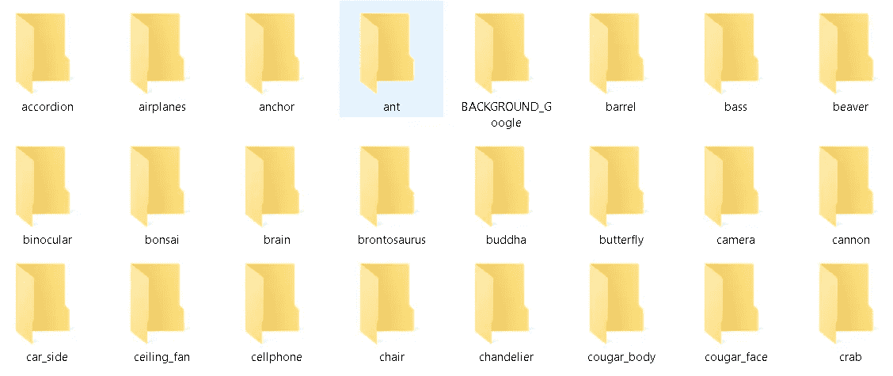

因此，我们得到了我们想要的东西——一个顶级目录，其中包含包含训练图像的子目录。

然后，和之前一样的两行，

**我们所做的就是将该目录的地址传递给函数，并选择我们想要为**训练模型的图像类别。假设我们要训练模型在 ***【杯子】*** 和 ***【螃蟹】*** 之间进行分类。我们可以像以前一样将他们的名字作为列表传递给`classes`参数。

此外，请注意，我们可能必须显著减少该数据集的`batch_size`，因为与 Flowers 数据集相比，训练图像的总数将会低得多，并且如果`batch_size`高于总样本，那么我们将使`steps_per_epoch`等于 0，这将在训练期间产生错误。

瞧啊。该函数找到相关图像(总共 130 个)并训练模型，每批 4 个，即每个时期 33 步。

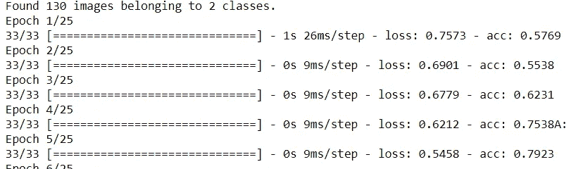

## 测试我们的模型

因此，我们看到了将训练图像的目录地址传递给函数并使用我们选择的类训练 CNN 模型是多么容易。

**模型好吗？**用网上下载的随机图片测试一下就知道了。

请记住，加州理工学院-101 数据集是由费李非和他的同事早在 2003 年创建的。因此，互联网上任何较新的图像都不太可能出现在数据集中。

我们随机下载了以下“螃蟹”和“杯子”的图片。

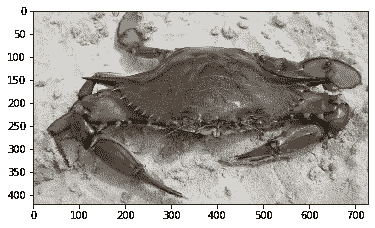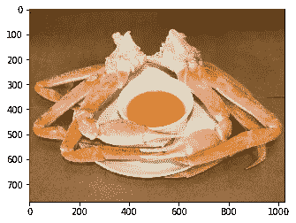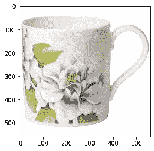

在一些基本的图像处理(调整大小和尺寸扩展以匹配模型)之后，我们得到了下面的结果，

```
model_caltech101.predict(img_crab)>> array([[1., 0.]], dtype=float32)
```

该模型正确预测了螃蟹测试图像的类别。

```
model_caltech101.predict(img_cup)>> array([[0., 1.]], dtype=float32)
```


该模型正确地预测了杯子测试图像的类别。

但是这个呢？

```
model_caltech101.predict(img_crab_cup)>> array([[0., 1.]], dtype=float32)
```

因此，该模型将测试图像预测为一个杯子。几乎是公平的，不是吗？

# 验证集和其他扩展

到目前为止，在`fit_generator`中我们只有一个`train_generator`对象用于训练。但是验证集呢？它遵循与`train_generator`完全相同的概念。您可以从您的训练图像中随机分割一个验证集，并将它们放在一个单独的目录中(与训练目录相同的子目录结构)，并且您应该能够将它传递给`fit_generator`函数。

甚至还有一个用于`ImageDataGenerator`类的`flow_from_dataframe`方法，在这里您可以传递包含在熊猫数据帧中的图像文件的名称，然后训练可以继续进行。

请随意试验这些扩展。

# 摘要

在本文中，我们回顾了 Keras 的几个实用方法，它们可以帮助我们构建一个紧凑的实用函数，以便为图像分类任务有效地训练 CNN 模型。如果我们可以在一个公共目录下的子目录中组织训练图像，那么这个函数可能允许我们只使用几行代码来训练模型。

这很有意义，因为使用这些内置的类/方法和我们的实用函数，我们可以将代码/数据流完全保留在 Keras 中，并以紧凑的方式训练 CNN 模型，而不是使用其他库(如 PIL 或 Scikit-image)单独抓取和预处理图像。

如果你有任何问题或想法要分享，请联系作者[**tirthajyoti【AT】Gmail . com**](mailto:tirthajyoti@gmail.com)。另外，你可以查看作者的 [**GitHub**](https://github.com/tirthajyoti?tab=repositories) **资源库**中其他有趣的 Python、R 和机器学习资源中的代码片段。如果你像我一样对机器学习/数据科学充满热情，请随时[在 LinkedIn 上添加我](https://www.linkedin.com/in/tirthajyoti-sarkar-2127aa7/)或[在 Twitter 上关注我。](https://twitter.com/tirthajyotiS)

[](https://www.linkedin.com/in/tirthajyoti-sarkar-2127aa7/) [## Tirthajyoti Sarkar - Sr .首席工程师-半导体、人工智能、机器学习- ON…

### 通过写作使数据科学/ML 概念易于理解:https://medium.com/@tirthajyoti 开源和有趣…

www.linkedin.com](https://www.linkedin.com/in/tirthajyoti-sarkar-2127aa7/)