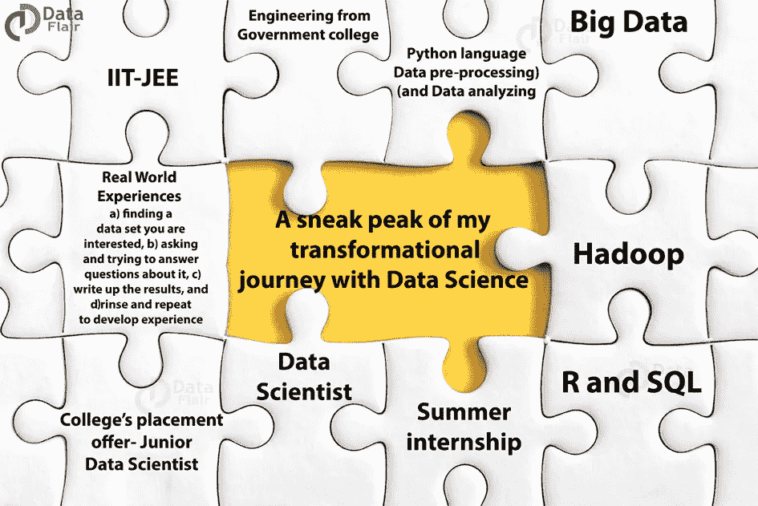
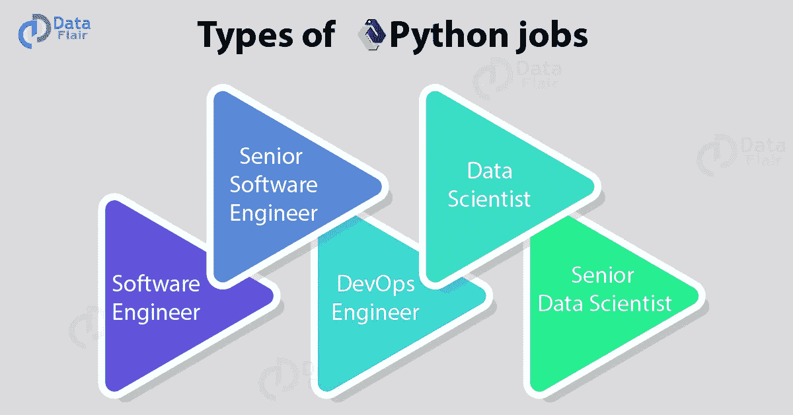

# 我的数据科学转型之旅中的一个亮点

> 原文：<https://towardsdatascience.com/a-sneak-peak-of-my-transformational-journey-with-data-science-9254d1654314?source=collection_archive---------25----------------------->

从童年开始，我就被视为铺设了一条有远见的道路，这条道路可以被兄弟姐妹追随，并得到长辈的赞赏。我的故事不是很英雄或者激励人心。只有我和“我的简单故事”。

在初中和高中时期，我是一个聪明勤奋的孩子。后来，我甚至准备了所有的入学考试，任何科学/数学专业的学生都会准备的。是的，我说的是 IIT-JEE！我对自己的目标很高(现在也是),但当时事情并没有很好地解决。我进入了一所颇有名气的政府工程学院。像其他学生一样，我不确定自己未来想做什么，所以工程是我的“首选”领域，也是一个安全的选择。它让我探索不同的领域。

但还是那句话，你必须有始有终。我对自己有不同的计划，但我必须为自己找到一个位置。这让我选择了 [**Python 语言**](https://data-flair.training/blogs/python-tutorials-home/) ，也让我从整体上更接近数据科学的****概念。我脑子里有许多问题。我会比同龄人挣得少吗？我会有一个薪水不断上涨的快速职业生涯吗？还有什么不可以！但是，数据科学成了我的救星。就像一个真正的救世主，它帮助我走出混乱。****

********

****我选择 **数据科学** 的 [**原因不是出于直觉，而是因为数据的大规模指数增长。数据是推动行业发展的燃料。
***“宁为玉碎，不为瓦全。”***
我参加了 2-3 个月的线下培训，培训内容是**](https://data-flair.training/blogs/why-learn-data-science/) **[**Python**](https://data-flair.training/blogs/python-tutorial/) 和数据科学。我在技术和非技术方面都学习过，但是我更喜欢非技术方面。它包括商业意识、沟通技巧和解决问题的策略。
渐渐地，Python 成为我在技术部分生存的力量【即数据预处理和数据分析】。我觉得数据科学****比我所接触到的要多。我继续与我的同事和前辈讨论如何在这个庞大的领域进一步提高。然后，我决定通过线上培训开始学习 [**大数据**](https://data-flair.training/blogs/big-data-tutorials-home/) 和 [**Hadoop**](https://data-flair.training/blogs/hadoop-tutorial/) 。我甚至有机会参加现场视频会议，并报道了各种项目来实践这一点。**********

****

**抓住它需要时间。数学或基本上统计部分根本不是问题，但编程确实给我带来了一些缺点。为此，我开始使用各种在线代码练习网站，这些网站确实增加了我之前所学的内容。**这些在不同平台和项目上的严谨实践完善了我的简历！**我开始申请一些实习机会，为我一直在学习的数字增值。
最初，反响不太好，更确切地说，应该说没有任何反应。我学会了如何保持动力，激励我实现目标。我用一些“**技术文献”**来充实我的知识，例如——*Python 速成班——作者 Eric Matthes，Peter Bruce 的《数据科学家实用统计学》，R-作者 Garrett Gorlemund 的《动手编程》，R . for Data Science and Learning SQL——作者 Alan Beaulieu。*
虽然我不能全部完成，但它们确实为我之前所学的知识增加了一些实用性，并向我介绍了新技术，如**和 [**SQL**](https://data-flair.training/blogs/sql-tutorial/) **。******

****由于 [***在线课程***](https://data-flair.training/hadoop-spark-developer-course/) ，我对 Hadoop 和大数据很满意，也掌握得很好，所以我没有参考任何书籍。
但是，如果在学习过程中，你认为你需要关于这些技术的任何指导，你可以随时查阅*《Hadoop—权威指南》和《实践中的大数据 Barnard Marr》*****

****后来，我用一些新项目更新了我的简历，这些项目涵盖了我所学到的最新技术。很快，我开始接到实习的电话。我参加了其中的一个“暑期培训/暑期实习”。这 75 天揭示了数据科学的本质以及当时获得的信息背后的现实意义。然后，我加入了大学的就业机会。****

****我所期望掌握的知识和我之前学习的课程直接刺激了我作为初级数据科学家的起步。这里的印象是，它通常不提供给新生。但是，我的项目工作和培训在我的职业生涯中起到了至关重要的作用。我遵循了我在训练期间学到的所有步骤，并在这里练习了几次。所有这些都让我在整个项目分配过程中更有效率。****

****我对使用哪种方法、应用哪种工具有了自己的想法和主意。学会区分什么是重要的，什么是不重要的。所有这些知识帮助我成为一名更有效的数据科学家。我认识到，在少数项目中取得成功或实现一个目标并不意味着你有权给自己贴上“有效”的标签。高效是一个持续的过程，它让你更谦虚地学习，并提高你的生产力。所有这些让我接触到了新项目，并帮助我每天都学到一些新东西。****

****我很早就意识到这一点，没有免费的午餐，如果你想在生活中得到什么，你必须全心全意地付出。要获得真实世界的经验，你需要:
*a)找到你感兴趣的数据集，b)询问并尝试回答相关问题，c)记录结果，d)冲洗并重复以积累经验。*****

****要称自己为真正的数据科学家，并有一个操纵它的“长期计划”，你必须铺平道路并**创造你自己的身份【那种快乐的感觉是无法形容的:】。******

****简而言之，我们开始工作吧。****