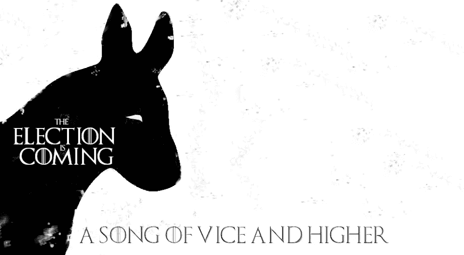
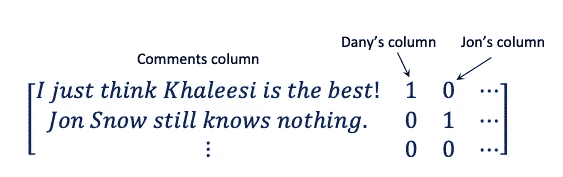
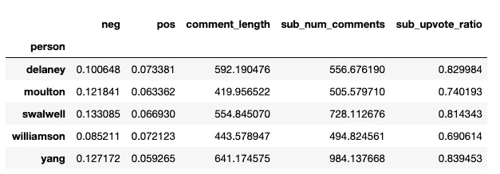
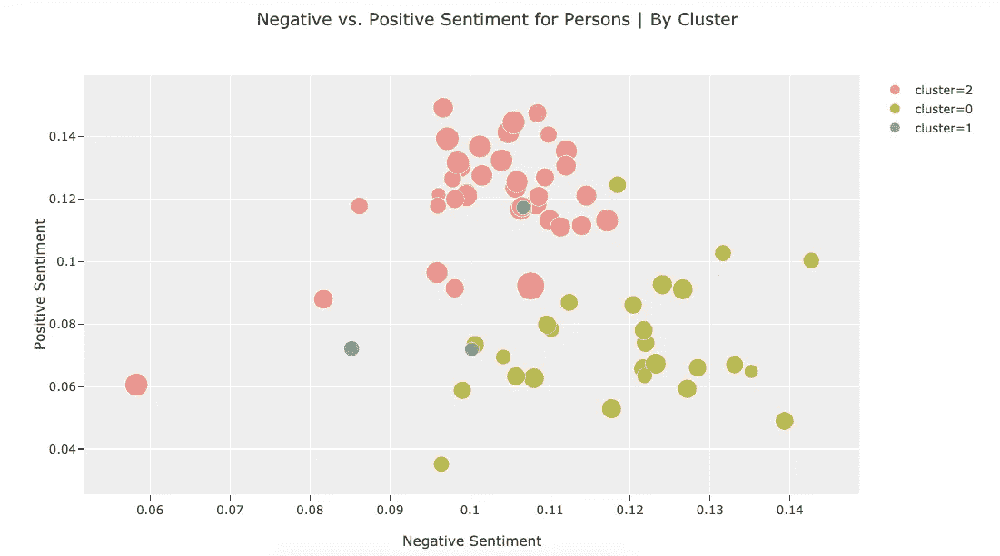
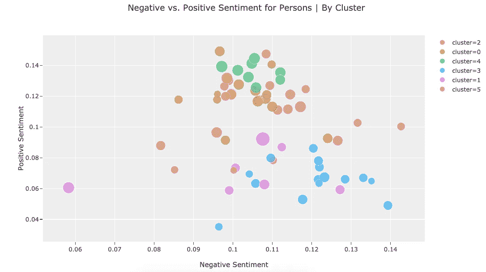
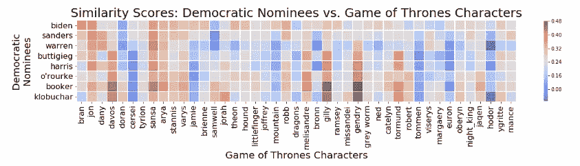

# 罪恶之歌:通过《权力的游戏》刻画总统候选人

> 原文：<https://towardsdatascience.com/a-song-of-vice-and-higher-characterizing-presidential-nominees-through-game-of-thrones-5dc685f6c1dd?source=collection_archive---------19----------------------->

## 作者:韦林多·曼格罗邦和米娅·伊瑟曼

Image by author

这个夏天，很多人对《权力的游戏》表达了强烈的意见——龙，浪漫，当然还有谁应该统治七大王国。事实上，你可能已经听过很多现实世界中的政治理由来解释这个故事中的事件——这个故事的背景是一个有龙和魔法存在的世界。粉丝们喜欢分析节目的政治，他们从第一季就开始分析了。

现实政治呢？希望每个对《权力的游戏》有强烈意见的人都同样关注即将于 2020 年举行的非虚构的美国总统选举。以防你对临冬城之战比对民主党辩论日程更感兴趣，我们用科学的方法整理了一份《权力的游戏》人物提名名单！

伯尼·桑德斯？更像伯尼·珊莎！詹德利——来自南方的好男孩，有一个令人困惑的同名者——那就是贝托！谁会在夜王再次召集他的僵尸大军之前最终击败他呢？艾莉亚·史塔克，又名伊丽莎白·沃伦！以下是目前民调超过 2%的总统候选人的完整名单以及他们对应的《权力的游戏》角色:拜登&乔恩、桑德斯&桑莎、沃伦&艾莉亚、Buttigieg &达沃斯、哈里斯&托尔蒙德、奥鲁克&詹德利、布克&吉利、克洛布查尔&乔拉。

如果到目前为止这感觉有点刺激，你没有错。本文的其余部分详细记录了创建我们的列表的过程。请继续阅读这些配对背后的科学，并随时查看[我们的 Github 库](https://github.com/MIAISEMAN/a-song-of-vice-and-higher)。

# 获取和准备数据

我们使用 Reddit 注释和自然语言处理来创建映射。通过 Reddit API，以及来自[这篇文章](/exploring-reddits-ask-me-anything-using-the-praw-api-wrapper-129cf64c5d65)的一点帮助，我们将来自[政治](https://www.reddit.com/r/politics/)和[权力的游戏](https://www.reddit.com/r/gameofthrones/)子编辑的超过 30 万条评论保存到亚马逊网络服务[关系数据库服务](https://aws.amazon.com/rds/)。

一旦我们有了一个很长的评论列表，我们需要将这些评论归属于特定的人。(出于我们的目的，“人物”既指虚构的人物，也指非虚构的被提名者。)为了做到这一点，我们创建了一个函数来检查评论数据帧中的每一行，将每条评论与一个人及其假名的字典进行比较，并记录该名字是否出现在评论中以给予该人信任。这被证明是非常耗时的，所以我们找到了一个更好的方法:矩阵！

使用 [sklearn 的计数矢量器](https://scikit-learn.org/stable/modules/generated/sklearn.feature_extraction.text.CountVectorizer.html)，我们将 324629 条评论和 114 个假名变成了一个矩阵。我们还为 114 个假名(例如卡丽熙和丹妮是同一个人)和 67 个人创建了一个 114 乘 67 的矩阵。然后，我们对这两个矩阵进行点积，得到每个人在评论行中的评论数:

An example of the dot product’s resulting matrix (Image by the author)

# 以情感和音量为特征的聚类

因为我们最感兴趣的是对每个角色进行分析，所以我们创建了一个矩阵，将人物作为第一列，将他们的特征作为其他列。我们使用[维德](https://github.com/cjhutto/vaderSentiment)来分析每个评论的情绪，并使用正面分数作为第一个特征，然后负面分数作为另一个特征。我们还使用 Reddit 的“投票率”(投票数除以投票数)、评论数和评论长度作为特征。sub_num_comments 列最终也用于根据所有的评论来查找特性的平均值。

Image by the author

如果我们使用无监督的 kmeans 聚类来查看不同的组是什么，我们会发现什么？最佳 *k* (3)并不比被提名者和其他被提名者组合在一起多多少，对角色也是一样。有趣的是，我们确实注意到，对人物的情感通常比被提名者更积极地被解读。

Image by the author

# 添加语义特征

在寻找更有吸引力的集群时，我们想要不同于用户情绪和数量的特性。如果我们看看角色的名字是如何相互关联的呢？为此，我们使用了 [Gensim](https://radimrehurek.com/gensim/) ，这是一个允许您“分析纯文本文档的语义结构”和“检索语义相似的文档”的工具我们就是这么做的！

我们使用所有的评论作为训练 word2vec 模型的语料库，该模型将单词转化为向量。然后，我们使用 Gensim 的*最相似*特征(利用余弦相似度)将这些人与“总统”、“宝座”和“领袖”进行比较。当我们使用这些特性重新聚类( *k* =6)时，我们得到了稍微有趣一些的结果，但是它仍然没有给我们两个不同领域中的自然重叠。

Image by the author

# 使用相似性得分进行匹配

很明显，我们需要变得更笨手笨脚，以实现我们的点击诱饵目标，将《权力的游戏》中的人物与总统候选人匹配起来。所以，我们把情感和数量抛到了九霄云外，只使用*最相似的相似度分数。*为了简化我们的分析，我们决定只关注前 8 名被提名者，即当时民调支持率超过 2%的人:拜登、桑德斯、沃伦、Buttigieg、哈里斯、奥罗克、布克和克洛布查尔。

Hodor — not a politician! (Image by the author)

为了创建我们的最终排名，我们按照投票顺序查看了被提名者，并将他们与最匹配的角色配对。拜登&乔恩，桑德斯&桑莎，沃伦&艾莉亚，布蒂吉格&达沃斯，哈里斯&托尔蒙德，奥鲁克&詹德利，布克&吉利，克洛布查尔&乔拉。

你有它！你怎么想呢?你会做些不同的事情吗？请在评论中给我们留言。

此外，不要忘记投票，否则你不会比《权力的游戏》更好。