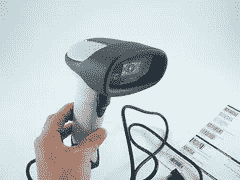
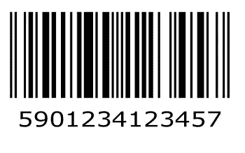
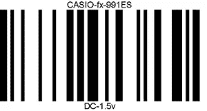
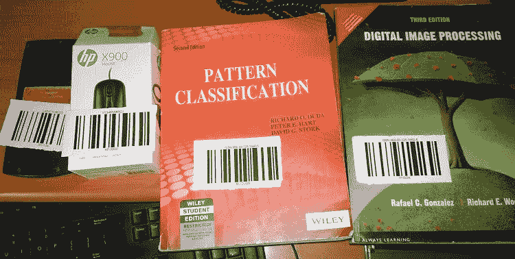

# 使用网络摄像头扫描条形码的独立应用程序

> 原文：<https://towardsdatascience.com/a-standalone-application-to-scan-barcode-using-webcam-e09e44d9dbb?source=collection_archive---------7----------------------->

## **在购物商店开发经济高效的自动化计费流程的一步**

# **什么是条形码阅读器**

当你逛任何一家购物中心或商店时，你一定见过条形码检测机(见图 1，图片来源 [flickr](https://www.flickr.com/photos/tags/photos/) )，它能读取你购买的商品的条形码并计算出价格。最后，你会得到一张购物收据，上面有你所购买的物品以及每件物品的价格。在购物中心使用条形码扫描仪在很大程度上减少了文书工作和数字化购物。然而，它仍然需要人的努力。



Figure 1: A typical bar code scanner

另一个问题是，它的成本很高。变化和耐久性也是这种条形码扫描仪的一个问题。因此，有必要开发这样一种系统，它能使扫描产品的过程自动化，并且成本低，维护要求低。

在这篇文章中，使用 python 开发了一个条形码扫描仪，它可以使用网络摄像头读取产品的条形码，解码条形码中加密的项目的成本，并计算产品的价格，最后在购物结束时，您将获得您购买的项目数量、购买日期、购买项目的名称和相应的成本。发现开发的系统具有成本效益，耐用，易于使用，完全自动化的计费过程，即不需要人工扫描条形码。

# **条形码生成**

现在，python 中有许多标准库可以用来创建条形码。我用过 *pyBarcode* 。它可以提供 EAN-8，EAN-13，EAN-14，UPC-A，JAN，ISBN-10，ISBN-13，ISSN，Code 39，Code 128，PZN 类型的标准条形码。要安装 *pyBarcode* ,请使用 pip 作为

```
*pip install pyBarcode*
```

一旦安装了 *pyBarcode* ，运行以下四行代码来创建条形码图像。这将在*中保存条形码图像文件。svg* 格式。不过也可以另存为*。以下代码中的*与略有变化，摘自此处的。

```
>>>import barcode
>>>EAN = barcode.get_barcode_class('ean13')
>>>ean = EAN(u'5901234123457')
>>>fullname = ean.save('ean13_barcode')
```

上述代码将以欧洲商品编号(ean)标准保存条形码。您可以根据选择更改标准。使用 python 脚本生成的条形码如图 2 所示。



Figure 2: Generated barcode using python script

或者，您可以从互联网上免费下载任何软件来生成条形码。我用的工具是从[这个](http://free-barcode.com/)网站下载的。您只需要在(可选)条形码的上方和下方设置数据和文本。您还可以设置条形码图像的宽度和高度，并将其提取为。 *png* 或储存在 excel 中。在我的应用程序中，我使用了 CODE 128 标准，并将图像提取为。 *png* 。使用软件工具生成的条形码如图 3 所示。



Figure 3: Barcode generate using software.

类似地，我为四个产品(两本书、一个计算器和一个计算机鼠标)生成了条形码，将这些条形码打印出来并粘贴到产品上。经过这些步骤，我的四个产品看起来像，如图 4 所示。



Figure 4: Barcode stick on products under consideration

因此，通过这种方式，您还可以为您的购物商店创建自己的产品条形码。

# **条形码扫描**

在这里，我开发了一个 python 应用程序来读取我创建的条形码，并使用网络摄像头解码数据。该脚本初始化实时视频流，并从视频中提取每一帧。它通过模糊帧来寻找边缘。双边滤波器或高斯滤波器可用于此目的。然后采用自适应阈值获得处理后的图像。在形态学操作之后，围绕条形码绘制轮廓。所有这些步骤都由 *pyzbar* 的*解码*对象负责。因此，在执行程序之前，确保您已经安装了 *pyzbar* ，可以使用 pip as 安装

```
*pip install pyzbar*
```

对于剩余的过程，请从 [GitHub](https://github.com/gautamkumarjaiswal/BarCodeReader) 库下载完整的代码，并按照 readme 中提到的步骤进行操作。

# **工作原理:**

条形码中加密的*数据*(产品成本)是产品名称及其成本的组合。例如，物品计算器条形码的*数据*被设置为 C4，其中“C”被视为物品 ID ( **C** 计算器)，而“4”被视为以美元为单位的物品成本。对于每个扫描的项目，应用程序记录购买日期，购买的项目 ID 和项目成本。一旦我们按下按钮“e”退出条形码读取过程，应用程序会添加每一个购买项目的成本，并显示最终的购物成本。完整过程的演示视频显示在这里。

Demo of the execution of barcode reader script using webcam

# **优点**

1.  这种应用可以被认为是成本有效的，因为与条形码阅读器的成本相比，网络摄像头的成本非常非常低。
2.  它非常容易操作，也不需要人力，因为网络摄像头可以固定在某个位置，客户只需要将要购买的商品面向网络摄像头的条形码。
3.  与条形码阅读器相比，网络摄像头更耐用，即使出现问题，也很容易修复。
4.  这个应用程序可以用在购物中心和小商店，以自动化计费过程。它也可以用来开发类似的应用程序，如在图书馆，一本书可以分配给学生使用条形码扫描系统。

# **挑战**

1.  如果条形码尺寸较小，或者网络摄像头和条形码之间的距离过大，则系统无法扫描条形码。

这个应用程序也可以用来读取二维码与矿工改变代码。您可以下载代码并创建自己的条形码，根据您的要求设置产品成本。最后，您将拥有一个适用于您的商店/购物店的自动计费流程的完整应用程序。感谢 Jayeeta Chakraborty，他帮助我开发了这个项目。希望这个应用程序可以帮助研究人员和开发人员开发定制的条形码扫描仪。