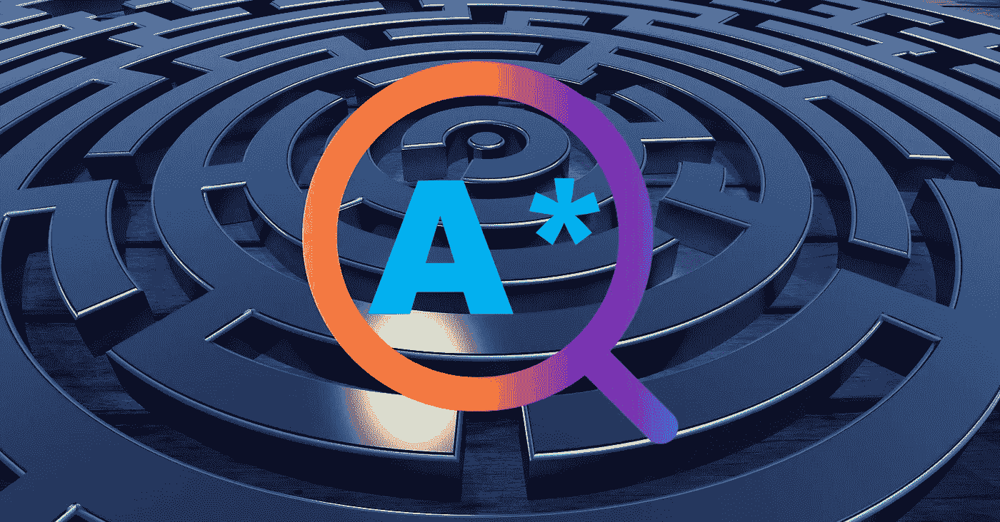
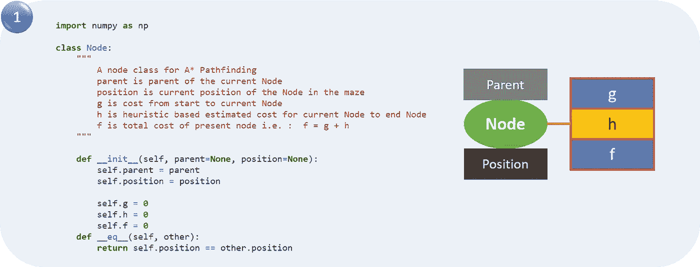
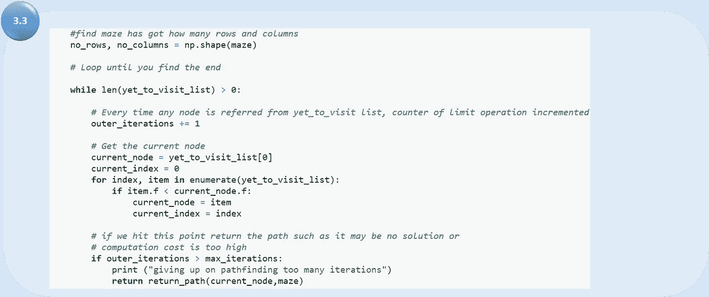

# A 星(A*)搜索算法

> 原文：<https://towardsdatascience.com/a-star-a-search-algorithm-eb495fb156bb?source=collection_archive---------0----------------------->

Image from Pixabay and created by Author

## 分步编码的 A-Star 搜索算法

通过最短的路线到达目的地是我们每天都在做的事情。A-star(也称为 A*)是寻找节点或图之间最短路径的最成功的搜索算法之一。这是一种有根据的搜索算法，因为它使用关于路径成本的信息，并且还使用[启发式](https://en.wikipedia.org/wiki/Heuristic_(computer_science))来找到解决方案。

在本文中，我将重点介绍如何使用简单的 python 代码构建 A-star (A*)搜索算法。我发现许多文章和博客都非常关注理论，但没有太多关于这个项目的信息。我在这里尝试用易于理解的细节一步一步地展示代码。

首先，让我们先来点理论热身。

A*实现 ***最优性*** 和 ***完备性*** ，搜索算法的两个有价值的性质。

> 当搜索算法具有**最优性**时，意味着**保证**找到**最佳可能解**。当一个搜索算法具有**完备性**的性质时，意味着如果一个给定问题**的解**存在，该算法**保证**找到它。

为了理解 A*的工作原理，我们首先需要理解几个术语:

*   **节点**(也叫**状态** ) —所有潜在的位置或停止点都有唯一的标识
*   **转换** —在状态或节点之间移动的动作。
*   **开始节点—** 从哪里开始搜索
*   **目标节点—** 停止搜索的目标。
*   **搜索空间** —节点的集合，就像棋盘游戏的所有棋盘位置
*   **成本** —从一个节点到另一个节点的路径的数值(比如距离、时间或财务费用)。
*   **g(n)** —这代表从**起始节点**到任意节点 **n** 的路径的 ***精确成本***
*   **h(n)** —这代表从节点 **n** 到目标节点的启发式 ***估计成本*** 。
*   **f(n)** —邻居节点 n 中的最低成本

每次 A*进入一个节点，它计算到达所有相邻节点的成本 f(n)(n 是相邻节点)，然后进入 f(n)值最低的节点。

我们使用以下公式计算这些值:

> f(n) = g(n) + h(n)

这里我们将解决一个迷宫问题。我们必须在迷宫中找到从起点到终点的最短路径。

1) Left: Maze problem 2) Right: Position of every node (2D NumPy array positions) of the Maze (Image by Author)

对于这个问题，如果有一个有效的步骤可用，从迷宫位置有四个移动(左，右，上，下)。在红色方块位置，不允许移动(像在开始位置，只有向下的运动是可用的，因为向上和向左的移动被墙阻挡，而对于右边是红色方块位置，因此不允许移动)。

我采用了来自[这里](https://gist.github.com/ryancollingwood/32446307e976a11a1185a5394d6657bc)和[这个博客](https://medium.com/@nicholas.w.swift/easy-a-star-pathfinding-7e6689c7f7b2)的代码，这是一个极好的信息来源。如果你需要更清晰的理论和解释，请阅读帕特里克·莱斯特在 A*上的文章。

首先，我们将创建下面的类和帮助函数:

(1) **类“节点”**可用于为每个节点创建一个对象，其信息为父节点、迷宫中的当前位置和成本值(g，h & f)。

(2)我们需要定义一个**路径函数**，它将返回从 A*开始到结束节点的路径

我们将建立一个**搜索函数**，它将驱动代码逻辑:

(3.1)初始化所有变量。

(3.2)将起始节点添加到“尚未访问列表”定义停止条件以避免无限循环。用相对位置来定义运动。

重复以下步骤，直到满足停止标准:

(3.3)在“尚未访问列表”中寻找 f 成本最低的方块这个方块成为当前的方块。我们还检查是否达到了最大迭代次数

(3.4)检查当前方块是否与目标方块相同(意味着我们已经找到路径)

(3.5)使用当前正方形并检查与该当前正方形相邻的四个正方形，以更新子节点。如果它是不可移动的，或者如果它在“已访问列表”中，忽略它。否则，以父节点作为当前节点创建新节点，并更新节点的位置。

(3.7)检查创建的所有子节点以查看

如果它不在“尚未访问列表”中，请将其添加到“尚未访问列表”使当前方块成为该方块的父方块。记录正方形的 f、g 和 h 成本。

如果它已经在“尚未访问的列表”中，使用 g 成本作为度量，检查一下到那个方块的路径是否更好。较低的 g 成本意味着这是一条更好的路径。如果是，将方块的父方块更改为当前方块，并重新计算方块的 g 和 f 分数。

(4) **主程序:**我们将定义迷宫、起点和终点位置。然后，我们将使用搜索功能，如果路径存在，我们可以从路径功能打印路径。

现在，我将一步一步地检查代码中的上述步骤(参考括号中的数字)。

首先，我们将为一个节点创建一个类，该类将包含与该节点相关联的所有属性，如节点的父节点、节点的位置以及该节点的所有三个成本(g、h & f)。我们初始化该节点，并构建一个方法来检查该节点与另一个节点是否相等。

Image by Author

现在我们将构建 path 函数，它将用于返回从起始节点到目标节点(结束节点)的路径。

Image by Author

现在我们将定义搜索函数，它有多个步骤。第一步是初始化我们将在函数中使用的节点和列表。

Image by Author

将起始节点添加到“尚未访问列表”定义停止条件以避免无限循环。根据相对位置定义移动，这将用于查找子节点和其他相对位置。

Image by Author

现在我们通过比较所有 f 成本并选择成本最低的节点进行进一步扩展来使用当前节点。我们还检查是否达到了最大迭代次数，设置一个消息并停止执行(避免无限循环)

Image by Author

从“尚未访问列表”中删除所选节点，并将该节点添加到已访问列表中。现在我们检查是否找到了目标方块。如果我们已经定位了目标方块，那么调用 path 函数并返回。

Image by Author

对于选定的节点，找出所有子节点(使用移动来查找子节点)。获取所选节点的当前位置(这将成为子节点的父节点)
a)检查是否存在有效位置(边界墙将使少数节点无效)
b)如果任何节点位置无效(红色方块)，则忽略该位置
c)添加到所选父节点的有效子节点列表中

在图中，我们显示黑色圆圈节点是当前节点，绿色圆圈节点是正确的子节点。

Image by Author

对于所有子节点:
a)如果子节点在已访问列表中，则忽略它，并尝试下一个子节点。
b)计算子节点 g、h 和 f 的值。对于 h 启发式算法，此处使用欧几里德距离计算当前节点到达目标节点的成本。
c)如果孩子在“尚未访问列表”中，则忽略它，将孩子移至“尚未访问列表”

Image by Author

现在，最后，我们将运行迷宫的主程序，并获得路径。参考同样使用箭头显示的路径。

Image by Author

# 结论

A-star (A*)是人工智能中一个强大的算法，有着广泛的用途。然而，它只能发挥它的启发功能(考虑到问题的性质，它可以是高度可变的)。A*是寻路最流行的选择，因为它相当灵活。

它已经在许多软件系统中找到应用，从机器学习和搜索优化到游戏开发，其中角色通过复杂的地形和障碍到达玩家。

你可以在[这个](https://github.com/BaijayantaRoy/Medium-Article/blob/master/A_Star.ipynb) GitHub 仓库中找到完整的代码。

## 感谢阅读。你可以在 [LinkedIn](http://www.linkedin.com/in/baijayantaroy) 上和我联系。

*每月只需 5 美元，就可以无限制地获取最鼓舞人心的内容……点击下面的链接，成为一名媒体会员，支持我的写作。谢谢大家！* 