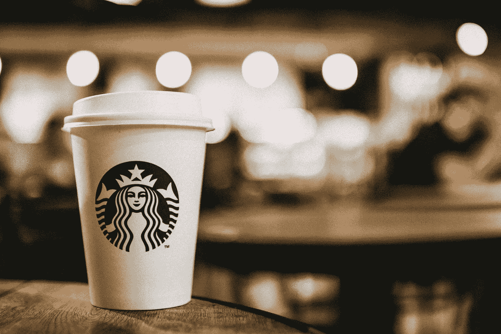
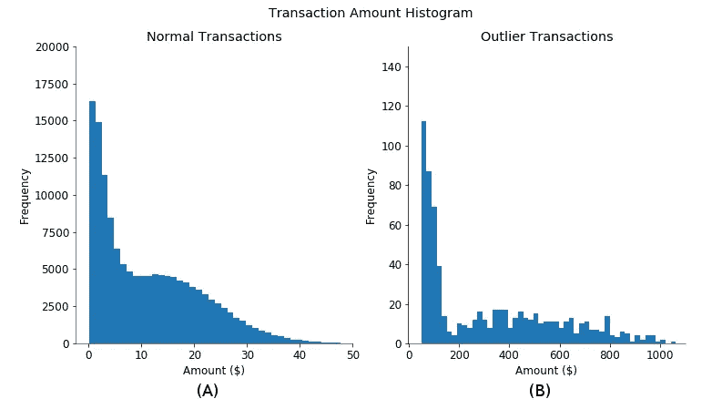
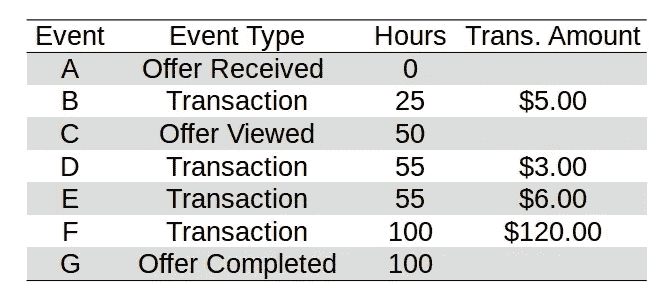
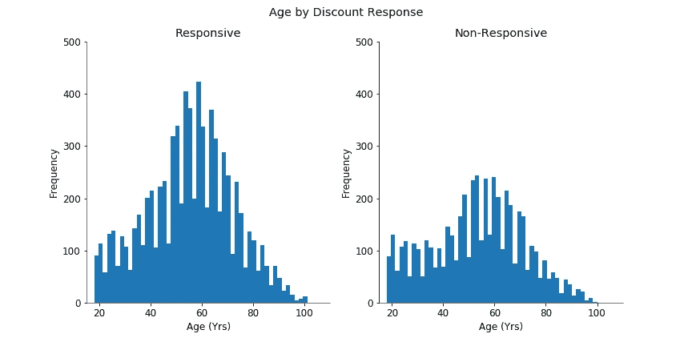
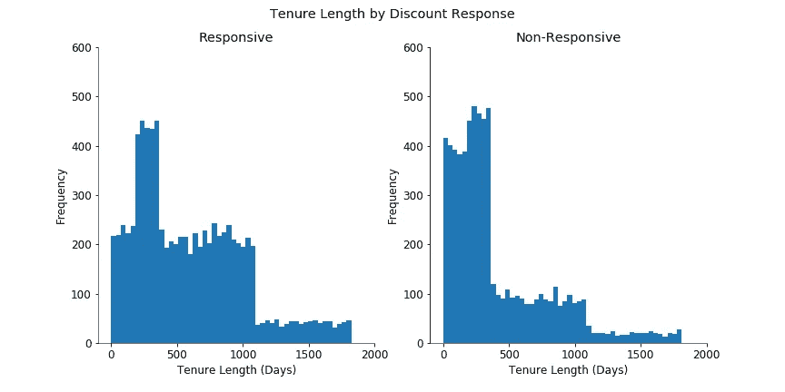
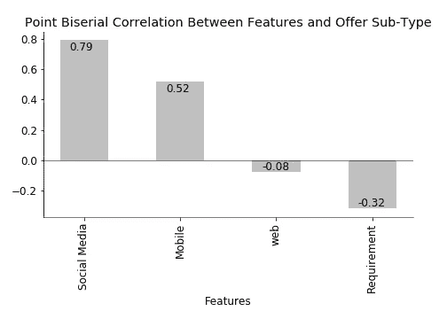
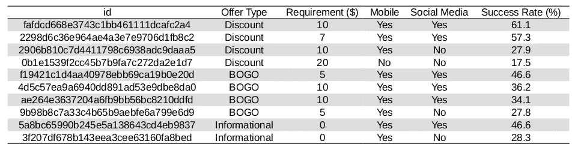

# 星巴克案例研究:优化顾客与促销的匹配

> 原文：<https://towardsdatascience.com/a-starbucks-case-study-optimizing-customer-to-promotion-match-e189f7f86db3?source=collection_archive---------8----------------------->

Photo Credit: [Adrianna Calvo](https://www.pexels.com/photo/close-up-photography-of-starbucks-disposable-cup-597933/)

# **简介**

销售活动是用来促进短期销售的营销工具。成功取决于针对正确的客户进行正确的促销。设计不佳的销售活动会让公司付出代价；例如，收入可能会以奖励的形式流失。这意味着，每次公司发起销售活动时，必须仔细考虑奖励的形式——做出该决定所需的关键信息是:1)不同类型促销的预测销售增长，以及 2)了解特定客户对不同促销广告的反应。像星巴克这样的大型零售商在美国有近 14000 家店铺，为数百万顾客提供服务，一场糟糕的促销活动的代价可能是巨大的。

在这篇文章中，我将使用从星巴克的一个实验(见下文)中收集的数据来分析顾客对不同促销的反应。在星巴克，大多数销售活动都是通过互联网进行的，这些促销活动可以分为三类:

*   折扣
*   买一送一(BOGO)
*   信息(例如，新产品或季节性产品)

如果星巴克的老顾客在促销期间花的比她多，促销活动就成功了。如果一个星巴克常客在此期间不改变他的消费行为，销售活动就有让公司付出代价的危险。据估计，星巴克拥有 2300 万“星巴克移动应用”会员，以及关于这些客户的人口统计数据、收到的促销和购买记录的大量数据。通过结合几种数据分析技术，我将回答以下问题(概述了每个目标的简要方法):

**1。细分客户群。**对于不同类别的销售活动，我们能否将客户分为有响应的和无响应的客户？

我将设计功能，并手动将客户分为两组:一组不响应促销，另一组响应促销。*反应迅速的顾客*是在促销期间在星巴克消费增加的顾客。

**2。预测新客户行为。给定之前没有星巴克购买记录的顾客的基本资料(年龄、收入、性别、会员日期),我们能否预测他或她对某种促销活动的反应？**

根据现有的客户人口统计数据(性别、年龄、收入和会员资格)，我将使用机器学习来建立一个预测模型，以帮助预测新的星巴克会员是否会成为特定促销类别的*响应客户*。

**3。识别成功促销的特征。**与成功的销售活动相关的一些特征是什么？

使用探索性数据分析(EDA)，我将确定成功促销中的常见特征。

# **术语**

促销**子类型**可以归入三个**类别**之一:1)折扣，2) BOGO，或 3)信息。例如，促销子类型“花 10 美元减 2 美元”和“花 20 美元减 5 美元”都属于折扣类别。

在折扣类别中，客户在消费一定金额后会获得小额奖励(例如，消费 10 美元可获得 2 美元的折扣)。在 BOGO 类别中，顾客支付一件商品的全价，并免费获得第二件商品。在“信息”类别中，不提供金钱或奖励，但会通知客户关于新产品或季节性产品的信息。

**单个报价**是发送给客户的广告，宣布促销子类型。

**销售活动**是在给定时间向客户群发送多个单一报价的行为。

# **星巴克的实验**

在星巴克进行的这个实验中，收集了六个销售活动的数据。在第 1、8、15、18、21 和 24 天宣布了销售活动。在每次销售活动中，大约有 12700 个单次报价(大约。每个子类型 1270 个单个报价)被发送给随机选择的客户。总共有十个促销子类型可用:四个属于折扣类别，四个属于 BOGO 类别，两个属于信息类别。

# **数据集**

三个数据集可用: ***作品集*** ， ***成绩单*** ，以及 ***简介*** 。

***Portfolio*** 包含星巴克提供的所有促销类别和子类型的参考列表。

***抄本*** 记录客户的交易历史，发送给客户的单笔报价的数量和子类型，并提供分析单个客户行为所需的数据。通过一个月的过程收集抄本数据。

***简档*** 包含关于客户的人口统计信息(例如，性别、年龄、收入和会员资格期限)，并且当与从抄本数据导出的信息相结合时，可以用于构建客户行为的预测模型。

# **数据清理**

对 ***组合*** 、 ***抄本*** 、 ***概要*** 数据集的部分特征进行了数据清理。

在 ***组合*** 中，“渠道”和“报价 _ 类型”被转换为虚拟特征。

在 ***抄本*** 中，“事件”被转换为虚拟特征。在“值”中，条目格式根据描述的事件类型而有所不同。我把这些条目分成不同的特征。如果该值反映了单个要约事件(例如，已接收、已查看或已完成的要约)，则将对应于该单个要约的子类型的 id 输入到名为“ID”的新特征列中。如果该值反映了一个事务事件，则事务金额被输入到一个名为“transaction_amount”的新特性列中

在 ***轮廓*** 中，加工了几个特征。在“年龄”功能中，2175 名客户被列为 118 岁(可能是未透露年龄的客户的默认条目)。我将年龄列中的所有 118 个值转换为 NaN 值。在“成为会员”功能中，客户成为星巴克会员的日期以八位数格式记录(例如，20180726 表示 2018 年 7 月 26 日)。我将其转换为自八位数参考日期以来客户成为会员的总天数，并将该特性重命名为“tension _ length”。“性别”被转换为虚拟特征。

# **数据分析**

## **1。细分客户群。**

在这里，我将执行数据处理和特征工程，针对每种促销类别(折扣、BOGO、信息)，将*响应客户*与*非响应客户*进行细分。回应型顾客是指在促销期间收到一个报价，并以比平时在星巴克消费更多的钱来回应的顾客。

基于交易和单个报价(例如，收到的报价、查看的报价或完成的报价)数据，我确定了客户在促销和非促销期间的每小时支出(SPH)(见下文)，并使用设定的比率(促销-SPH/非促销-SPH)来确定*响应客户*。用于计算比率的几个指标定义如下:1)异常值，2)感知时间(客户感知促销的时间长度)，以及 3)每个促销类别的 SPH。

**度量标准。**

1.  极端值

在星巴克，主要产品是饮料和糕点，大多数交易金额低于 50 美元(见图 1-A)。然而，一小部分交易金额大得惊人(例如，一次付款超过 1000 美元，图 1-B)。这些大额交易可能是餐饮订单，不太可能受到促销的影响，因此不在此处分析。

Figure 1\. Histograms of transaction amounts for normal transactions (A) and outlier transactions (B). Note that x an y axes are scaled differently between (A) and (B)

要被视为异常交易，交易金额必须高于由截断四分位数间距(IQR)方法确定的阈值。如果 IQR 得出的阈值低于 50 美元，那么我使用 50 美元作为阈值。

截断的 IQR 是通过首先将客户交易从高到低排序，然后删除前 20%的记录而得到的。这有助于避免人为的高 IQR。阈值是通过第一个四分位数(Q1)值以上的 IQR 值的两倍来计算的(阈值= 2 * IQR + Q1)。

2)意识时间

重要的是要确定顾客知道一次促销活动的时间长度，因为这是顾客的购买行为可能受到促销活动影响的时期。

对于折扣和 BOGO 类别，知晓时间是指客户查看报价的时间，即 1)客户完成报价(即购买)或 2)报价到期(即没有购买)。对于“信息”类别，知晓时间是指客户查看报价的时间到报价到期的时间。

3)每小时支出(SPH)

促销-SPH 按类别(折扣、BOGO 或信息)计算，并定义为:

知晓时间内所有正常交易的总和/属于某一类别的所有单个报价的知晓时间总和

例如，为了计算客户的 SPH 折扣，将在知晓时间内发生的所有正常交易的总和除以属于折扣类别的单个报价的知晓时间总和。

非促销 SPH 的定义是:

非知晓时间内所有正常交易的总和/非知晓时间的总和

所有 SPH 计算都排除了异常值。

**识别*响应的客户。***

对于给定的促销类别，客户是否可以被归类为*响应客户*取决于(促销-SPH/非促销-SPH)比率。如果(促销-SPH/非促销-SPH)比率高于 1.04(针对折扣)、1.12(针对 BOGO)和 1.00(针对信息)，则认为客户对特定促销类别做出了*响应*。

这里有一个例子。

Table 1\. *Hypothetical transcript data of a customer.*

假设一个客户收到了折扣类别中的单个报价(事件 A，表 1)，查看了单个报价(事件 C)，进行了三次交易(事件 B、D、E 和 F)，并完成了报价(事件 G)。交易 B 发生在知晓时段之外，将被排除在 SPH 促销计算之外。交易 F 被确定为异常值，将从促销 SPH 计算中排除。交易 D 和 E 发生在 aware 时段，将予以考虑。

在本例中:

折扣-SPH =(事件 D 交易金额+事件 E 交易金额)/(事件 G 时间戳-事件 C 时间戳)

= ($3.00 + $6.00) / (100–50)

=每小时 0.18 美元

如果该客户的非促销 SPH 为每小时 0.10 美元，则(折扣-SPH/非促销-SPH)比率将为:0.18 美元/ $0.10 = 1.80 美元

由于*响应客户*的“通过”(折扣-SPH/非促销-SPH)比率为 1.04，我将该客户确定为*响应客户*。

**探索性数据分析(EDA)。**

快速浏览一下*响应型客户*和 ***简档*** 【性别】、【年龄】和【收入】中的可用特征之间的可能关系，可以发现客户是否是*响应型客户*(参见图 2 中使用“年龄”特征的示例)。“任期长度”似乎显示了积极响应之间的微小差异(*图 3* )。

F*igure 2\. Histograms showing similar “age” distribution for responsive vs. non-responsive customers. Histograms for “gender” and “income” also show no notable differences between responsive vs. non-responsive customers.*

F*igure 3\. Histogram of “tenure_length” for responsive vs. non-responsive customers.*

**评论。**

这里没有使用复杂的预测算法，但是基本的数据处理和分析可以有效地将客户群分为*响应客户*和*非响应客户*。

## **2。预测新客户行为。**

在这里，我将使用机器学习来建立一个模型，用于预测新客户对特定促销类别(折扣、BOGO、信息)的反应。新客户是一个新的“星巴克移动应用程序”成员，具有基本的个人资料数据，但没有与星巴克的先前交易记录。基于这些客户的档案数据，我建立了三个分类器模型(每个促销类别一个)来预测一个新成员是否会成为某个促销类别的*响应客户*。

**初始算法扫描。**

对包括逻辑回归、线性判别分析、K-最近邻、支持向量机(SVM)、AdaBoost (Ada)、随机森林(RF)和 XGBoost (XGB)在内的七种算法的初始扫描显示，RF 具有最佳性能。F1 分数用于评估性能，因为它反映了第一类和第二类错误。

如果出现第一类错误，意味着一个*响应客户*被预测为一个*非响应客户*，那么*响应客户*的数量将被低估。如果销售活动是基于具有这种误差的预测模型设计的，那么星巴克促销的奖励可能被设置在不能最大化潜在销售促进的水平。

如果出现第二类错误，意味着一个*非响应客户*被预测为*响应客户*，那么*响应客户*的数量将被高估。如果销售活动是基于有这种误差的预测模型设计的，更多的顾客将享受促销的回报，而不会促进销售，星巴克可能会损失收入。

**优化模型超参数。**

来自 Ada、SVM、RF 和 XGB 的最佳性能模型得到了优化。折扣和 BOGO 的优化模型显示没有改善，而信息模型显示略有改善。

**性能。**

收集了折扣(0.65)、BOGO (0.67)和信息(0.53)测试集的 F1 分数。

**重要特征。**

“任期长度”被认为是区分所有促销类别的*响应客户*和*非响应客户*的最重要特征。但是由于“任期长度”对于任何新客户来说总是零天，所以这个特性不是一个有用的区分指标。“年龄”、“性别”和“收入”不是区分特征。

**评论。**

给定新客户的基本概况信息，无法使用机器学习模型预测客户与促销的匹配。可能会收集其他特征，如客户的职业、教育水平或位置，以帮助开发更有效的预测模型(尽管额外的数据收集可能会降低客户的用户体验)。

## **3。识别成功促销的特征。**

这里我使用数据处理来确定推广子类型的成功率。*成功的单次优惠*必须满足以下标准:1)交易发生在单次优惠被查看之后，以及 2)客户花费的金额高于促销优惠所要求的金额。

促销子类型的成功率计算方法如下:

*成功单笔报价数* /总单笔报价数

**探索性数据分析(EDA)。**

计算了所有十个推广子类型的成功率，范围从 17.5%到 61.0%，没有显示出对推广类别的显著依赖性(参见*表 2* )。此外，还计算了要约子类型特征和成功率之间的点双列相关(图 4)。

F*igure 4\. Selected point biserial correlations of offer sub-type features and the success rate.*

T*able 2\. Ten sub-types and their id’s, selected features (“purchase requirement,” “channel”), and projected success rate.*

选择何种渠道(即社交媒体、移动应用、网页和电子邮件)提供单一优惠是成功促销的决定性因素(参见*图 4* )。对于每一个子类型，一套固定的渠道被用来发出单一的报价，那些通过社交媒体和星巴克移动应用程序分发的成功率最高。

成功率也与较低的购买要求相关；也就是说，在奖励生效之前，客户支付的金额越少或购买的商品越少，促销就越成功(见*图 3* )。例如，在给予“20%奖励”的基础上，要求客户“花 5 美元减 1 美元”的子类型优惠将比“花 20 美元减 4 美元”的促销更有效。

**评论。**

一次成功的促销可以归入任何类别，但高成功率的决定因素是发送单一优惠的渠道选择和奖励障碍。

# **建议星巴克采取的行动**

下面列出了一些在促销期间提升短期销售额的建议措施。

1.为了最大限度地提高客户响应:

*   从现有会员处收集特定时间段的数据，确定单个客户的客户-促销类别匹配，并相应地发送单个报价。

2.预测新客户行为:

*   当新顾客注册成为星巴克会员以测试可能有助于顾客-促销匹配的可能特征时，在简档部分中可能要求附加数据(例如，职业、教育水平、位置)。

3.要最大限度地提高单次报价的成功率:

*   通过社交网络和移动应用程序发送单个报价。
*   提供折扣和 BOGO 促销，购买要求低。

# 下一步是什么？

可以做的一个有趣的实验是，发出邀请客户“选择你自己的促销”的单个报价。例如，单个报价可能包含使用折扣子类型、BOGO 子类型的选项，或者获得新的或季节性产品的第一视图。因为客户有“选择”的权利，所以像这样的促销将吸引客户，并揭示每个客户喜欢什么的洞察力，从而有助于改善客户与促销的匹配。可能是一个有趣的想法来测试？

谢谢你看我的帖子。请参见[我的 GitHub 库](https://github.com/keigito/Starbucks_Customer_Analysis)了解这里介绍的工作细节。