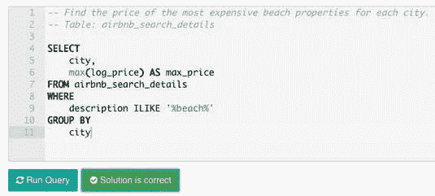
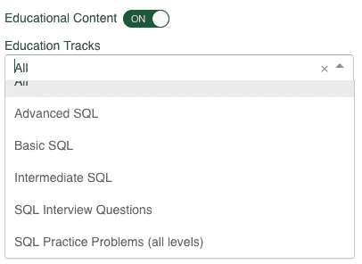

# 回答技术面试中任何问题的循序渐进的方法

> 原文：<https://towardsdatascience.com/a-step-by-step-approach-to-answering-any-question-in-a-technical-interview-99bc4183265b?source=collection_archive---------41----------------------->

## **在分析和数据科学领域工作的 4 个建议——一个可以利用的框架**

任何求职者都知道，整个过程中最紧张的部分几乎肯定是令人恐惧的求职面试！如果你想从事分析方面的职业，那么面试过程会有一系列独特的考验和磨难。但是就像生活中的任何事情一样，你能做的最好的事情就是做好准备。

> 这篇文章将帮助你做好准备——我们将解释从分析面试中可以期待什么，以及你如何最好地准备。

Image from [Unsplash](https://unsplash.com/)

对于分析领域的大多数职业来说，公司希望你能够很好地编码，或者至少足够好地了解语法，使它不会成为你日常工作的障碍。因此，虽然这些技能通常会受到考验，但这并不是面试官关注的唯一技能。除了技术部分(即编码部分)，您可能还需要解决一个“用例”，这是一个他们经历过的问题，一个假设的问题，或者一个他们正在积极尝试解决的问题。

> 他们不仅测试你解决问题的方法，也测试你解决问题的方法。

# **成功的步骤**

## **1。关注方法而不是代码**

> 更多的重点通常放在你的方法和途径上，而不是代码本身是否 100%正确

这里需要注意的是，他们不只是在寻找你的解决方案。他们希望看到你解决问题的方法，以及你与主题相关的扎实的技术基础。即使是错误的解决方案，如果您向他们介绍一下您是如何做到这一点的，他们也会留下深刻印象。

你需要向他们展示你理解方法论和你需要做出的潜在的假设来达成解决方案。因此，您需要向他们介绍您所做的假设，以及您做出这些假设的原因。例如，你对用户数量有什么假设？

你还必须思考和解释支撑你的方法论的数学。思考在这种情况下，什么会影响您正在处理的指标，并告知您了解导致这些变化的原因。

如果你还看不到，沟通是贯穿所有这些建议的关键变量。在解释你的方法时，你需要表现出对形势的充分把握。解释你对问题的假设，以及你对解决方案的假设。

Image from [Unsplash](https://unsplash.com/)

## 2.在代码上注重细节，但只有在被问到的时候

> 证明你的技术基础足以胜任手头的工作

在工作面试问题中，你经常会看到一段代码，希望你能分析它或者改正错误，从而解决问题。这就是显示你注重细节的极端重要的地方。然而，在这部分之前，你最有可能关注的是解决问题的方法和途径，所以先参考上面的提示 1。

> 你应该引导面试官完成这个问题的每一部分。看着语法，向面试官解释每个代码块要实现什么。从这里开始，您将能够对这段代码要实现的目标有一个“大致的了解”,并理解可以添加(或删除)什么来实现一个适当的解决方案。

一旦你恰当地解释了整个代码，以及你解决问题的方法，带面试官看一下你认为的解决方案是什么。

Image from [StrataScratch](http://www.stratascratch.com), with permission from founder

如您所见，解决方案很重要，但如何实现同样重要。如果面试官能看到你的思维过程，看到你基本上是在正确的轨道上，对所涉及的方法论有着坚实的理解，他们会更愿意原谅你的错误。

## 3.想想边缘案例

> 向他们证明您可以将业务问题与技术解决方案联系起来

在编码中，理解边缘案例总是很重要的，工作面试也不例外。

> 想一想你认为准则可能会被打破的情况，并与你的面试官交流。

如果您能够将这些边缘案例与他们在业务中实际遇到的特定场景联系起来，将会非常有帮助。这是一个很好的机会，不仅可以展示你的编码知识，还可以展示你对他们业务的理解。

然后，一旦你确定了这些潜在的边缘情况，建议一些方法来解释它们，这样问题就不会发生了。一旦你清楚地识别出潜在的问题，解决方案总是更容易达成。这是你向面试官展示你总是在思考潜在的问题领域，并且能够解决它们的机会。

## 4.不要接受明显的事实！

> 它们是用来绊倒你的

在面试中出现的任何问题，永远记住不要接受显而易见的答案！如果它是显而易见的，它可能不会在工作面试中作为一个问题给你。

这就是为什么考虑上面的建议如此重要。考虑呈现的每个细节，寻找代码中的漏洞，并考虑真实的业务边缘案例。通过沟通所有这些，你将有可能确定问题所在，并从那里你可以建立一个解决方案。

记住，这是一个需要解决的复杂问题，否则，他们不会给你看。如果你一开始很纠结，慢慢来，陪面试官看一遍，反正他们想看你的思维过程。

# 帮助您成功的结论和资源

我们无法确切地告诉你在求职面试中会遇到什么问题。但是通过考虑以上所有的建议，你可以制定一个可靠的策略来解决你可能遇到的任何问题。

> 如果你想对你的编码进行一些额外的练习，看看过去的一篇关于学习 SQL 和 Python 的最好平台的文章。

如果你面试的是一个涉及编码的分析职位，那么编码几乎应该成为你的第二天性。面试官更感兴趣的是你如何分解问题，如何识别需要改进的地方，以及如何找到解决方案。他们还希望看到你了解他们的业务，这意味着考虑具体的优势案例和可能与他们经营的竞争环境相关的相关因素。

Image from [StrataScratch](http://www.stratascratch.com), with permission from founder

所以你有它，慢慢来，彻底，但最重要的是沟通你的整个思维过程。

祝你好运！

*最初发表于*[T5【https://www.stratascratch.com】](https://www.stratascratch.com/blog_feed/4-interview-tips-for-a-job-in-analytics-and-data-science)*。*