# 使用 Seaborn / Matplotlib 创建高级 Python 数据可视化的分步指南

> 原文：<https://towardsdatascience.com/a-step-by-step-guide-for-creating-advanced-python-data-visualizations-with-seaborn-matplotlib-1579d6a1a7d0?source=collection_archive---------0----------------------->

## 尽管 Python 中有大量优秀的可视化工具，Matplotlib + Seaborn 仍然因其创建和定制各种绘图的能力而脱颖而出。


Photo by Jack Anstey on Unsplash

在本文中，我将首先浏览几个部分，为一些不熟悉 Matplotlib 的读者准备背景知识:

1.  了解两个不同的 Matplotlib 接口(已经造成了很多混乱！) .
2.  理解图中的元素，这样你就可以很容易地查找 API 来解决你的问题。
3.  看一下几种常见的情节类型，这样读者会对何时/如何使用它们有更好的了解。
4.  学习如何增加你的情节的“维度”。
5.  了解如何使用 GridSpec 对图形进行分区。

然后我将通过一个例子来讨论创建高级可视化的过程:

1.  树立一个目标。
2.  准备变量。
3.  准备可视化。

让我们开始旅程吧。

# 两个不同的 Matplotlib 接口

在 Matplotlib 中有两种编码方式。第一个是基于状态的:

```
import matplotlib.pyplot as plt
plt.figure()
plt.plot([0, 1], [0, 1],'r--')
plt.xlim([0.0, 1.0])
plt.ylim([0.0, 1.0])
plt.title('Test figure')        
plt.show()
```

这有利于创造简单的情节(你称之为一堆 plt。XXX 来绘制图形中的每个组件)，但您没有对图形的太多控制。另一个是面向对象的:

```
import matplotlib.pyplot as plt
fig, ax = plt.subplots(figsize=(3,3))
ax.bar(x=['A','B','C'], height=[3.1,7,4.2], color='r')
ax.set_xlabel(xlabel='X title', size=20)
ax.set_ylabel(ylabel='Y title' , color='b', size=20)
plt.show()
```

这将需要更多的时间来编码，但你可以完全控制你的数字。这个想法是，你创建一个“图形”对象，你可以把它想象成你要构建的整个可视化的边界框，和一个或多个“轴”对象，它们是可视化的支线剧情，(不要问我为什么这些支线剧情叫“轴”。名字太烂了……)支线剧情可以通过这些“轴”对象的方法来操作。

(关于这两个接口的详细解释，读者可以参考
[https://matplotlib . org/tutorials/introductive/life cycle . html](https://matplotlib.org/tutorials/introductory/lifecycle.html)
或
[https://pbpython.com/effective-matplotlib.html](https://pbpython.com/effective-matplotlib.html))

让我们在本教程中坚持使用面向对象的方法。

# 面向对象界面中图形中的元素

下面这幅取自 https://pbpython.com/effective-matplotlib.html 的图很好地解释了一个图形的组成部分:

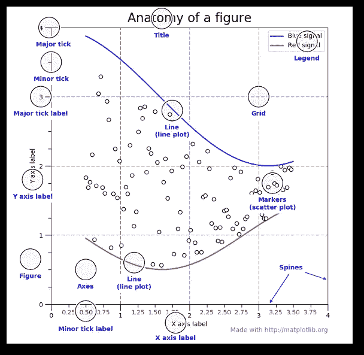

让我们看一个简单的例子，如何用面向对象的界面创建折线图。

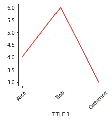

```
fig, ax = plt.subplots(figsize=(3,3))
ax.plot(['Alice','Bob','Catherine'], [4,6,3], color='r')
ax.set_xlabel('TITLE 1')
for tick in ax.get_xticklabels():
    tick.set_rotation(45)
plt.show()
```

在上面的代码中，我们创建了一个 axes 对象，在其上创建了一个线图，添加了一个标题，并将所有的 x-tick 标签逆时针旋转了 45 度。

查看官方 API，看看如何操作轴对象:[https://matplotlib.org/api/axes_api.html](https://matplotlib.org/api/axes_api.html)

# 几种常见的绘图类型

在对 Matplotlib 的工作原理有了大致的了解之后，是时候看看一些常见的情节了。他们是

散点图(x:数值#1，y:数值#2)，

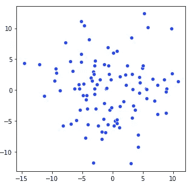

线形图(x:分类序数#1，y:数值# 1)[感谢 Michael Arons 在前图中指出一个问题]，

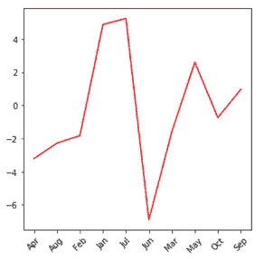

条形图(x:分类#1，y:数字#1)。数字#1 通常是分类#1 的计数。

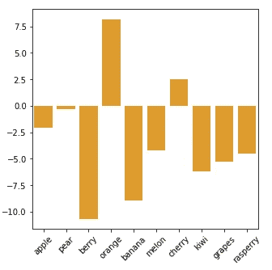

直方图(x:数值#1，y:数值#2)。数字#1 组合成组(转换成分类变量)，数字#2 通常是这个分类变量的计数。

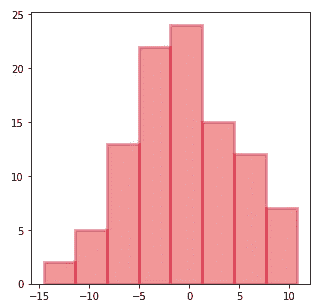

内核密度图(x:数值#1，y:数值#2)。数字#2 是数字#1 的频率。

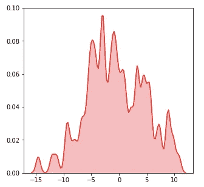

二维内核密度图(x:数值#1，y:数值#2，颜色:数值#3)。数值#3 是数值#1 和数值#2 的联合频率。

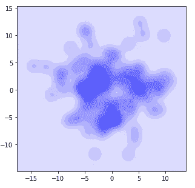

箱线图(x:分类#1，y:数值#1，标记:数值#2)。箱线图显示了分类#1 中每个值的统计数据，因此我们可以了解其他变量的分布情况。y 值:另一个变量的值；标记:显示这些值是如何分布的(极差、Q1、中位数、Q3)。

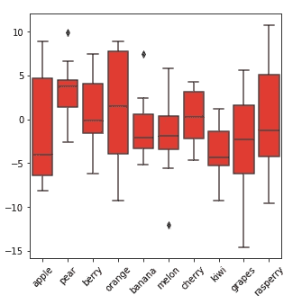

小提琴图(x:分类#1，y:数值#1，宽度/标记:数值#2)。小提琴图有点类似于箱线图，但它更好地显示了分布。

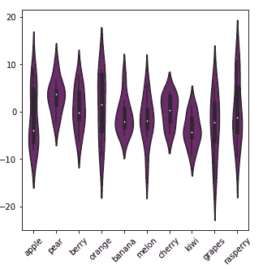

热图(x:分类#1，y:分类#2，颜色:数字#1)。数值#1 可以是分类#1 和分类#2 的共同计数，也可以是该对中每个值的其他数值属性(分类#1、分类#2)。

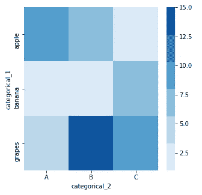

为了了解如何绘制这些图形，读者可以通过谷歌搜索以下列表来查看 seaborn APIs:

SNS . bar plot/SNS . distplot/SNS . line plot/SNS . kdeplot/SNS . violinplot
SNS . scatter plot/SNS . box plot/SNS . heat map

我将给出两个示例代码，展示如何在面向对象的界面中生成 2D kde 图/热图。

```
# 2D kde plots
import numpy as np
import matplotlib.pyplot as plt
import seaborn as snsnp.random.seed(1)
numerical_1 = np.random.randn(100)
np.random.seed(2)
numerical_2 = np.random.randn(100)fig, ax = plt.subplots(figsize=(3,3))
sns.kdeplot(data=numerical_1,
            data2= numerical_2,
            ax=ax,
            shade=True, 
            color="blue",  
            bw=1)
plt.show()
```

关键是参数 ax=ax。跑步的时候。kdeplot()方法，seaborn 会将更改应用到 ax，一个“axes”对象。

```
# heat mapimport numpy as np
import pandas as pd
import matplotlib.pyplot as plt
import seaborn as snsdf = pd.DataFrame(dict(categorical_1=['apple', 'banana', 'grapes',
                                      'apple', 'banana', 'grapes',
                                      'apple', 'banana', 'grapes'], 
                  categorical_2=['A','A','A','B','B','B','C','C','C'], 
                  value=[10,2,5,7,3,15,1,6,8]))
pivot_table = df.pivot("categorical_1", "categorical_2", "value")# try printing out pivot_table to see what it looks like!fig, ax = plt.subplots(figsize=(5,5))sns.heatmap(data=pivot_table, 
            cmap=sns.color_palette("Blues"),
            ax=ax)

plt.show()
```

# 增加你的图的维度

对于这些基本图，只能显示有限的信息量(2-3 个变量)。如果我们想显示这些图的更多信息呢？以下是几种方法。

1.  覆盖图
    如果几个折线图共享相同的 x 和 y 变量，您可以多次调用 Seaborn plots，并将它们全部绘制在同一个图上。在下面的例子中，我们在覆盖图中添加了一个分类变量[value = alpha，beta]。

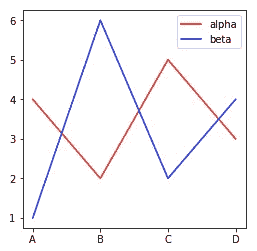

```
fig, ax = plt.subplots(figsize=(4,4))
sns.lineplot(x=['A','B','C','D'], 
             y=[4,2,5,3],
             color='r',
             ax=ax)
sns.lineplot(x=['A','B','C','D'], 
             y=[1,6,2,4], 
             color='b',
             ax=ax)    
ax.legend(['alpha', 'beta'], facecolor='w')
plt.show()
```

或者，我们可以将 x 轴相同但 y 轴不同的条形图和折线图结合起来:

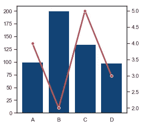

```
sns.set(style="white", rc={"lines.linewidth": 3})fig, ax1 = plt.subplots(figsize=(4,4))
ax2 = ax1.twinx()sns.barplot(x=['A','B','C','D'],
            y=[100,200,135,98], 
            color='#004488',
            ax=ax1)sns.lineplot(x=['A','B','C','D'], 
             y=[4,2,5,3],
             color='r',
             marker="o",
             ax=ax2)
plt.show()
sns.set()
```

这里提几点意见。因为两个图具有不同的 y 轴，我们需要创建另一个具有相同 x 轴的“轴”对象(使用。twinx())然后绘制在不同的“轴”上。sns.set(…)是为当前剧情设置特定的审美，我们最后运行 sns.set()将一切设置回默认设置。

将不同的柱状图组合成一个分组柱状图也为该图增加了一个分类维度(多了一个分类变量)。

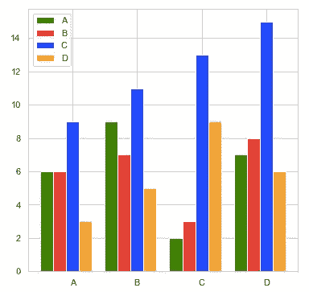

```
import matplotlib.pyplot as pltcategorical_1 = ['A', 'B', 'C', 'D']
colors        = ['green', 'red', 'blue', 'orange']
numerical = [[6, 9, 2, 7],
             [6, 7, 3, 8],
             [9, 11, 13, 15],
             [3, 5, 9, 6]]number_groups = len(categorical_1) 
bin_width = 1.0/(number_groups+1)fig, ax = plt.subplots(figsize=(6,6))for i in range(number_groups):
    ax.bar(x=np.arange(len(categorical_1)) + i*bin_width, 
           height=numerical[i],
           width=bin_width,
           color=colors[i],
           align='center')ax.set_xticks(np.arange(len(categorical_1)) + number_groups/(2*(number_groups+1)))# number_groups/(2*(number_groups+1)): offset of xticklabelax.set_xticklabels(categorical_1)
ax.legend(categorical_1, facecolor='w')plt.show()
```

在上面的代码示例中，您可以自定义变量名、颜色和图形大小。number_groups 和 bin_width 是根据输入数据计算的。然后，我编写了一个 for 循环来绘制条形，一次一种颜色，并在最后设置刻度和图例。

2.面-将数据集映射到多个轴，它们之间有一两个分类变量的差异。读者可以在[https://seaborn.pydata.org/generated/seaborn.FacetGrid.html](https://seaborn.pydata.org/generated/seaborn.FacetGrid.html)中找到一堆例子

3.散点图中节点的颜色/形状/大小:下面的代码示例来自 Seaborn 散点图 API，展示了它是如何工作的。([https://seaborn . pydata . org/generated/seaborn . scatter plot . html](https://seaborn.pydata.org/generated/seaborn.scatterplot.html))

```
import seaborn as snstips = sns.load_dataset("tips")
ax = sns.scatterplot(x="total_bill", y="tip",                      
                     hue="size", size="size",
                     sizes=(20, 200), hue_norm=(0, 7),
                     legend="full", data=tips)
plt.show()
```

# 使用 GridSpec 划分图形

面向对象界面的一个优点是，我们可以很容易地将我们的图形划分成几个子图形，并用“轴”API 操纵每个子图形。

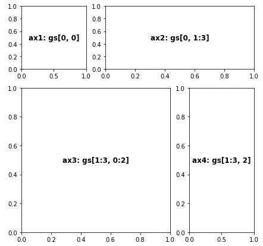

```
fig = plt.figure(figsize=(7,7))
gs = gridspec.GridSpec(nrows=3, 
                       ncols=3, 
                       figure=fig, 
                       width_ratios= [1, 1, 1],
                       height_ratios=[1, 1, 1],
                       wspace=0.3,
                       hspace=0.3)ax1 = fig.add_subplot(gs[0, 0])
ax1.text(0.5, 0.5, 'ax1: gs[0, 0]', fontsize=12, fontweight="bold", va="center", ha="center")  # adding text to ax1ax2 = fig.add_subplot(gs[0, 1:3])
ax2.text(0.5, 0.5, 'ax2: gs[0, 1:3]', fontsize=12, fontweight="bold", va="center", ha="center")ax3 = fig.add_subplot(gs[1:3, 0:2])
ax3.text(0.5, 0.5, 'ax3: gs[1:3, 0:2]', fontsize=12, fontweight="bold", va="center", ha="center")ax4 = fig.add_subplot(gs[1:3, 2])
ax4.text(0.5, 0.5, 'ax4: gs[1:3, 2]', fontsize=12, fontweight="bold", va="center", ha="center")plt.show()
```

在示例中，我们首先用 gridspec 将图形划分成 3*3 = 9 个小方框。GridSpec()，然后定义几个 axes 对象。每个轴对象可以包含一个或多个框。在上面的代码中，gs[0，1:3] = gs[0，1] + gs[0，2]被分配给 axes 对象 ax2。wspace 和 hspace 是控制地块间距的参数。

# 创建高级可视化

有了前几节的一些教程，是时候制作一些很酷的东西了。让我们从 https://www.kaggle.com/mehdidag/black-friday[的
下载分析 Vidhya 黑色星期五销售数据，并做一些简单的数据预处理:](https://www.kaggle.com/mehdidag/black-friday)

```
df = pd.read_csv('BlackFriday.csv', usecols = ['User_ID', 'Gender', 'Age', 'Purchase'])df_gp_1 = df[['User_ID', 'Purchase']].groupby('User_ID').agg(np.mean).reset_index()df_gp_2 = df[['User_ID', 'Gender', 'Age']].groupby('User_ID').agg(max).reset_index()df_gp = pd.merge(df_gp_1, df_gp_2, on = ['User_ID'])
```

然后，您将获得一个表，其中包含用户 ID、性别、年龄以及每个客户购买的商品的平均价格。

**第一步。目标** 我们很好奇年龄和性别会如何影响黑色星期五期间的平均购买价格，我们也希望看到价格分布。我们还想知道每个年龄组的百分比。

**第二步。变量**
我们希望在图中包括年龄组(分类)、性别(分类)、平均商品价格(数值)以及平均商品价格的分布(数值)。我们需要包括另一个图，每个年龄组的百分比(年龄组+计数/频率)。

为了显示平均物品价格+它的分布，我们可以用核心密度图，箱线图，或小提琴图。其中，kde 显示的分布最好。然后，我们在同一个图形中绘制两个或更多的 kde 图，然后绘制小平面图，这样年龄组和性别信息都可以包括在内。对于另一个图，条形图可以很好地完成这项工作。

**第三步。可视化**
一旦我们有了关于变量的计划，我们就可以考虑如何将它可视化。我们需要先做图形分区，隐藏一些边界、xticks、yticks，然后在右边加一个条形图。

下面的情节就是我们要创造的。从图中，我们可以清楚地看到，根据数据，男性比女性倾向于购买更昂贵的物品，老年人倾向于购买更昂贵的物品(对于前 4 个年龄组，趋势更明显)。我们还发现，18-45 岁的人是黑色星期五销售的主要买家。

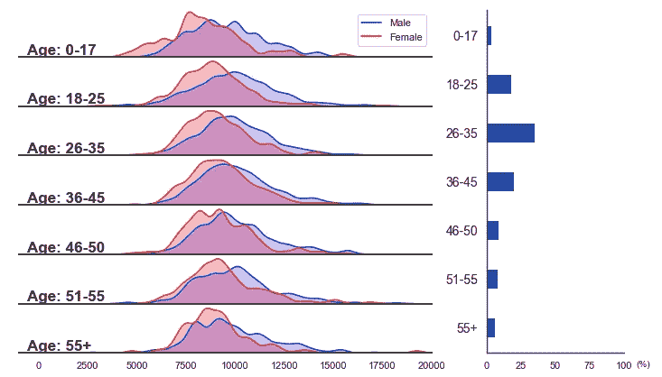

以下代码生成绘图(注释中包含解释):

```
freq = ((df_gp.Age.value_counts(normalize = True).reset_index().sort_values(by = 'index').Age)*100).tolist()number_gp = 7**# freq = the percentage for each age group, and there’re 7 age groups.**def ax_settings(ax, var_name, x_min, x_max):
    ax.set_xlim(x_min,x_max)
    ax.set_yticks([])

    ax.spines['left'].set_visible(False)
    ax.spines['right'].set_visible(False)
    ax.spines['top'].set_visible(False)

    ax.spines['bottom'].set_edgecolor('#444444')
    ax.spines['bottom'].set_linewidth(2)

    ax.text(0.02, 0.05, var_name, fontsize=17, fontweight="bold", transform = ax.transAxes) 
    return None**# Manipulate each axes object in the left. Try to tune some parameters and you'll know how each command works.**fig = plt.figure(figsize=(12,7))
gs = gridspec.GridSpec(nrows=number_gp, 
                       ncols=2, 
                       figure=fig, 
                       width_ratios= [3, 1],
                       height_ratios= [1]*number_gp,
                       wspace=0.2, hspace=0.05
                      )ax = [None]*(number_gp + 1)
features = ['0-17', '18-25', '26-35', '36-45', '46-50', '51-55', '55+']**# Create a figure, partition the figure into 7*2 boxes, set up an ax array to store axes objects, and create a list of age group names.** for i in range(number_gp):
    ax[i] = fig.add_subplot(gs[i, 0])

    ax_settings(ax[i], 'Age: ' + str(features[i]), -1000, 20000)    

    sns.kdeplot(data=df_gp[(df_gp.Gender == 'M') & (df_gp.Age == features[i])].Purchase, 
            ax=ax[i], shade=True, color="blue",  bw=300, legend=False)
    sns.kdeplot(data=df_gp[(df_gp.Gender == 'F') & (df_gp.Age == features[i])].Purchase, 
            ax=ax[i], shade=True, color="red",  bw=300, legend=False)

    if i < (number_gp - 1): 
        ax[i].set_xticks([])**# this 'for loop' is to create a bunch of axes objects, and link them to GridSpec boxes. Then, we manipulate them with sns.kdeplot() and ax_settings() we just defined.**ax[0].legend(['Male', 'Female'], facecolor='w')**# adding legends on the top axes object  ** ax[number_gp] = fig.add_subplot(gs[:, 1])
ax[number_gp].spines['right'].set_visible(False)
ax[number_gp].spines['top'].set_visible(False)ax[number_gp].barh(features, freq, color='#004c99', height=0.4)
ax[number_gp].set_xlim(0,100)
ax[number_gp].invert_yaxis()
ax[number_gp].text(1.09, -0.04, '(%)', fontsize=10, transform = ax[number_gp].transAxes)   
ax[number_gp].tick_params(axis='y', labelsize = 14)**# manipulate the bar plot on the right. Try to comment out some of the commands to see what they actually do to the bar plot.** plt.show()
```

像这样的地块也被称为“喜悦地块”或“山脊线地块”。如果你试图使用一些 joyplot 软件包来绘制相同的图形，你会发现这有点困难，因为每个支线剧情中都包含了两个密度图。

希望这是一个快乐的阅读给你。