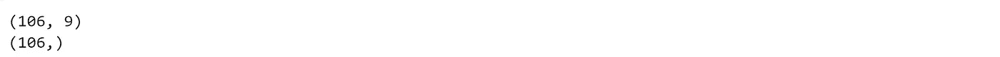

# 为乳腺组织分类构建多类分类器的分步指南

> 原文：<https://towardsdatascience.com/a-step-by-step-guide-to-building-a-multiclass-classifier-for-breast-tissue-classification-5b685d765e97?source=collection_archive---------18----------------------->

## 从头开始构建您自己的分类器

Photo by [Paweł Czerwiński](https://unsplash.com/@pawel_czerwinski?utm_source=unsplash&utm_medium=referral&utm_content=creditCopyText) on [Unsplash](https://unsplash.com/?utm_source=unsplash&utm_medium=referral&utm_content=creditCopyText)

这篇文章包含一步一步的建立和训练一个简单的多类分类模型来分类乳房组织的指南。我们将使用来自 UCI 机器学习知识库的[乳房组织](https://archive.ics.uci.edu/ml/datasets/Breast+Tissue)数据集作为我们训练和测试分类器模型的数据集。

让我们开始吧。

# 了解数据集

你可以从这个[链接](https://archive.ics.uci.edu/ml/machine-learning-databases/00192/BreastTissue.xls)下载数据集。数据集是一个带有。xls 扩展名，文件名为***breast tissue . xls .***打开文件，我们可以发现两个选项卡:描述和数据。

通读该描述，我们知道该数据集包含 106 个从乳房新切下的组织的电阻抗测量实例。该数据集有 9 个要素和 1 个类属性。每个乳房组织属于六类中的一类。

数据选项卡包含我们需要的数据。我们可以继续操作，只使用 data 选项卡创建一个新的 CSV 文件。

# 导入数据

让我们将之前保存的 CSV 文件导入到 pandas 数据帧中。

# 快速浏览数据

现在，我们已经加载了数据，我们可以看到数据的形状，找出数据中有多少个不同的类，并通过查看数值的平均值、标准偏差和百分比分布来了解数据分布的基本概念。

# 定义输入和输出

让我们把数据分成输入和输出。我们将 9 个特征作为输入 X，类作为输出 y。

# 分割训练和测试数据

现在，我们将数据集进一步划分为训练数据集和测试数据集，其中总数据集的 0.33%被划分为测试集。 *X_train* 为训练输入， *y_train* 为训练输出， *X_test* 为测试输入， *y_test* 为测试输出。

# **创建并拟合分类模型**

让我们使用 [xgboost](https://xgboost.readthedocs.io/en/latest/) python 库构建一个多类梯度提升分类器，并使用训练数据集训练分类器。

# 将训练好的模型应用于测试数据集

我们有一个经过训练的多类分类器，现在我们将使用它来预测测试集的类。我们将使用 [ROC AUC](https://scikit-learn.org/stable/modules/generated/sklearn.metrics.roc_auc_score.html) 作为该模型的评估矩阵。

# 直观比较输出

您还可以直观地比较测试数据集的预期输出和预测输出。

现在，您已经成功构建并训练了一个乳房组织分类器，它可以将给定的数据分类到六个不同的类别中。我们从 CSV 文件中提取数据，指定输入和输出，分成训练集和测试集，训练一个梯度提升分类器，并在测试集上测试它。

这里有一个[完整代码](https://github.com/sabiipoks/blog-posts/blob/master/BreastTissue_Multiclass_Classification.ipynb)的链接。

*觉得这个帖子有用吗？请在下面留下你的想法。*

[**点击这里**](https://medium.com/@sabinaa.pokhrel) 阅读我其他关于 AI/机器学习的帖子。

**数据来源:**

[https://archive.ics.uci.edu/ml/datasets/Breast+Tissue](https://archive.ics.uci.edu/ml/datasets/Breast+Tissue)

Dua d .和 Graff c .(2019 年)。UCI 机器学习知识库[http://archive . ics . UCI . edu/ml]。加州欧文:加州大学信息与计算机科学学院。

**参考文献:**

 [## sk learn . preprocessing . label binarizer-sci kit-learn 0 . 21 . 3 文档

### 以一对一的方式对标签进行二进制化。有几种回归和二进制分类算法可用于…

scikit-learn.org](https://scikit-learn.org/stable/modules/generated/sklearn.preprocessing.LabelBinarizer.html)  [## sk learn . metrics . roc _ AUC _ score-sci kit-learn 0 . 21 . 3 文档

### 根据预测得分计算受试者工作特征曲线下的面积(ROC AUC)。注意:这个…

scikit-learn.org](https://scikit-learn.org/stable/modules/generated/sklearn.metrics.roc_auc_score.html)