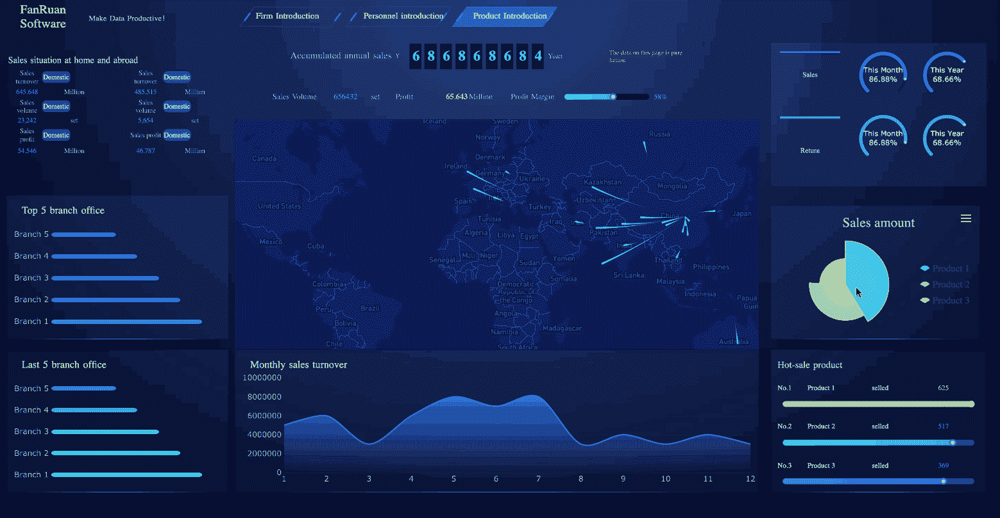
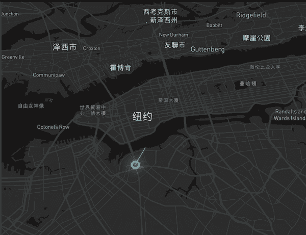
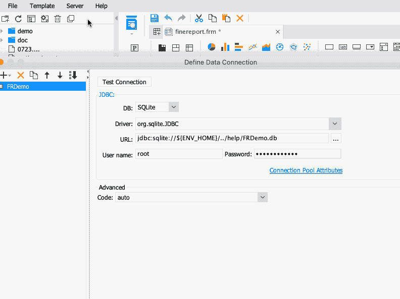

# 制作销售仪表板的分步指南

> 原文：<https://towardsdatascience.com/a-step-by-step-guide-to-making-sales-dashboards-34c999cfc28b?source=collection_archive---------7----------------------->

我写过一些关于 [**业务仪表盘**](/a-beginners-guide-to-business-dashboards-981a8192a967) 数据可视化的入门指南，但是那些文章还是有点理论化。最近，我一直在做一个数据可视化的销售仪表板项目。从指标的确定、版面设计、图表类型到动态效果，我总结了一些经验和看法。在本帖中，我将与你分享制作**销售仪表板**的具体步骤。

# **1。制作仪表盘的工具**

仪表板[的生产](http://www.finereport.com/en/features/tv-dashboard?utm_source=medium&utm_medium=media&utm_campaign=blog&utm_term=A%20Step-by-Step%20Guide%20to%20Making%20Sales%20Dashboards)可以通过代码开发或现有的可视化工具来完成。很多人会用 JS 和 Ecahrts，但通常涉及到数据支持、后台响应、实时更新、平台运维等。，需要更多的技术，这里就不赘述了。

另一种方法是使用现成的可视化工具。使用像 [FineReport](http://www.finereport.com/en/?utm_source=medium&utm_medium=media&utm_campaign=blog&utm_term=A%20Step-by-Step%20Guide%20to%20Making%20Sales%20Dashboards) 或 [Tableau](https://www.tableau.com/) 这样的工具来构建业务仪表板是相对简单和高效的。由于自己的工作需要，对 FineReport 的操作比较熟悉，所以本文中我将向大家展示的是我是如何使用 FineReport 制作销售仪表盘的。

# **2。确定分析指标**

观看销售仪表盘，你可能会被[酷炫的视觉效果](http://www.finereport.com/en/features/data-visualization?utm_source=medium&utm_medium=media&utm_campaign=blog&utm_term=A%20Step-by-Step%20Guide%20to%20Making%20Sales%20Dashboards)所吸引。但是，请记住，仪表板必须基于数据的呈现，任何酷的效果都不能影响数据的有效显示。

因此，我们应该首先考虑哪些数据和哪些指标应该放在仪表板上。您可以使用关键指标分解方法来确定要显示哪些数据。

**步骤 1** :识别关键指标。对于销售仪表盘来说，你的总销售额一定是最重要的，这是主题。

**第二步**:从多个维度分解关键指标，也就是分解你的销售额。

*   从时间维度来看。每个季度或每个月的销售情况如何？为什么有些时间段销量特别高？采取了哪些措施？
*   从地理维度来看。各地区销售情况如何？他们的排名是什么？
*   从规划的角度来看。现在的销售和之前的计划有什么区别？
*   从比例维度来看。每个产品的销量如何？哪些是最赚钱的明星产品？

# **3。设计布局**

一般情况下，一个指标独占仪表盘上的一个区域，所以通过关键指标的定义，你就知道仪表盘上会显示什么内容，仪表盘会分成多少块。您可以根据业务场景确定指标的重要性，然后设计仪表板的布局。

布局的目的是合理地呈现业务指标和数据。有主次指标。一级指标反映的是核心业务，二级指标用于进一步细化，所以在设计布局时赋予了不同的权重。

这里我推荐几种常见的布局。

# **4。选择图表类型**

关键指标确定后，我们需要确定指标的分析维度。数据能否分析透彻，能否为决策提供支持，取决于指标的分析维度。我们常见的分析方法有类比、趋势、分布、构成等。分析方法的选择取决于实际的业务场景。

以购物中心的数据为例，我将告诉你如何选择正确的图表类型。

如果想了解更多关于图表的类型和应用，可以参考本文 [*数据可视化中的 16 大图表类型*](/top-16-types-of-chart-in-data-visualization-196a76b54b62) 。

# **5。添加动态效果**

动态效果是可视化的重要组成部分。它们使整个仪表板更具吸引力。但是过多的动态使观众眼花缭乱，它不能突出关键信息。所以需要注意动态设计的比例。

动态效果的范围很广。有动态图像、页面旋转、列表滚动、实时数据更改等等。以下是 [FineReport](http://www.finereport.com/en/?utm_source=medium&utm_medium=media&utm_campaign=blog&utm_term=A%20Step-by-Step%20Guide%20to%20Making%20Sales%20Dashboards) 的一些内置动态效果。

# **练习**

以上是制作仪表盘的基本步骤。说到这里，我将向您展示我如何使用 FineReport 来制作销售仪表板。

## ①导入数据

首先，我们准备数据并将其导入 FineReport Designer。这里的数据是虚构的，因为我用的是 FineReport 的内置数据集。

如下图所示，在真实场景中，我们需要连接各种数据库来导入数据。

连接的数据可以是常见的关系数据库，也可以是 Excel 之类的文件数据。并且 FineReport 支持连接大数据平台。

## ②制作模板

一旦数据准备就绪，下一步就是创建模板。

首先，我创建一个空白模板，如下所示。原理是在空白模板上拖拽一个可视化组件(比如图表)，然后绑定数据。

在我们开始之前，我们需要考虑我们想要在这个空白界面上显示什么样的销售数据。

经过深思熟虑，我设计了以下布局。中间是主旋律，左右是副主旋律。

## ③选择可视化元素

对于销售，我们首先分析量化指标。拖放表格和图表来显示，如上所示。

在 FineReport Designer 上选择合适的图表样式，连接开始导入的数据。

## ④添加动态效果

在这个销售仪表板中，我添加了一个流程图来显示全国或全球销售业务的分布。

动态效果如下图所示，数据是销售地点的经纬度信息。

最后，经过一系列的美化设置，仪表盘就完成了。

这个销售仪表板相对简单，这里是我用 FineReport 制作的一些其他仪表板。

最后我想说，做一个仪表盘并不难。最重要的是，我们必须找出业务运营性质的关键指标，并让领导者看到数据的价值。这是数据可视化中最重要的一步。希望今天分享的文章能对你有一点帮助。如果你想自己做一个销售仪表盘，可以下载 [FineReport](http://www.finereport.com/en/?utm_source=medium&utm_medium=media&utm_campaign=blog&utm_term=A%20Step-by-Step%20Guide%20to%20Making%20Sales%20Dashboards) 来练习，这是一个零编码的可视化工具。它的个人版本是完全免费的。

# 您可能也会对…感兴趣

[数据可视化十大地图类型](/top-10-map-types-in-data-visualization-b3a80898ea70)

[初学者如何设计酷的数据可视化？](/how-can-beginners-design-cool-data-visualizations-d413ee288671)

[商业仪表盘初学者指南](/a-beginners-guide-to-business-dashboards-981a8192a967)