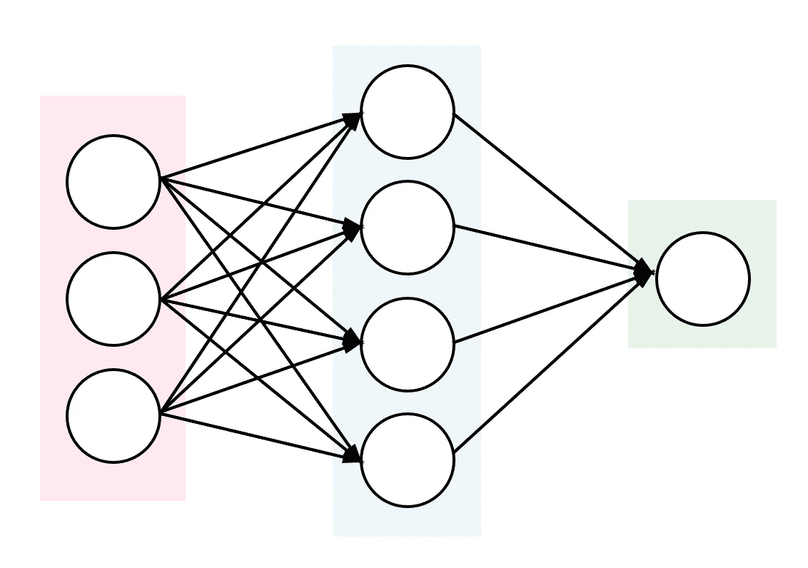

# 梯度下降和反向传播的逐步实现

> 原文：<https://towardsdatascience.com/a-step-by-step-implementation-of-gradient-descent-and-backpropagation-d58bda486110?source=collection_archive---------4----------------------->

## 从头开始构建神经网络的一个例子

这篇文章背后的初衷仅仅是我在神经网络中梳理数学，因为我喜欢精通算法的内部工作，并获得事物的本质。然后我想，与其一遍又一遍地重温记事本上的公式，我还不如编一个故事。尽管您可能会找到一些从头构建简单神经网络的教程。不同的人看待事物的角度不同，学习的侧重点也不同。另一种思维方式可能在某种意义上增强理解。所以让我们开始吧。


Photo from Unsplash

***概括地说神经网络***

神经网络的核心是一个大函数，它将一些输入映射到所需的目标值，在中间步骤中执行生成网络的操作，这是通过在一个反复执行此操作的流水线场景中乘以权重并添加偏差来实现的。训练神经网络的过程是确定一组参数，使期望值和模型输出之间的差异最小化。这是使用梯度下降(又名反向传播)来完成的，根据定义，梯度下降包括两个步骤:计算损失/误差函数的梯度，然后响应于梯度更新现有参数，这就是下降是如何完成的。重复这个循环，直到达到损失函数的最小值。这个学习过程可以用简单的等式来描述:W(t+1) = W(t) — dJ(W)/dW(t)。

***数学直觉***



Photo from [https://blog.goodaudience.com/artificial-neural-networks-explained-436fcf36e75](https://blog.goodaudience.com/artificial-neural-networks-explained-436fcf36e75)

出于我自己的练习目的，我喜欢使用一个如图所示的只有一个隐藏层的小网络。在该布局中，X 表示输入，下标 I、j、k 分别表示输入、隐藏和输出层中的单元数量；w_ij 表示连接输入到隐藏层的权重，w_jk 是连接隐藏到输出层的权重。

在这种情况下，模型输出计算如下:


损失函数的选择通常是误差平方和。这里，我使用 sigmoid 激活函数，为了简单起见，假设偏差 b 为 0，这意味着权重是影响模型输出的唯一变量。让我们推导出计算隐藏到输出权重 w_jk 的梯度的公式。


确定隐权输入的复杂性在于它间接影响输出误差。每个隐藏单元输出影响模型输出，因此对隐藏权重 w_ij 的输入取决于它所连接的所有单元的误差。推导开始也一样，只是把 z_k 处的链式法则展开到子函数上。


***更多思想:***

请注意，两个权重的梯度具有相似的形式。误差通过激活函数的导数反向传播，然后通过来自前一层的输入(激活输出)加权。在第二个公式中，来自输出层的反向传播误差被进一步投影到 w_jk 上，然后重复相同的反向传播方式并通过输入进行加权。这种反向传播过程一直重复到任意层神经网络的第一层。***“因此，关于每个参数的梯度被认为是参数对误差的贡献，并且应该在学习期间被否定。”***

将上述过程编写成代码:


以下是完整的示例:

```
import numpy as npclass NeuralNetwork:
    def __init__(self):
        np.random.seed(10) # for generating the same results
        self.wij   = np.random.rand(3,4) # input to hidden layer weights
        self.wjk   = np.random.rand(4,1) # hidden layer to output weights

    def sigmoid(self, x, w):
        z = np.dot(x, w)
        return 1/(1 + np.exp(-z))

    def sigmoid_derivative(self, x, w):
        return self.sigmoid(x, w) * (1 - self.sigmoid(x, w))

    def gradient_descent(self, x, y, iterations):
        for i in range(iterations):
            Xi = x
            Xj = self.sigmoid(Xi, self.wij)
            yhat = self.sigmoid(Xj, self.wjk)
            # gradients for hidden to output weights
            g_wjk = np.dot(Xj.T, (y - yhat) * self.sigmoid_derivative(Xj, self.wjk))
            # gradients for input to hidden weights
            g_wij = np.dot(Xi.T, np.dot((y - yhat) * self.sigmoid_derivative(Xj, self.wjk), self.wjk.T) * self.sigmoid_derivative(Xi, self.wij))
            # update weights
            self.wij += g_wij
            self.wjk += g_wjk
        print('The final prediction from neural network are: ')
        print(yhat)if __name__ == '__main__':
    neural_network = NeuralNetwork()
    print('Random starting input to hidden weights: ')
    print(neural_network.wij)
    print('Random starting hidden to output weights: ')
    print(neural_network.wjk)
    X = np.array([[0, 0, 1], [1, 1, 1], [1, 0, 1], [0, 1, 1]])
    y = np.array([[0, 1, 1, 0]]).T
    neural_network.gradient_descent(X, y, 10000)
```

参考资料:

1.  [https://theclevermachine . WordPress . com/2014/09/06/derivation-error-back propagation-gradient-descent-for-neural-networks/](https://theclevermachine.wordpress.com/2014/09/06/derivation-error-backpropagation-gradient-descent-for-neural-networks/)
2.  [https://towards data science . com/how-to-build-your-own-your-own-neural-network-in-python-68998 a08e 4 f 6](/how-to-build-your-own-neural-network-from-scratch-in-python-68998a08e4f6)