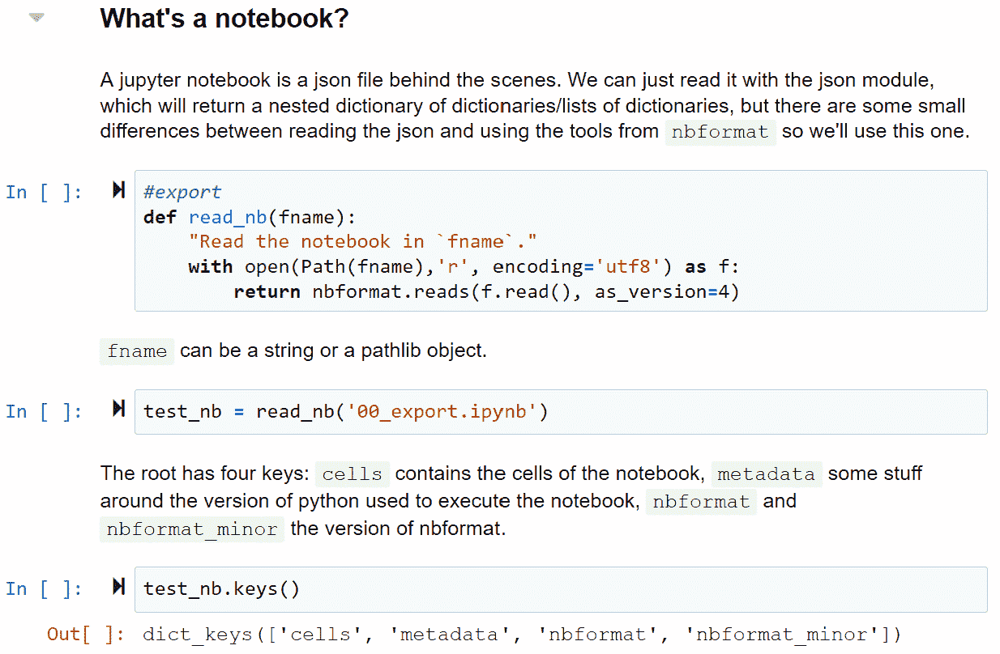
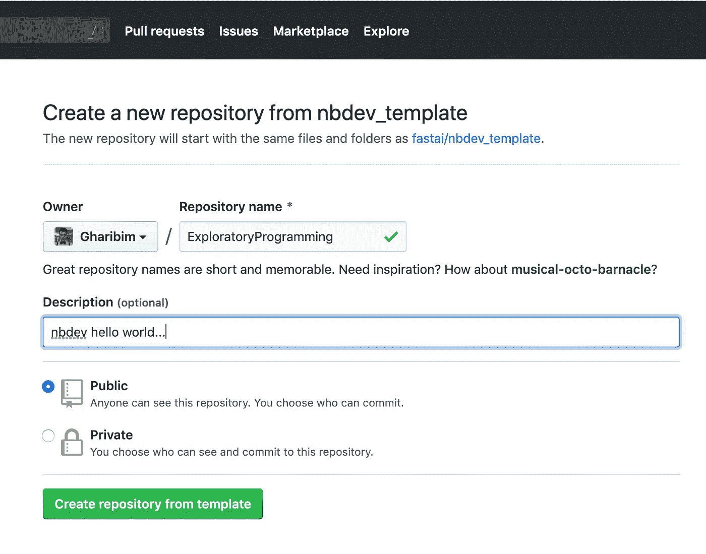
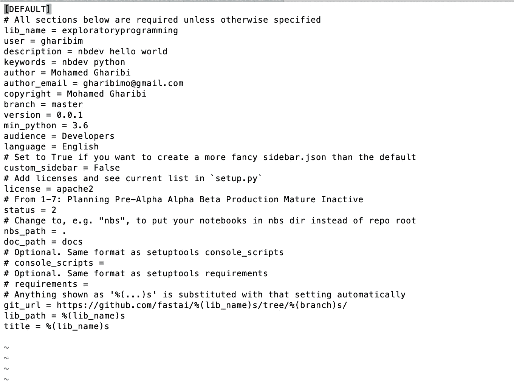
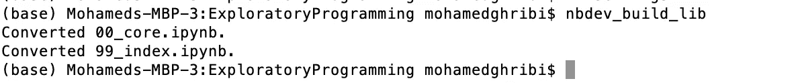
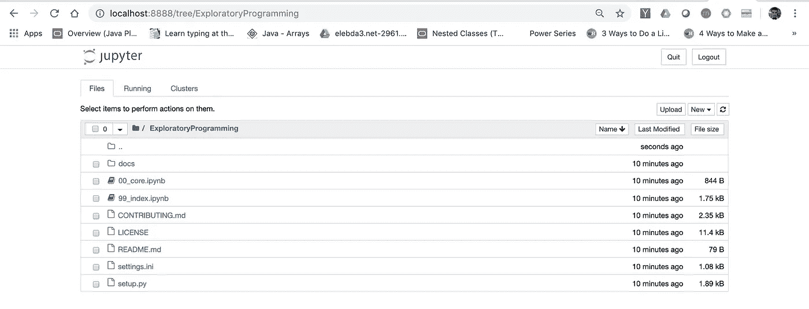
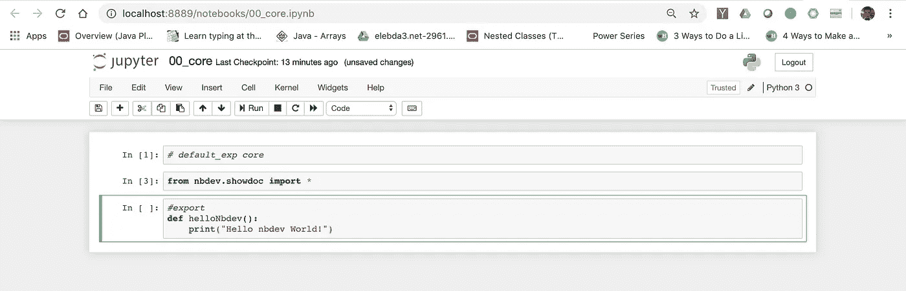
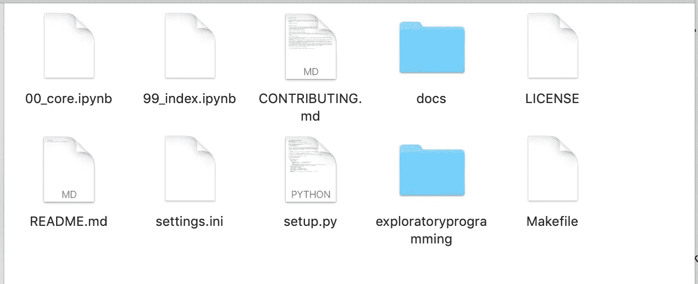
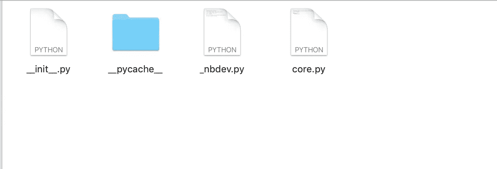

# 开始 nbdev 的逐步介绍——探索性编程

> 原文：<https://towardsdatascience.com/a-step-by-step-introduction-to-starting-nbdev-exploratory-programming-4a761ed1f796?source=collection_archive---------22----------------------->

## 使用 nbdev 的简化 Hello World 示例

“我真的认为[nbdev]是编程环境的巨大进步”:Swift、LLVM、Xcode 和 Swift Playgrounds 的发明者克里斯·拉特纳。


Image by [Alfons Morales](https://unsplash.com/@alfonsmc10) — Unsplash

[杰瑞米·霍华德](https://twitter.com/jeremyphoward)不停地用他伟大的库给我们留下深刻的印象，例如 [Fastai](https://www.fast.ai/) (一个使用 PyTorch 的高级 API)。

今天(2019 年 2 月 12 日)杰瑞米·霍华德和[西尔万·古格](https://twitter.com/GuggerSylvain)发布了另一个令人敬畏的库[“nbdev”](/(from nbdev))，它允许在 Jupyter 笔记本上完全开发一个库，将你所有的代码、测试和文档放在一个地方。

也就是说，正如 Donald Knuth 在 1983 年所设想的那样，您现在拥有了一个真正有文化的编程环境！



*Exploring the notebook file format in the nbdev source code*

# nbdev:探索性编程(来自 nbdev)

探索性编程是一种基于观察的编程技术。在编码时，编码人员倾向于花费大量时间探索和试验不同的 API、数据、算法等。尤其是 ML 工程师，他们花了很多精力去改变超参数，并把它们记录在某个地方——实验管理。当您使用 REPL 或笔记本系统(如 Jupyter 笔记本)编码时，这样的过程更容易。但是这些系统对于“编程”部分来说并不强大。这就是为什么人们主要使用这样的系统进行早期探索，然后在项目的后期切换到 IDE 或文本编辑器。

# nbdev 的特点(来自 nbdev)

nbdev 的主要目的是将 IDE/编辑器的关键特性带到笔记本电脑中，让您不必担心整个生命周期。此外，nbdev 还提供以下功能:

*   Python 模块是按照最佳实践自动创建的，比如用导出的函数、类和变量自动定义 __all__ ( [更多细节](http://xion.io/post/code/python-all-wild-imports.html))
*   在标准文本编辑器或 IDE 中导航和编辑您的代码，并将任何更改自动导出到您的笔记本中
*   从代码中自动创建可搜索的超链接文档。您用反勾号括起来的任何单词都将被超链接到相应的文档，在您的文档站点中将为您创建一个侧栏，其中包含到您的每个模块的链接，等等
*   Pip 安装程序(为您上传到 pypi)
    测试(直接在您的笔记本中定义，并并行运行)
    持续集成
*   版本控制冲突处理

# 设置您的 nbdev (Hello World 示例)

设置 nbdev 很简单:

*   [点击此处](https://github.com/fastai/nbdev_template/generate)此链接将引导您进入 Github，在这里您只需给出一个回购名称



*   之后，克隆 repo 并编辑`settings.ini`文件以符合您的要求。不要忘记取消注释所需的行(lib_name、user 等。)



*   每次编辑后，运行命令`nbdev_build_lib`，它预装了 nbdev。



然后启动 Jupyter 笔记本，如果你在基本目录下，你应该看到以下内容:



点击`00_core.ipynb`，在这里你将创建你的第一个模块！



当您开始创建单元格和编写代码时，不要忘记以`#export`或`#exports`开始每个单元格，以显示文档中的源代码。

最后，您有两种选择，是否将下面的代码放在最后一个单元格中:

```
from nbdev.export import *
notebook2script()
```

或者运行命令:`nbdev_build_lib`

不要忘记编辑`index.ipynb`。这将被转换为您的项目自述文件，也将成为您的文档的索引。

运行命令`nbdev_build_lib`后，将创建一个新目录，其名称与您在`settings.ini`中设置的`lib_name`相同。注意`exploratoryprogramming`:



`exploratoryprogramming`的内容:



现在，您将开始创建令人惊叹的深度学习项目！如果您有任何问题或意见，请告诉我。

# 资源

*   [nbdev](https://nbdev.fast.ai/)
*   [nbdev Github](https://github.com/fastai/nbdev)