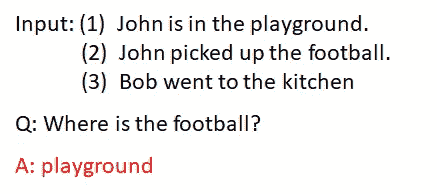
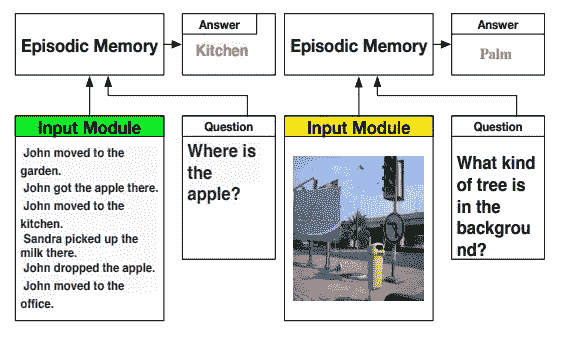

# 用动态记忆网络实现通用自然语言处理的一步

> 原文：<https://towardsdatascience.com/a-step-towards-general-nlp-with-dynamic-memory-networks-2a888376ce8f?source=collection_archive---------9----------------------->

## 用动态记忆网络和问答格式解决不同的自然语言处理任务

Image by [Pete Linforth](https://pixabay.com/users/TheDigitalArtist-202249/?utm_source=link-attribution&utm_medium=referral&utm_campaign=image&utm_content=3308188) from [Pixabay](https://pixabay.com/?utm_source=link-attribution&utm_medium=referral&utm_campaign=image&utm_content=3308188)

Source: [1]

*我假设你已经熟悉 LSTMs 和 GRUs 等递归神经网络(包括 seq2seq 编码器-解码器架构)。*

通用自然语言处理的一个障碍是不同的任务(如文本分类、序列标记和文本生成)需要不同的顺序架构。处理这个问题的一个方法是将这些不同的任务视为问答问题。因此，例如，可以向模型询问对一段文本的情感是什么(传统上是文本分类问题)，答案可以是“正面”、“负面”或“中性”之一。

论文“问我任何问题:自然语言处理的动态记忆网络”介绍了一种新的、模块化的问答体系结构。

对于复杂的问答问题，LSTMs 和 GRUs 的内存组件可能会成为瓶颈。很难一次就在内存组件中积累所有相关信息，因此，本文背后的关键思想是允许模型根据需要多次访问数据。

尽管该架构乍看起来极其复杂，但它可以被分解成许多简单的组件。

# 模块

## 语义记忆模块

语义记忆模块简单地引用单词嵌入，例如手套向量，输入文本在被传递到输入模块之前被转换成该单词嵌入。

## 输入模块

输入模块是一个标准的 GRU(或 BiGRU)，其中每个句子的最后一个隐藏状态是显式可访问的。

## 问题模块

问题模块也是一个标准的 GRU，要回答的问题作为输入，最后一个状态隐藏状态是可访问的。

## 情节记忆模块

这是对输入数据进行多次传递的模块。在每一遍中，来自输入模块的句子嵌入作为输入被馈送到情节记忆模块中的 GRU。这里，每个嵌入的句子被分配一个权重，该权重对应于其与所问问题的相关性。

不同的权重可以被分配给不同遍的句子嵌入。例如，在下面的例子中；

由于句子(1)与问题没有直接关系，因此可能不会在第一遍中给予很高的权重。然而，在第一次传递中，模型发现足球与约翰相关联，因此在第二次传递中，给予句子(1)更高的权重。

对于第一遍(或第一“情节”)，嵌入“q”的问题用于计算来自输入模块的句子嵌入的注意力分数。

句子 *sᵢ* 的注意力分数然后可以通过 softmax(这样注意力分数总和为 1)或单个 sigmoid 来获得 *gᵢ。
gᵢ* 是赋予语句*sᵢ*的权重，并在时间步长 *i.* 充当 GRU 输出的全局门

时间步 *i* 和情节 *t* 的隐藏状态计算如下:

当 *g* = 0 时，隐藏状态被简单地向前复制。也就是说，

第 *t 集的 GRU 的最后隐藏状态，*被称为 *m* ᵗ，可以被视为在第 *t.* 集期间发现的事实的聚集。从第二集开始， *m* ᵗ被用于计算第 *t+1* 集的句子嵌入以及问题嵌入 *q* 的注意力分数。

计算如下:

在 *sᵢ* 和 *q、*和 *sᵢ* 和 *m* ᵗ⁻之间计算多个简单的相似性度量，即逐元素乘法和绝对差。连接的结果然后通过 2 层神经网络来计算 *sᵢ的注意力分数。*第一集， *m⁰* 换成了q

剧集的数量可以是固定的、预定义的数量，或者由网络本身确定。在后一种情况下，一个特殊的刀路结束表示被附加到输入中。如果这个向量被选通函数选择，那么迭代停止。

## 回答模块

答案模块由一个解码器 GRU 组成。在每个时间步，与问题嵌入连接的前一个输出作为输入。

使用词汇表上的标准 softmax 生成输出。

解码器通过 *m* 向量(来自情节存储模块的 GRU 计算的最后隐藏状态)上的函数初始化。

# 应用于情感分析

该模型在发表时达到了情感分析的艺术水平。

对于下面的例子，该模型关注所有的形容词，并且当仅允许 1 次通过时，最终产生不正确的预测。然而，当允许两次通过时，该模型对第二次通过时的正面形容词给予显著更高的关注，并产生正确的预测。

Analysis of Attention for Sentiment: [1]

# 在其他数据集上的性能

Source: [1]

Source: [1]

# 开关模块

模块化的一个重要好处是，只要替换模块具有正确的接口，就可以用另一个模块替换另一个模块，而无需修改任何其他模块。

论文“用于视觉和文本问答的动态记忆网络”展示了使用动态记忆网络来回答基于图像的问题。

输入模块被另一个使用基于 CNN 的网络从图像中提取特征向量的模块代替。如前所述，提取的特征向量然后被馈送到情节记忆模块。

Source: [2]

Source: [2]

Visual Question Answering Accuracy: [2]

Attention visualisations of answers to some questions: [2]

# 额外资源

*   [斯坦福大学，cs224n，第 16 讲:问答的动态神经网络](https://www.youtube.com/watch?v=T3octNTE7Is&list=PL3FW7Lu3i5Jsnh1rnUwq_TcylNr7EkRe6&index=17)
*   [注意力及其不同形式](/attention-and-its-different-forms-7fc3674d14dc)

# 参考

[1] K. Ankit，O. Irsoy，J. Su，J. Bradbury，R. English，B. Pierce，P. Ondruska，I. Gulrajani 和 R. Socher，随便问我:自然语言处理的动态记忆网络，*(2016)。*

*[2] C .熊，S. Merity 和 R. Socher，视觉和文本问答的动态记忆网络，*(2016)。**