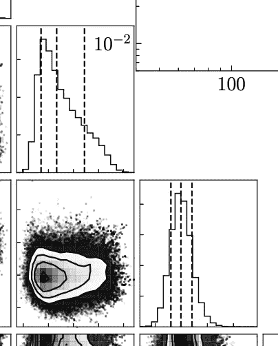
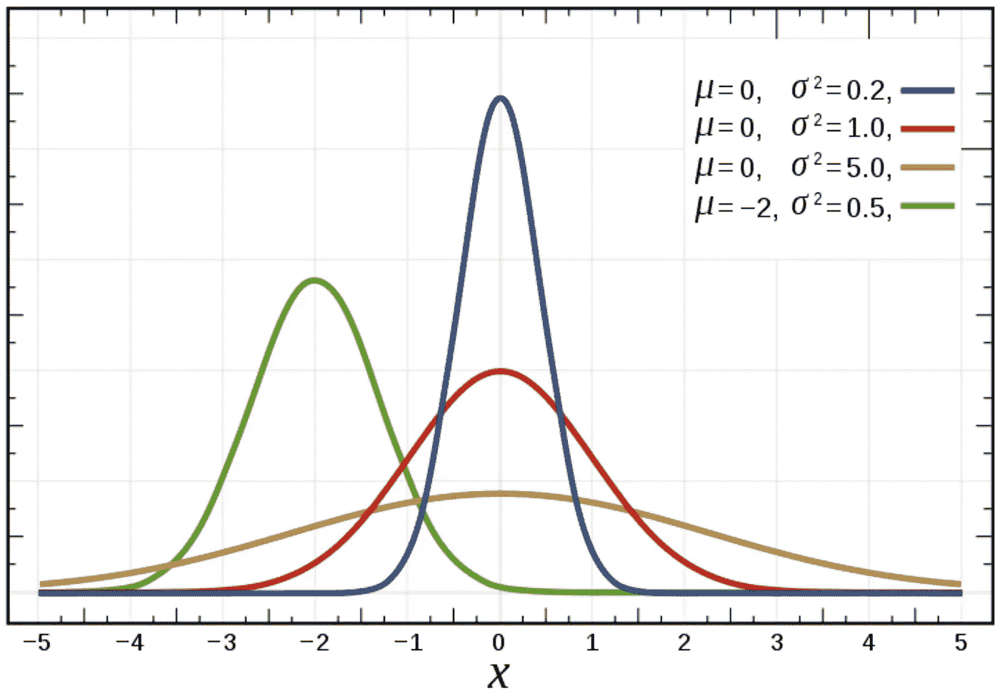
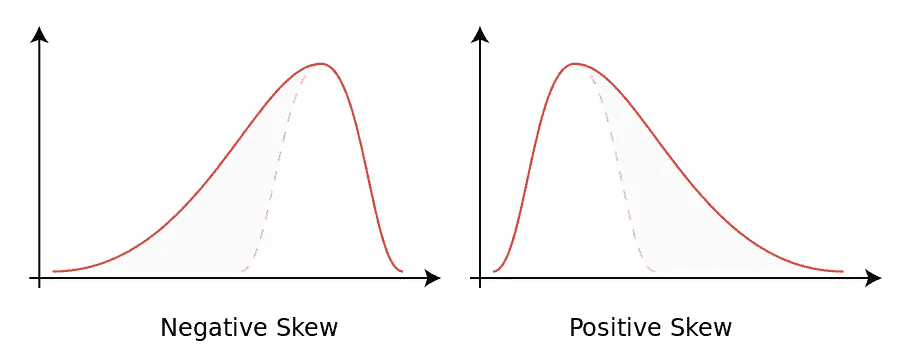
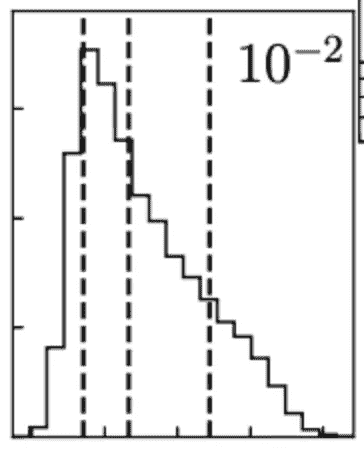
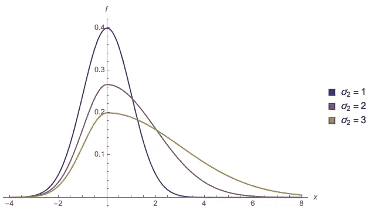
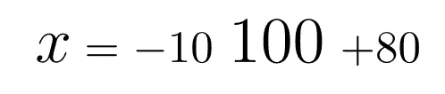

# 一针延迟——对数据科学中最大的小问题的适度修复

> 原文：<https://towardsdatascience.com/a-stitch-delayed-a-modest-fix-for-the-biggest-small-problem-in-data-science-61ac4a68e920?source=collection_archive---------22----------------------->

## 对于科学家如何报告和重复使用结果，可以说没有标准。我们已经达成了一个务实的约定，但它存在严重缺陷。在这里，我建议一种新的和几乎通用的方法来提高报告结果的可重复性，而不需要额外的成本或努力。

当使用、发布和阅读统计数据时，很容易被欺骗。

不是出于故意或恶意，而是因为对复杂概念的误解和误用。

**尽管这也很容易——一个有才华的数据科学家可以让数字说出他们想说的任何话*

今天，我想解决一个简单的概念和一个长期以来扭曲科学结果的误解，只是轻微的。

然后我想告诉你如何解决它，而几乎不用动一根手指。

我想花点时间来充分解释这篇文章的动机——但是对于那些在数据科学方面有经验的人来说，你可能想跳到**猴子**的图片来得到问题的结论和解决方案的陈述。

首先我们要问，什么是*结果*？

是什么将每份学术著作中的无数数字和图形分成*结果。我认为，也许令人困惑的是，这完全不在作者的掌控之中。结果是被其他人使用的任何数字、图形或概念。*

这就是为什么我们要小心谨慎的原因，作为作者，我们要清楚地区分结果，以及它们晦涩的表亲*汇总统计数据。*

[汇总统计](https://www.wikiwand.com/en/Summary_statistics)试图用尽可能少的数字来解释数据的分布、偏斜和形状——它们有助于作者展示和读者理解我们可能应用于任何数据集的指示性指标。它们并不试图描述数据的一般形式，只是一些相关的特征(例如，数据集的*范围*—最高值和最低值之间的差异—可能是有用的，但它不能告诉您这些值内的分布情况)。

我在这篇文章中提出的一切都适用于(或可能)被解读为结果的数字——这些数字试图代表所有数据的一般行为，可以放心地引用和重复使用。

结果是我们继承的数字。这些数字可能几十年都没有经过检验和检查。这些数字可以成为通用的说法并在全球传播。这些数字输入并影响着新的结果和新的思想，随着时间的推移不断涌现。

结果是交换的——它们是共享和给予的——我们需要知道我们所说的是公平的。

如果我们能够简单地、一般地(也许是普遍地)表达它们，那么其他人就更容易理解、评价它们并从中受益。

最少的信息中最真实的信息——我们如何用尽可能少的语言表达一些关于数据的有意义的东西？

A dataset which we might hope to describe, simply and briefly, with just a few numbers. Without intending to shame the authors or editors I shall not name the publication I’ve pulled it from (which is otherwise an excellent piece of work which this misstep barely dampens)

让我们从一个数据集开始，并从那里解释我们可能如何着手构建一个*结果，*以及不同方法的优点和危险。

左边的图片取自一份出版物。然而，让我们假设这三个面板来自我们所做的分析——让 1000 个人猜一个瓶子里有多少个球以及球的总重量。

每个人的答案可以被认为是 2D 平面上的一个位置——x 代表球的数量，y 代表重量。如果我们在每个人的 x，y 坐标上放一个大头针，我们会看到一些区域布满了大头针(希望在正确答案附近)，而一些区域几乎是空的(就像如果有人认为有 10 个球，那么它就是一公吨)。

右下角的面板显示了他们猜测的密度——就像小山上的等高线——在大多数人猜测的区域上升到一个平滑的峰值。上面和右边的图分别是 x 和 y 各自的分布(虽然不太正确，但如果我们沿着 x 和 y 方向分割，你可以把它们看作我们的山的横截面)。

我们可以看到，人们对权重的看法相对一致——大多数答案都落在一个小区域内，并且在那个区域内，分布是均匀的。

但是，球的数量会引起更多的问题。人们倾向于高估比低估多得多的数量(想象三个连续的回答者猜测 10，100 和 1000)。有一个峰值——但它周围有一个不对称性。

正是在处理这种不对称时，当前的惯例出了问题。

总结数据的最常见方法之一是查看中位数(如果我们将所有数据按升序排列，值在中间)以及第 16 个和第 84 个百分位(值大约在有序列表的 1/8 和 7/8 处)。

为什么是这些数字？16–50–84*

*这恰好是我的分类代码

它们与每一位统计学家的老朋友都有关系——正态分布[——这是一种近乎怪异的普适表示，描述了数据如何在峰值处分组，并围绕峰值均匀分布。这使我们能够只用两个值来很好地描述大量数据集——平均值(峰值)和标准差(分布)。](https://www.wikiwand.com/en/Normal_distribution)

我们可以看到，将这个应用到上面的 y 值，我们会得到一个非常好的拟合。瞧——不错的*结果，*和只用了两个数字！(我的意思是，如果我们只写下两个数字——假设平均值为 1 千克，分布范围为 200 克——你可以画出一条曲线，这条曲线看起来与我们的数据非常相似，但你从未见过它)

因此，明智地将正态分布应用于适当的数据并恢复两个数字是一个好主意。如果你能做到，那就去做！

但是很多时候，就像我们的 x 数据一样，我们不能。这两个参数没有办法描述不对称，我们需要第三个。我们有很多选择，但我想列出 3 个——好的、坏的和丑陋的。

## 丑陋的(但实际上非常好的)方法——均值、标准差和偏斜

如果我们用湿沙做一个正态分布，然后倾斜它会怎么样？

我们会得到一个[偏态分布](https://www.wikiwand.com/en/Skewness)，有两个不对称的尾部。如果我们向左倾斜沙堆，我们会得到负的偏斜(更多的分布高于平均值),向右倾斜会得到正的偏斜。

然而，我们仍然通过平均值和标准差来描述我们的数据，现在只是增加了一个额外的、深奥的参数。许多读者可能会对选择哪种偏斜是正的和负的皱起眉头，当他们被告知如何计算时更是如此。

有了这三个数字，我们几乎可以肯定*可以*重建 x 的分布——但是画出来却是一场噩梦。我们有所有需要的信息，但只是以抽象的形式——没有简单的错误栏，也没有明显的方法来引用和绘制结果。

这是一种非常好的做事方式，如果你喜欢那种方式的话，但它很丑陋，也不直观(尽管来吧)。

## 坏方法——16–50–84

我还没有兑现解释这些数字的承诺。让我们解决这个问题。

正态分布下 16%的区域位于平均值以下 1 个标准差的左侧。

正态分布下 84%的区域位于平均值上方 1 个标准差*的左侧。*

因此，如果我们有正态分布的数据，这两个数字，当与平均值比较时，告诉我们标准偏差。两次。

而当分布不是完全正态分布时，这两个数字告诉我们…什么都没有？

这里有一个基本问题——16 和 84(以及 50)是只与严格对称的正态分布相关的三个数字——然而我们试图用它们来描述一种不同的非对称分布。

我们衡量的东西和衡量的方式之间存在脱节。显然这两者之间有联系，但是从一个到另一个，我们必须采取一些非线性的步骤。这就像用种子的重量来衡量森林的生物量。那里有信息，但它被抽象成无用的。

为了更好地演示这一点，**试着根据第 16、50 和 84 百分位值画出一个分布图**。

如果你画的曲线介于 0 和一个无穷数之间，那你就没画对。这三个数字不足以约束曲线，并且**与任何型号**都不相关。

让那件事过去一会儿。

Hello grainy old friend

我们实验中 x 的分布就是一个很好的例子。这三条虚线显示的是 16–50–84%。

想象一下，拿走分布图，只留下那些——然后把这个图传给其他人，让他们解释这个分布图。

谁会看着这三条线，然后想把波峰放到左边。谁能猜出右边尾巴的长度。

如果给出结果，谁能够解释数据的真实形式。

在这一点上，你可能会想“是啊，这种方法太可怕了——为什么会有人这么做呢？”

或者你可能在想“是的，它并不伟大，但它完成了工作——不要捣乱”

第一个回应来自任何出于合理原因相信改变传统的人。

Sweden — shortly after the side of the road you drive on was legally changed

第二种人知道改变约定代价很高，会导致一段时间的混乱，通常不值得从解决一个小问题中获益。

这篇文章的标题提到了最大的小问题——这是一个小问题——可能只占百分之几的错误和误述。

显然有更好的方法，也有很多人使用，但几乎都有额外的成本。

*   你可以传递你的全部数据集——数据的完美表现，但是很沉重。它占用空间，需要时间和精力去寻找和整合，并且可能有作者很好理解但继承者可能永远不知道的细微差别。
*   您可以将您能想到的最佳模型拟合到每个数据集，这很好，但将曲线拟合到数据并不是一门完美的艺术，报告您的结果不仅需要陈述数字，还需要陈述所使用的分布以及得出分布的方法。

这两种方法都是完全合法且广泛使用的方法——但是它们需要大量的时间和精力。

16-50-84 的实用主义惯例继续存在的原因是它简单、快捷且易于理解。说明你做了什么，怎么做的，很简单。

务实的捷径惯例没有错，事实上，我认为它们通常比它们在准确性上的花费付出更多的红利(节省时间和精力)。

那么，如果我告诉你，有一种同样简单的方法(至少在计算复杂性方面)可以在任何数据集上工作，并给出很好地代表更广泛的数据形式的结果，会怎么样呢？

如果我试图提出一个新的结果报告的最低标准会怎么样？

## 好方法——直接计算分裂法线

在一轮关于模糊统计分布的公开测验中，分裂正态分布是比较容易回答的问题之一。它经常被发现、再发现和遗忘。如果你取两个不同的正态分布(每个都有自己的标准差)，把它们切成两半，然后把它们错误地拼在一起，你就会得到这个结果。

* *包括我在内，直到我发现了一份* [*的伟大文件*](https://arxiv.org/pdf/1405.4995.pdf) *详细记载了其他所有声称发现*的人

The left-hand side has a standard deviation of 1, whilst the right-hand side deviation varies. When they are both equal we just have a normal normal distribution (which is what I’ve taken to calling it to reduce confusion)

发现它的原因是，它给出了一个有用的简单方法来描述不对称分布。在三个数字中，它映射出数据的**模式***-它是峰值-以及数据从该模式的任一侧下降的速率。这三个数字是直接可见的(不像偏斜度),实际上给出了有意义的结果(不像 16–50–84)。

* *还记得你在学校学过这个吗，把它用在一个关于鞋码的问题上，然后就再也没听说过它了*

它被遗忘的原因是它只有一点点用处——有很多其他分布也很适合，有些甚至有一些更令人羡慕的属性(虽然正态分布和对数正态分布在自然界中相对常见，但分裂正态分布本质上是人工的，虽然它可以很好地描述数据，但它永远不会是“完美的”)

然而，我在这里给你一个**全新的**优势，我认为它使分裂正态分布成为一个可行的替代品，作为结果报告的最低实用标准——我找到了一种方法使它*可以直接计算*。

通过直接计算，我的意思是您可以通过少量的基本数学运算(如平均值，只需要加法，或中位数，只需要对数据进行排序)来拟合数据的分裂正态分布，而不像其他方法，您必须通过尝试一系列不同的模型并找到最佳模型(如最大似然估计)来拟合数据。

我将把如何做到这一点的完整描述留给一个[干燥机来源——我写的关于这个主题的论文](https://doi.org/10.22541/au.155733227.75726722)。

这意味着寻找分裂正态参数与 16–50–84 百分位值一样简单，而且更具代表性。

那我们该怎么办？好吧，我的建议是[开始使用它:)](https://github.com/zpenoyre/splitnormal)跟随那个链接，你会找到一个(非常基本的)python 脚本*，它可以对它建模、拟合并从中随机取样。

如果任何阅读的人知道如何将这样的东西放入 numpy(或 scipy library)中，那似乎是它的自然去处。

使用分裂法线**总是很好的**。这不是最优雅或最准确的解决方案，但它永远不会不起作用。

这一切都是为了降低获得更好工具的门槛，简化人们处理数据的方式，而不是使其复杂化。我不知道它是否会被采纳——或者是否还能提出更好的标准——但我真的希望这将有助于阻止其他人以后采用 16-50-84 的方法。

我建议任何感兴趣的人开始将这些价值观融入他们的工作中，而不是 16-50-84 方法中的 T1。两个相互竞争的标准只会让事情变得更复杂，这是为了让世界变得更简单(更准确)。

如果您这样做了，但确实想表明您对数据的处理有所不同，那么像这样引用您的值怎么样？：

对任何人来说都很容易阅读，但微妙地表明你正在使用这种约定。(并引用这个。如果你想——【https://doi.org/10.22541/au.155733227.75726722】T2

也许我说服了你，也许没有。每个人做任何事情都没有一个正确的方法。我对我认为做得不对的人的数量感到震惊——但这是一个非常主观的观点，即使如此，我也很少相信这使他们的工作或结论无效——这只是一个不幸的、普遍的、希望可以解决的问题。

俗话说，及时缝一针可省九针。这一针来得有点晚——也许只省了三四针。但是，任何微小的时间或准确性的节省，当在全世界制作、阅读和使用统计数据的人群中发挥出来时，都将拯救生命。

摆弄概念和工具。如果你认为还有更好的方法，请告诉我。重要的是，如果你是过去犯过这种错误的人，不要觉得自己被挑了出来(令人尴尬的是，我想我可能犯过)——这是一个进步的时代，而不是防御的时代。

如果你愿意，你可以在[推特](https://twitter.com/zpenoyre)上找到我，在那里我倾向于发布关于不可穿越网络的神秘笑话，但有时也是关于其他科学的。

这很可能是一个不断发展的文档——我欢迎任何人的意见，如果你回来发现它被修改了，不要感到惊讶(希望是更好的)。你正在阅读的版本是最早的草稿。