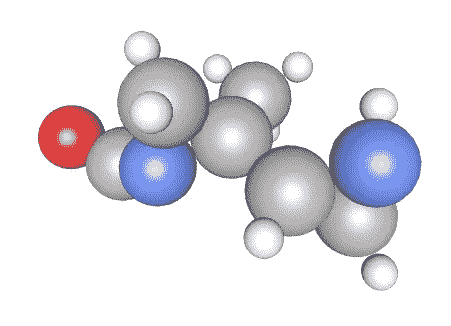

# 一个关于我在一次单人滑雪比赛中获得第一枚金牌的故事:完成的事情和吸取的教训

> 原文：<https://towardsdatascience.com/a-story-of-my-first-gold-medal-in-one-kaggle-competition-things-done-and-lessons-learned-c269d9c233d1?source=collection_archive---------7----------------------->

## 或者一个关于伟大团队的故事

参加卡格尔比赛是一项严峻的挑战。你需要花费大量的时间和努力，学习新的东西，尝试很多花样才能得高分。通常这还不够，因为有很多伟大的人，他们有更多的经验，更多的空闲时间，更多的硬件或其他一些优势(也许他们甚至拥有所有的优势)。

以前我只能在比赛中获得银牌。有时是由于运气(在重组之后)，有时是由于大量的工作。也有很多比赛我获得了铜牌(或者没有奖牌),尽管我花了很多时间在上面。

## 竞争描述

当我看到一个新的[比赛](https://www.kaggle.com/c/champs-scalar-coupling)在 5 月底开始，我立刻对它产生了兴趣。这是一场针对特定领域的竞赛，旨在预测分子中原子之间的相互作用。

这项挑战旨在预测原子之间的相互作用。核磁共振(NMR)是一种使用类似于 MRI 的原理来理解蛋白质和分子的结构和动力学的技术。

世界各地的研究人员进行核磁共振实验，以进一步了解分子的结构和动力学，涉及环境科学、制药科学和材料科学等领域。

在这个竞赛中，我们试图预测一个分子中两个原子之间的磁相互作用(标量耦合常数)。量子力学的最新方法可以计算出这些耦合常数，只要给定一个 3D 分子结构作为输入。但是这些计算非常耗费资源，所以不能总是使用。如果机器学习方法可以预测这些值，这将真正有助于药物化学家更快、更便宜地获得结构洞察力。

## 比赛的开始

我通常为新的 Kaggle 竞赛编写 EDA 内核，这次也不例外。当我在做的时候，我意识到这个比赛非常有趣和独特。我们有关于分子和它们的原子的信息，所以分子可以用图形来表示。Kaggle 竞赛中表格数据的常用方法是广泛的特征工程和使用梯度推进模型。

我在早期的尝试中也使用了 LGB，但是我知道应该有更好的方式来处理图形。这是相当迷人的，我决定认真参加这次比赛。

## 第一步

我没有领域知识(上次我关注化学公式是在学校)，所以我决定从纯 ML 技术开始:大量的特征工程，创建出折叠元特征等等。像往常一样，我用内核发表我的作品。正如你在截图中看到的，他们很受欢迎:)

当时，这种方法在排行榜上给出了相当好的分数，我能够留在银区。

## 论与时俱进的重要性

真正帮助我的事情之一是阅读论坛和内核。从比赛开始到最后，我阅读了所有的内核和论坛帖子。它们包含许多有用的信息，否则这些信息可能会被忽略。甚至不太流行的内核也可以包含有趣的新特性。小线索可能包含洞察力，这可能有助于增加分数。

## 组建团队

几乎从一开始，我就意识到领域专业知识将提供一个重要的优势，所以我搜寻每一条这样的信息。当然我注意到有几个活跃的专家，他们在论坛上写文章，创造内核，所以我从他们那里读到了一切。

有一天，我收到了鲍里斯的电子邮件，他是这个领域的专家，认为我们的技能可以互补。通常我更喜欢一个人参加一段时间的比赛，但在这种情况下，联合起来对我来说似乎是个好主意。这个决定被证明是一个伟大的决定:)

## 合并方法

我们的方法在开始时非常不同:我做技术特征工程，Boris 致力于创建描述符。一段时间后，我们意识到我的模型在一些原子对类型上工作得更好，而他的模型在其他类型上工作得更好——所以我们为不同的类型训练了不同的模型。

我们很幸运还与[菲利普·马戈利斯](https://www.kaggle.com/psilogram)合作。不久之后，他的模型显示出比我们更好的结果。

我们团队的另一名成员成为了[博扬](https://www.kaggle.com/tunguz)，我们能够进一步提高我们的成绩。

他们真的是伟大的 ML 专家，在这场比赛中与他们一起工作是一次很棒的经历。

## 图形神经网络

当时我们已经看到了神经网络在竞赛中的潜力:著名的 kaggler Heng 贴出了一个模型的例子。

过了一段时间，我甚至能够在我的电脑上运行它，但结果比我们的 LGB 模型更差。然而，我们的团队知道，如果我们想要志存高远，我们就需要使用这些神经网络。

一些辩论确定了，因此我们邀请克里斯托夫加入我们的团队。看到他能够极快地构建一个新的神经网络，真是令人惊讶。很快我们停止了对 LGB 的训练，因为他们远远落后于克里斯托夫的神经网络。

## 神经网络时代

从那时起，我的角色变成了一个支持者。我用我们的神经网络做了很多实验:尝试各种超参数，不同的架构，对训练计划或损失的各种小调整等等。有时，我对我们的预测进行 EDA，以找到我们感兴趣或错误的案例，然后我们使用这些信息来进一步改进我们的模型。

我的主要贡献之一是寻找新的方法:

*   我翻阅了很多关于神经网络架构的论文:EAGCN、3DGNN 等很多；
*   我试过各种亏，比如胡贝尔。我甚至找到了一篇关于焦点损失回归思想的论文，但是实施起来并不可行；
*   当然，我尝试了像 RAdam 和 Ranger 这样的新的热门优化器，但是简单的 Adam 在我们的情况下更好；
*   和许多其他事情；

但最终是 Christof 实现了架构，这给我留下了非常深刻的印象和启发。

## 五金器具

好的硬件对于训练这些神经网络真的很重要。我们用了很多硬件，相信我，真的很多:)但是！我们还大量使用了 kaggle 内核:你可以同时用 P100 在 4 个 kaggle 内核中训练模型(现在只有 1 个),所以即使没有额外的硬件，我们也可以获得金牌。

## 结果和结论

我们的最终解决方案确保了我们的第八名和金牌。而我现在是 kaggle 大师:)

值得注意的是，我们的团队是能够获得比-3 lmae(各种类型平均绝对误差的对数)更好的分数的团队之一。在这个[帖子](https://www.kaggle.com/c/champs-scalar-coupling/discussion/98375#569312)中，竞赛主持人写道，他们会很高兴看到比-3 更好的分数，我们做到了！

我从这次比赛中学到了很多东西，下面我想分享一些经验:

*   看内核和论坛，他们提供了很多有用的信息；
*   做好做很多失败实验的准备。当你试图寻找下一个能提高你分数的新事物时，你会测试很多想法，但大多数都不会奏效。不要气馁；
*   总是寻找新的想法，阅读新的论文和文章。你永远不知道你会在哪里找到一个新的很酷的工作想法；
*   创建一个团队将使用的验证，以便实验具有可比性；
*   一个伟大的团队由拥有不同技能的人组成，他们应该涵盖不同的领域；
*   Kaggle 比赛很有趣，尽管很累:)

我很幸运能和这些了不起的人一起工作，为此我要感谢他们！