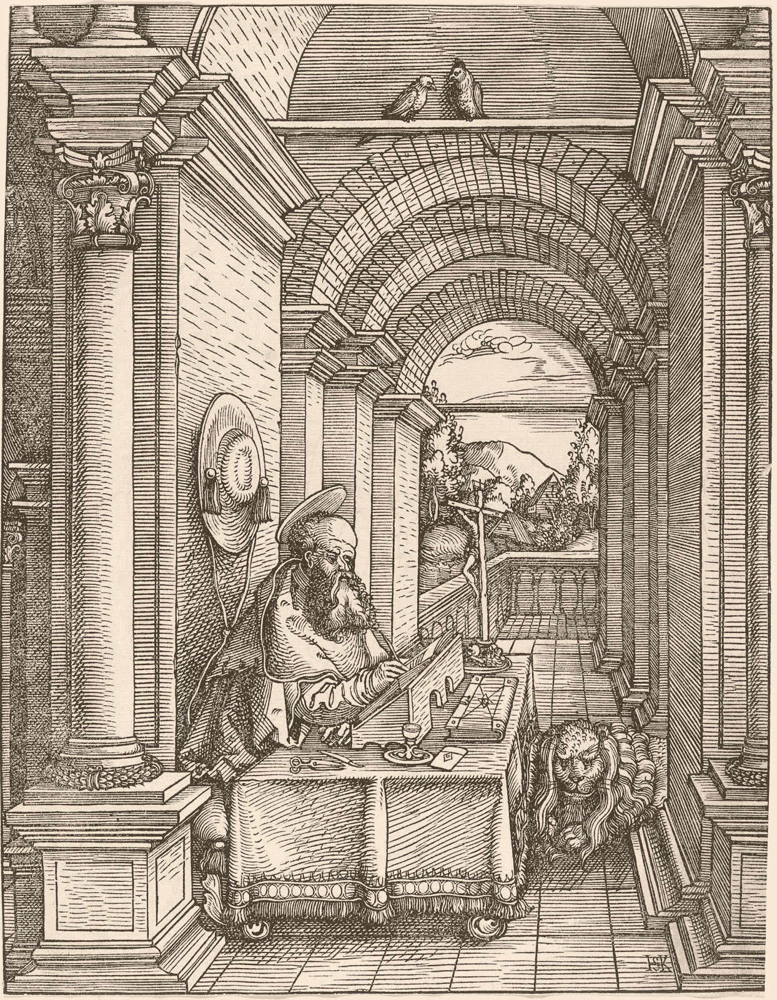

# 机器讲的故事

> 原文：<https://towardsdatascience.com/a-story-told-by-a-machine-328002e3487?source=collection_archive---------11----------------------->

## **艾写作的迂回之路**

德克·克内梅尔和乔纳森·福利特

Figure 01: Our languages and our writing mirror the societies in which we live.
[Illustration: Saint Jerome Writing by Hans Springinklee German, 1522 woodcut, National Gallery of Art, Open Access]

你可能没有意识到，但人工智能已经在编写你可能已经读过的故事了。多年来，股票简介都是由机器编写的。最近，[小联盟体育比赛总结也已经](https://www.theverge.com/2016/7/4/12092768/ap-robot-journalists-automated-insights-minor-league-baseball)。接下来是长篇故事和小说吗？在加州大学圣克鲁斯分校，人工智能研究员 Snigdha Chaturvedi 和她的团队正在设计自然语言处理模块，有朝一日将使机器能够讲述长篇叙事故事。虽然目前这项技术令人印象深刻，但离这个目标还有很长的路要走。通过他们的研究，我们可以开始更好地理解自然语言生成技术将如何成为我们生活的一部分。

Figure 02: AI is already writing stories that you’ve probably read, like minor league sports game summaries.
[Photo: [“Base hit” by Chris Chow on Unsplash](https://unsplash.com/photos/BhwRQr08PcM)]

## **语言是一面镜子**

如果我们试图标记迄今为止人工智能写作的进展，我们会发现自己处于恐怖谷阶段——至少在涉及比股票广告或棒球统计数据更复杂的故事时。就像长相接近人类的机器人，其怪异的美学令人反感，人工智能写作同样可以表现为不太像人类，粗糙，有时古怪或跑题。对于人工智能研究来说，语言是如此具有挑战性的领域，原因有很多。

> “语言是我们生活的社会的镜子，”查图维迪说。“所以，问题是当计算机科学家设计试图理解语言的算法时，他们通常不会考虑语言理解的社会方面。人类说的或做的大多数事情都由两个标准来定义:他们的个性和他们与他人的关系。”

查图维迪解释说:“人与人之间的这种关系在解释他们的行为和言语方面起着非常重要的作用。”。“如果你理解关系，你就能更好地解释人类行为。由于语言只是人类世界的反映，这将有助于理解语言。”所有这些因素都与上下文相关——这是人工智能努力解决的问题，至少在当前的实例化中是如此。人工智能在特定的专业领域可以无情地有效——例如破解国际象棋、围棋和扑克等游戏。在这些场景中，背景问题几乎无关紧要。粉碎这些竞争策略游戏的人工智能通常甚至不考虑对手。这只是看着瞬间的快照，以数学上最佳的方式行动。从计算和战略的角度来看，这是很难做到的，因为人脑基本上无法做到这一点。然而，人类擅长理解背景。如果人工智能要实现其拥护者为其设想的潜力，它必须在这一领域取得进展。

Chaturvedi 说:“在模拟或理解人际关系方面已经有了一些工作，但这是有限的。“这项工作面临两个主要挑战。第一个是超越了自然语言处理中大多数先前科学工作中使用的二元关系的主导概念。在这种二元关系的范例中，您假设关系只能有两种类型。例如，处理脸书等社交媒体数据的人会假设用户要么是朋友，要么不是。所以只有两种可能。因此，这些关系的二元性质。他们没有对人际关系做出更微妙的假设。这是因为从计算的角度，从自然语言处理的角度来看，发展这个微妙的概念更具挑战性。但是如果你想想现实世界的关系，它们并不是二元的。真实的社会关系可以有多个方面。例如，两个人可以是朋友或家庭成员，或者他们可能处于浪漫的关系中。他们可能是正式或非正式的关系。查图维迪说:“人们可能处于监督-被监督的关系中，等等。

二进制对工程师开发计算技术有重大影响。从某种意义上来说，用 1 和 0 来思考是一切开始的地方。二进制模式继续渗透到软件的行为方式中，比如查图维迪在脸书发现的粗糙的关系框架。真正的关系，其中存在一些意义和理解，要微妙得多，这又回到了问题的难度:不仅我们的各种关系是微妙的和非二元的，每个人的关系，以及他们独特的关系星系，可以与下一个人大相径庭。一刀切的方法不太可能让任何人满意。真正的理解至少需要更大的关系世界的背景和细微差别，以及一个人更小的独特世界的背景和细微差别。还有其他的问题:“这项工作的另一个主要挑战是融入人类关系的进化或变化的本质。想想看，人际关系不是一成不变的，而是随着时间而变化。例如，你七岁时的朋友可能与你现在的朋友大不相同。这在分析故事时甚至更为重要，因为各种角色之间关系的变化使故事变得有趣，”查图维迪说。

## 语境的挑战:这个故事如何结束？

那么，你如何开始解决人工智能讲故事的背景问题呢？Chaturvedi 和她的团队承担的一个研究领域是帮助机器识别一个故事的好结局。“我们试图解决的技术问题是，你有一个故事和两个结局选项，但两个选项中只有一个是正确的或更符合逻辑的，而另一个只是一个糟糕的结局。“对人类来说，这是一个非常容易解决的问题，”查图维迪说。“人类真的很擅长辨别两种结局中哪一种更合理，因为另一种选择在大多数情况下都是荒谬的。在这个项目中，我们希望看到计算机系统或人工智能算法识别明智的选择有多容易。如果计算机可以解决这个问题，这将意味着它对文本连贯性和常识性知识有所了解，以及是什么让技术变得有意义，等等。所以，事实证明，设计这样一个人工智能系统并不是一个容易的问题。”

这是一个明显的构建模块，首先，机器以某种有意义的方式开发理解故事的能力，然后潜在地开发它们自己的故事。不用说，这对写作专业人士来说意义重大。“所以这是一个具有挑战性的研究问题，因为识别好的或合理的结尾需要理解是什么让一段文字像一个故事一样连贯或合理，”查图维迪说。“如果你仔细想想，这是一个非常开放的领域问题。例如，很难雇佣一个能够写出所有规则来告诉我们是什么让一段文字连贯的人。这可能是因为我们作为人类，甚至不知道当我们判断一段文字是否连贯时，我们会考虑哪些因素。”

为了评估连贯性，Chaturvedi 和她的研究小组考虑了三个因素。首先，故事的结尾需要遵循事件的逻辑顺序。第二，完整的故事必须有一个合理的情感轨迹——发生在主角身上的事情必须有意义。最后，结尾需要和故事的主题一致。“我们提出了一个系统，可以将所有这三个因素缝合在一起……并判断一个结局是否与故事相符，”查图维迪说。“我对这个项目非常兴奋，因为它给了我一个思考文本连贯性和故事的机会。这促使我致力于一个更具挑战性的问题，即设计人工智能系统来生成完整的故事。”

Chaturvedi 描述了该团队研究的下一步:“我们正在尝试让机器与人类合作来生成一个短篇故事。所以，本质上，故事是由机器生成的，但人类是与机器合作或引导它生成特定类型的故事。从研究的角度来看，自动讲故事通常是一项非常具有挑战性的任务。它要求人工智能系统不仅能说出好的、语法正确的英语句子，而且它们必须结合在一起，形成一个连贯的故事。生成的故事需要主题一致。它应该有一个有趣的情节，有目标的人物，规则，关系等等。这个故事应该有情感流动。它应该有特定的道德价值，特定类型的结局，等等。换句话说，故事生成需要大量的规划和思考。这些挑战已经吸引了人工智能专家非常非常长的时间。”

“最近，人们对讲故事重新产生了兴趣，尤其是在自然语言处理领域，出现了一种称为深度学习算法的学习算法。这些更新、更好的算法的问题是，它们比传统的自然语言处理生成系统更难控制。在我们的工作中，我们希望通过让人类用户参与进来，对商店的再生过程有更多的控制。更具体地说，用户会告诉系统，他们希望看到故事后面发生的特定事情，系统必须一次一句地生成故事。这类似于在 Bandersnatch 中非常成功的互动讲故事的想法，这是在网飞播出的黑镜集。”

## **AI 和伟大的计算小说**

2016 年，未来大学函馆分校的松原仁史(Hitoshi Matsubara)带领团队[与人工智能](https://www.smithsonianmag.com/smart-news/ai-written-novella-almost-won-literary-prize-180958577/)合作开发了一部中篇小说，通过了日野新一文学奖的第一轮评审。法官 Satoshi Hase 认为这部小说结构良好，但其他方面有所欠缺，如人物描述。这部名为《电脑写小说的那一天》的中篇小说，是根据丹尼·刘易斯(Danny Lewis)为史密森尼杂志(Smithsonian Magazine)撰写的报道，使用以下过程写成的:首先，人类设计师写了自己的中篇小说，并将其提炼为基本组成部分:单词、句子和基本结构。基于这些参数，计算机使用一种算法从原始作品中重新混合出一部新的中篇小说。例如，它与在我们的短信中建议自动完成的技术重叠。显然，考虑到这种基本的方法，我们离竞争主要文学奖的机器还有很长的路要走。我们更多地处于工具开发阶段，在这个阶段中，应用程序不仅与让我们眼花缭乱的输出相差甚远，而且甚至不能以对实际训练有素的作者特别有用的方式运行。

Figure 03: We are a long way away from machines competing for major literary prizes. We are more in the tool development stage.
[Photo: [“Library at Orchard, Singapore” by Fahrul Azmi on Unsplash](https://unsplash.com/photos/cFUZ-6i83vs)]

一般来说，人工智能系统不擅长生成长文本。在最好的情况下，他们可以创建少量的内容，这些内容与故事中先于它的现有内容是一致的。然而，人工智能顺序生成的文本越多——它们的原始文本离它自己生成的内容之前的设定叙事越远——它就变得越不连贯。它似乎更像一个智能句子生成器，而不是一个作家。

“我们正在使用基于深度学习的系统，这些系统因理解起来非常复杂而臭名昭著。在很高的层面上，深度学习模型[是]数学表示的复杂集合，如矩阵和向量，它们相互作用，给你想要的输出。Chaturvedi 说:“虽然这种复杂性使它们变得非常强大，但数学表达方式甚至让人类专家或科学家都难以破译该系统到底是如何工作的。“现在，由于我们不了解这些模型是如何工作的，命令它们做一件特定的事情变得越来越困难，就像指示它们生成特定的故事情节一样。在我们的工作中，我们通过为这一信息提供一个特定的重要组件来引导模型包含人工监督。所以，本质上，主要的技术挑战是你如何教这些系统注意用户在说什么，用户希望故事中发生什么？他们在创作故事的时候是如何整合这些信息的？”

这是深度学习模型呈现的另一个更普遍的限制——甚至是风险。我们人类无法理解它们，也无法对它们进行逆向工程。他们的力量和潜力通过在大量数据上放松来创造他们自己的模型而被释放。但它把引擎变成了某种黑匣子，我们只有有限的机构去理解，更不用说在某些方面去调整了。不像过去的物理或机械系统，甚至更传统地由人类编写的软件，我们并不完全了解正在发生什么。

## **人工智能写作的应用**

目前用于撰写金融或体育报道的人工智能系统在本质上是有限的，至少目前如此。Chaturvedi 说:“有几家公司对自动识别新闻故事、新闻稿文档等中的关键事件感兴趣，并将其转换为故事，以便人类或算法读者可以使用。”“这个过程基本上有两个步骤。第一步，训练一个人工智能模型，从新闻稿和此类文档中自动提取相关事件。不幸的是，这些人工智能系统的输出…不一定是一种好的、自然的格式。它通常以表格的形式呈现，可以方便地存储在数据库中，但不一定以易读的方式传达全部信息。因此，第二步是将这些表格状的事件数据转换成看起来自然的英语句子或故事。这是目前商业人工智能系统不擅长的一步，在这个过程中需要大量的人工努力。”

这些故事是使用模板生成的。“你可以把模板想象成人工或半自动生成的句子或带槽的短篇故事。机器的工作是获取一个模板，但是它必须选择一个与它工作的上下文相关的模板。一旦它选择了模板，它的任务就是用相关的类似素材的事件填充这些槽。”这些刻板的模板通常不能产生流畅的、像人类一样的散文:例如，至少就目前而言，它们不能意译。正因为如此，这种模板化的人工智能故事通常类似于复制粘贴的文本。“在实践中，当这些系统输出基于模板生成的文本时，人类进入系统并平滑内容，”Chaturvedi 说。

人工智能书写系统具有大量市场应用的潜力。Chaturvedi 说:“专业作家可以利用它们来获得关于他们下一部创作作品的想法。“你可以想象出更多类似的电影，但它们会在艾的帮助下制作，而不完全是人类作家写的。它们也可以用来改进现有的电脑游戏。这种系统的交互性质可以使它们在培训和教育领域非常成功。例如，你可以用这样的系统来教孩子们语言连贯和讲故事。人工智能生成的故事也可以用来帮助记者制作新闻故事。”

因此，虽然今天人工智能写作的艺术水平仍然很粗糙，但 Chaturvedi 看到了一条前进的道路，在那里生成的文本将得到很大的改善。这是否意味着有能力的小说不会很快由人工智能产生？“那需要一些时间。目前，系统通常试图生成短文本，并且这些文本限于特定类型的领域。对于生成更长的故事，我认为我们可能需要等待几十年才能拥有完全由人工智能系统生成的故事和由人工智能系统生成的小说，”Chaturvedi 说。“问题是，当人类写长文档时，比如小说，他们在头脑中为文档准备了一个叙述计划或故事情节。Chaturvedi 说:“当他们写一个句子时，它是在他们刚刚写的上下文中，以及他们对整个文档的想法中。这一切都回到了背景的挑战。机器甚至不能记住之前整个故事的背景，甚至不能记住它自己写的故事的整个部分。

Figure 04: One day, maybe sooner than we think, AI-based generation systems will enable amateur writers to express themselves in a professional manner, making it possible for essentially everyone to be a writer.
[Photo: [“Weathered books” by Syd Wachs on Unsplash](https://unsplash.com/photos/slItfWbhijc)]

然而，Chaturvedi 设想了一个实际的未来，这种人工智能研究将发展为创意专业人士提供有用的工具，即使小说写作还有很长的路要走。“人工智能写作肯定会让职业作家的工作轻松很多。它不仅会在某些内容不正确、含糊不清或难以阅读时提供建议，还会为作者提供创造性的想法，帮助他们清除写作障碍。”有一天，也许比我们想象的更快，基于人工智能的生成系统将使业余作家能够以专业的方式表达自己，使基本上每个人都成为作家成为可能。此外，在新闻等领域，这种人工智能系统将能够大大减少记者的工作量，使他们能够专注于收集事实和有新闻价值的材料。Chaturvedi 说:“这也肯定有助于他们加快撰写报道的过程，为用户提供更多的实时新闻。”

[*Creative Next*](http://www.creativenext.org) *是一个播客，探索人工智能驱动的自动化对创意工作者，如作家、研究人员、艺术家、设计师、工程师和企业家的生活的影响。本文伴随* [*第二季第四集— AI 与增强讲故事*](https://creativenext.org/episodes/ai-augmented-storytelling/) *。*