# 微妙的闺蜜特质:通过 Spotify 和网飞了解你的闺蜜

> 原文：<https://towardsdatascience.com/a-subtle-analysis-on-couples-music-and-movie-tastes-via-spotify-netflix-df40ce274383?source=collection_archive---------19----------------------->

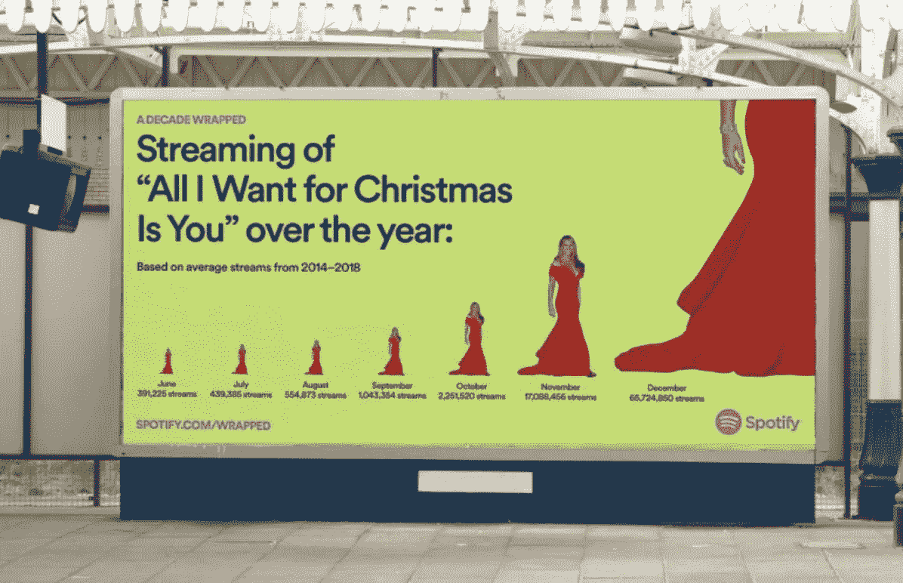

Credit to Kaleb Bruel — Head of US Consumer Marketing @ Spotify

Spotify release [2019 年结束](https://www.spotify.com/us/wrapped/)的时候已经是年底了。我惊讶于我的播放列表在全球范围内的流派和艺术家的变化。两年前我可以不停地听音乐歌曲，但今年我的音乐品味变成了流行和民谣。受 Spotify Wrapped 的启发，我决定做一个有趣的分析，不仅对我自己，也对我朋友的音乐品味进行分析，以弄清楚这些数据会给我们带来什么。

除了音乐，通过分析我们在网飞的观影历史，我很好奇我们的电影品味有多相似。通过了解这些细微差别，我可以节省决定看哪些电影或听哪些歌曲的时间，并在我们共度时光时更好地推荐我们的共同兴趣。

*是的，像其他亚洲朋友团体一样，我们分享每一个订阅账户，包括 Spotify 和网飞·:D*

你可以在这里找到我的 Github repo 的链接:

[](https://github.com/giginghn/spotify-netflix-analysis) [## 吉金恩/Spotify-网飞-分析

### Spotify release 2019 结束时是年底。我惊讶于我的播放列表在流派和艺术家方面的变化…

github.com](https://github.com/giginghn/spotify-netflix-analysis) 

# 概述

1.  数据收集
2.  数据分析
3.  机器学习方法
4.  结论

# 数据收集

1.  Spotify:

为了阅读 Spotify API，我需要通过他们的[开发者](https://developer.spotify.com/)网站申请许可和证书。然后，我在 R 中使用了一个由 Charlie Thompson 开发的名为 [spotifyR](https://www.rcharlie.com/spotifyr/) 的包装函数，从我和我朋友的 10 个最受欢迎的艺术家中提取所有专辑和歌曲。

初始数据包含 22 列，其中 595 首歌曲来自我的列表，714 首歌曲来自桑的列表。然而，重要的是承认我没有使用所有 22 个变量，而只是使用了与音频功能高度相关的变量——根据 Spotify:

- **情绪**:可跳性、效价、能量、节奏

- **属性**:响度、语音、乐器性

- **语境**:活跃度，声音

*这些功能的解释如下:*

*   **Acousticness** :一个从 0.0 到 1.0 的置信度度量，表示音轨是否是声学的。1.0 表示音轨是声学的高置信度。
*   **可跳舞性**:可跳舞性描述了一首曲目在音乐元素组合的基础上适合跳舞的程度，包括速度、节奏稳定性、节拍强度和整体规律性。值 0.0 最不适合跳舞，1.0 最适合跳舞。
*   **能量**:能量是一个从 0.0 到 1.0 的度量，代表强度和活动的感知度量。通常，高能轨道感觉起来很快，很响，很嘈杂。例如，死亡金属具有高能量，而巴赫前奏曲在音阶上得分较低。对该属性有贡献的感知特征包括动态范围、感知响度、音色、开始速率和一般熵。
*   **乐器性**:预测一个音轨是否不包含人声。“Ooh”和“aah”在这种情况下被视为乐器。Rap 或口语词轨道明显是“有声的”。乐器度值越接近 1.0，轨道不包含人声内容的可能性就越大。高于 0.5 的值旨在表示乐器轨道，但随着该值接近 1.0，置信度会更高。
*   **活跃度**:检测录像中是否有观众。较高的活跃度值表示音轨被现场执行的概率增加。高于 0.8 的值很有可能表示该音轨是实时的。
*   **响度**:音轨的整体响度，单位为分贝(dB)。响度值是整个轨道的平均值，可用于比较轨道的相对响度。响度是声音的质量，是与体力(振幅)相关的主要心理因素。值的典型范围在-60 和 0 db 之间。
*   **语速**:语速检测音轨中是否存在口语单词。越是类似语音的录音(例如脱口秀、有声读物、诗歌)，属性值就越接近 1.0。高于 0.66 的值描述可能完全由口语单词组成的轨道。介于 0.33 和 0.66 之间的值描述可能包含音乐和语音的轨道，可以是分段的，也可以是分层的，包括说唱音乐。低于 0.33 的值很可能代表音乐和其他非语音类轨道。
*   **效价**:从 0.0 到 1.0 的一个量度，描述一个音轨所传达的音乐积极性。高价曲目听起来更积极(例如，快乐、愉快、欣快)，而低价曲目听起来更消极(例如，悲伤、沮丧、愤怒)。
*   **速度**:轨道的整体估计速度，单位为每分钟节拍数(BPM)。在音乐术语中，速度是给定作品的速度或节奏，直接来源于平均节拍持续时间。

2.网飞:

我在这里下载了我们 2019 年[内的观看历史，并与](https://www.netflix.com/ViewingActivity) [Imdb 数据集](https://www.imdb.com/interfaces/)合并，提取电影属性和特征。

网飞数据集的一个缺点是它不记录重复的活动。所以如果我在 2019 年 12 月看《奇怪的事》，我在 6 月看的同一集会被 12 月的那集取代。

我最初从 Imdb 下载了 3 个数据集，每个数据集都包含电影的独特属性。出于分析目的，我将所有这些孤立的数据集集成为一个，并且只保留最重要的特征:

*   **类型** —该备选标题的枚举属性集。以下一项或多项:备选、dvd、节日、电视、视频、工作、原创、imdbDisplay。将来可能会在没有警告的情况下添加新值
*   **运行时间分钟** —标题的主要运行时间，以分钟为单位
*   **类型** —包括多达三种与标题相关的类型(纪录片、戏剧、喜剧、电视剧、真人秀、犯罪、动作、冒险、惊悚等)。)
*   **平均** —所有个人用户评分的加权平均值
*   **numVotes** —标题获得的票数

# 数据分析

1.  音乐分析

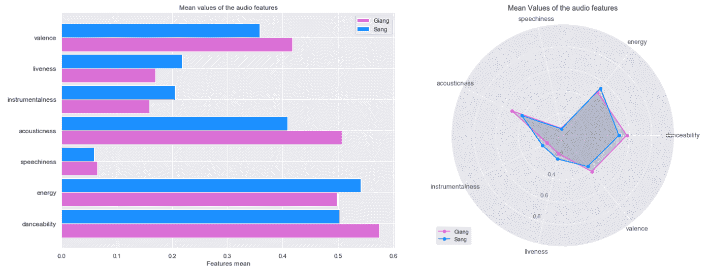

柱状图和雷达图都表明我们在音乐上有非常相似的品味，但是，我的歌有更多的声音，舞蹈性和效价(积极)，而他的歌更活泼，更有活力，更有乐器感。这证实了我在分析之前的假设，因为当我喜欢听独立音乐和民谣时，桑的音乐品味一直是越摇滚和音乐。其实我们的歌都是很高能的，暗示了我们对流行歌曲的共同品味。

速度和响度也和旋律、和声或节奏一样重要，因为它们代表了歌曲的速度和力度以及它所承载的情绪。

*比如一首歌的 BPM 和 dB 越高，这首歌的节奏越快，越强劲，就越趋于刺激和欢快。另一方面，低 BPM 和 dB 意味着歌曲速度较慢，暗示悲伤、戏剧或浪漫。*

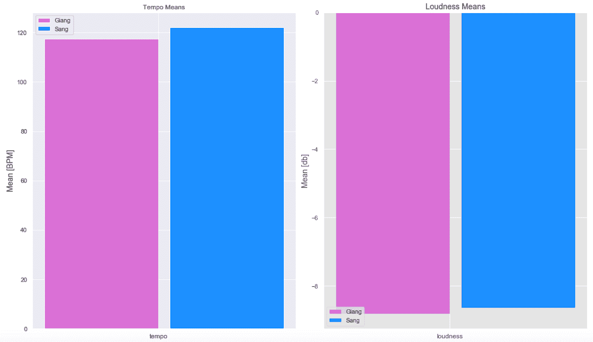

从上面的图表中可以看出，我们的播放列表的速度都接近 120 BPM，平均响度接近-9 dB，这表明速度快且充满活力。这再一次证实了我的期望，因为我们的前 10 名艺术家中的一些人有我们在锻炼或健身房中不断重复的歌曲。

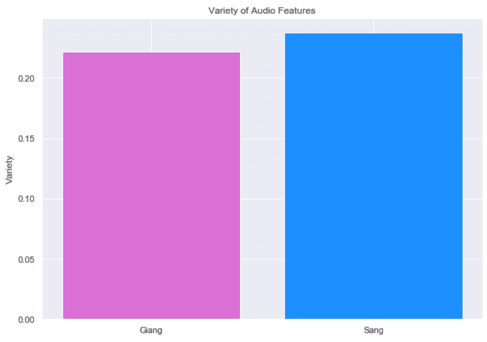

我也对我们选择音乐的多样性感到好奇。为了利用数据集中的这个因素，我计算了**标准偏差**，然后计算了所有标准偏差的**平均值**，以获得能够代表我们播放列表多样性的数字。

从上面的条形图可以看出，桑的播放列表往往比我的更多样化。通过下面的图表，我们可以更深入地了解每个功能的多样性:

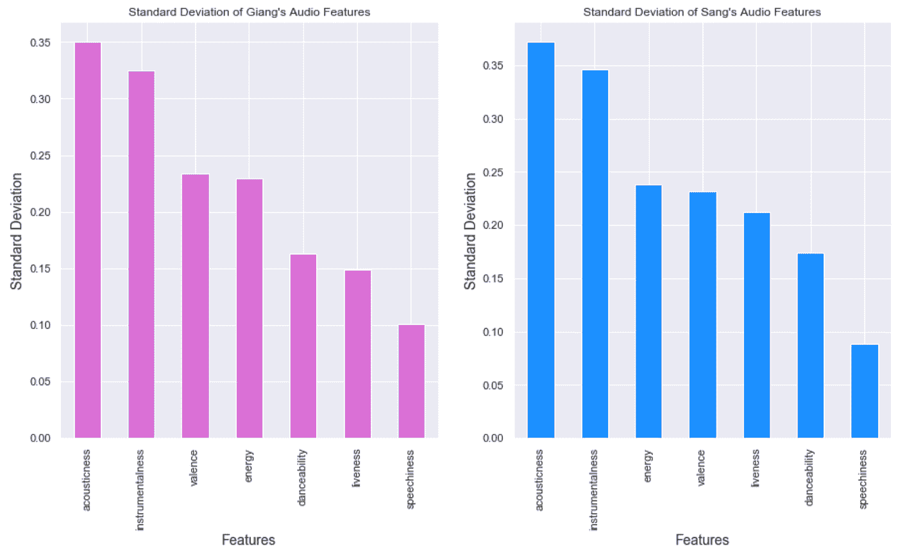

发现这些音频变量之间的线性关系也很有趣。

根据线性回归分析，当化合价增加 1 个单位时，能量和可跳舞性都增加大约 1.2 个单位。如果我们仔细观察桑的特征，他的歌曲即使在低价位也具有高能量，而我的播放列表在价位增加时具有显著更高的可跳性。

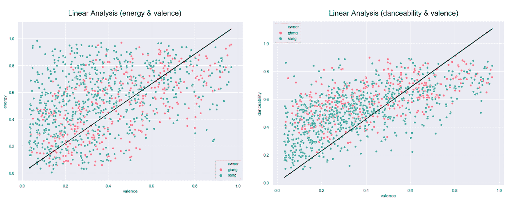

现在我们可以理解我和我朋友的音乐品味之间的细微差别，让我们直接进入我们对电影的选择。

2.电影分析

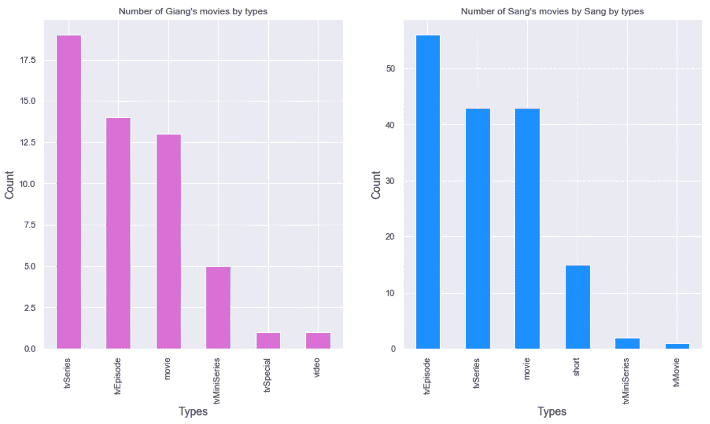

根据上面的柱状图，我和桑都喜欢电视剧，但是他比我更喜欢短片。事实上，我们的电影品味非常相似，因为我们都喜欢纪录片、喜剧、惊悚片、动作片、爱情片和剧情片。如果我们仔细看看，桑的电影列表在类型上又一次比我的更多样化。

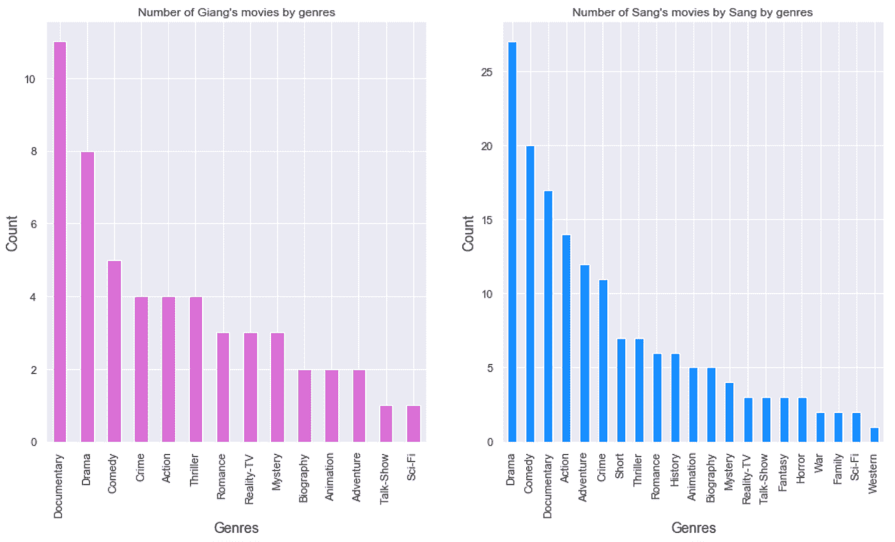

平均来说，我们欣赏的电影评分在 7.0 到 8.0 左右，但根据 Imdb，我们的电影有多受欢迎呢？《冒险》是桑的热门电影，而我的惊悚片是 Imdb 上最受欢迎的。我们俩都喜欢动作片和戏剧类的电影。

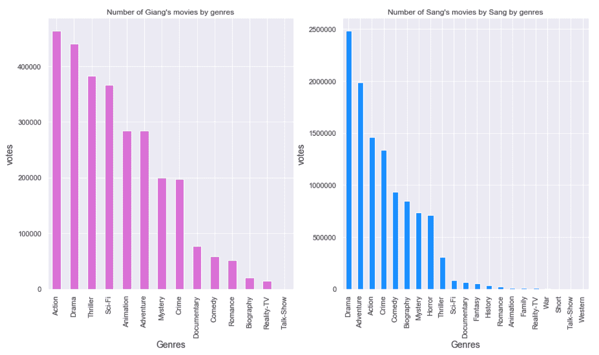

现在，我们已经对数据有了一些有意义的了解，我想在预测应用方面更进一步。

# 机器学习方法

我们知道我和桑在音乐和电影方面的品味的差异和相似之处，那么**什么是最有预测性的特征，可以准确地将一首歌或一部电影归类为更有可能被我选中或演唱？**

为了找到最具预测性的特征，我们将计算所有预测变量的特征重要性。有两种常见的特征重要性模型——随机森林和 XGBoost。

在这个特定的问题中，我将对 Spotify 和网飞数据集应用随机森林分类器，因为它们都存在共线性问题。共线性是指某些独立变量高度相关的情况，这可以通过在 Python 中可视化相关图来检测。

选择 Random Forest 而不是 XGBoost 的原因是:

*   当有几个相关的特性时，XGBoost 倾向于选择一个并在几个树中使用它，这样其他相关的特性就不会被经常使用。因此，其他相关特征在分割过程中不再有帮助，并且它们不会带来关于已经使用的特征的新信息。
*   而随机森林中的每棵树都不是由相同的特征构建的，因为每棵树都有随机选择的特征。因此，每个相关特征可能有机会在树之一中被选择。因此，学习是并行进行的，所以每个树都不知道其他树使用了什么。

在发现协变量后，我们将尝试不同的机器学习模型，看看哪一个具有最佳性能，然后我们可以在该模型上进行优化。

1.  Spotify 数据

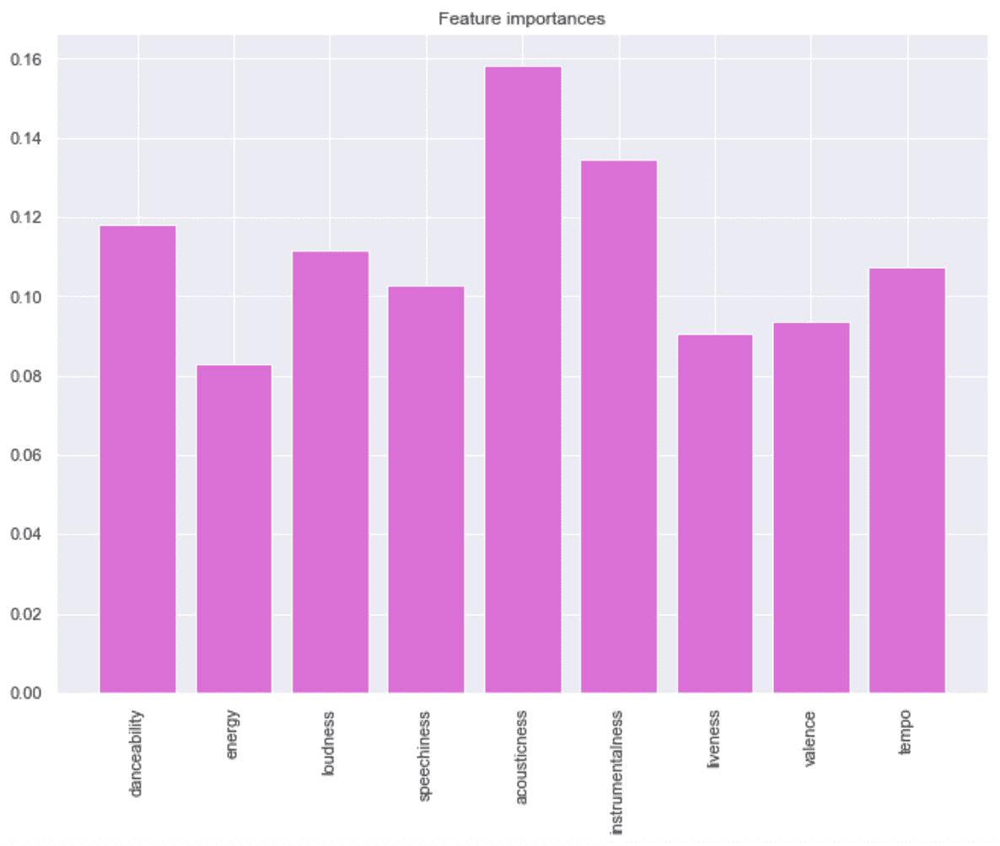

我们可以看到，声音、舞蹈性、能量、响度、活跃度、效价和节奏是歌曲分类的最具预测性的特征。

对于这个预测问题，我用分类算法来预测一首歌会被我听还是被唱。在平衡数据并将其分成训练集和验证集之后，我使用了 3 个模型:[随机森林](https://www.google.com/search?q=random+forest&oq=random+forest&aqs=chrome..69i57j69i59l2j0l2j69i60l3.3772j1j1&sourceid=chrome&ie=UTF-8)、[逻辑回归](/logistic-regression-for-dummies-a-detailed-explanation-9597f76edf46)和[线性判别分析](https://www.google.com/search?q=linear+discriminant+analysis&oq=linear+dis&aqs=chrome.0.0j69i57j0l5j69i60.2318j1j4&sourceid=chrome&ie=UTF-8)。

为了评估模型的性能，我决定访问 5 个核心[指标](https://www.analyticsvidhya.com/blog/2016/02/7-important-model-evaluation-error-metrics/)来对每个模型的质量进行评分:准确性、精确度、召回率、F1 和 AUC。

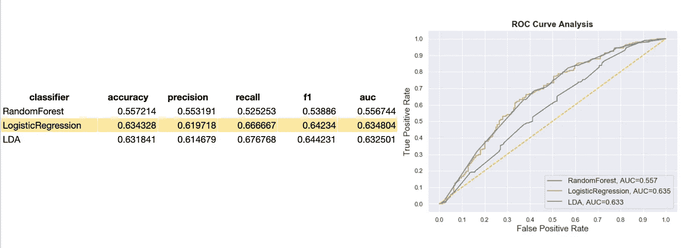

从指标和 ROC 曲线可以看出，逻辑回归在 3 种算法中表现最好。但是，可以更好！然后，我将对逻辑回归进行超参数调整，看看模型是否可以改进。

为了优化这个模型，我将使用带有不同正则项的网格搜索来调整这个模型。

```
random.seed(123)#train test split
X_train_logit, X_test_logit, y_train_logit, y_test_logit = train_test_split(os_data_X, os_data_y, test_size=0.4, random_state=0)#generate random grid with l2 penalty
grid={“C”:np.logspace(0.01,0.001,10,100,1000), “penalty”:[“l2”]}# l2 ridgelogreg=LogisticRegression(solver=’lbfgs’)
logreg_cv=GridSearchCV(logreg,grid,cv=5)
logreg_cv.fit(X_train_logit,y_train_logit)#choosing the best parameters
logreg_cv.best_params_,logreg_cv.best_score_
```

然而，即使在调优之后，该模型也没有显著的改进。为了简单起见，我们可以将原始模型作为性能最好的模型。

2.网飞数据

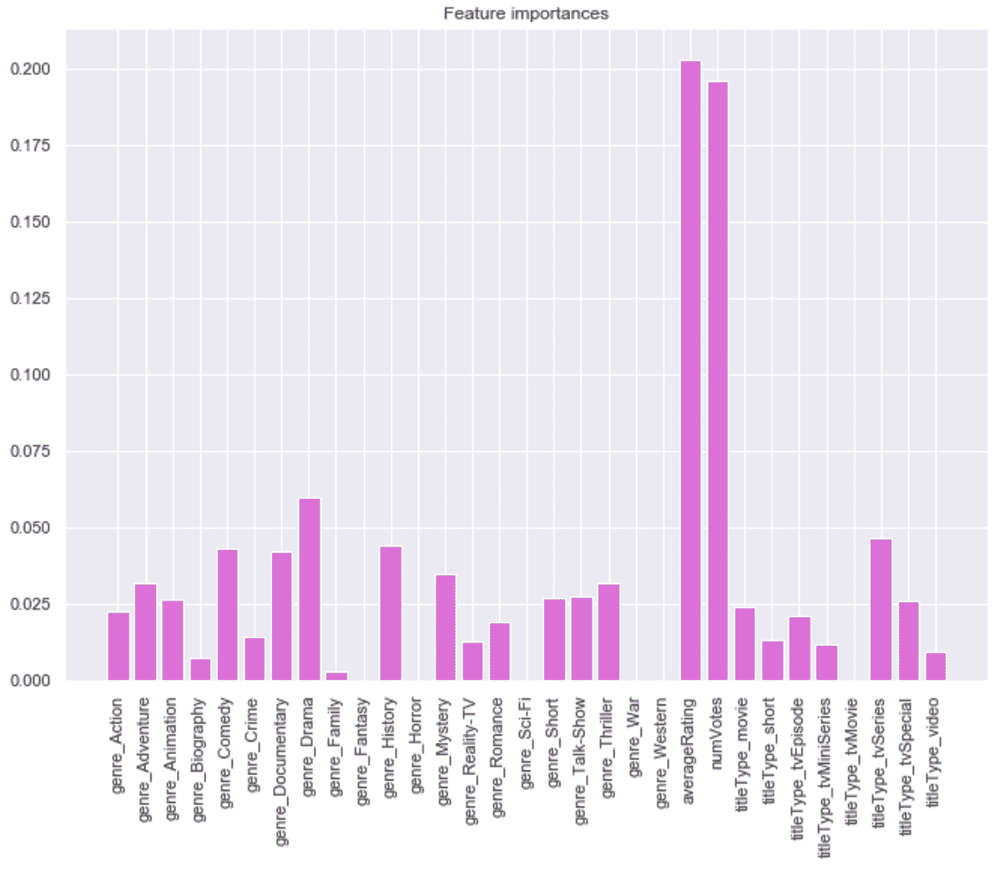

从上面的特征重要情节可以清楚地看出,( 1)动作片、冒险片、喜剧片、纪录片、电视剧、真人秀是最具预测性的类型,( 2)电视剧是最具标题类型预测性的类型,( 3)平均评分和投票数是最具预测性的协变量，用于对哪部电影可能被我或桑观看进行分类。

同样，我将使用分类算法来预测一个移动是否会被我或桑观看。在上采样以平衡数据并将其分成训练集和验证集之后，我使用了两个模型:[随机森林](https://www.google.com/search?q=random+forest&oq=random+forest&aqs=chrome..69i57j69i59l2j0l2j69i60l3.3772j1j1&sourceid=chrome&ie=UTF-8)和[线性判别分析](https://www.google.com/search?q=linear+discriminant+analysis&oq=linear+dis&aqs=chrome.0.0j69i57j0l5j69i60.2318j1j4&sourceid=chrome&ie=UTF-8)。

为了评估模型的性能，我将再次应用 5 个核心[指标](https://www.analyticsvidhya.com/blog/2016/02/7-important-model-evaluation-error-metrics/)对每个模型的质量进行评分。

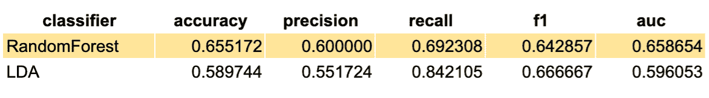

从指标来看，随机森林分类器显然是赢家。AUC 分数为 65.8%，准确性分数为 65.5%，该模型在仅使用默认参数的测试集上表现相当好。我仍然相信这个模型可以通过超参数调整得到进一步改进。

我将再次应用网格搜索来寻找模型优化的最佳参数。

```
# Number of trees in random forest
n_estimators = [int(x) for x in np.linspace(start = 200, stop = 2000, num = 10)]# Number of features to consider at every split
max_features = [‘auto’, ‘sqrt’]# Maximum number of levels in tree
max_depth = [int(x) for x in np.linspace(10, 110, num = 11)]
max_depth.append(None)# Minimum number of samples required to split a node
min_samples_split = [2, 5, 10]# Minimum number of samples required at each leaf node
min_samples_leaf = [1, 2, 4]# Method of selecting samples for training each tree
bootstrap = [True, False]# Create the random grid
random_grid = {‘n_estimators’: n_estimators,
               ‘max_features’: max_features,
               ‘max_depth’: max_depth,
               ‘min_samples_split’: min_samples_split,
               ‘min_samples_leaf’: min_samples_leaf,
               ‘bootstrap’: bootstrap}#train test split
X_train_rf, X_test_rf, y_train_rf, y_test_rf = train_test_split(os_data_X, os_data_y, test_size=0.4, random_state=0)# Use the random grid to search for best hyperparameters
random.seed(123)# Create the base model to tune
rf = RandomForestRegressor()# For random search of parameters, using 5 fold cross validation,
# search across 150 different combinations, and use all available coresrf_random = RandomizedSearchCV(estimator = rf, param_distributions = random_grid, n_iter = 30,cv = 5, verbose=2, random_state=42, n_jobs = -1)# Fit the random search model and select the best param
rf_random.fit(X_train_rf, y_train_rf)
rf_random.best_params_, rf_random.best_score_
```

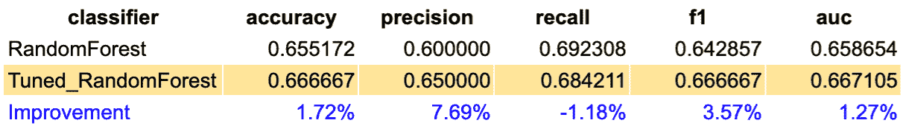

当我应用调整后的参数时，性能有了显著的提高，尤其是在精度方面，提高了 7.69%。

# 结论

通过探索性的数据分析和机器学习分析，我发现了自己的音乐和电影品味，同时更多地了解了朋友喜欢的流派。

据此，我可以断定，无论是歌曲还是电影，他的榜单都比我更加多元。此外，我的歌曲意味着更多的声音，舞蹈性和效价(积极)，而他的歌曲更活泼，更有活力和乐器。另一个见解是，当我反复重复电视节目时，桑更喜欢短片。

为了更深入地进行分析，我找到了最具预测性的特征，这些特征可以准确地将一首歌或一部电影分类为更有可能被我选择或演唱，并相应地将其输入机器学习模型。在尝试了不同的模型来预测歌曲是否会出现在我或桑的播放列表中之后，表现最好的模型是逻辑回归。另一方面，对电影列表进行分类的最佳模型是具有调整参数的随机森林。

总的来说，我对我的发现非常满意，希望我的分析能够有意义，并对预测网飞和 Spotify 上共享帐户的歌曲或电影产生影响，以进一步改善用户体验！

*参考:*

*   [https://towards data science . com/a-music-taste-analysis-using-Spotify-API-and-python-e52d 186 db 5 fc](/a-music-taste-analysis-using-spotify-api-and-python-e52d186db5fc)
*   [https://medium . com/ml review/Spotify-analyzing-and-predicting-songs-58827 A0 fa 42b](https://medium.com/mlreview/spotify-analyzing-and-predicting-songs-58827a0fa42b)