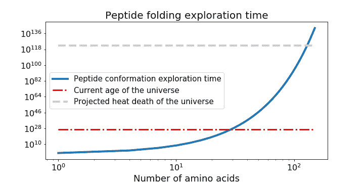
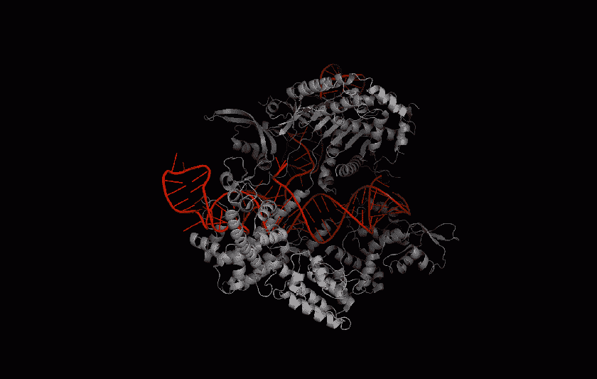
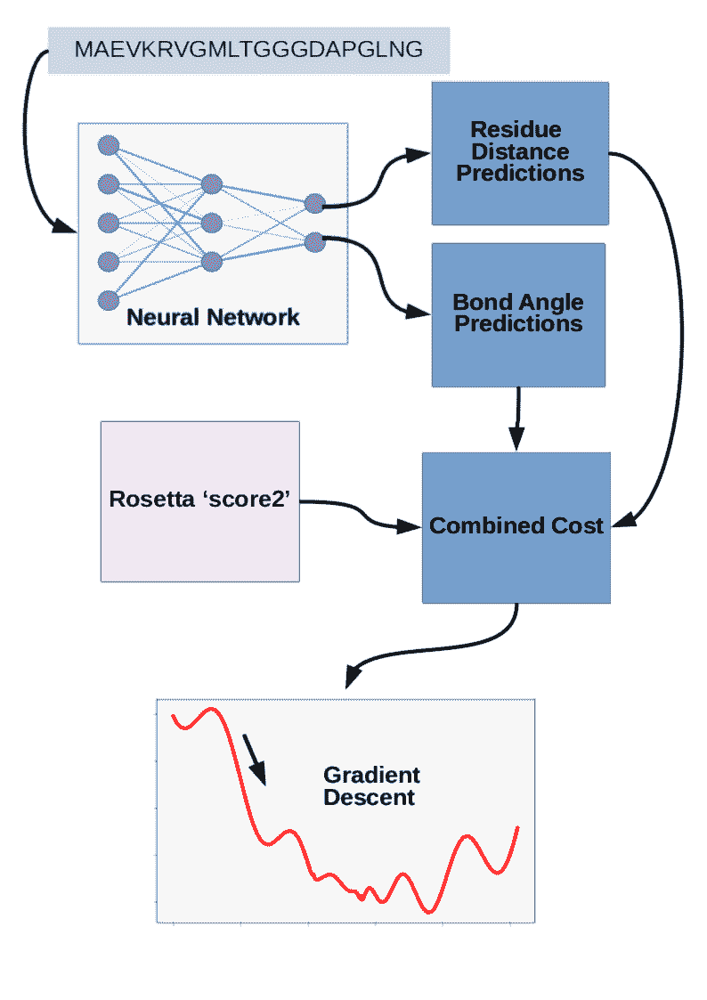

# 在 CASP13 | Exxact 博客上总结了 DeepMind 的蛋白质折叠打乱

> 原文：<https://towardsdatascience.com/a-summary-of-deepminds-protein-folding-upset-at-casp13-exxact-blog-f13a08316573?source=collection_archive---------34----------------------->

在去年的蛋白质结构预测竞赛的关键评估( [CASP13](http://www.predictioncenter.org/casp13/index.cgi) )中，来自 DeepMind 的研究人员通过以相当大的优势在[自由建模类别](http://predictioncenter.org/casp13/zscores_final.cgi?formula=assessors)中占据首位而成为[的头条](https://www.theguardian.com/science/2018/dec/02/google-deepminds-ai-program-alphafold-predicts-3d-shapes-of-proteins)，基本上是最近竞赛中 CASP 预测进展速度的两倍。这令人印象深刻，这是一个令人惊讶的结果，就好像一个以前没有参与深度学习的分子生物学实验室要在现代机器学习基准测试中彻底击败有经验的从业者一样。

# 蛋白质结构预测问题

生物机器被编码为信息序列。所谓的[分子生物学的中心法则](https://en.wikipedia.org/wiki/Central_dogma_of_molecular_biology)认为，DNA 序列决定 RNA 序列，而 RNA 序列又决定蛋白质序列，因此当它们折叠成生物纳米机器时，结构就会产生生物特征。这是我们在这篇文章中关注的最后一步:预测蛋白质的三维结构，这反过来又构成了生命力学的基石。

想象一下，当你第一次看到一只折纸鹤，并试图对用来制作它的褶皱进行逆向工程时，你得到的只是一张展开的纸，上面覆盖着用外语写成的寓言提示。现在想象一下，这个逆向工程问题意味着用 1D 线而不是 2D 线折出一只鹤，而且它实际上是一只真正的鸟。这应该让你对蛋白质结构预测的难度有所了解。考虑一个短的多肽链，其中 100 个氨基酸之间的连接只能采用两个角度的三个值。每一个可能的肽结构构象花费 1 纳秒的时间将比宇宙的年龄长几个数量级，这是一个被称为[莱文塔尔悖论](https://en.wikipedia.org/wiki/Levinthal%27s_paradox)的思想实验。

*研究肽结构的蛋白质折叠时间图研究时间给定两个自由度和每个肽键的 3 个可能位置，并假设花费 1 纳秒对每个构象进行采样。*

蛋白质结构预测是一个困难的问题，但潜在的影响是巨大的。蛋白质是细胞中结构和运动功能的所在地，也是生命复杂生物化学的信号载体和酶促指挥者。例如，蛋白质酶在称为活性位点的纳米级口袋中协调分子水平的化学反应。准确预测活性位点的结构以及它如何受到突变和小分子的影响，可以更好地为药物发现和蛋白质治疗提供信息。举个高调的例子，我们看看 Cas9，CRISPR 基因编辑中用来剪辑 DNA 的活性蛋白。2012 年 CRISPR/Cas9 作为遗传工具的演示承诺开放我们的生物源代码，但其潜力受到缺乏靶向特异性的限制，因为使用 Cas9 会增加[导致非靶向 DNA 链](https://www.nature.com/articles/nbt.2623)突变的风险。理解 Cas9 的结构是[设计基于 CRISPR/Cas9 的基因编辑系统](https://www.nature.com/articles/s41467-018-05477-x)以获得更好的特异性的关键部分。

*Cas9 蛋白(灰色)与指导 RNA(红色)和靶 DNA(橙色)复合。蛋白质数据库蛋白质结构* [*4008*](https://www.rcsb.org/structure/4oo8)

确定给定蛋白质的结构是一个资源和时间密集型过程，有大量的试错空间，并且绝大多数已知蛋白质都没有已知的结构。虽然蛋白质序列的数量遵循类似于其他以数据为中心的领域的指数轨迹，但已知蛋白质结构的数量正在以更快的速度增长。

# DeepMind 的方法

来自 DeepMind，我们可能会期待一个用于蛋白质结构预测的大规模端到端深度学习模型，但我们错了。深度学习只是结构预测过程的一个方面，最终的结构实际上是梯度下降优化的结果。DeepMind 团队尝试了一种“fancier”策略，涉及使用生成式对抗网络(GANs)进行片段组装，但最终通过梯度下降优化获得了最佳结果。梯度下降被应用于来自他们的深度学习模型以及分子建模软件 [Rosetta](https://www.rosettacommons.org/) 的分数组合。在[摘要](https://deepmind.com/documents/262/A7D_AlphaFold.pdf)中，碎片组装法和梯度下降法分别称为方法 1 和方法 2。

## 方法 1:片段组装

蛋白质的整体结构是由更小的片段结构单元组合而成；这些亚单位在某种程度上是模块化的，并形成在不同蛋白质和蛋白质家族中稍加修改即可重复使用的基序。这是使用多序列比对作为大多数蛋白质结构预测模型的一部分的主要原因。通过将新的蛋白质序列与具有已知结构的序列数据库进行比较，以具有相似序列的蛋白质中形成的结构为模板，可以推断出新蛋白质的亚结构。

值得注意的是，虽然 DeepMind 在他们的方法中使用了多序列比对，但他们没有使用任何模板。也就是说，虽然他们确实将这些序列与已知蛋白质片段序列的数据库进行了比较，但他们没有直接借用与这些序列相关的结构。他们使用一个生成神经网络来产生候选碎片，以插入到一个使用[模拟退火](https://en.wikipedia.org/wiki/Simulated_annealing)的更传统的结构优化工作流程中。虽然 GANs 在过去几年中已经相当成熟，在[重新生成图像](https://arxiv.org/abs/1809.11096)等任务上取得了令人印象深刻的结果，但在这种情况下，结果并不是最先进的。为此，DeepMind 将结合新旧技术，采用深度学习进行评分，梯度下降进行目标优化。

## 方法 2:深度学习分数的梯度下降

DeepMind 获奖项目的核心深度学习方面是一个神经网络，它可以预测氨基酸对之间的可能距离，以及连接氨基酸残基的每个肽键的角度。然后，这两个预测与来自 Rosetta 建模软件的“score2”一起被合并成一个分数，随后是梯度下降，以直接最小化组合目标成本。这有点不公平地简化了所有的工程工作，而这些工程工作是为了让这个过程运行得如此之好，但是从概念上来说，获胜的预测策略出奇地简单。这不是一个端到端的深度学习项目，涉及 GANs 的 fancier 方法表现不佳。综合来看，DeepMind 条目表明，聪明的策略仍然可以击败大型深度学习模型应用的蛮力计算资源，并强调需要在机器学习硬件和软件栈中保持一些灵活性。这与 OpenAI 支持的方法有些不同，他们已经发表了令人印象深刻的结果，在>[游戏播放](https://openai.com/blog/how-to-train-your-openai-five/)、[文本生成](https://openai.com/blog/unsupervised-sentiment-neuron/)和[音乐合成](https://openai.com/blog/musenet/)中使用了本质上相同的[长短期记忆](https://en.wikipedia.org/wiki/Long_short-term_memory)模型。

# 下一步是什么？

正如我们上面提到的，DeepMind 进入 CASP13 是对之前 CASP 比赛进度的向上偏离，他们以相当大的数量击败了该领域。由于他们坚实而令人惊讶的表现和高调的新闻报道，我们可能会担心问题已经解决，蛋白质折叠生物信息学家失业了。有些说法可能与事实相去甚远，但现实是，即使进展以 AlphaFold 设定的新速度继续，蛋白质结构预测仍需要[大约 4 年左右的时间](https://moalquraishi.wordpress.com/2018/12/09/alphafold-casp13-what-just-happened/)才能可靠地在任意蛋白质序列上实现 85%或更高的总拓扑结构。

端到端可区分模型和那些[直接预测蛋白质结构的模型](https://www.biorxiv.org/content/10.1101/265231v2)在 CASP13 上的表现明显差于 AlphaFold。蛋白质序列预测领域的一个独特挑战是，与其他领域相比，数据生成的速度很慢。这是我们在其他领域看到的具有大规模数据集的深度学习突破的一个障碍。另一方面，新的蛋白质序列继续以指数级的速度被添加到像 [UniParc](https://www.uniprot.org/help/uniparc) 这样的数据库中。我们已经看到了无监督学习可以为其他序列到序列域(如文本)做些什么，以及来自蛋白质序列的[无监督学习的有希望的结果。将蛋白质序列的深度预测知识与我们在 AlphaFold 上看到的进步结合起来，是未来研究的一个充满希望但未得到充分探索的领域。](https://moalquraishi.wordpress.com/2019/04/01/the-future-of-protein-science-will-not-be-supervised/)

在这篇文章中，我们谈到了序列到结构预测的静态折叠蛋白质问题固有的挑战，但也有动态蛋白质折叠问题，这是为了理解折叠本身的过程。解决前者将使我们对生物学有重要的了解，通过更好的药物发现和蛋白质工程，可以作为生物技术和医学的改进。解决后一个问题将增加另一个顺序的困难以及一个顺序的好处。理解蛋白质折叠过程将有助于我们理解为什么好的蛋白质会变坏，正如它们在许多现代疾病中发生的那样，例如那些导致痴呆症的疾病。这也是面向数据的研究人员非常有前途的领域，他们正在寻找一个充满未解决问题的领域，在那里他们可以做出实质性的贡献，产生真正的影响。

*原载于 2019 年 6 月 11 日*[*https://blog.exxactcorp.com*](https://blog.exxactcorp.com/deepminds-protein-folding-upset/)*。*