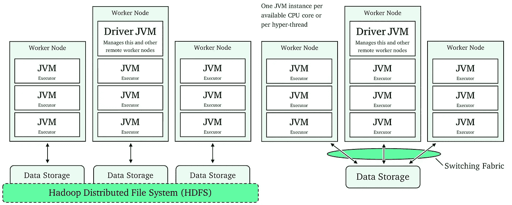
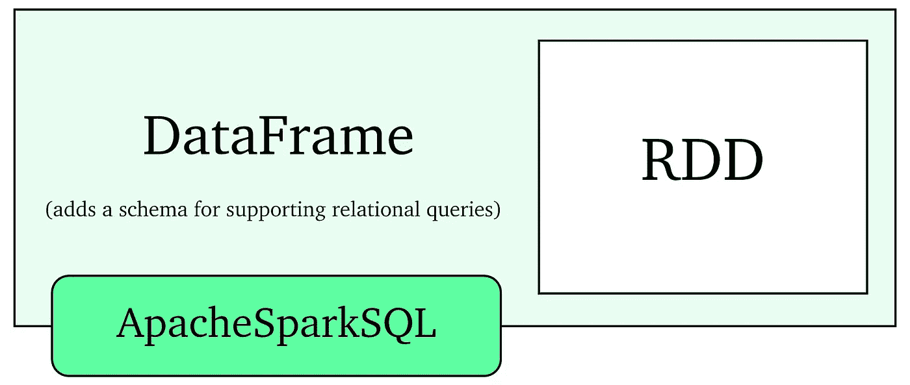
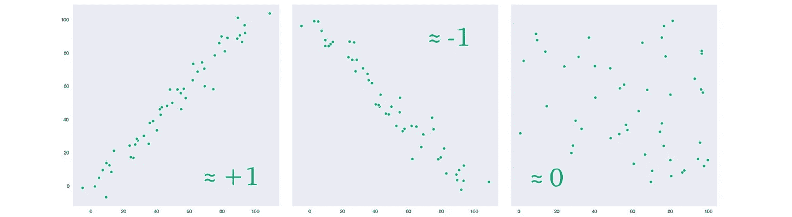
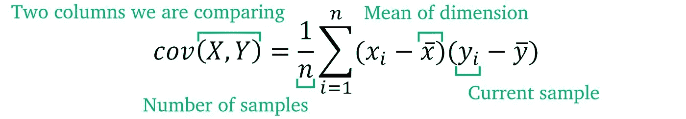
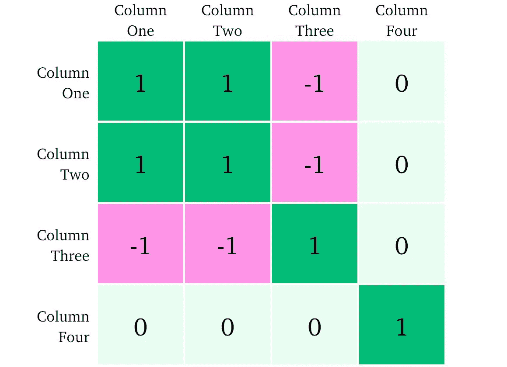
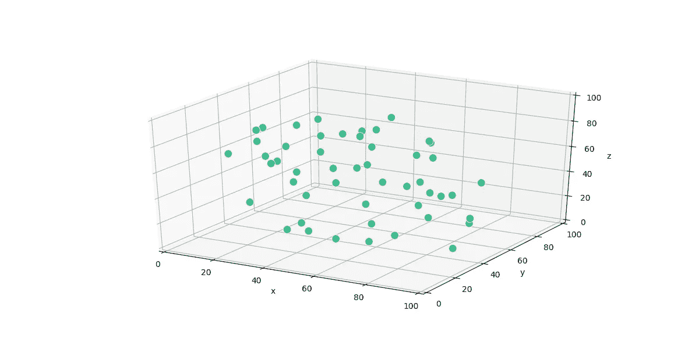
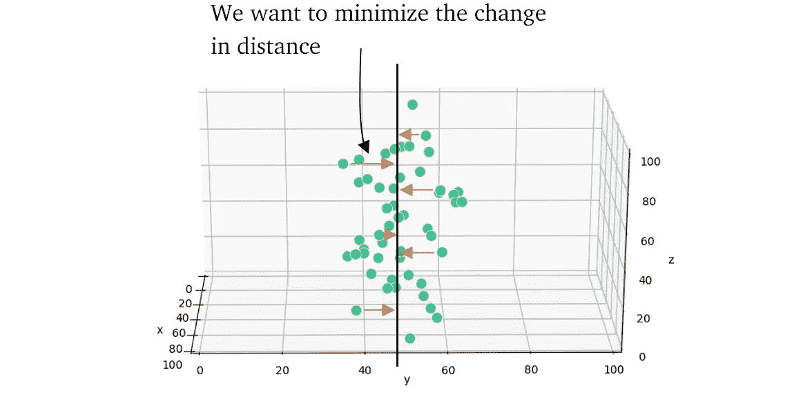
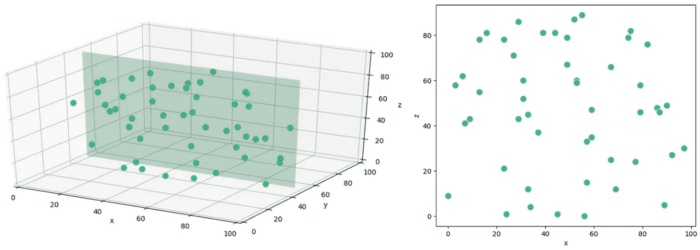

# Apache Spark 的可扩展数据科学基础

> 原文：<https://towardsdatascience.com/a-summary-of-the-advanced-data-science-with-ibm-specialization-1-4-5caf48c011df?source=collection_archive---------22----------------------->

## [IBM 高级数据科学专业](https://towardsdatascience.com/tagged/advanced-data-science)

## 我的想法是，对 IBM 高级数据科学专业中可伸缩数据科学基础的关键概念进行分解


Photo by [Carson Masterson](https://unsplash.com/@sonson?utm_source=medium&utm_medium=referral) on [Unsplash](https://unsplash.com?utm_source=medium&utm_medium=referral)

W 当在网上浏览数据科学/机器学习认证时，很容易在大量可用的产品中感到困惑和迷失。

我之前参加了斯坦福大学认证的著名的机器学习(在这里阅读)，我非常喜欢。我原本计划继续在吴恩达工作，并从 deeplearning.ai 的深度学习专业开始。虽然这看起来很神奇，但我偶然发现了 IBM 提供的这个专业。

那么，是什么吸引我走向 IBM 的专业化呢？有两个主要原因:

*   **Apache Spark** —这是最大的原因，云计算在机器学习的世界中非常重要，Apache Spark 在这个领域非常庞大。我对云计算的了解有限，也没有使用 Apache Spark 的经验，所以这对我来说是一个很大的卖点。
*   看起来更广泛(尽管可能更浅)的关注点，例如云计算、物联网和信号处理对数据科学的实际应用。

作为可扩展数据科学的基础，这篇文章自然是关于我在专业化第一部分(第一至第四周)的经历。我们还将涵盖:

*   Apache Spark 的基础知识(架构、rdd 和 ApacheSparkSQL)
*   四个统计时刻(非常简短)
*   协方差、相关性及其各自的矩阵
*   主成分分析降维

我们开始吧！

# 可扩展数据科学基础

## 第 1 周—简要介绍…

本课程首先由课程讲师 Romeo(IBM 的首席数据科学家)简要介绍 Apache Spark，以及我们将在接下来的几周内讨论的内容。接下来是如何使用 IBM Watson Studio 安装 Apache Spark 的说明，IBM Watson Studio 是贯穿整个课程的云服务。

然后有两个简短的编程*【任务】*，只是为了确保你有正确的环境设置。这个星期可以很容易地在不到一个小时内完成，我不会称之为一个星期...

## 第 2 周—数据存储、Apache Spark、RDDs 和 SQL

在这里，我们开始了解不同的数据存储解决方案。即:

*   结构化查询语言
*   NoSQL
*   对象存储

在讨论了各自的优缺点之后，我们开始学习 Apache Spark，重点是**可伸缩性和并行处理**。这部分其实很有意思！我们来看看 Apache Spark 的所有不同组件，包括硬件和软件。



The JBOD with HDFS architecture (left) and the off-node solution using a switching fabric (right)

我们了解到 ApacheSpark 是一个 Java 虚拟机(JVM)。为了加快我们的计算速度，我们可以并行使用多个工作节点，在如何分割工作负载方面，我们有两种选择:(1)在工作节点之间分割我们的数据和计算(JBOD 方法)或(2)在工作节点之间分割我们的计算，并使用“交换结构”从节点外的源提取数据。

选项(1)需要一个软件组件将物理上独立的存储磁盘视为一个磁盘，采用 JBOD(Just Bunch of Disks)方法(正式名称为 ***跨越*** )。该软件是“Hadoop 分布式文件系统”(HDFS)，它在工作节点的单个存储组件上创建一个虚拟视图，然后该视图可以被视为跨集群的单个虚拟文件。

选项(2)更简单，但由于节点外数据存储和工作节点之间的传输速度，延迟程度较小。这是我们在整个课程中使用的设置。

## RDDs，SQL API

从这里我们可以了解更多关于 Spark 的架构和 API。Spark 将数据存储在弹性分布式数据集中(RDD)。我们可以创建一个随机数据集，执行简单的计算并收集前 5 个结果，如下所示:

```
import random
rdd = sc.parallelize(random(range(100), 100))
rdd.map(lambda x: x + 1).take(5)
```



或者，Spark 通过 ApacheSparkSQL 提供 SQL 支持。这将 RDD 封装在数据帧中，允许关系查询。然后使用 ApacheSparkSQL 进行交互。使用此设置查询 dataframe 产品中产品总体的产品大小的标准偏差的示例:

```
spark.sql(
  "SELECT STDDEV_POP(p_size) AS sdsize FROM products"
).first().p_size
```

即使在使用 SQL 查询时，我们仍然可以直接与 RDD 交互，例如，如果我们想从一列中提取所有数据:

```
data = spark.sql(
   "SELECT p_size FROM products WHERE p_size > 0.5"
)
data.rdd.map(lambda x: x.p_size).collect()
```

## 第 3 周—统计

这个星期很简单，但仍然很有用。我们着眼于四个统计矩以及协方差、协方差矩阵和相关性。最后我们引入多维向量空间。

在本周的第一部分，我们来看四个统计时刻:

*   平均值(或集中趋势的量度)(如平均数和中位数)
*   标准偏差(和方差)
*   歪斜
*   峭度

如果你有统计学背景，这些概念你大概知道。令人尴尬的是，我不知道峰度实际上被称为“峰度”，但尽管如此，它们都是非常容易理解和应用的概念。

接下来我们引入协方差和相关性，我认为它们更有趣。我们使用这些属性来帮助我们理解不同列之间的关系。



Covariance of two variables with different relationships

相关性只是依赖性的一种度量，如果两个维度之间有很强的正相关关系，我们会发现相关值接近+1，如果有很强的负相关关系，我们会发现-1。对于两个完全独立的维度，我们会发现相关值为零。


Correlation between two dimensions X and Y

为了计算相关性，我们需要计算维度 X、Y(见下文)的协方差超过两个维度的标准偏差。



Covariance between two dimensions X and Y

我认为非常有用的东西是相关或协方差矩阵，因为我以前遇到过几次。它们的功能相同，但一个测量相关性，另一个测量协方差。



Correlation matrix for dataset with four dimensions

在上面的**相关性**矩阵中，我们可以看到，第四维与其他任何维度都没有相关性。我们可以这样理解，第四维要么包含大量有用的信息，要么完全不相关。要在 Spark 中构建相关矩阵，我们可以使用 MLLib 库。

```
# data is a (number of samples (n), number of dimensions) array
# where we have 4 dimensions, data.shape = (n, 4)from pyspark.mllib.stat import Statistics  # import MLlib
Statistics.corr(data)  # get correlation matrix for dataOut []: array(([ 1\.  ,  0.98, -0.97, -0.12],
               [ 0.98,  1\.  , -0.97, -0.12],
               [-0.97, -0.97,  1\.  ,  0.12],
               [-0.12, -0.12,  0.12,  1\.  ]))
```

一旦我们完成了 Spark 视频中的基本统计，我们就有了多维向量空间的最后一部分，这是非常小和直接的。接下来是本周的第二次也是最后一次测验和编程作业。编程任务简单而有趣，将上面学到的统计方法应用到 Spark 中。

## 第 4 周—可视化和 PCA

最后一周从快速浏览 matplotlib 绘图开始。Matplotlib 没有内置到 Spark 中，所以我们从 RDD 中提取数据，然后像往常一样将其输入 matplotlib。如果你已经使用 Python 了，这部分会超级简单。

接下来是**降维**。在这里，我们看一下如何使用主成分分析(PCA)算法来减少数据集中的维数(我将用非常简单的术语快速解释 PCA)。



我们了解到 PCA 用于降低数据集的维度，同时**保留维度之间的关系**。以上面的图为例，我们有一个三维向量空间(R^n ),我们想把它放入一个二维向量空间(R^k).我们希望找到一个表面，可以将 3D 数据映射到该表面上，同时最小化移动的距离。



一旦我们找到一个最小化距离变化的平面，我们就将 3D 点投影到新的 2D 平面上，从而降低维度。这实质上是找到变化不大的方向，并将其去除。在现实中，我们会经常处理高维向量空间，但简化概念是相同的。



在课程中，Romeo(讲师)指出，PCA 保持的关键属性之一是点与点之间的距离比，其符号如上。我认为这是一个有趣的观点，除了上面的解释，我认为肯定有助于提高我对 PCA 实际上在做什么的理解。

在 PCA 视频之后，我们有一个快速测验和一个最终的编程任务。两者都很简单，我发现这个编程作业是最简单的，因为之前作业中的大部分困难都源于缺乏 Spark 经验，但此时我感觉舒服多了。

# 最后的想法

好了，这就是 IBMs 高级数据科学专业化的第一部分！老实说，我认为课程非常简单，但同时也很好地介绍了 Apache Spark。

在这一点上，我唯一的*小抱怨是编程任务可能太抽象了，我希望自己设置 RDDs 和 ApacheSparkSQL 对象，但是我认为这样做是为了保持专门化的介绍部分简单。*

教练罗密欧非常好，我相信他非常有才华，他似乎有很强的解释一切的能力。内容是直接的，并且有很强的理论背景来加深对正在使用的工具的理解。

我在两周内完成了课程，同时工作也非常忙。所以它非常简短，但是我认为它很好地介绍了 Apache Spark。

总的来说，我对我学到的东西非常满意，我会向所有对数据科学云计算基础感兴趣的人强烈推荐这门课程。让我知道你的想法！

*如果你有兴趣了解斯坦福大学的机器学习 MOOC，请看这里:*

[](/a-review-of-stanfords-machine-learning-certification-9614ebee2b06) [## 斯坦福大学机器学习认证述评

### 在快速变化的数据科学环境中，这仍然值得吗？

towardsdatascience.com](/a-review-of-stanfords-machine-learning-certification-9614ebee2b06) 

谢谢，