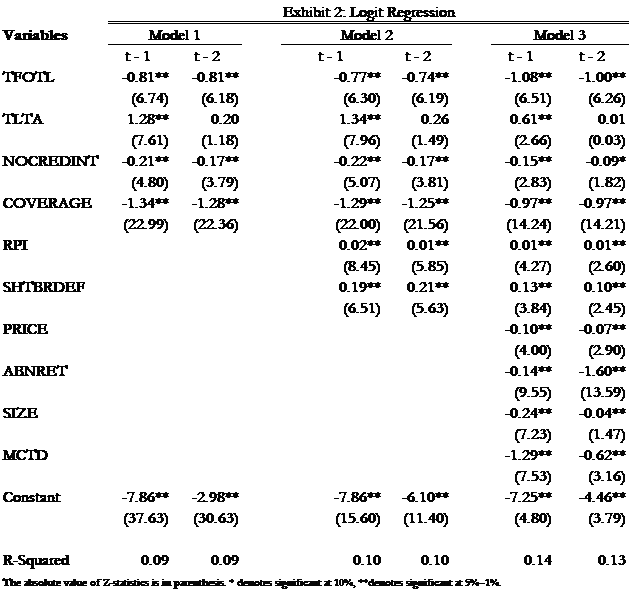
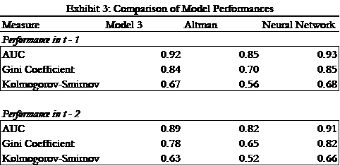
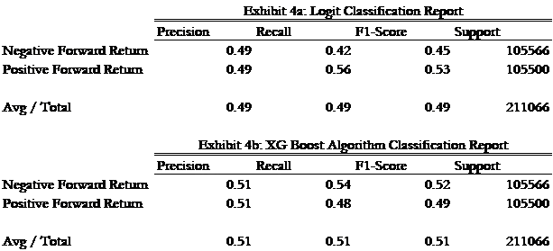
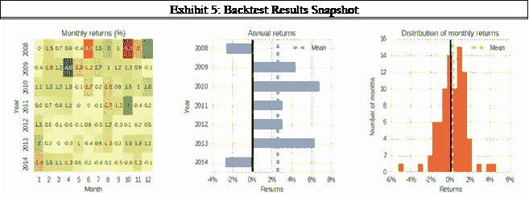
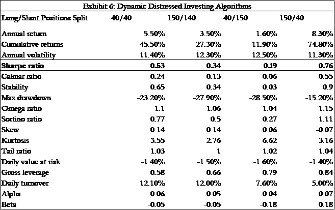

# 系统的不良投资策略

> 原文：<https://towardsdatascience.com/a-systematic-distressed-equity-investing-strategy-45c50be6b2ac?source=collection_archive---------10----------------------->

# 介绍

财务困境和破产给公司管理、运营和供应商带来巨大压力。据估计，破产成本占企业清算价值的平均比例为 7.5%，最大的破产案收取的费用超过 10 亿美元。可以理解的是，学术界已经积累了大量关于第 11 章和第 7 章申请预测的文献。之前的研究分为使用基于市场的[【2】](#_ftn2)(期权定价、信用违约互换)和基于会计的[【3】](#_ftn3)(收益、债转股)方法。Hillegeist 等人(2004)建议研究人员使用 Black-Scholes-Merton 模型，而不是传统的测量方法，如 Altman 的 Z 分数或 Ohlson O 分数[【4】](#_ftn4)。另一方面，Coelho 和 Taffler (2008)发现这两种方法的预测准确性几乎没有差异[【5】](#_ftn5)。**我们创建了一个能够跑赢市场的动态多空、贝塔中性的不良投资算法。**

如果研究人员仅在他们的违约概率(PD)模型中使用财务比率，他们就隐含地假设所有关于公司未来轨迹的相关信息都反映在年度账目中。随着最近大数据的激增和市场定价算法的日益复杂，评估金融困境的第一站和最后一站不太可能是 10-K。幸运的是，最近的工作支持了基于市场和会计方法的结合。Chava 和 Jarrow (2004 年)发现，会计变量(如净收入占总资产的比例)和基于市场的变量(如公司股票市场回报的特殊标准差)都是破产申请的重要预测因素。最近，蒂诺科和威尔逊(2013)[【6】](#_ftn6)采用尖端的机器学习工具来提高普通最小二乘回归生成的预测精度。对之前的进展采取整体观点为进一步建立当前的破产模型提供了一个有意义的机制。

# 行动（或活动、袭击）计划

我们探索了三条有希望的途径来制作实用的痛苦预测模型。首先，我们将宏观经济预测与可靠的市场和会计变量结合起来。其次，我们评估我们的破产预测模型是否可以用来创建系统的投资算法。第三，我们探索各种统计“技巧”，如 Z 得分预测和 winsorizing 值是否改善模型结果。我们的结果对破产过程中的各种利益相关者都有影响，包括:

1.重组顾问和律师:我们的模式独一无二，专注于上市公司。因此，重组顾问和律师可以利用该模型的建议，积极主动地寻找潜在客户，或试图通过提供债务管理援助来阻止破产。该模型还可以通过预测公司重组后重新申报的可能性来评估拟议计划的可行性。

2.困境和量化投资者:我们的模型提供了一种筛选潜在困境候选人和调查宏观经济前景的机制。对于定量公司，我们也构建了一个成功的系统的“不良投资”算法，旨在产生β-中性回报。

3.投资银行和保险公司:我们的模型可以作为内部预测系统的“健康检查”,确保银行贷款和保险信用违约掉期定价合理。

# 第 1 部分:一个全面的困境预测模型

我们复制了蒂诺科和威尔森提出的基于市场、会计和宏观经济的模型。这些数据涵盖了 1980 年至 2011 年期间超过 3000 家公开上市的公司，其中 379 家申请破产保护。强调我们对财务困境的定义是很重要的。按照传统的描述，如果一家公司的股票停牌超过三年，处于自愿清算状态，在申请破产时被摘牌，或者处于破产管理状态，那么该公司就是违约。更重要的是，我们还遵循 Pinado 等人(2008 年)的观点，如果 EBITDA 低于利息支出*且*市值连续两年下降，则将公司归类为财务困境。考虑到法律动议的日期并不总是与市场开始预期财务破产的日期一致，这种区分很重要。事实上，在合法申请破产之前，公司停止报告财务报表的时间平均为 1.17 年。我们的样本中有 5%(1254 家公司)被归类为不良资产。

所有后续的数据分析都是用 Python 完成的。5 变量 Altman Z 模型(1968 年)和 7 变量 Ohlson logit 模型(1980 年)表明，只需要几个变量就可以达到财务困境预测的高准确度。我们的第一步是使用递归特征消除(RFE)从超过 130 个变量中选择最重要的预测因子。RFE (1)在一大组初始变量上训练逻辑回归，(2)获得每个变量的点估计，(3)删除具有最低重要系数的变量，以及(4)重复该过程，直到仅保留最重要的特征[【7】](#_ftn7)。

样本分为财务困境和健康的公司。结果是一个二元因变量，我们使用面板 logit 框架来考虑时变协变量。被归类为财务困境的公司被赋予 1 的值，而健康的公司被赋予 0 的值。RFE 以最大的区分准确性估计模型，其形式为:

Regression 1

其中 *F(x)* 代表企业陷入困境的概率 Pr(Y = 1|x)，我们的预测因子分别代表会计、宏观和基于市场的自变量。

我们的递归估计器确定了四个会计比率、两个宏观经济变量和四个市场变量，与传统校准相比，这些变量提高了我们模型的预测准确性。图表 1 提供了所选预测值的相关矩阵；低共线性意味着我们的变量之间的高度互补性，每个变量都解释了响应中独特的方差[【8】](#_ftn8)。我们现在考虑模型所选预测器背后的直觉。

## *1.1 会计变量*

我们最后的四个会计比率包括营运资金对总负债、总负债对总资产、利息覆盖率和无信用区间。所有四个变量在以前的研究论文中都得到了充分的认可。营运资金与总负债之比将公司的现金流与公司获得的所有短期和长期负债进行比较。该比率在 Marais (1979)中因其对比内部现金产生和财务义务的区分能力而受到称赞。总负债与总资产的比率估计公司资产中负债所占的比例。如果一家公司经历了总资产价值的下降冲击，固定负债的不变利息支付通常会导致技术性违约。利息覆盖率是用来预测破产的最常见的变量之一，衡量公司满足即期利息义务的能力。

一个显著的结果是无信用区间变量的显著性。公式上，无信用区间的计算方法为(速动资产-流动负债)/((销售额-EBITDA)/365)。从实践的角度来看，无信贷区间估计了一家公司在不消耗流动资源的情况下，能够为运营支出融资的时间。而其他三个会计变量侧重于资产效率和信贷覆盖面，无信贷区间强调营运资本的稳定性。总的来说，会计比率集中在一家公司的特殊业务运营及其独特的债务、股权和资产组合上。

## *1.2 市场变量*

股价、异常回报、相对于市场指数(规模)的市值以及相对于总债务的市值都证明在预测违约方面具有重要意义。基于市场的变量的数量清楚地表明，纳入实时数据作为会计变量的补充，在模型中提供了有意义的区分能力。异常回报和规模等变量凸显了公司相对于同行的表现。价格反映了投资者对股票的供求关系，而总债务的市值将股票的市场动态与债权人的现有债权联系起来。虽然会计变量侧重于公司资产和财务义务现金覆盖之间的关系，但基于市场的变量强调投资者对公司未来增长和现金产生机会的评估。

## *1.3 宏观经济变量*

代表了一个从先前文献的关键突破，我们证明了将宏观经济变量纳入财务困境预测的效用。在 11 个宏观经济指标中，有两个包含在最终模型中:零售价格指数(RPI)和 3 个月期国债利率。零售物价指数衡量家庭商品和服务价格的变化。正如亚当·斯密以来的经济学家所详述的那样，鉴于工资增长滞后，名义价格的上涨与企业收入的增加相关，从而降低了破产的风险 [[10]](#_ftn10) 。3 个月期国库券利率补充了零售物价指数对贷款利率的影响。在通货膨胀水平不变的情况下，较高的利率意味着一个经济体实际增长率的上升。实际 GDP 增长趋势的改善与更高的企业生产率和投资回报率相关，从而降低违约风险。总体而言，宏观经济变量的使用通过考虑公司财务的系统风险，填补了会计和基于市场的指标留下的空白。陷入困境的社区对宏观变量的不重视有利于对特质风险的关注，这是以理解违约概率的准确性降低为代价的。

## *1.4 结果分析*

RFE 只确定哪种变量组合最具预测力。我们现在评估每个变量的*个体*对预测响应变化的贡献。在图表 2 中，我们展示了三种估计违约概率的模型:仅会计变量模型、会计和宏观模型以及完全综合的模型。我们估计公司财务困境前一年和两年的违约可能性，以提供更大的预测灵活性。

我们强调了歧视性分析的三个关键发现。首先，宏观经济变量在一年期和两年期都具有统计显著性，即使在模型 3 中控制了会计和基于市场的协变量。其次，我们最全面的模型(模型 3)轻而易举地超越了基于蒂诺科和威尔森估计的行业标准奥特曼 Z 评分(图表 3)。我们通过曲线下面积、基尼等级系数和 Kolmogor-Smirnov 性能指标证明了模型结果的稳健性。第三，简单的 logit 模型符合更复杂的结构，例如神经网络分析。神经网络是一种典型的“黑盒”算法，它使用一组连接的节点与模型的预测器进行交互，以获得单个输出。与此同时，Logit 模型为个体预测者提供了简单的显著性估计，因此对行业专家来说更实用。

总之，我们利用递归特征消去法获得了一个对预测财务困境有用的会计、市场和宏观经济变量的混合。我们的模型优于当前的行业方法，并提供了一个简单的工具，可以很容易地被重组和不良投资从业者使用[【11】](#_ftn11)。

# 第 2 部分:将模型扩展到不良投资

在第一部分中，我们得到了一个预测上市公司财务困境的综合模型。虽然我们“训练”了我们的模型对金融违约概率的响应，但很自然地质疑我们确定的预测指标是否可以用于系统的“不良投资”算法。一方面，传统的(基础的)信贷经理轻视运用算法投资于预期破产的公司的想法。另一方面，AQR 和 Citadel 等量化公司正大举投资于构建系统，做空财务困境公司的股票，并长期持有健康公司的股票。因此，我们提供了我们的观点对生动的辩论迷人的苦恼社区。

使用量子 Python 模块，我们重建了上面发现的预测器。我们将威尔希尔 5000 指数设定为我们的投资领域，并将我们的反应定义为公司的每月预期回报。我们给有正远期收益的公司赋值 1，给有负远期收益的公司赋值 0。如上所述，我们采用以下形式拟合 logit 回归:

Regression 2

其中 *R(X)* 代表公司收益为正 Pr(Y = 1|x)的二元概率，我们的预测器分别代表会计、宏观和基于市场的预测器。

我们讨论了我们在系统投资中的三个关键发现。首先，一个简单的 logit 模型使用了我们在第一部分中的预测值，其精确度和召回率[【13】](#_ftn13)为 49%(图表 4)。换句话说，我们的 logit 模型比抛硬币，打赌如果我们正面着地，股票会上涨更糟糕。其次，即使我们使用机器学习来捕捉数据中的高阶交互，我们的梯度提升算法在预测回报时也只有 51%的精度和召回率——仅略高于随机猜测。第三，我们的机器学习算法没有将任何宏观因素识别为对公司月度回报具有统计意义的预测因素。然而，当我们将预测范围扩展到季度和年度回报时，3 个月国债利率和零售价格指数都成为我们模型的重要特征。总的来说，预测市场回报的微弱成功令人羞愧，并强调了超越容易获得的定量数据的重要性。

作为我们分析的最后一步，我们评估是否可以将梯度推进的轻微预测优势转化为持续的利润。我们首先创建一个包含 300 只股票的基准长/空投资组合，平均分配给预测违约概率最低的公司的多头头寸和预测违约概率最高的公司的空头头寸。我们回溯测试结果的一个片段包含在图表 5 中，使用 winsorizing 和 z-scoring 等技术对我们的发现没有显著的改变。2008 年，我们的算法跑赢市场近 50%，年/年回报率为 5%。然而，在金融危机后的每一年，该算法的表现都大大逊于标准普尔 500，平均回报率为 2.5%。该算法表现一般的原因是样本中痛苦的频率。虽然 2008 年破产数量激增 31%，但上市公司的平均违约率通常在 5%左右。beta-中性的多头/空头股票算法需要一定比例的健康和不健康的公司，或者过度暴露于特定行业或公司的风险。

我们以两种关键方式解决基线算法的缺点。首先，我们评估改变算法可以启动多少多头和空头头寸的好处。其次，我们根据市场波动动态调整我们的空头头寸集中度。例如，如果 VIX 指数高于其长期平均水平两个标准差，我们的投资组合在所有头寸中 30%做多，70%做空。因此，我们利用系统性危机上升的时期，而不是保持相同的多空比例。如图表 6 所示，一个有 140 个多头和 40 个空头头寸的动态不良投资算法记录了一个 S&P500[【14】](#_ftn14)的两倍。在整个回溯测试期间，我们的算法优于标准普尔 500 指数，同时将 2008 年的跌幅限制在-5%。通过解决我们的违约概率模型的简单实现中固有的弱点，我们成功地创建了一个能够在高度竞争的市场环境中生成 alpha 的算法。

# 结论

我们通过三个有意义的机制为行业从业者推进破产预测模型的构建。首先，我们再次强调了在破产预测模型中结合会计、市场和宏观经济变量的好处。蒂诺科和威尔森模型的 AUC 得分为 86%，超过了行业标准的奥特曼 Z 得分。其次，我们已经证明了使用我们确定的变量来准确预测市场回报的困难，即使是使用最先进的统计操作。最后，我们通过强调动态多空、beta-中性不良投资算法的功效，为我们的投资研究提供了一个顶点。我们的模型可以为重组顾问、律师、保险公司和有兴趣分别评估当前和潜在客户或投资违约概率的困境投资者提供实际指导。从银行家到量化分析师，重组领域继续为大数据领域的创新提供机会。

# 附录:

***来自《走向数据科学》编辑的提示:*** *虽然我们允许独立作者根据我们的* [*规则和指导方针*](/questions-96667b06af5) *发表文章，但我们不认可每个作者的贡献。你不应该在没有寻求专业建议的情况下依赖一个作者的作品。详见我们的* [*读者术语*](/readers-terms-b5d780a700a4) *。*

Ang，James S，等《公司破产的管理成本:一个注解》《金融杂志》，第 37 卷，第 1 期，1982 年，第 219-226 页。提供研究进展的有用摘要。

[【2】](#_ftnref2)布莱克、菲舍尔和迈伦·斯克尔斯。“从理论到新的金融产品。”《金融杂志》，第 29 卷，第 2 期，1974 年，第 399 页。首次尝试基于市场的定价模式。

[【3】](#_ftnref3)《企业破产的预测:判别分析》《金融杂志》，第 23 卷，第 1 号，1968 年，第 193 页。是开创性的工作。

布朗、斯蒂芬等，“管理预测、诉讼风险和 FD 法规”SSRN 电子期刊，2004 年。

科埃略、路易斯·m 和理查德·j·塔夫勒。"市场对破产申请的异常反应." *SSRN 电子杂志*，2008 年。

赫尔南德斯·蒂诺科、马里奥和尼克·威尔森。"使用会计、市场和宏观经济变量的上市公司财务困境和破产预测."《国际金融分析评论》，2013 年，第 394–419 页。

[【7】](#_ftnref7)蒂诺科和威尔逊没有详细说明他们的变量选择过程，尽管我们在数量上得到了相同的结果。

[【8】](#_ftnref8)注意，TFOTL 与利息覆盖率的相关系数为 0.726，是所有变量中最高的。原因很明显，因为 FFO/TL 与 EBITDA/利息支出极其相似。然而，FFO 涵盖了 EBITDA 未涵盖的资本支出和营运资本变化，而 TL 涵盖了利息支出未直接涵盖的金融债务。

[【9】](#_ftnref9)Zmijewski，Mark E .《与财务困境预测模型估计相关的方法论问题》。《会计研究杂志》，第 22 卷，1984 年，第 59 页。

[【10】](#_ftnref10)重要提示:通胀上升可能会刺激美联储加息。更高的利率通常会限制信贷，增加违约风险。因此，重要的是要强调，在控制恒定利率时，较高的通胀会改善公司业绩**，我们的模型通过同时回归 RPI 和国债利率来做到这一点。**

参见霍华德·马克斯的投资者信。

[【13】](#_ftnref13)精度是 tp / (tp + fp)的比值，其中 tp 是真阳性的数量，fp 是假阳性的数量。精确度直观上是分类器在样本为阴性时不将其标记为阳性的能力。召回率是 tp / (tp + fn)的比值，其中 tp 是真阳性的数量，fn 是假阴性的数量。召回直观上是分类器找到所有肯定样本的能力。

[【14】](#_ftnref14)利用我们对负回报更高的预测准确性，我们分散了长期投资，集中于短期投资。