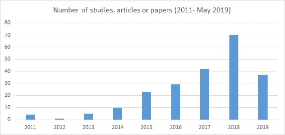
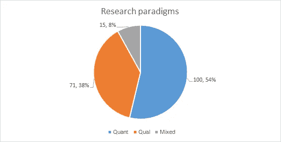
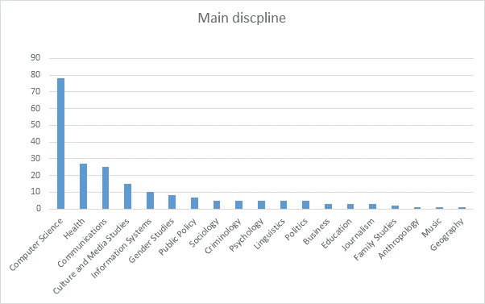
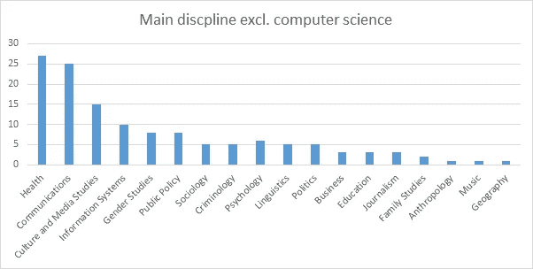

# Reddit 的系统化文献综述

> 原文：<https://towardsdatascience.com/a-systematized-literature-review-of-reddit-dd2acbe6ebc4?source=collection_archive---------31----------------------->

Image: Reddit Inc.

几个月前，我对 Reddit 上的研究进行了系统化的文献综述。

**结果如何？我在 Reddit 上找到了 211 篇学术论文。**

这包括在同行评审期刊上发表的作品、提交的会议论文、编辑过的文集的章节以及偶尔的博士论文。

## Reddit 和 Twitter:它们如何比较？

Image: own

社会科学家喜欢 Twitter 这个平台。他们在上面发关于自己工作的微博，进行数字交流，偶尔关注恶搞账号。特别是政治科学家*绝对喜欢*推特。

现在我们来做一个两个平台学术研究的趣味对比。Reddit 有 211 部学术著作，相比之下:

*   2007 年至 2012 年间，Twitter 上有 380 篇论文( [Michael 和 Proferes，2014](https://www.emerald.com/insight/content/doi/10.1108/AJIM-09-2013-0083/full/html) )
*   在推特和微博上有 575 次([威廉姆斯、沃里克和梅利莎，2013 年](https://www.emerald.com/insight/content/doi/10.1108/JD-03-2012-0027/full/html))
*   671 项关于社交网站的研究工作( [Boyd，2015](http://www.danah.org/researchBibs/sns.php) )
*   127 在 Twitter 和政治选举活动中工作( [Jungherr，2016](https://www.tandfonline.com/doi/abs/10.1080/19331681.2015.1132401) )。

# 按年份分列的研究产出

Reddit 成立于 2005 年，但直到几年后，其作品才开始出现在同行评审期刊和会议论文中。除了 2012 年的一个小插曲，研究产出同比有所增长。

这篇评论止于 5 月初发表的作品。考虑到这一趋势，如果今年的产量超过去年，我一点也不会感到惊讶。

Image: own

# 范式研究

大多数研究是定量的，其次是定性的和混合的方法。位于计算机科学和人机交互(HCI)的研究绝大多数是定量的。混合方法研究往往来自多个研究人员的项目，他们带来了各种各样的技能，以最佳方式接近研究目标。定性研究在大多数学科中都很常见。

Note: this number does not add up to 211 because it excludes non-empirical studies and chapters in edited collections which were derived from empirical studies from journals. Image: own

# 哪些学科研究 Reddit？

绝大多数研究来自计算机科学，其次是社会科学。最受欢迎的是健康、交流、文化和媒体研究。

Image: own

排除计算机科学有助于将社会科学的其他部分形象化得更容易一些。

Image: own

作为一个旁注，当我最初进行这篇评论时，我并没有期望从音乐研究中找到一篇研究。这项研究由 Kovacevich 和 Huron ( [2018](http://emusicology.org/article/view/6012) )完成，主要关注自主感觉经络反应(ASMR)音乐和/r/ASMR subreddit。有趣的东西。

# 文献综述法

这是一篇系统的综述。它有系统审查的要素，但没有声称自己是全面的([格兰特&布斯，2009](https://onlinelibrary.wiley.com/doi/pdf/10.1111/j.1471-1842.2009.00848.x) )。

2019 年 5 月至 7 月期间，通过在[科学网](https://clarivate.com/products/web-of-science/)和 [Scopus](https://www.scopus.com/home.uri) 数据库上搜索单词“Reddit”和“subreddit”来确定文献的范围。谷歌学术[的前 50 页被搜索，但没有进一步的。这是因为许多来自社交媒体分享功能的误报被发现。](https://scholar.google.co.uk/scholar?hl=en&as_sdt=0%2C5&q=reddit&btnG=)

从那里开始，我对高引用文章的书目和脚注进行了滚雪球式的搜索，这导致了更多的研究人员、研究项目和组织。其中包括来自计算机机械协会(ACM)图书馆和非营利组织 CivilSevant.io 的研究成果和会议文章

创建了一个包含每个研究项目信息的电子表格。这些包括:出版日期、研究名称、研究范式、学术学科、相关的第二个学术学科、使用的方法和出版类型(会议论文、期刊文章、书籍章节)。

以上信息是通过阅读期刊摘要收集的。如果信息没有在摘要中提供，文章本身被搜索关键词和略读来找到相关信息。

## 限制

如果关键词 Reddit 和 subreddit 没有包含在被搜索数据库的摘要或标签中，它们就不会出现在这篇文献综述中。

这项审查也仅限于一名研究人员。这意味着，如果研究的编码分类不正确，没有第二个研究人员来纠正错误。这是值得注意的研究，位于学科和方法以外的研究人员的知识和技能。比较系统的综述通常包括两个或更多的研究人员，他们或者独立地对研究进行分类，或者联合起来找出错误并加以纠正。⁴

## 脚注

1.  我计划在 2019 年全年更新这篇综述，以说明进一步的研究成果。称之为有点[整数偏差](https://economistsview.typepad.com/economistsview/2013/10/round-number-bias.html)和做一个完人。
2.  这导致 156 万次搜索命中。
3.  检索的关键词包括:方法、研究方法、范式、定量、定性。这样做是为了加速文章的分析。
4.  更深入的解释见[代码间可靠性](https://en.wikipedia.org/wiki/Inter-rater_reliability)。