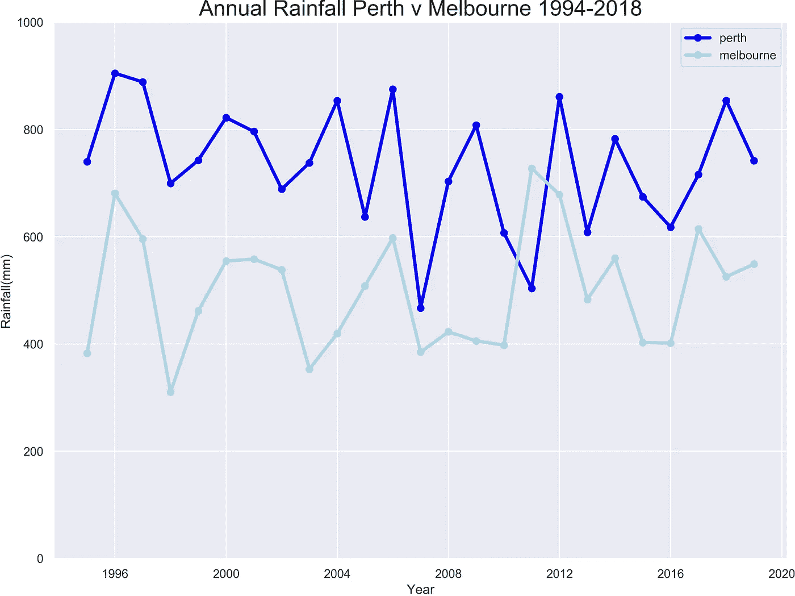

# 双城记——熊猫解开的谜团

> 原文：<https://towardsdatascience.com/a-tale-of-two-cities-a-mystery-solved-with-pandas-631684dda4b1?source=collection_archive---------38----------------------->

## 珀斯真的比墨尔本更潮湿吗？

Photo by [Ricardo Resende](https://unsplash.com/@rresenden?utm_source=medium&utm_medium=referral) on [Unsplash](https://unsplash.com?utm_source=medium&utm_medium=referral)

最近我从墨尔本搬到了珀斯，我发现对这两个城市进行比较是很自然的。哪个有更好的咖啡？好的，这个很简单——墨尔本轻而易举！哪一个雨水更多——为了回答这个问题，我求助于我最喜欢的 Python 分析工具 Pandas。

**我们将讨论什么内容**

*   调查 25 年的年降雨量
*   使用 Seaborn 来观想并快速得出一些见解
*   找出哪个城市的雨天最少

Photo by [Kieren Andrews](https://unsplash.com/@keekkja?utm_source=medium&utm_medium=referral) on [Unsplash](https://unsplash.com?utm_source=medium&utm_medium=referral)

# 调查# 1——年降雨量对比

**首先我们加载所有的常规包**

**接下来，我们导入来自 BoM 的降雨数据**

注:我选择墨尔本机场气象站仅仅是因为 CBD 气象站已于 2009 年退役(参考[http://www . BOM . gov . au/weather-services/announcements/vic/la trobe-site-closure . shtml](http://www.bom.gov.au/weather-services/announcements/vic/latrobe-site-closure.shtml))

现在，我们将单独的年、月、日列合并成一个日期时间索引，这将有助于下一步

选择一个重叠两个数据集的时期——我名义上选择了 25 年，这听起来对这项研究来说足够了

绘制年总降雨量，看看哪个城市的年降雨量最大。很明显，珀斯的年降雨量一直较高，然而这只是故事的一部分。

Annual rainfall comparison

附注:2011 年墨尔本降雨量超过珀斯的反常现象部分是由于拉尼娜现象。更多信息请点击此处[https://bit.ly/2prGy68](https://bit.ly/2prGy68)

# 调查# 2 —月降雨量对比

Photo by [reza shayestehpour](https://unsplash.com/@r_shayesrehpour?utm_source=medium&utm_medium=referral) on [Unsplash](https://unsplash.com?utm_source=medium&utm_medium=referral)

看看 25 年研究期间的月平均值——这将显示墨尔本和珀斯的降雨量有多季节性

Pandas *pivot_table* 函数为我们提供了一种快速简单的方法来聚合所有的时间序列数据。

现在我们可以并排绘制两个月平均值

Monthly rainfall comparison

很明显，珀斯的季节性很强，大部分降雨发生在五月到九月。七月是珀斯最潮湿的月份，降雨量接近 150 毫米。相反，墨尔本全年降雨量稳定，每月约 20-60 毫米。

> 这就是为什么墨尔本人总是需要一把伞！

# 调查 3——未雨绸缪

虽然许多人关注平均降雨量，但很少关注下雨天数。我很好奇这是如何抓住墨尔本的“毛毛雨因素”的

我们可以使用方便的 Numpy *where* 函数，在这种情况下，该函数根据日降雨量不为零的条件返回标签“湿”或“干”。

现在我们可以计算出珀斯和墨尔本每个月的雨天数；其中有 25 年的价值。

现在，我们可以轻松地将这两个数据框连接起来，以便并排绘制它们。同时，我们可以快速得出每个城市每年的平均下雨天数。

鼓声……冠军是墨尔本，一年有 135 个雨天，珀斯以 109 天落后。

Photo by [Pietro Rampazzo](https://unsplash.com/@peterampazzo?utm_source=medium&utm_medium=referral) on [Unsplash](https://unsplash.com?utm_source=medium&utm_medium=referral)

最后，我们可以使用 Seaborn *pointplot* 来比较这两个城市，看看在任何给定的月份里有多少个雨天。

Rainy days per month

# **下雨天的降雨量有多少？**

众所周知，并非所有的雨天都是均等的。有些只是毛毛雨，有些则是绝对的雨！

因为我们已经标注了雨天，所以在 Seaborn 使用*线图*来查看不同月份的降雨量是非常直接的。

Given that it is a rainy day — how much rain typically falls?

由此我们可以看出:

*   当墨尔本在 2 月和 11 月/12 月下雨时，往往会很大——这是典型的夏季倾盆大雨
*   相反，墨尔本冬天的雨天通常会下毛毛雨，降雨量只有 2-3 毫米
*   珀斯的夏末仍然很潮湿(下雨的时候),但是总日降雨量非常不稳定——因此在一月和二月期间蓝色阴影区域的置信区间很宽。

非常感谢你阅读我的第一篇博文！

笔记本和数据可以在这里找到

 [## 杰伊-斯坦/两个城市的中尾

### 此时您不能执行该操作。您已使用另一个标签页或窗口登录。您已在另一个选项卡中注销，或者…

github.com](https://github.com/jay-stein/medium_tail_of_twocities)