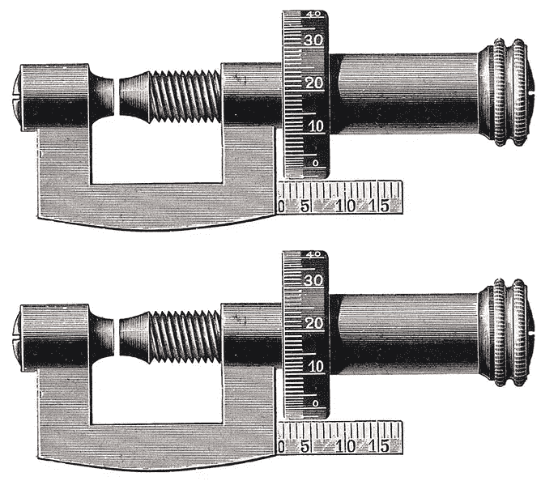
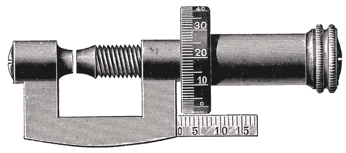
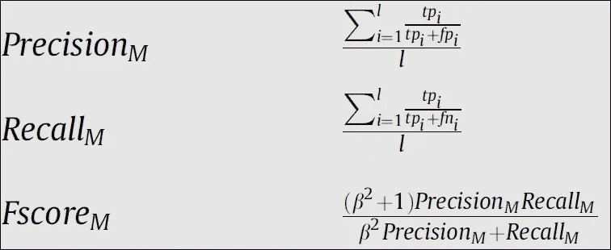
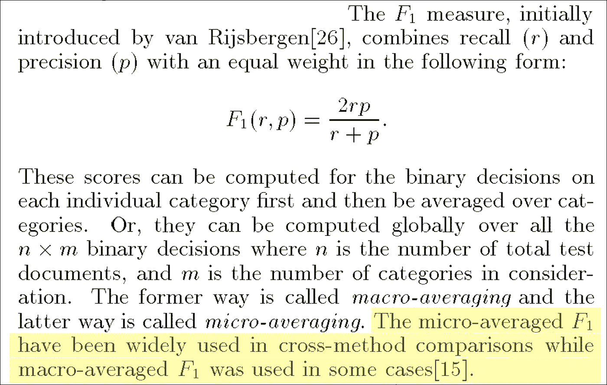

# 两个宏 F1 的故事

> 原文：<https://towardsdatascience.com/a-tale-of-two-macro-f1s-8811ddcf8f04?source=collection_archive---------16----------------------->

在写完我的 2 部分系列**多类度量变得简单(** [**第一部分**](/multi-class-metrics-made-simple-part-i-precision-and-recall-9250280bddc2) **，** [**第二部分**](/multi-class-metrics-made-simple-part-ii-the-f1-score-ebe8b2c2ca1) **)** 之后，我收到了来自读者的鼓励和有用的反馈，包括掌声、错别字更正等。首先，非常感谢所有的回复者！特别是一封电子邮件来自一位好奇的读者(他希望匿名，所以我称这位读者为“谜”)，引发了对 F1 宏观平均分数计算方式的调查。这让我陷入了一个相当令人惊讶的兔子洞，我在这篇文章中描述了它。底线是:有不止一个宏观 F1 分数；数据科学家大多会不假思索地使用软件包中的任何可用内容。

快速提醒一下，[第二部分](/multi-class-metrics-made-simple-part-ii-the-f1-score-ebe8b2c2ca1)解释了如何计算宏观 F1 分数:它是每个班级 F1 分数的平均值。换句话说，首先计算所有类的每类精度和召回率，然后组合这些对来计算每类 F1 分数，最后使用这些每类 F1 分数的算术平均值作为宏 F1 分数。在第二部分的示例中，猫、鱼和母鸡类别的 F1 分数分别为 42.1%、30.8%和 66.7%，因此宏观 F1 分数为:

**宏-F1 =(42.1%+30.8%+66.7%)/3 = 46.5%**

但显然，事情并没有这么简单。在电子邮件中，“谜”引用了一篇被高度引用的论文，该论文以一种非常不同的方式定义了宏观 F1 得分:首先，计算宏观平均精度和宏观平均召回率。然后，计算这两个指标的调和平均值，作为最终的宏观 F1 分数。在我们的例子中，宏精度和宏召回是:

**宏精度= (31% + 67% + 67%) / 3 = 54.7%**

**宏观召回率= (67% + 20% + 67%) / 3 = 51.1%**

因此，使用第二种方法，我用星号( ***)** )表示:

**Macro-F1 * = 2×(54.7%×51.1%)/(54.7%+51.1%)= 52.8%**

如您所见，Macro-F1 和 Macro-F1*的值非常不同:46.5%和 52.8%。

宏 F1 和宏 F1*测量的是两种不同的东西。那么哪一个是“真正的”宏观 F1-score 呢？宏 F1 还是宏 F1*？请继续阅读。

“Enigma”发给我的参考资料是 Marina Sokolova 和 Guy Lapalme 的“[分类任务的性能测量的系统分析](https://scholar.google.com/scholar?cluster=14636768960278377699&hl=en&as_sdt=0,5&sciodt=0,5)”。根据谷歌学术的说法，这篇论文有大约 2000 条引文。

以下是 Sokolova 论文中对 F1 宏观得分的定义:

(注意， *l* 是级数， *M* 代表宏。此外，β是一个可以用来调整精确度和召回率的相对重要性的参数。β=1 赋予了精确度和召回率同等的权重，也是我在我的文章中一直使用的。)

事实上，从上述论文摘录中可以看出，Sokolova 论文选择计算 Macro-F1*而不是 Macro-F1。

相比之下，其他参考文献选择计算宏 F1。一篇被广泛引用的论文是杨等人于 1999 年发表的“对文本分类方法的重新检验”[参考文献 2]。在撰写本文时，根据谷歌学术的统计，这篇论文被引用了 3695 次。以下是论文的相关摘录:

该段提到“在某些情况下使用了宏观平均值 F1[15]”。[15]参考文献是 Lewis 等人[Ref 3]在 1996 年发表的论文“[线性文本分类器的训练算法](https://scholar.google.com/scholar?um=1&ie=UTF-8&lr&q=related:fJYC6VUsglqoCM:scholar.google.com/)”，其中作者明确指出“平均 F1 是 F1 在所有类别中的平均值”。

回到我们的问题:应该用宏 F1 还是宏 F1*？他们都试图将每个类的精度和召回值总结成一个数字，但是方式不同。在缺乏真正的领域特定问题的情况下，每种类型的错误都有一个定义的成本，使用任一种度量来总结模型的性能提供了一种简单但有些模糊的比较模型的方法。当部署一个真实的系统时，这些数字可能不合适，您需要根据手头的业务问题提供自己的指标。从这个意义上说，这两个指标都有相同的缺陷。重要的是要记住，在比较模型时要保持一致并使用相同的指标。

至于哪一个更受欢迎:如果历史是由胜利者书写的，那么——不管喜欢与否——度量是由软件包定义的。Python 的 sklearn 库是最流行的机器学习包，它提供了`sklearn.metrics.f1_score`函数，该函数计算宏 F1(而不是宏 F1*)。因此，大多数数据科学家和研究人员使用 Python 库函数来计算 Macro-F1，通常不会给予它第二个想法——正如我在“谜”的电子邮件进入我的收件箱之前所做的那样。

*更新(2019 年 12 月 18 日):*我收到了朱里·奥皮兹的一封电子邮件，他最近与人合著了一篇关于这个主题的论文，结果很有趣。具体来说，作者建议使用宏 F1 和*而不是宏 F1** ，因为它对错误类型分布不太敏感。我建议看看报纸；参见本文末尾的[参考文献 4]。

## **参考文献**

[参考文献 1]索科洛娃、玛丽娜和盖伊·拉帕尔梅。"[对分类任务的性能测量的系统分析](https://scholar.google.com/scholar?cluster=14636768960278377699&hl=en&as_sdt=0,5&sciodt=0,5)"*信息处理&管理*45.4(2009):427–437。

[参考文献 2]杨，，。"[对文本分类方法的重新审视](https://scholar.google.com/scholar?cluster=14915108114852596110&hl=en&as_sdt=0,5&sciodt=0,5)" *SIGIR* 。第 99 卷。№8.1999.

【参考文献 3】Lewis，David D .等.[线性文本分类器的训练算法](https://scholar.google.com/scholar?um=1&ie=UTF-8&lr&q=related:fJYC6VUsglqoCM:scholar.google.com/)。SIGIR 。第 96 卷。1996.

【参考文献 3】Lewis，David D .等.[线性文本分类器的训练算法](https://scholar.google.com/scholar?um=1&ie=UTF-8&lr&q=related:fJYC6VUsglqoCM:scholar.google.com/)。 *SIGIR* 。第 96 卷。1996.

[参考文献 4]奥皮兹、朱里和塞巴斯蒂安·布斯特。[宏 F1 和宏 F1。](https://arxiv.org/pdf/1911.03347.pdf)*arXiv 预印本 arXiv:1911.03347* (2019)。