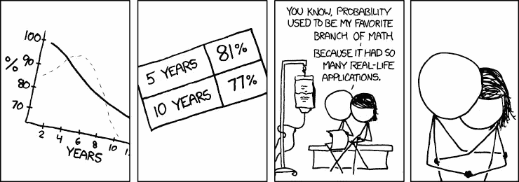

# 张量流概率的讲述

> 原文：<https://towardsdatascience.com/a-tell-of-tensorflow-probability-a2bf5a364391?source=collection_archive---------15----------------------->

source — [https://xkcd.com/881/](https://xkcd.com/881/)

不管我们如何看待概率这个神秘的话题，我们都生活在一个随机的环境中。从永远难以捉摸的量子力学到我们的日常生活(“今天有 70%的可能性会下雨”，“及时完成工作的可能性不到 30%”……)我们都在有意无意地使用它。我们生活在一个“不确定、不确定、不确定”的世界里。因此，知道如何推理是任何人的武器库中最重要的工具之一。

在这篇文章中，我不会详细介绍或解释概率(那会使文章太长)，也不会试图给出一些大概的描述。这篇文章是关于一个具体的问题，以及我如何使用 Python 和 [Tensorflow probability](https://www.tensorflow.org/probability) 解决它。

在进入实现细节之前，我们将触及一些基本的定义。详细的介绍，你可以拿起[任何](https://bayes.wustl.edu/etj/prob/book.pdf) [好的](https://www.amazon.com/Introduction-Probability-Theory-Applications-Vol/dp/0471257087) [书](https://www.amazon.com/First-Course-Probability-9th/dp/032179477X)或者如果你时间不够，那么你可以看看[这篇](/probability-fundamentals-of-machine-learning-part-1-a156b4703e69)的优秀文章。

事不宜迟，让我们开始旅程吧。

# 我们想要解决的问题

> 掷一次公平骰子，如果结果是奇数，则掷一次公平硬币。否则，如果结果是偶数，那么公平的硬币将被投掷两次。在这两种情况下，都会计算人头数。获得的人头数的方差是多少？

当然，有几种方法可以解决这个问题。你可以在我得到它的原始 [Quora](https://www.quora.com/A-fair-dice-is-rolled-if-the-result-is-an-odd-number-then-a-fair-coin-is-tossed-3-times-Otherwise-if-the-result-is-even-number-then-a-fair-coin-will-be-tossed-2-times-In-both-cases-of-heads-is-counted-Whats-the?ch=99&share=bef02ae8&srid=nmId) 线程中查看它们。方法不同，但最终结果是 0.68 左右。

在这里，我们将看到如何使用 Python 和 TensorFlow-probability 来模拟一个实验，并验证我们之前获得的结果。

一个警告:*我们可以使用任何其他包，例如 numpy，来实现相同的目标，但我开始阅读超级令人印象深刻和超级受欢迎的“* [*概率编程&黑客的贝叶斯方法*](http://camdavidsonpilon.github.io/Probabilistic-Programming-and-Bayesian-Methods-for-Hackers/) *”，在最近的版本中，它已经被移植到 tfp(这就是我们从现在开始将如何调用 TensorFlow-Probability)，因此我正在使用它。*

# 随机变量和概率分布

在我们定义随机变量和概率分布的含义之前，我们需要给出概率的一个有用的定义。我将从我之前提到的精彩文章中引用它，因为我相信它很好地抓住了这个术语的本质，而没有任何数学工具。

> 概率论是一个数学框架，用于量化我们对世界的不确定性。它允许我们(和我们的软件)在不可能确定的情况下进行有效的推理

好吧，太好了。现在我们需要理解什么是随机变量，概率分布意味着什么。

**随机变量**—随机变量就是它所说的，一个可以取随机值的变量。然而，有一个小警告。它不能取任何随机值。每当我们谈论一个随机变量时，我们隐含地或明确地把它附加到一个叫做“样本空间”的东西上。这听起来可能有点可怕，但不用担心。

样本空间是在我们进行实验时，某个变量可以取的所有值的集合。比方说，为了简单起见，我们在抛硬币。那么样本空间可以表示为— **{H，T}** 其中 H 代表头部，T 代表尾部。因此，如果我们将投掷硬币的实验结果分配给变量 x，那么 x 的一系列值可能看起来像这样— **{H，T，H，T，T，H，H，H，T…}** 正如我们可以看到的，x 可以随机地取值 H 或 T，在每次实验结束时，我们记录下该特定值。

*这里要注意一件事，我们还没有谈到任何偶然事件。我们刚刚建立了一个可以取随机值的变量。这是因为接下来会出现机会因素。我们称之为概率分布。*

**概率分布** —概率分布是一种确定随机变量在样本空间中取某个值的概率的方式(函数，数学上)。因此，从上面的例子延伸，假设我们正在扔一个公平的硬币，在这种情况下，我们有 50%的机会它变成正面，有 50%的机会它变成反面。我们可以使用称为[伯努利分布](https://en.wikipedia.org/wiki/Bernoulli_distribution)的东西对此进行建模，其中我们可以提到事件 1 发生的概率为 p (p ≤ 1)(在我们的情况下，这将映射到头部)，事件 0 发生的概率为 1-p(在我们的情况下，这将意味着尾部)。如果我们写一个代码，用伯努利分布来模拟抛硬币的现象，然后运行实验足够长的时间，我们会看到正面的百分比收敛到 50%,反面也是如此。

我们可以为一个可能有两种以上结果的实验(掷骰子)考虑伯努利分布的扩展。我们可以定义每个结果出现的概率。例如，对于公平骰子的情况，每个表面的概率是 1/6。我们称这种概率分布为多项式分布。*(我没有说出全部的真相，多项分布并不是伯努利分布的真正扩展，而是二项分布的推广。而伯努利分布是二项式分布的特例。然而，为了这个实现，我们可以忽略这个细节。)*

# 解决方案

我们现在掌握了解决这个问题所需的所有知识。我假设对“方差”、“均值”等术语有基本的了解。所以不打算解释了。也就是说，我给出了使用 Python 解决这个问题的逻辑步骤。

*   我们需要使用多项式分布来模拟骰子的投掷，并多次投掷骰子(实际执行实验)。为了解决这个问题，我们假设投掷骰子 1000 次。
*   我们需要记录每张脸出现的次数，并将其存储在一个列表中。
*   完成上述步骤后，我们需要取出列表中的每个成员，根据它是偶数索引元素还是奇数索引元素，我们必须抛出一个 number _ of _ times _ that _ index _ turned _ up *(2 或 3)的硬币。为了更好地理解这种说法，让我们举一个例子——[1，3，2，1，2，1]。假设这表示投掷骰子 10 次的结果。这意味着在 10 次中，1 出现了 1 次，而 2 出现了 3 次。如此等等。一旦我们有了这个列表，我们需要一个接一个地检查它，根据不同的面(奇数或偶数)，我们需要掷一枚公平的硬币，价值* 3 或价值* 2 次。所以对于 1，我们只扔 3 次(在我们的实验中 1 出现的次数是 1)。然而，对于 2，我们将投掷它 6 次(它出现了 3 次，每次我们需要投掷两次，所以 3 * 2 = 6)
*   我们使用伯努利分布对投掷进行建模，并记录头部出现的次数(假设 1 表示头部)
*   我们在每次投掷实验结束时计算头部的方差，并将其存储在一个全局列表中
*   以上步骤我们都做很多遍，比如说 100 遍。
*   100 次结束时，我们取全局方差列表的平均值。

最后，这是我刚才描述的逻辑的代码。

这就是了，全局方差列表的平均值是…(鼓辊🥁) 0.68355…我们已经使用稳健建模和实验验证了数学预测。太棒了。

谢谢你读到这里。我知道这是一个很长的阅读，你一直非常理解我。再次感谢你。您需要安装 Tensorflow、tfp 和 numpy 才能运行此笔记本。使用 pip 安装它们相当容易，所以我就不赘述了。

如果你喜欢这篇文章，请尽情鼓掌，这将鼓励我以后写类似的文章。

另外，我正在和我的合著者 [Tirthajyoti](https://medium.com/u/cb9d97d4b61a?source=post_page-----a2bf5a364391--------------------------------) 写一本关于使用 Python 进行数据争论的书，很快就会出版。我们希望通过这种方式为生态系统增加很多价值。看一看或者捡一个；)如果你愿意的话！

最后，如果您有任何反馈，请通过 [Linkedin](https://www.linkedin.com/in/shubhadeep-roychowdhury/) 联系我(或在此发表评论！).我将非常乐意连接。

一会儿见:)