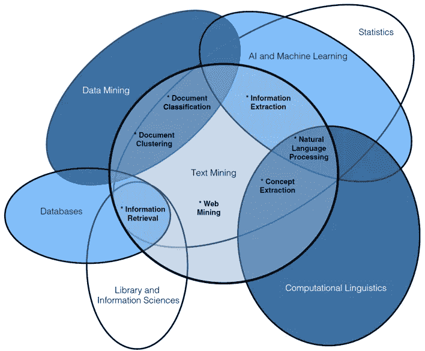
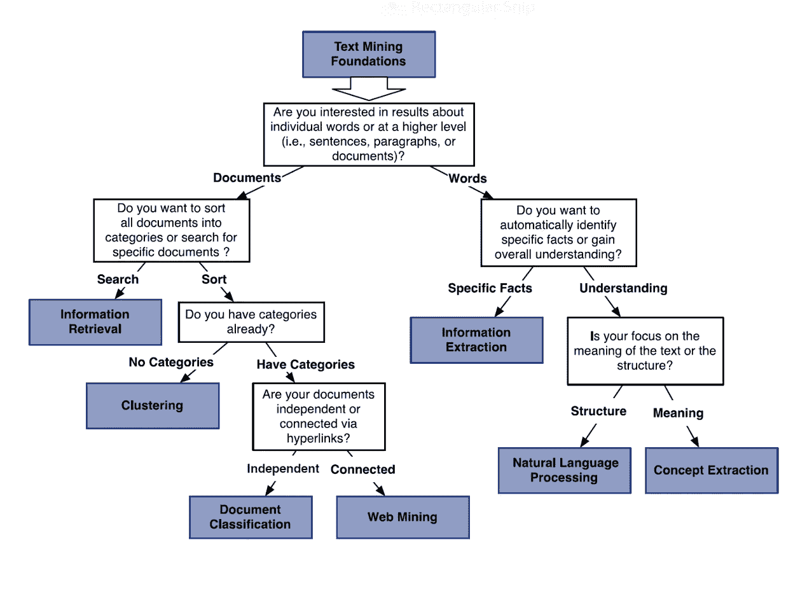
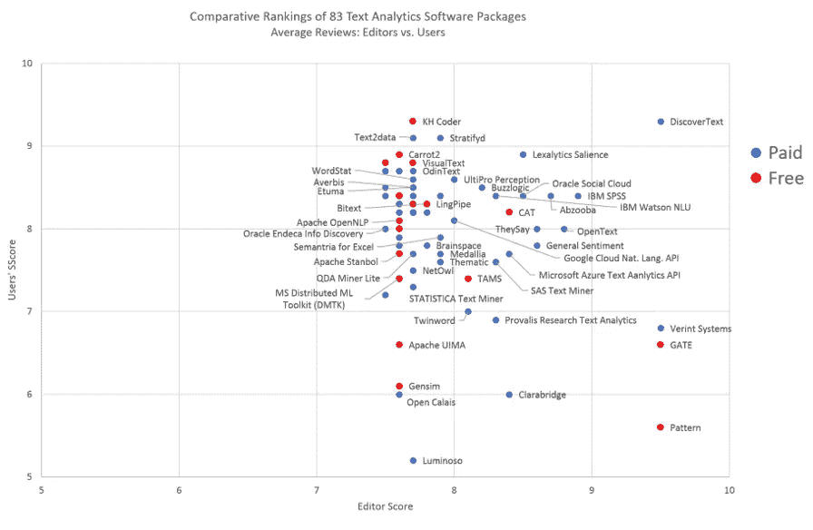
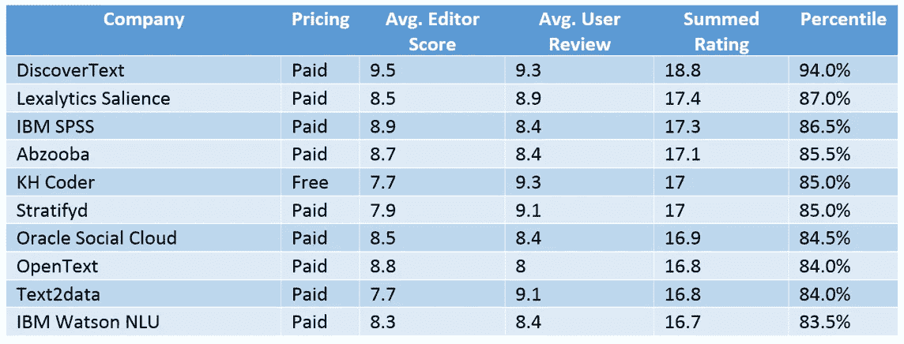
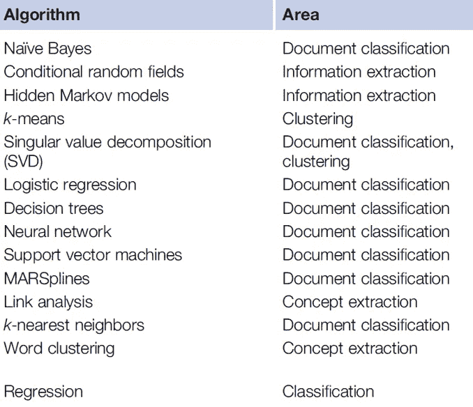

# 更新的文本分析初级读本:文本分析策略中的关键因素

> 原文：<https://towardsdatascience.com/a-text-analytics-primer-key-factors-in-a-text-analytics-strategy-d24dc84a5576?source=collection_archive---------16----------------------->

A Venn diagram of the subfields of text analytics and how they relate (Miner, 2012)

**简介**

我们在过去 24 个月中创建的世界上约 90%的数据-平均每天 2.5 万亿字节-其中约 90%是非结构化数据，即文本、推文、图片和视频等内容(Griffith，2018)。在这个电子洪流中发现意义和目的的目标创造了文本分析行业(又名文本挖掘)。

这篇文章是为那些对文本分析的好处感兴趣，并且正在寻找如何形成一个高层次战略的关键考虑因素的决策者而设计的。这篇文章用 15 分钟的时间提供了主要观点和决定的简明概述，而不是花时间去梳理和理解数百页的教科书和期刊文章。请将本文视为数据科学之外或不熟悉数据科学的决策者的“备忘单”，以快速了解文本分析中的关键问题。

术语“文本分析”在 2000 年代中期开始使用；然而，它的前身“文本挖掘”在几十年前就被使用了，并且似乎起源于 20 世纪 80 年代早期情报界和生命科学行业中的现代计算形式(Hobbs，1982)。然而，文本分析的起源至少要早一个世纪。俄亥俄州立大学和东京大学的物理学教授托马斯·门登霍尔(Thomas Mendenhall)在 1887 年 3 月发表在杂志*科学*上的一篇论文中使用统计方法分析了成分特征曲线(Mendenhall，1887)。克劳德·布林肯分析了沈煜伦·柯蒂斯·斯诺德格拉斯 1963 年 3 月在*美国统计协会杂志*上的文章，以证明这是马克·吐温的笔名，而马克·吐温本身又是塞缪尔·l·克莱门斯的笔名(布林肯，1963)。哈佛大学的弗雷德里克·莫斯特勒(Frederick Mosteller)和芝加哥大学的大卫·华莱士(David Wallace)在 1963 年 6 月使用了带有泊松和负二项式的朴素贝叶斯统计模型来分析美国开国元勋亚历山大·汉密尔顿(Alexander Hamilton)和詹姆斯·麦迪逊(James Madison)中的哪一位撰写了*联邦党人论文*(莫斯特勒，1963) (马迪根，2019)。

文本分析的流行在很大程度上与电子邮件和垃圾邮件的普遍存在相一致，因为它过去和现在都常用于自动检测哪些消息可能是不想要的邀约。然而，随着智能手机和短信的出现，文本分析需求出现了第二个爆发点，随着社交媒体的出现，出现了第三个爆发点。随着数十亿用户开始在脸书、Twitter、Instagram、YouTube 和其他平台上发帖，大量数据应运而生，其中绝大多数是非结构化数据，而且大部分是基于文本的。

**什么是文本分析？**

早期的统计方法和基于规则的人工智能在很大程度上依赖于定量字段(数字)和统计模型来计算描述性统计数据，并通过回归、贝叶斯定理等粗略地模拟现实世界。因此，企业和其他组织想要回答的关于这些文本块中的事实、关系和情感的问题在很大程度上被锁定，并且在没有文本分析的情况下无法进行分析。

文本分析试图理解文本本身，识别或分类作者，或将文本与世界上的有形事物或事件联系起来。这意味着文本分析的处理可以——但不一定——涉及计算语言学、内容分析、信息检索和自然语言处理。许多文本挖掘涉及将文本分成片段或符号(比如关键词)，并对它们进行加权，加权通常由一个单词或短语在一篇文章中的使用次数与其正常出现频率的对比来确定。其他特征通常包括单词的长度及其功能(Madigan，2019)。

可以说，对文本分析最感兴趣的，也是发展最快、影响最大的，是情感分析。根据作者的语言和行为对他们进行分类不仅有助于定制营销、说服或治疗的发展，如果人们可以从文本字段中测量情感，那么人们也可以测量和预测情感的变化(稍后将详细介绍)。

传统上，统计方法、模型和工具用于以二元方式(好/坏)对文本进行分类。其中包括线性和逻辑回归以及分类和回归树(CART)等判别模型，以及贝叶斯分类器和线性判别分析(LDA)等生成模型(Madigan，2019)。随着 2000 年代后期廉价和大规模计算能力和存储的出现，机器学习模型开始更普遍地使用，首先是有监督的机器学习模型，如支持向量机(SVM)。

机器学习在两个方面不同于传统的统计方法:(1)它是统计的一种健壮的蛮力应用；和/或；(2)它使用计算分析特有的算法，使软件能够发现和学习事物，就像人类一样，如果我们拥有无限或非常高的认知功能、回忆和完美的视觉。为此，机器学习是一种超越统计的进化，本质上是一种增强人类发现和预测我们否则无法发现和预测的事物的工具。

Project questions that can help determine the direction of text analytics projects (Miner, 2012)

**最重要的研究问题**

过于简单，并根据领域应用而变化，打造文本分析策略和方法的关键问题本质上是:“在数十种可用的机器学习算法中，有数百种变化，应该使用哪些算法，以及以什么顺序或周期使用？”正是在这里，数据科学和机器学习通才获得了很多次的关注，因为他们通常清楚地拥有更广泛的跨学科知识库，包括几十种算法，何时何地使用每种算法，以及它们不同组合的优缺点，这些组合称为集成。在此基础上，战略和方法为选择初始和次级方法、雇用团队、时间表、预算提供了信息，并确定了什么是可能的以及何时可能的可行性。

第二个关键的研究问题依赖于主题或领域专长。也就是说，人们试图发现或预测什么，以及从什么中发现或预测什么？这些特定的目标和目的通常来自于团队成员，他们精通应用领域空间，并且将使他们自己能够回答(和重复回答)问题，进行根本原因分析，并解释草案发现，或者审查培训和测试数据结果。

**因素——主要考虑事项**

可以说，研究问题的答案——在何时、何地使用哪些算法——是由四个先决功能问题或考虑因素的答案提供的:(1)是使用现成的文本分析软件、定制构建还是使用混合；(2)用作训练数据的文本源的可用性、准确性、多样性和标记；(3)使用监督或无监督的机器学习，通常由环境决定；(4)领域应用中的词汇覆盖和词汇需求；以及(5)时间表和预算。

或者，过多的方法和算法也可以通过关于项目的经典“你想做什么”问题来缩小范围(见上面的决策树图)；然而，正确回答这些问题通常需要一些决策者可能不具备的文本分析和数据源知识。因此，本文的大部分内容集中在第一组先决条件问题上，这些问题更容易回答。

***1。商业现成软件、定制软件或混合软件***

至少有 83 种用于文本分析的商业现成(COTS)软件解决方案拥有足够多的客户，可以给他们提供评论和比较排名。许多应用程序和用例略有不同；然而，本质上是电子表亲。没有一个始终排在第 95 百分位以上；不过， [DiscoverText](https://discovertext.com/) 比较接近。

第一次发表在这里的二次分析对编辑和用户评论的总得分进行了比较，对该领域的领导者进行了排名(见下图和下表)。知道领导者应该考虑谁和知道落后者不应该考虑谁一样重要。一般来说，收费解决方案的表现总是远远超过免费解决方案。得分一般的提供商的名称已在可视化中剔除，以便有空间轻松查看领先者、落后者以及主要公司的解决方案排名(例如，Apache、Google、IBM、Microsoft、Oracle 等)。).右上角的解决方案具有最高的综合得分；左下角的答案得分最低。

Comparative rankings of 83 text analytics software packages

Top 10 text analytics software solutions ranked by aggregate critic and user review scores (Imanuel, 2019)

对于绝大多数应用程序来说，这十个应用程序中的一个或多个就足够了，并且代表了时间和资源的最佳价值，以在文本分析过程的主要步骤中获得非常好的(尽管远非完美的)结果。在许多情况下，选择大公司的产品(如 IBM、Oracle 等。)，即使它们的排名比其他公司低，也可能是有益的，因为它们比拥有更高排名产品的小公司或初创公司拥有更广泛、更可靠的支持和文档。

如果存在建立定制系统以实现卓越性能的商业案例，或者因为领域应用中的特质，那么两种方法或算法的组合对于分类和情感分析重复表现良好，这是文本分析的两个最大步骤:(1)用于监督学习的支持向量机；(2)递归神经网络(RNNs)、卷积神经网络(CNN 或 ConvNets)和长短期记忆的组合用于无监督学习(，王，2016)(杨，2019)。在几乎所有情况下，免费或低价安装 Anaconda with RStudio 将允许已经编写的数千个 R 库在大多数算法组合中重用。下表列出了传统上用于文本分析的算法。

Machine learning algorithms traditionally used for text analytics (Miner, 2012)

***2。识别&准备浩繁，准确&多样训练数据***

选择文本数据源是工作的一半，因为训练数据及其不可用性是机器学习的一个肮脏的秘密。从业者和调查经常表示，数据科学 80%的时间和精力用于数据准备，对于文本分析，通常是文本来源(书面或音频)。为了有效，机器学习文本分析通常需要大量带标签的训练数据，以教会算法学习执行它们的预测任务。这里固有的是，数据应该是完整的、干净的、多样的、在未来随时可用的，并且是因果性的——而不仅仅是必然结果。此外，必须有足够的因果关联、标记和干净的数据来对不同的模型进行实验，以确定它们在通过训练测试循环进行预测时的相对有效性。

例如，如果一个人试图预测经济增长或收缩，他们将需要足够大的数量和多样性的干净和有标签的数据，以便能够确定这些数据元素中的哪些是因果性的(或指示性的)，如经济何时增长或收缩，增长或收缩的程度，以及加速或减速的程度(可以说，这可能最好通过使用索尔福德系统的随机森林决策树来快速合理地完成，它可以轻松确定哪些元素是因果性的，以及其比例)。一旦确定了关键的因果术语，情感分析就可以推断出含义，而聚类可以监控情感的变化。

在许多情况下，这个先决条件是大量时间和资源的焦点，这是理所当然的。根据证券交易委员会(SEC)的公司 10K 备案文件、新闻报道或美联储董事会成员的声明，预测经济扩张或收缩是可能的，也可能是不可能的。可能需要进行多次数据搜索，才能找到最具因果性或最能预测预期结果的数据元素，之后，训练一个机器学习系统来监控和预测班次只是工作的后一半。

一旦数据源被识别，因果关系在其特征中被确认并被标记，数据清理和组织就可以由十几个 R 函数在容易访问和精通的库中灵巧地处理。

或者，文本分析可用于识别和监控趋势。这更像是一个分析功能，做起来更快更容易(更便宜)，因为它不是试图预测结果。通常情况下，这意味着培训会以更快、更便宜的方式进行。该分析更侧重于概念提取，而不是因果关系和预测。即使是这些情绪趋势，也可以随着时间的推移进行监控，以检测群集转移时情绪的变化。

***3。选择有监督或无监督的机器学习方法***

使用有监督的或无监督的(更自动化的)机器学习进行文本分析的决定很大程度上取决于正在执行过程中的哪个步骤、需要分析多少文本、多久分析一次以及需要有多完美(例如，灵敏度与特异性)。较小的数据集可以更慢地周转，或者具有战略时间表，可能更适合有监督的机器学习方法。需要提供建议或预测流的大型数据集，不管时间表如何，都适合无监督的机器学习方法，前提是它们可以提供所需程度的准确性、敏感性和特异性。

***4。*词汇覆盖范围**

将文本分析应用或调整到不同领域的关键步骤之一是推断情感或特征提取的准备。历史上，通过将单词转换成可以用二进制(0 和 1)表示的符号，创建了一种叫做*的 n 元语法*。使用迁移学习的新方法——重用以前模型中的元素——现在既更快又更准确。在拥有预测和分类情感的词典的情况下，FastAI 是在维基百科上预先训练的模型，是为特定领域应用建立定制语言模型的高级起点。通过使用 FastAI 语言模型，可以在其基础上构建特定的领域适应，然后是分类器，以实现最大的开发和处理馈送和准确性(95%的准确性是可能的)。通常还必须考虑其他领域的适应性；然而，词汇和词汇是普遍的主要考虑因素。

***5。预算、资源&时间表***

有一句格言说，请求可以被廉价、完美或快速地满足，你只能选择其中的两个，因为这三个都是不可能的。我 20 年应用预测分析和数据科学的经验证明了这一点。

金钱、人才和时间限制了大多数项目，包括数据科学领域的项目，这是一件好事，否则支出会令人作呕，投资回报也很难实现。关于使用哪些工具的决策通常取决于可用的工具。类似地，这可能取决于一个项目可以使用的人才资源以及使用时间。数据科学中的一个经典例子是，是使用 R 统计语言还是 Python 通用语言。虽然两者都有优点和缺点(我更喜欢 R ),但这可能取决于您的团队中有哪些语言可供您使用，哪些语言是您的队友知道的。

关于时间表，有监督的文本分析需要更多的劳动(因此，可能需要更长的时间)；然而，自定义编码、特征提取和无监督机器学习算法的调整，尤其是对于预测，也可能是时间密集型的。较大的团队可能适合有监督的方法，而较小的团队(和更多的数据)可能适合无监督的方法。在关于价值的部分，有一个关于如何平衡这些考虑因素的建议，开始一个新的文本分析项目，它通常旨在快速赢得信誉和未来工作的更多资金。

**高级问题——预测情绪趋势&可解释性**

如果除了训练时间和努力之外，数据科学还有一个肮脏的秘密，那就是可解释性。大多数使用机器学习的消费者和决策者都是没有数据科学甚至统计学专业背景的高管。或者，即使他们确实有这样的背景，机器学习对于他们的领域专业知识来说也是足够遥远的，并且移动如此之快，以至于使其价值可以识别，但不详细或彻底地为人所知。因此，要让这些决策者使用预测模型，他们必须信任它们，而要信任它们，他们必须理解它们。因此，可解释性成为一个关键的考虑因素。

最大化可解释性的一个方法是使用可视化进行特征分析。一种受欢迎的可视化是自组织地图(SOMs)，它本身是一种无监督的机器学习技术。som 根据相似的特征将数据分类成聚类段。例如，在电子商务领域，他们将客户群分为高消费但低消费群体，或高消费但低消费群体。在电子商务中，这表明如何通过营销或行为干预锁定一个群体。

在情感分析中，情感的积极或消极以及强弱也可以使用自组织映射(SOM)进行聚类。如果在不同的时间框架内重复这种分析，也有可能看到情绪是如何变化的，以什么方向，以什么速度或速率变化。从这些移动的聚类中，人们可以计算出具有置信区间的未来方向的概率。这使得摄取、分析、重复的循环方法成为必要，并且例如在概念提取之后向单词添加聚类功能。

例如，想象一下，在 10K 公司的备案文件中，用词正以越来越快的速度向经济收缩转变。人们可以在理论上以合理的准确度计算出衰退的概率，或者失业索赔，或者借贷或储蓄率。有可能预测经济走向的能力允许预防性干预以最大化其结果。

这些经济预测还可以基于不同行业、地区或两者的基于文本的大数据中的消费者或企业情绪进行，并汇集到多维数据库中进行可视化。这将使组织能够更准确地预测哪些部门或地区正在变冷，哪些部门或地区在不同时间以不同程度变暖，或者什么问题在哪里变暖，有时为什么变暖。

这里的关键是预测的概念。从历史上看，在进行观察、记录、分析和做出新的决策之间会有很长的等待时间。这些工具允许延迟在很大程度上得到改善，并转移到预防性政策或管理中，这也适用于发现趋势，而不仅仅是因果预测。

最终，可解释性是一个如此关键的问题，以至于专家们经常建议，最好有一个可理解的和可解释的方法或模型，而不是一个可能执行得稍微好一点但却无法解释的方法或模型。

**价值主张**

在一个完美的世界中，原型项目可以作为“概念验证”来构建，也可以通过有价值的新见解快速投入生产，投资以 1 万美元而不是 10 万美元来衡量。一旦这些原型被社会化并获得信任，文本分析的预算、时间线和复杂性可以发展，在此期间，更多的文本数据也几乎总是可用于更好地训练和通知结果、预测和趋势分析。随着时间的推移，基于文本的通信语料库在快速增长，因此使用文本分析的可能性与日俱增。

归根结底，价值或投资回报是大多数商业案例中关于在文本分析上投资多少预算(精力、时间、人才)的决定因素。一个使用 COTS 的三到六个月的项目可能是一些组织能够花费的最多的时间来获得正的 ROI。政府、跨国公司和医疗保健机构都有在进化浪潮中部署文本分析和其他形式的机器学习的商业案例。使用 COTS 或小规模趋势分析仪获得 60–75%的预测值，然后定制或扩展(更多地理多样性、数据输入、特异性或精确度，或任何目标)。

**结论**

文本分析可以为经济、金融、电子商务以及社会和地缘政治问题的公众情绪提供非凡的见解。在很大程度上，这是因为社交媒体上的人类行为和通信的数字化正在创建如此庞大的文本数据语料库以供挖掘。如果你领导一个组织或企业，在这个组织或企业中，预测消费者或大量人群情绪的能力是有价值的，或者分析情绪趋势以及它们在不同群体中如何随时间变化，你可能有一个商业案例，用真实世界的实验来探索文本分析。此后，可能最好从通才数据科学专家开始，他可以尽可能多地使用 COTS 工具快速原型化概念验证，以社交和探索兴趣和好处，了解更大的投资和定制解决方案团队是否、何时以及如何可能获得正回报。

# **参考文献**

布里讷格尔，C. (1963 年)。马克·吐温和沈煜伦·柯蒂斯·斯诺德格拉斯书信:作者身份的统计检验。*美国统计协会杂志*，58(301):85–96。

格里菲斯，E. (2018 年 11 月 15 日)。*我们生成的大数据中有 90%是非结构化的。*检索自 PC 杂志:[https://www . pcmag . com/news/364954/90 %- the-percent-of-the-big-data-we-generate-is-an-structured-me](https://www.pcmag.com/news/364954/90-percent-of-the-big-data-we-generate-is-an-unstructured-me)

霍布斯，j。沃克，d。阿姆斯勒，r。(1982)。对结构化文本的自然语言访问。*第九届计算语言学会议论文集(COLING*’82)(第 127-132 页)。捷克斯洛伐克布拉格:普拉哈学院。

伊曼纽尔。(2019 年 8 月 21 日)。*用于文本分析、文本挖掘和文本分析的 63 大软件。*今日从预测分析检索:[https://www . predictiveanalyticstoday . com/top-software-for-text-analysis-text-mining-text-Analytics/](https://www.predictiveanalyticstoday.com/top-software-for-text-analysis-text-mining-text-analytics/)

马迪根博士，刘易斯博士(2019 年 8 月 18 日)。文本挖掘:综述。美国纽约州纽约市:哥伦比亚大学。

t .门登霍尔(1887 年)。成分特征曲线。*理科*，9(214s):237–246。

Miner，g .，Delen，d .，Elder，j .，Fast，a .，Hill，t .，Nisbet，R. (2012)。文本分析的七个实践领域。在*非结构化文本数据应用的实用文本挖掘和统计分析*(第 29–41 页)。阿姆斯特丹:爱思唯尔公司。

f .莫斯特勒和 d .华莱士(1963 年)。一个作者问题中的推理。*美国统计协会杂志*，275–309 页。

王军，梁志友，赖，张，谢(2016)。使用区域 CNN-LSTM 模型的多维情感分析。计算语言学协会第 54 届年会会议录(第 225-231 页)。柏林:计算语言学协会。

杨，冯，杜，陈，黄，李(2019)。基于融合门的 R-CNN 和 C-RNN 的集成情感分析方法。*国际计算机通讯杂志&控制*，272–285 页。